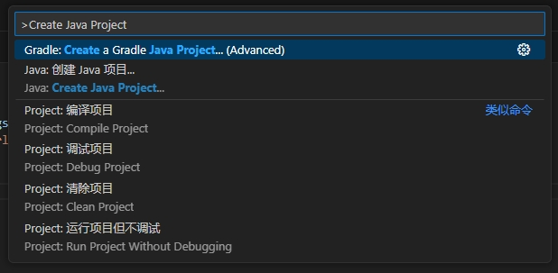
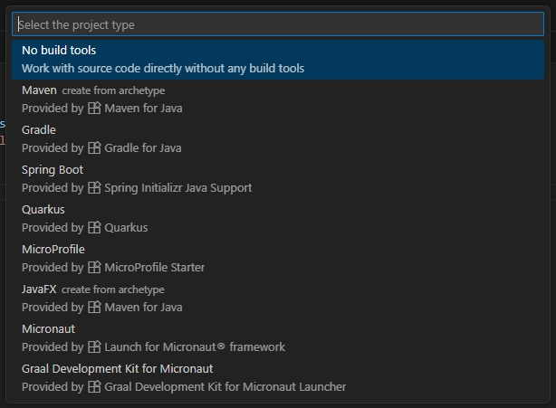
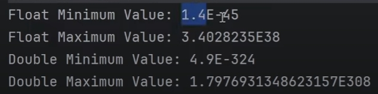
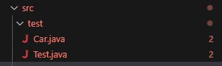
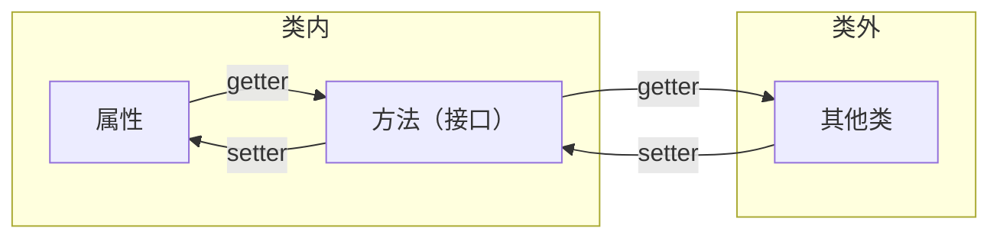
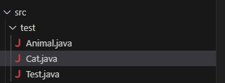
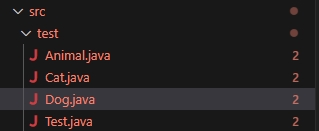

[toc]

# 🧊's 后端学习笔记

## Java SE 篇

Java SE，是 Java Standard Edition (Java 标准版) 的缩写，是 Java 的核心和基础，本篇讲的是 Java 的基础部分，不会涉及到框架部分。

### 1. Java 基础篇

#### 1.0 Java 项目的基本结构以及创建 java 项目

**Java 项目的结构**

当你在创建一个 Java 项目的时候，一般文件夹里会包含以下文件：

* `src` **文件夹 (Source Code)**：这是项目的核心，存放你所有书写的 `.java` 源代码文件。
* `lib` **文件夹 (Libraries)**：存放项目依赖的外部库 (`.jar` 文件)。
* `out` **或** `target` **或** `bin`  **文件夹 (Output)**：存放 Java 源代码编译后生成的字节码文件 (`.class` 文件)。
* **配置文件**：比如 `.project`，`.classpath`，`.pom.xml`，`build.gradle` 等。


**包 (Package)** 是什么

如果说项目是 “一本书”，那么**包**就是书里的**章节**

写一本书，不会统统的把内容糅杂在一起，而是分章节，例如“第一章”，“第二章”等等，包就是这个作用，主要有三个目的：

1. **组织和管理类**
    把功能相关的类放到同一个包里，可以让项目结构清晰。例如一个电商项目可以有：
	* `com.mycompany.user`：存放所有和用户有关的类，例如 `User.java`，`LoginService.java`
    * `com.mycompany.order`：存放所有和订单相关的类，例如 `Order.java`，`PaymentService.java`
    * `com.mycompany.product`：存放所有和商品相关的类。
2. **避免命名冲突**
    想象以下，如果小明写了一个工具类叫 `Utils.java`，小王也写了一个工具类 `Utils.java`。如果没有包，这两个文件就会冲突。但如果你们把各自的类放进不同的包里，例如 `com.xiaoming.feature1.Utils` 和 `com.xiaowang.feature2.Utils`，那么就能互不冲突。
3. **控制访问权限**
	如果在一个类里定义的变量或者方法不写 `public`，`private`，`protected`，那么它就是**包级私有**的，只有在同一个包里的其他类才能访问它。


例子：

```
MyBookProject/  (这是整个"项目")
├── src/  (书稿文件夹)
│   └── com/
│       └── mycompany/
│           ├── user/  (这是 "user" 包)
│           │   ├── User.java  (这是一个"类")
│           │   └── UserService.java
│           ├── order/  (这是 "order" 包)
│           │   ├── Order.java
│           │   └── PaymentService.java
│           └── Main.java  (程序的主入口类)
│
├── lib/  (参考书架)
│   └── some-library.jar  (一本参考书)
│
└── bin/  (印刷品文件夹)
    └── ... (自动生成的 .class 文件)
```


**创建 Java 项目**

打开 vscode，在扩展中搜索 `Java` 以及 `Extension Pack for Java`，并且安装这两个插件。

在 vscode 之中 `ctrl + shift + p` (windows) 或者 `command + shift + p` (MacOS) ，输入 `Create Java Project`





我们目前只需要创建空项目即可，选择 No build tools，即可创建好一个项目。


#### 1.1 Java 完整执行过程


**JDK (Java Development Kit)**，里面有工具和库，能够让你编写 Java 代码。当安装 JDK 的时候，JRE 也会被同时安装。

**JRE (Java Runtime Environment)**，提供了一个运行环境，你可以在 JRE 里面运行你的 Java 代码。JRE 内部有着 JVM，Java 代码在进入 JVM 之后才能运行。

**JVM (Java Virtual Machine)**，能够加载 .class 文件中的字节码，然后将其转换成当前运行环境所能理解和执行的机器码。即能将平台独立的字节码翻译成该平台的平台以来的机器码并且执行。


当我们编写一个 Java 程序时，我们会将代码写在一个 .java 文件之中，然后使用 javac 命令将文件编译成二进制代码（字节码），这个是**平台独立（平台无关）**的文件，也就是 javac 编译后的 .class 文件。然后在不同平台上，使用 jvm 加载 .class 文件的字节码，将其转换为当前运行环境所能理解和执行的机器码，JVM 是**平台依赖（平台相关）**的。

> **平台独立**指的是一个软件、程序、编程语言或者系统**能够在不同操作系统、硬件架构或其他计算环境下运行，而无需进行大量的修改或者重新编写**。即 “一次编写，到处运行”。
>
> **平台依赖**指的是一个软件、程序、编程语言或者系统**只能在特定的操作系统、硬件架构或其他计算环境下运行**。如果想要在不同的平台上运行，通常需要对代码进行大量的修改、重新编写以及重新编译。


当我们需要手动编译一个 java 文件时，例如 `Test.java`，我们需要在终端中执行

```bash
.javac Test.java
```

这会生成一个 `Test.class` 的文件，也就是上面提到的平台独立的字节码

在终端中执行

```bash
java Test
```

即可运行我们书写的 java 代码。

> 这里为什么不写 `java Test.class`？这行命令实际上调用的是 jvm，让其将字节码翻译成机器码并且运行，既然是 jvm，那它只会接受所有的 `.class` 文件，所以不需要特定的指定其后缀，因为其默认就会认为你要执行 `xxx.class` 文件。


#### 1.2 Java 程序的框架

以下是一个简单的 Java 程序示例：

```java
class Test {
    public static void main(String[] args) {
        System.out.println("Hello World!");
    }
}
```


这里的 class 后面跟着的是类名。在 java 中，我们将所有的代码写入类里面，这个类名要跟我们的文件名完全一致，且大小写敏感。


`public static void main(String[] args)` 这里是声明了主方法 main。在 java 中，main 就是程序的主入口。

其中，`public` 是访问修饰符，代表这个方法可以被类外的其他程序所访问。

`static` 表示这个方法属于类的本身，而不是类的实例。

`void` 表示这个方法不会返回任何值。

`String[] args` 表明该方法接受一个字符串数组作为参数。命令行参数可以通过这里传递给你的程序。

> 加入我编译程序的命令是
>
> ```bash
> javac Test.java
> java Test apple banana
> ```
>
> 那么 `args` 之中接受的就是 `["apple", "banana"]`
>
> 假设我代码中加入了 `System.out.println(args[0]);`
>
> 那么执行 `java Test apple banana` 后，终端输出为：
>
> ```bash
> Hello World!
> apple
> ```


`System.out.println()` 是一个 `java.lang` 包中的函数，能够在控制台中输出括号内的东西并**换行**。


请记住，分号是 java 指示语句结束的关键元素，能够帮助编译器知道语句的结束，所以在 Java 中书写语句时，你都必须使用分号来表示它的结束。


#### 1.3 Java 基础数据类型

不同于 python，java 是一种强类型语言，变量是有其具体的类型的，一般不能跨类型转化（例如 int 转 string 等等），一般也不能跨类型进行操作和运算。例如在 python 中这样是合法的：

```python
age = 20
```

但是在 java 中你需要这样写

```java
int age = 20;
```

即 `[类型] [变量名] = [值];`


我们也不能将一个变量重复声明为不同类型。例如以下是不合法的：

```java
int age = 20;
long age = 20; //不合法！因为 age 已经被声明为 int 类型了
```


##### 1.3.1 整数型

整数型分为 `byte`，`short`，`int`，`long` 四种

`byte` 的取值范围是 `-128 ~ 127`，占一个字节 (byte)

`short` 的取值范围是 `-32768 ~ 32767`，占两个字节 (byte)

`int` 的取值范围是 `-2147483648 ~ 2147483647` ( 21 亿，$-2 \times 10^9 \sim 2 \times 10^9$ )，占四个字节 (byte)

`long` 的取值范围是 `-9223372036854775808 ~ 9223372036854775807` ( 922 兆，$-9 \times 10^{18} \sim 9 \times 10^{18}$ )，占八个字节 (byte)

具体数字不需要背诵，大概知道范围是多少即可。如果实在需要知道，可以使用

```java
System.out.println(Byte.MIN_VALUE);
System.out.println(Byte.MAX_VALUE);
```

即可。可以将 `Byte` 替换为 `Short`，`Integer`，`Long` 以知道四种类型的最小和最大范围。


但当你输入数字的时候，编译器会默认其为 `int` 类型，所以当你声明例如

```java
long x = 2147483648
```

的时候，其仍然会报错。所以这时候你需要让编译器知道你给的是一个长整数，需要在数字后加一个 `l`，例如

```java
long x = 2147483648l
```

注意 `l` 是字母 `L` 的小写。


##### 1.3.2 小数型

小数型分为 `float`，`double` 两种

一般精度要求较低使用 `float`，精度要求较高使用 `double`。

`float` 一般具有 7 位小数的精度，占四个字节 (byte)

`double` 一般具有 15 位小数的精度，占八个字节 (byte)


但例如我们输入

```java
float x = 1000.1111231121f;
```

输出 x 的时候会发现为 `1000.11115`，只有 5 位小数，为什么呢？这是因为 float 同时也需要存前面的整数部分。如果我们定义 x 的时候：

```java
float x = 1.1111231121f;
```

输出 x 的时候就会发现为 `1.1111231`，有 7 位小数了。


当输入小数时，编译器也会默认其为 `double` 类型，所以当你声明例如

```java
float x = 3.1415926;
```

时其会报错。所以需要让编译器知道你给的是一个 `float` 类型的单精度浮点数，需要在数字后加一个 `f`。

```java
float x = 3.1415926f;
```


`float` 和 `double` 类型的最小值和最大值为，但这里的最大值和最小值指的是正数的最大值和最小值，负数同理，只不过前面加一个负号即可：




##### 1.3.3 字符型

`char` 是 java 中用来存**单个字符**的变量类型，占两个字节 (byte)，例如：

```java
char x = 'a';		// 注意这里的声明都是单引号而不是双引号，单引号一般指的是字符
char y = '\u27A4';	// unicode 表示法
char z = 10084;
```


在 java 中，`char` 类型的变量可以表示 Unicode 字符集在 $0 \sim 65535$ 之间的所有字符。

ASCII 码的范围一般在 $0 \sim 127$，是 Unicode 字符集的子集。


当然，java 之中也可以进行类型转换。例如以下操作都是合法的：

```java
char x = (char) 10084;
char xx = 10084;
int y = (int) x;
int yy = xx;
```


##### 1.3.4 布尔型

`boolean` 是 java 中用来存**真或假**的变量类型，占一个比特位 (bit)，例如：

```java
boolean a = true;
boolean b = false;
```


当**两种类型兼容**且**目标类型大于源类型**（占字节少的类型转化到占字节多的类型）时，会发生扩展转换，这时候精度不会丢失，且不会报错，编译器会自动进行转换类型，这个叫做**隐式转换**，也叫**宽化基本类型转换 (Widening Primitive Conversion)**，也可以叫做**自动转换**。

```java
int a = Integer.MAX_VALUE;
long b = a; //这里就是隐式转换
```


当**两种类型不兼容**或者**目标类型小于原类型**（占字节多的类型转化到占字节少的类型）时，会发生**窄化基本类型转换 (Narrowing Primitive Conversion)**，也叫**显式转换**。需要手动指明。

```java
Long a = Long.MAX_VALUE;
int b = (int) a; //这里就是显式转换
```

> 这里如果我们输出 b 的值，会发现其为 `-1`，这是为什么呢？
>
> a 在二进制中，可以表示为 `01111111 11111111 11111111 11111111 11111111 11111111 11111111 11111111`。即 8 个字节 64 位之中，第一位为 0，其余位为 1，当其转换成 int 的 4 个字节 32 位时，会保留后面的 32 位，即 b 的二进制表示为 `11111111 11111111 11111111 11111111`，如果学过补码的就知道这是 `-1` 的表示。


#### 1.4 Java 命名规则

Java 变量是**大小写敏感的**，即 `amount`，`Amount`，`amouNt` 这三个是不同的变量。

Java 的变量可以使用字母，数字，下划线 `_`，以及美元符号 `$` 进行组合，但首位不能是数字，变量名也不能是 Java 的保留关键字。

Java 变量应该**遵循小驼峰命名**法，即从第二个单词开始，每个单词的首字母都需要大写。例如：`fullName`，`myStudentCourses`

请让你的变量名**有意义**，这样在团队协作中，其他人就能知道你的变量名是什么意思。例如你要写人名，那我们应该将变量命名为 `name` 而不是 `a` 或者 `xxx`。


**以下三个后面会学到，你需要记住他们的命名规则**。

Java 中的**方法**也应该遵循与变量一样的规则，**遵循小驼峰命名法**。

Java 中的**类**应该要首字母大写，如果有多个单词，则应该**遵循大驼峰命名法**。即所有单词的首字母大写。

Java 中的**常量**应该要用**全大写字母和下划线来命名**。


#### 1.5 Java 的算术运算符及位运算符

##### 1.5.1 Java 中的算术运算符

Java 中有 `+ - * / %` 这五种基本算术运算符，运算优先级为 `% / *` > `+ -`，如果有括号的话优先为括号，同级运算符从左到右进行运算。


Java 也支持 `+= -= *= /= %=` 这样的复合运算符。复合运算符包含了**隐式类型转换**。

> 假设我有一段代码如下：
>
> ```java
> byte a = 10;
> a = a + 5;
> ```
>
> 会发现这一段出现了报错，原因是 `a + 5` 没有特殊声明的话，Java 会将数字看作是 `int` 类型的，所以 `a + 5` 这个数字是 `int` 类型的，但是 `a` 是 `byte` 类型的，所以会出现报错。我们当然可以显式转换来解决，如：
>
> ```java
> byte a = 10;
> a = (byte) (a + 5);
> ```
>
> 但我们也可以使用复合运算符来进行处理，即：
>
> ```java
> byte a = 10;
> a += 5;
> ```
>
> 这里的复合运算符就包含了**隐式类型转换**


Java 也有自增自减运算符，即 `++ --`。并且这个自增自减运算符**前置与后置是不同的**。且自增自减运算符优先级最高，即 `++ --` > `% / *` > `+ -`。

```java
int a = 99;
int b = a++;
```

这一段的 `++` 是后置的，运行结果是 `a = 100, b = 99`。自增自减运算符后置表示我先执行 `int b = a` 这个语句，然后在进行 `a = a + 1` 的操作。即当自增自减运算符**后置**时，**先使用，后增加 / 减少**。


```java
int a = 99;
int b = ++a;
```

这一段的 `++` 是前置的，运行结果是 `a = 100, b = 100`。自增自减运算符后置表示我先执行 `a = a + 1` 这个语句，然后在进行 `int b = a` 的操作。即当自增自减运算符**前置**时，**先增加 / 减少，后使用**。


下面的例子，可以自行尝试解决一下：

```java
int a = 1;
System.out.println(a++ + --a);
```

> 这一个的答案是 2。
>
> a++，遵循先使用后增加的原理，所以这里表达式的值是 1，然后 a 变成 2；
>
> --a，遵循先减少后使用的原理，之前的 a 是 2，那么减少后 a 变成 1，所以表达式的值为 1；
>
> 那么两者相加就是 1 + 1 = 2。


##### 1.5.2 Java 中的位运算符

Java 中的位运算符只能对 `byte short int long` 这四种类型使用。

Java 中有以下这几种运算符：`and`，`or`，`xor`，`not`，`left shift`，`right shift`，`unsigned right shift`，分别代表与运算 ( `&` )，或运算 ( `|` )，异或 ( `^` )，取反 ( `~` )，左移 ( `<<` )，右移 ( `>>` )，无符号右移 ( `>>>` )。


与运算 ( `&` ) 能够将两个数字按照其二进制每位进行运算，当两个数字的对应二进制位**都为 1**，则运算结果的当位为 1，否则为 0。

例如 5 & 4，5 的二进制为 `101`，4 的二进制位 `100`，对其进行按位与运算得到的结果就为 `100`，答案就是 4。


或运算 ( `|` ) 能够将两个数字按照其二进制每位进行运算，当两个数字的对应二进制位**有一个为 1**，则运算结果的当位为 1，否则为 0。

例如 5 & 4，5 的二进制为 `101`，4 的二进制位 `100`，对其进行按位与运算得到的结果就为 `101`，答案就是 5。


异或运算 ( `^` ) 能够将两个数字按照其二进制每位进行运算，当两个数字的对应二进制位**相同**，则运算结果的当位为 1，否则为 0。

例如 5 & 4，5 的二进制为 `101`，4 的二进制位 `100`，对其进行按位与运算得到的结果就为 `001`，答案就是 1。


| 第一个数的二进制位 | 第二个数的二进制位 | `&`  | `|`  | `^`  |
| :----------------: | :----------------: | :--: | :--: | :--: |
|         0          |         0          |  0   |  0   |  0   |
|         0          |         1          |  0   |  1   |  1   |
|         1          |         0          |  0   |  1   |  1   |
|         1          |         1          |  1   |  1   |  0   |


取反运算 ( `~` ) 能够让一个数字的所有二进制位取反，即 0 变 1，1 变 0。例如对 5 进行取反运算，答案为 -6。因为：

5 的二进制位为 `101`，假设这个变量是 int 类型的。那么取反之后就变成：

`11111111 11111111 11111111 11111010`，即为 -6 的补码表示。


左移运算 ( `<<` ) 能够让一个数字的所有二进制位左移任意位，如果超出变量类型则丢弃，右侧用 0 补齐。例如：

```java
int a = 5;
int c = a << 1;
```

5 的二进制位为 `101`，左移一位之后会变成 `1010`，答案为 10。

> 实际上对于正数来讲，左移运算相当于对这个数字 * $2^x$，其中 $x$ 代表左移的位数。


右移运算 ( `>>` ) 能够让一个数字的所有二进制位右移任意位，如果超出变量类型则丢弃，左侧使用符号位补齐 (对于正数左侧用 0 补齐，对于负数左侧用 1 补齐 )。例如：

```java
int a = 5;
int c = a >> 1;
```

5 的二进制位为 `101`，左移一位之后会变成 `10`，答案为 2。

```java
int a = -5;
int c = a >> 2;
```

`-5` 的二进制位为 `11111111 11111111 11111111 11111011`，右移两位之后变成

`11111111 11111111 11111111 11111110`，答案为 -2。

> 实际上对于正数来讲，右移运算相当于对这个数字 / $2^x$，其中 $x$ 代表右移的位数，但是要记得是向下取整的整除。


无符号右移运算 ( `>>>` ) 与右移一样，但左侧会使用 0 补齐。例如上面负数的例子：

```java
int a = -5;
int c = a >>> 2;
```

`-5` 的二进制位为 `11111111 11111111 11111111 11111011`，无符号右移两位之后变成

`00111111 11111111 11111111 11111110`，答案为 1073741822。


#### 1.6 java 中的字符串 (String) 与类 (Class) 的基本概念

字符串 `String` 实际上可以理解为字符序列，即许多字符组成的一个序列，可以存多个字符。例如：

```java
String name = "ice"; // 记住此处声明用的是双引号，双引号一般指的是字符串
String address = new String("China")	// 这样也可以声明一个字符串
```

注意，这两种声明方式是有区别的，下面会进行详细解释。


就像 C++ 等语言一样，Java 也是面向对象的语言，也有类的概念。例如一个学生，有其姓名，学号，以及班别，我们不可能对每一个新的学生都单独分别声明变量，例如 `name1, name2, name3` 等等，如果又需要新增一个年级，我们就需要对之前所有学生都新增 `grade1, grade2, grade3` 等等。这会不会太麻烦了一点？所以对于这种，我们引入了一个概念 ---- 对象。在 Java 中，我们可以通过实现类来实现面向对象编程。

我们可以在项目对应的包的文件夹中，新建一个 Java 文件，例如 `Student.java`，里面的内容有：

```java
// Student.java

package xxx;	// 这里的 xxx 是你当前文件对应的文件夹名，也叫包名

public class Student {
    String name;
    String address;
    int no;
}
```

这样我们就可以在其他引用了 Student 类的任意 java 文件中来使用这个类。例如:

```java
// Test.java

package xxx;

public class Test {
    public static void main (String[] args) {
        Student a = new Student();	// 用 类名 变量名 = new 类名() 来创建一个实例。
        a.name = "ice";
        a.address = "China";
        a.no = "2024";
    }
}
```

> 这里的 Student.java 和 Test.java 是在同一个文件夹下的，即在同一个**包**下的。


以下讲的内容可能会涉及到 [java 堆内存](#heapMemory)，可以先略微的看一下，了解以下堆内存是什么再回来看。[点我查看 java 堆内存篇](#heapMemory)


先来个小问题：请问下面这个代码的输出是什么？

```java
String a = new String("Ram");
String b = new String("Ram");
String c = "Ram";
String d = "Ram";
System.out.println(a == b);
System.out.println(c == d);
```

如果你的答案是：

```
true
true
```

那你就错误了。

正确答案应该是

```
false
true
```

为什么呢？

我们知道，堆内存中存放的是程序创建的对象实例和数组。使用 `String a = new String("Ram")` 的方式创建一个字符串实际上是创建了一个**对象**，会被分配到不同的堆内存上，所以在声明 a 的时候，a 被分配到了一个地址上，而声明 b 的时候，b 被分到了另一个地址上。这两个的地址是不一样的，所以两者是不一样的。

但为什么使用 `String c = "Ram"` 时，c 和 d 又是相等的呢？这是因为堆内存中有个区域叫做字符串池，它会将我们写到的**第一次出现的字符串**放入其中。这样当下次书写的时候，我就只需要将其分配到同一个内存上即可。所以两者的地址是一样的。

实际上，在字符串的比较中，我们实际上比较的是他们的**引用 (Reference)**，而不是比较他们的**内容**。所以我们只会在基本数据类型上使用 `==` 判断两者是否相同。


在 Java 中，**方法 (Method)** 就是一段**封装了特定功能、可以被重复调用的代码块**。本节我们只介绍字符串的一些方法。关于方法的详细讲解将会在后面书写。


第一个方法是 `.length()`，它能够返回字符串的长度。例如：

```java
String a = "ice";
System.out.println(a.length()); // 3
```


第二个方法是 `.charAt()`，它能够传入任意索引，就会返回对应下标对应的字符。例如：

```java
String a = "ice";
System.out.println(a.charAt(1)); // c，因为字符串的下标是从 0 开始的
```

如果输入的下标超过范围 (`0 ~ a.length() - 1`)，那么 java 会报错。


我们上面讲过，我们只会在判断基本数据类型时使用 `==` 来判断。所以 java 给我们提供了一个字符串比较的方法，也就是第三个方法 `.equals()` 来比较字符串是否相同。例如：

```java
String a = new String("Ram");
String b = new String("Ram");
String c = "Ram";
String d = "Ram";
System.out.println(a.equals(b)); // true
System.out.println(c.equals(d)); // true
System.out.println(a.equals(c)); // true
```


如果我们忽略大小写，例如有时候一些网站的用户名是大小写**不敏感**的，那就可以使用我们的第四个方法 `.equalsIgnoreCase()`，这个方法能够在忽略大小写的情况下比较两个字符串的值。例如：

```java
String a = "Ram";
String b = "ram";
System.out.println(a.equalsIgnoreCase(b)); // true
System.out.println(a.equals(b)); // false
```


第五个方法是 `.compareTo()`，这个方法会按照**字典序**比较两个字符串，返回值是一个 int。假设我们使用了 `str1.compareTo(str2)`，若：

* 返回一个负整数 (`< 0`)，即表示 `str1` 字典序**小于** `str2`。
* 返回零 (`== 0`)，即表示 `str1` 和 `str2` 的内容**完全相同**。
* 返回一个正整数 (`> 0`)，即表示 `str1` 字典序**大于** `str2`。

它的比较规则是：

1. 从两个字符串的第一个字符开始，逐个向后对比它们的 Unicode 值，若出现不同则停止，然后返回 `str1` 的字符值 - `str2` 的字符值。
2. 若已经比较完了所有字符，且长度完全一致，那么返回的值为 0。
3. 若有一个字符串短于另一个字符串，且短的字符串是长的字符串的**前缀**，则返回两者的长度差 (正数)。

> 前缀是指例如 `apple` 和 `applepie` 这样关系的字符串。即从 `applepie` 的第一位开始，到任意位置所截的字符串，都是 `applepie` 的前缀。即 `a`，`ap`，`app`，`appl`，`apple`，`applep`，`applepi` 都是 `applepie` 的前缀。


第六个方法是 `.compareToIgnoreCase()`，与 `.compareTo()` 一样，只不过忽略了大小写。


`.compareTo()` 与 `.equals` 的区别：

|   特性   |                        `.compareTo()`                        |                   `.equals()`                   |
| :------: | :----------------------------------------------------------: | :---------------------------------------------: |
| 返回类型 |                             int                              |                     boolean                     |
| 比较目的 |                判断两个字符串的**字典序关系**                |      判断两个字符串的**内容是否完全相同**       |
| 主要用途 | 排序 (例如 `Collections.sort()` 对字符串列表进行排序时，就是用的这个方法) | 条件判断 (例如 `if(password.equals("123456"))`) |


第七个方法是 `.substring()` 方法，这个方法能够截取一部分的字符串，例如：

```java
String name = "ice_awa";
String a = name.substring(1, 4);
System.out.println(a); // "ce_" 左闭右开的区间，截取了 [1, 3] 即 [1, 4) 的字符串
```


第八个方法是 `.toUpperCase()` 方法，这个方法能够让所有字母转换为大写。例如：

```java
String name = "ice";
System.out.println(name.toUpperCase()); // ICE
```


第九个方法是 `.toLowerCase()` 方法，这个方法能够让所有字母转换为小写。例如：

```java
String name = "ICE";
System.out.println(name.toLowerCase()); // ice
```


第十个方法是 `.trim()` 方法，这个方法能够忽略掉首尾的所有空格。例如：

```java
String name = "      ice_awa      ";
System.out.println(name.trim()); // ice_awa
```


第十一个方法是 `.replace()` 方法，这个方法能够将字符串中的某个子字符串替换成另一个字符串。例如：

```java
String a = "ice_awa";
String b = a.replace("awa", "pwp");
System.out.println(b); // "ice_pwp"

String c = "ice ice ice ice ice";
String d = c.replace("ice", "ice_awa");
System.out.println(d); // "ice_awa ice_awa ice_awa ice_awa ice_awa";
```


第十二个方法是 `.contains()` 方法，这个方法能够查看字符串中是否包含某个子字符串。例如：

```java
String name = "ice_awa";
System.out.println(name.contains("awa")); // true
```


第十三个方法是 `.startsWith()` 方法，这个方法能够查看某个字符串是否是这个字符串的前缀。例如：

```java
String name = "ice_awa";
System.out.println(name.startsWith("ice")); // true
```


第十四个方法是 `.endsWith()` 方法，这个方法能够查看某个字符串是否是这个字符串的后缀。例如：

```java
String name = "ice_awa";
System.out.println(name.endsWith("awa")); // true
```


第十五个方法是 `.isEmpty()` 方法，这个方法能够查看某个字符串是否是空的。例如：

```java
String a = " ";
String b = "";
System.out.println(a.isEmpty()); // false
System.out.println(b.isEmpty()); // true
```


第十六个方法是 `.isBlank()` 方法，这个方法能够查看某个字符串是否只由空格组成。例如：

```java
String a = "    ";
String b = " ";
System.out.println(a.isBlank()); // true
System.out.println(b.isBlank()); // true
```


第十七个方法是 `.indexOf()` 方法，这个方法能够告诉你某个字符串第一次出现的位置。例如：

```java
String a = "ice_awa";
System.out.println(a.indexOf("a")); // 4
System.out.println(a.indexOf("awa")); // 4
```

也可以给定两个参数，表示从下标为几开始，找到后面第一次出现这个字符串的位置。例如：

```java
String name = "Amar Panchal";
System.out.println(name.indexOf("a", 5)); // 6
```


第十八个方法是 `.lastIndexOf()` 方法，这个方法能够告诉你某个字符串最后一次出现的位置。例如：

```java
String a = "ice_awa";
System.out.println(a.lastIndexOf("a")); // 6
```


第十九个方法是 `.valueOf()` 方法，这个方法能够将数字转换成字符串。例如：

```java
int a = 10;
String s = String.valueOf(a);
System.out.println(s); // "10"
```


第二十个方法是 `.format()` 方法，这个方法类似于 `System.out.printf()`，也类似于 C 语言的 `printf()`。例如：

```java
String str = String.format("My name is %s and I am %d years old.", "ice", 18);
System.out.println(str); // My name is ice and I am 18 years old.
```


#### 1.7 Java 的条件语句与循环语句

Java 中有以下的关系运算符，用于比较大小：`> < >= <= == !=`。当其比较基本数据类型的时候，它比较的是两个的值，但不比较类型。例如：

```java
int a = 65;
char b = (char) 65;
System.out.println(a == b); // true
```

当其比较其他数据类型的时候，它比较的是两个的引用。例如前面提到的字符串的比较操作。


Java 中有以下的逻辑运算符，`&& || !`，分别代表与，或，非。可以连接多个关系运算符。


Java 中也有条件判断语句：`if, else if, else`，用法也与其他语言一样。即：

```java
if ( 条件语句 1 ) {
    语句 1
} else if ( 条件语句 2 ) {
    语句 2
} else {
    语句 3
}
```

当条件语句 1 成立时，语句 1 就会被执行。否则若条件语句 2 成立，则语句 2 会被执行。若都不成立，则语句 3 会被执行。


Java 中也有 `switch case` 的语句，用法与 C 类似，也要注意每个 case 之后**都要 break**，只不过需要加上大括号。即：

```java
switch ( 变量 ) {
    case xxx: {
        语句 1
        break;
    }
    case xxx: {
        语句 2
        break ;
    }
    default: {
        语句 3
    }
}
```


在 Java 12 之后，switch case 块可以这样写：

```java
switch () {
	case xxx -> {
        
    }
    case xxx -> {
        
    }
}
```

这里用了 `->` 代替 `:`，并且每个块后面**不用再写 break 了**。

并且 Java 12 之后，switch case 块可以给变量赋值，例如：

```java
int res = switch (day) {
    case "MONDAY" -> 1;
    case "TUESDAY" -> 2;
    default -> 0;
}
```


Java 中有三种循环的方式，`while, for, do-while`，用法与 C 类似。这里直接讲三种的用法：

```java
while ( 条件语句 ) {
    语句
}
```

当条件语句满足时，语句就会被执行。


```java
do {
    代码 1
} while ( 条件语句 ) {
    代码 2
}
```

每次循环时，无论条件语句是否满足，都会先执行一边代码 1，然后判断条件语句是否满足。若满足，则执行代码 2，若不满足，则跳出整个循环。


```java
for ( 初始条件; 条件语句; 更新语句) {
    代码
}
```

先执行一边初始条件。然后若条件语句满足，则执行内部的代码。然后执行更新语句。


#### 1.8 Java 中的数组

Java 中一维数组有以下几种声明方法：

```java
int[] arr = {1, 2, 3};	// 静态初始化
int[] arr = new int[5];	// 动态初始化
```

```java
int[] arr;
arr = new int[5];
```

```java
int[] arr;
arr = new int[]{1, 2, 3};
```

对于数字型的数组，默认的初始值都为 0。

> 实际上，这里的 `arr` 是一个引用，它会被存进 [栈内存](#stackMemory) 之中。而数组具体的内容会被存进 [堆内存](#heapMemory) 之中。


在数组被创建的时候，它都会有一个叫 length 的**属性**，可以像如下进行调用：

```java
int[] a = new int[10];
for (int i = 0; i < a.length; i++) {
    System.out.println(arr[i]);
}
```

请注意这里是 `length` 而不是 `length()`，这个是数组对象的**属性**而不是**方法**。 

> <span id = "toString"></span>
> 一个有趣的问题：如果我的代码是如下书写的：
>
> ```java
> int[] arr = new int[5];
> System.out.println(arr);
> ```
>
> 这样输出的是什么呢？
>
> 它会输出类似以下的格式：`[I@15db9742` 之类的格式。每次运行时都会不同，例如下次就有可能是 `[I@6d06d69c`。这个输出实际上是当你给 `System.out.println()` 传入一个对象时 (数组也是一个对象)，它会调用这个对象的 `toString()` 方法，然后打印返回的字符串。
>
> Java 的数组对象**并没有重写**从 `Object` 类继承来的默认的 `toString()` 方法，而这个方法的设计内容是返回一个对象的“身份标识”，格式是：`类名 + "@" + 对象的哈希码的十六进制格式`。
>
> 所以上面的输出 `[I@15db9742` 实际上表示的是：
>
> * `[`：表示这是一个数组
> * `I`：这是数组原始的内部签名，`I` 代表 `int` 类型。若是 `String` 数组，则是 `[Ljava.lang.String;`，若是 `Double` 数组，则是 `[D`
> * `15db9742`：这是 `arr` 指向的那个数组对象的**哈希码**的十六进制表示。它与内存地址有关**但不完全等同于内存地址**。


对于数组来讲，我们想遍历数组，可以使用 for-each 来遍历：

```java
int[] arr = {1, 2, 3, 4, 5};
for (int x : arr) {
    System.out.println(x);
}
```


在 Java 中，我们也有二维数组的创建，创建方式如下：

```java
int[][] arr = new int[3][3];	// 静态初始化
int[][] arr = {					// 动态初始化
    {1, 2, 3},
    {4, 5, 6},
    {7, 8, 9}
}
```


在 Java 中，我们可以创建"锯齿状"的数组，例如以下的数组：

```java
{
    {1, 2},
    {3, 4, 5},
    {6}
}
```

创建方式如下：

```java
// 静态初始化
int[][] arr = new int[3][];
arr[0] = new int[2];
arr[1] = new int[3];
arr[2] = new int[1];

// 动态初始化
int[][] arr = {
    {1, 2},
    {3, 4, 5},
    {6}
}
```


当数组是多维时，我们要使用 length 属性遍历的话，我们就需要进行如下操作：

```java
int[][] arr2D = new int[3][3];
for (int i = 0; i < arr2D.length; i++) {		// 注意这一行是 arr2D.length
    for (int j = 0; j < arr2D[i].length; j++) { // 注意这一行是 arr2D[i].length
        //代码
    }
}

int[][][] arr3D = new int[3][3][3];
for (int i = 0; i < arr3D.length; i++) {				// 注意这一行是 arr3D.length
    for (int j = 0; j < arr3D[i].length; j++) { 		// 注意这一行是 arr3D[i].length
        for (int k = 0; k < arr3D[i][j].length; k++) {	// 注意这一行是 arr3D[i][j].length
            //代码
        }
    }
}
```

我该如何理解呢？实际上，length 属性是当前维度拥有多少元素的属性。例如一个 `int[][] arr = new int[3][2]`，那么 `arr.length` 实际上是第一维有多少元素，即为 `3`。而 `arr[0].length` 实际上是问 `arr[0]` 由多少个元素，即为 `2`。


#### 1.9 Java 的方法 (签名，重载，对象的可变性)

我们在书写代码的时候，经常会发现有一些代码出现了许多次，这些可重复的代码如果我一直书写，就会让代码变的冗长且不好维护。例如我需要执行 `a + b` 多次，例如十几次或者更多次，那我就需要复制很多遍 `a + b`；当我需要将这些代码改成 `b + c` 的时候，我又需要将所有的语句都这样修改，会增加我们的工作量。我们就需要引入一个新的概念：方法。

**方法 (Method)** 是一段**封装了特定功能、可以被重复调用的代码块**，能够解决我们上述的烦恼。

它的语法结构是：`[修饰符] [方法类型] [方法名]([参数名]) throws [异常类型] { ... 方法体 ...}`

* **修饰符**：例如 `public`，`protected`，`private` 以及 `static`，这些后面会讲到，这部分是**可选的**。
* **返回类型**：方法执行完毕后返回给调用者的数据类型。如果不需要返回则用 `void`。
* **方法名**：你给这个功能起的名字。
* **参数列表**：方法执行时需要从外部接收的数据。可以没有参数，也可以有一个或者多个。
* `throws` **异常类型**：声明方法有可能会出现某些类型的异常，这个后面会讲到。这部分是**可选的**。
* **方法体**：`{}` 大括号中的具体代码。方法被调用时，这里面的代码就会执行。

给几个简单的例子：

```java
public void eat(String food) {
    System.out.println("我吃了" + food);
}
public int getAge() {
    int age = 19;
    return age;
}
```


有时候，方法中的参数列表我们不确定有多少个，我们就可以用**可变参数**，例如：

```java
public int sum(int... nums) {
    int res = 0;
    for(int x : nums) {
        res += x;
    }
    return res;
}
```

这里的 `int...` 指的就是可变参数，当我们调用这个函数时，以下的所有调用形式都是合法的：

```java
sum();
sum(1, 2);
sum(1);
sum(4, 5, 6);
sum(9, 10, 11);
```

即，我可以不用特定指定有几个参数了。当我们使用可变参数时，Java 实际上会把这个参数给封装成一个**数组**，即上述例子的 `nums` 实际上是一个 int 类型的数组。

**但是要注意**，使用可变参数时，要遵循以下规则：

* **一个方法最多只能有一个可变参数**
  例如，你不能这样写：`public void someMethod(int... nums, String... names) { ... }`

* **可变参数必须是参数列表中的最后一个**
  正确的例子：

  ```java
  public void someMethod(String message, double score, int... userIds) {
      // 一些代码
  }
  ```

  错误的例子：
  ```java
  public void someMethod(int... userIds, String message) {
      // 一些代码
  }
  ```


##### 1.9.1 方法的签名 (Signature)

**方法签名**，是 Java 用来**唯一标识一个方法**的东西，就像我们的身份证号码一样独一无二。在一个类中，一个方法的签名**只包括**两部分：**方法名和参数列表**。这里的参数列表又指**参数的类型、数量和顺序**。但请注意，**参数的名字不属于签名的一部分**。

同样的，**返回类型**（如 int 或者 void），**访问修饰符**（如 public 或者 private），以及 `throws` **异常字句**都不影响它的签名，**不属于方法签名的一部分**。


##### 1.9.2 方法的重载 (Overloading)

**重载 (Overload)** 指的是在**同一个类中**，允许存在一个以上的**同名方法**，只要它们的**参数列表不同**即可。

> 实际上，方法的重载也叫做编译时多态

例如简单的计算器类：

```java
public class Calculator {

	// 1. 参数个数不同
    public int add(int a, int b) {
        System.out.println("调用了有两个int参数的add方法");
        return a + b;
    }

    public int add(int a, int b, int c) {
        System.out.println("调用了有三个int参数的add方法");
        return a + b + c;
    }

    // 2. 参数类型不同
    public double add(double a, double b) {
        System.out.println("调用了有两个double参数的add方法");
        return a + b;
    }
    
    // 3. 参数类型的顺序不同
    public void print(String message, int number) {
        System.out.println(message + ": " + number);
    }

    public void print(int number, String message) {
        System.out.println(number + " -> " + message);
    }
    
    // ---- 调用 ----
    public static void main(String[] args) {
        Calculator calc = new Calculator();
        calc.add(2, 3);        // 调用第一个add
        calc.add(2, 3, 4);     // 调用第二个add
        calc.add(2.5, 3.5);    // 调用第三个add
        calc.print("数字是", 100);  // 调用第一个print
        calc.print(200, "是数字");  // 调用第二个print
    }
}
```


但请注意，**若仅仅返回类型不同**，那么他们**不能构成重载**。例如：

```java
public class BadExample {
    public int calculate(int a) {
        return a * 2;
    }
    
    // 编译错误！编译器无法区分你要调用哪个方法。
    public double calculate(int a) {
        return a * 2.0;
    }
}
```


##### 1.9.3 对象的可变性 (Mutability)

> 这部分知识需要对栈内存和堆内存有一定的了解。可以 [点此查看堆内存相关知识](#heapMemory) 以及 [点此查看栈内存相关知识](#stackMemory)

**可变性**，描述的是一个**对象在被创建了之后，它的内部状态还能不能被改变**。根据这一点可以将对象分为**可变对象**和**不可变对象**。

**不可变对象 (Immutable Object)** 的特点是**对象一旦创建，其内部状态就再也无法改变**。例如 `String`、`Integer`、`Double`、`Long` 等所有基本类型的包装类，以及 Java 8 的日期时间 API（如 `LocalDate`）。**任何看似“修改”不可变对象的方法，实际上都会返回一个全新的对象，而原始对象保持原样。**

**可变对象 (Mutable Object)** 的特点是**对象创建后，我们依然可以通过调用它的方法来改变它内部的状态。**例如 `StringBuilder`、`ArrayList`、`HashMap`、`Date`，以及我们自己创建的大多数普通对象。

如果有以下代码，请问输出的结果是什么：

```java
// Test.java

package test;

public class Test {
    // 这里的 Cat 类具体的内容你不需要知道，我们只需要用到其中的 name 属性。
    public static Cat funcA(Cat cat) {
        cat.name = cat.name.toUpperCase();
        return cat;
    }

    public static String funcB(String x) {
        x = x.toUpperCase();
        return x;
    }

    public static void main(String[] args) {
        Cat a = new Cat();
        a.name = "bob";
        String b = "bob";
        Cat aa = funcA(a);
        String bb = funcB(b);

        System.out.println(a.name);
        System.out.println(aa.name);
        System.out.println(b);
        System.out.println(bb);
    }
}
```

正确的输出是：

```
BOB
BOB
bob
BOB
```

为什么会出现这样的输出？

首先，Java 的方法永远是**值传递**的。并且，`Cat` 对象是**可变的**，`String` 对象是不可变的。

让我们一步一步解析一下代码运行时发生的事情：

**对于** `Cat` **类部分：**

首先执行 `Cat a = new Cat(); a.name = "bob";` 这两步。这时内存中发生的是：

* 堆内存：创建了一个 `Cat` 对象，房子里有个 `name` 属性，值是 `"bob"`。假设地址是 `0x123`。
* 栈内存：`main` 方法的栈帧里，创建了一个引用变量 `a`，这个变量指向的地址是 `0x123`。

然后调用了 `funcA(a)` 方法：

* Java 进行**值传递**。它把 `a` 变量的**值**（也就是地址 `0x123`）**复制一份**，传给 `funcA` 方法的参数 `cat`。
* 现在，`funcA` 的栈帧里，也有了一个引用变量 `cat`，值也是 `0x123`。

当我们执行 `cat.name = cat.name.toUpperCase()` 时：

* `funcA` 方法通过 `cat` 这个引用变量，指向了 `0x123` 地址。
* 它对 `name` 属性进行了修改，`"bob"` 变成了 `"BOB"`。这个修改是**直接作用于堆内存中那个唯一的 `Cat` 对象**。

**对于** `String` **类部分：**

首先执行 `String b = "bob";` 这一步：

* 堆内存中的字符串常量池：创建了一个 `String` 对象，内容是 `"bob"`，假设地址是 `0x456`。
* 栈内存：`main` 方法的栈帧里，创建了一个引用 `b`，值为 `0x456`。

然后调用了 `funcB(b)` 方法：

* 同样是值传递，`b` 的值 (`0x456`) 被**复制**一份给了 `funcB` 的参数 `x`。
* 现在，`main` 的 `b` 和 `funcB` 的 `x` 这两个引用，都指向了同一个 `"bob"` 字符串对象。

当我们执行 `x = x.toUpperCase()` 这一步：

* `x.toUpperCase` 这个方法**不会修改**原始的 `"bob"` 字符串（因为 `String` 是不可变对象）。
* 它会在堆里**创建一个全新的** `String` **对象**，内容是 `"BOB"`，假设这个新对象的地址是 `0x789`。
* 然后通过 `=` 赋值操作，把这个**新地址** `0x789` 赋值给了 `funcB` 方法的**内部的局部引用** `x`。
* 此时，`funcB` 里的 `x` 不再指向 `"bob"`，而是指向了 `"BOB"`。但 `main` 方法里的 `b` **完全没有受到影响**，仍然指向的是 `"bob"`。

所以返回后，`bb` 指向的地址实际上是 `0x789`，即 `"BOB"`，而 `b` 指向的地址仍然是 `0x456`，即 `"bob"`。`a` 和 `aa` 都是指向 `0x123` 这个 `cat` 类，它里面的 `name` 属性是 `"BOB"`。


#### 1.10 Java 中 Math 库的一些函数

|       代码       |            含义            |
| :--------------: | :------------------------: |
| `Math.max(a, b)` |  返回两个数字中大的那个数  |
| `Math.min(a, b)` |  返回两个数字中小的那个数  |
|  `Math.abs(x)`   |      返回数字的绝对值      |
|  `Math.ceil(x)`  |   返回浮点数的向上取整值   |
| `Math.floor(x)`  |   返回浮点数的向下取整数   |
| `Math.round(x)`  | 返回浮点数四舍五入后的整数 |
|  `Math.sqrt(x)`  |     返回 x 开根后的数      |
| `Math.pow(x, y)` |     返回 $x^y$ 的结果      |
|  `Math.log(x)`   |    返回 $log_ex$ 的结果    |
| `Math.log10(x)`  |    返回 $lg\ x$ 的结果     |
|    `Math.PI`     |     返回 $\pi$ 的结果      |
| `Math.random()`  |  返回 $0 \sim 1$ 的随机数  |


#### 1.11 Java Lambda 表达式

简单来说，**Lambda 表达式是一段可以被传递的匿名代码块**。**Lambda 表达式最大的优点就是：【简洁】**。

Lambda 表达式的完整语法可以分为三个部分：

```
(参数列表) -> { 方法体 }
```

1. **参数列表 (Parameters)**：就是那个抽象方法需要接收的参数。
2. **箭头符号 `->`**：这是 Lambda 操作符，用来分隔参数和方法体，可以读作 "goes to"。
3. **方法体 (Body)**：就是你具体要执行的代码逻辑，也就是对抽象方法的实现。

这个“三件套”还有很多可以简化的“语法糖”哦，让小橘给你一一道来：

- **参数类型可以省略**：大多数情况下，编译器能根据上下文推断出参数类型，所以你可以不写。

  Java

  ```
  // 完整版
  Comparator<String> comp = (String s1, String s2) -> { return s1.length() - s2.length(); };
  // 省略参数类型
  Comparator<String> comp = (s1, s2) -> { return s1.length() - s2.length(); };
  ```

- **如果只有一个参数，小括号 `()` 也可以省略**：

  Java

  ```
  // 比如 Consumer 接口的 accept(T t) 方法
  Consumer<String> printer = (s) -> System.out.println(s);
  // 省略小括号
  Consumer<String> printer = s -> System.out.println(s);
  ```

- **如果方法体只有一句代码，大括号 `{}` 和 `return` 关键字（如果需要返回值的话）都可以省略**：

  Java

  ```
  // 我们最开始的 Comparator 例子
  // 完整版
  Comparator<String> comp = (s1, s2) -> { return s1.length() - s2.length(); };
  // 省略大括号和 return
  Comparator<String> comp = (s1, s2) -> s1.length() - s2.length();
  ```

掌握了这些简化规则，你就能写出非常优雅的 Lambda 表达式啦！


### 2. Java 提高篇

> 本节中，2.1 与 2.2 在教材上一般不会提到，但是若想就业或者了解底层原理，可以稍作学习。

<span id = "heapMemory"></span>

#### 2.1 Java 堆内存，分代垃圾回收模型

Java 中的**堆内存 (Heap Memory)** 是 JVM 在运行时管理的最大一块内存区域。它的唯一目的就是**存放程序中创建的对象实例和数组**。

Java 中的所有线程访问的都是**同一个堆内存区域**，这也是为什么 Java 多线程编程中需要处理“线程安全”问题的根源。

Java 堆内存的大小可以在 JVM 启动时通过参数来设定，例如 `-Xms` 初始堆大小，`Xmx` 最大堆大小。


Java 堆内存也是**垃圾回收的主要场所**，JVM 的**垃圾回收器 (Garbage Collector, GC)** 会清理堆内存，就不用像 C++ 等语言手动 `delete` 或者 `free` 以免内存泄漏。


为了让**垃圾回收 (GC)** 更高效，JVM 的设计者们将堆内存划分成了几个区域，这就是**分代垃圾回收模型**。堆内存的结构如下：

```mermaid
graph TD
A[堆内存]-->B[新生代]
A-->C[老年代]
B-->D[伊甸园区]
B-->E[幸存者 0 区]
B-->F[幸存者 1 区]
````


* **新生代 (Young Generation)**，是绝大多数新对象诞生的地方。因为大约 98% 的对象都是”昙花一现“的，即临时创建的，很快就被废弃，所以将它们集中放在新生代，可以非常搞笑地进行内存回收。新生代内部又可以分为以下几个部分：
	* **伊甸园区 (Eden Space)**，新对象的出生地
	* **幸存者 0 区 (Survivor 0 Space)** 与 **幸存者 1 区 (Survivor 1 Space)**。当伊甸园区满了，GC 就会进行一次**小型回收 (Minor GC)**，活下来的对象就会挪到其中一个幸存者区。这两个幸存者区会来回倒腾，每经历一次回收还”活着“的对象，年龄就 +1。
* **老生代 (Old Generation / Tenured Generation)**。当一个对象在新生代中存活了很多次 Minor GC，JVM 就会认为它是一个”长寿“的对象，就会将其”晋升“到老年代。在这里存放的都是生命周期很长的对象，对老年代**垃圾回收 (Minor GC 或 Full GC)** 发生的频率会低很多，但一旦发生，耗时会长的多。


#### 2.2 Java 栈内存以及栈帧

<span id = "stackMemory"></span>

Java 中的**栈内存 (Stack Memory)** 是 Java 内存中用于**存储方法的调用信息和局部变量**的内存区域。它有以下特点：

1. **存储内容**：有局部变量和方法调用 (栈帧)：
	* **局部变量**：在方法内部定义的变量，又分为基本数据类型和对象引用。
		* **基本数据类型**：比如 `int a = 10;`，变量 `a` 和它的值 `10` 都存在栈里。
		* **对象引用**：例如一个数组 `int[] arr = new int[5];`，这里的 `arr` 就是一个引用，存的是堆内存中对象的地址。
	* **方法调用 (栈帧)**：每当一个方法被调用，JVM 就会创建一个**"栈帧 (Stack Frame)"**并且将其压入栈顶。这个栈帧里面包含了这个方法所有局部变量、操作数栈等信息。
2. **先进后出 (LIFO, Last In First Out)**，栈的特点
3. **线程私有**
    **每一个线程都有它独立的栈内存**。所以方法里的局部变量是**线程安全的**。
4. **速度快，空间小**：栈内存的分配和回收速度非常快，因为它只是简单地移动栈顶指针。但它的空间通常比堆小得多。
5. **自动管理**：栈内存由 JVM 自动管理，当一个方法执行结束，它的栈帧就会自动销毁，不需要垃圾回收器 (GC) 的介入。
6. 如果方法调用太深 (例如没有终止的递归调用)，把栈内存的空间全部沾满了，就会抛出 `StackOverflowError`。


#### 2.3 Java 中的权限控制 (Public, Protected, Private)

`public`：被这个关键词修饰的成员，可以在**任何地方**被访问，无论是同一个类，还是同一个包，还是不同的包里的任何类都可以访问。**通常用于对外提供功能的接口或者方法**。

`protected`：被这个关键词修饰的成员，在**同一个包里的任何类**或者在**不同包里，通过继承的子类**可以访问。当你希望一个方法或者属性**只被子类继承和使用，或者被同一个包里的"兄弟类"使用，但又不想外界能够随机访问他时**，就可以使用 `protected` 关键字。

`private`：被这个关键词修饰的成员，**只能在它所在的那个类的内部被访问**。当我们涉及到**封装**时，类的**属性几乎总是应该被声明为 `private`**，然后通过 `getter/setter` 方法来控制对这些属性的访问和修改。

`default`：这个不是一个关键词。它表示如果你没有明确指明 `public`，`protected`，`private`，那么它就是默认的 (default)。它也叫**包级私有**，即这个成员只能被**同一个包里的其他类访问。除了这个包以外的所有类，哪怕是子类，都无法访问。**


#### 2.4 Java 中的类与对象 (构造函数，封装，继承，多态与抽象类)

对于一辆车来讲，我们一般会有这辆车的蓝图，这个蓝图里面会记载车的属性以及行为。例如重量，油耗等等这些属性；以及刹车，油门等等这些行为。对于 Java 来讲，这个蓝图就叫**类**，跟据这个蓝图创建出来的，一个个具体存在的实例就叫**对象**。

**类**就是一个模板，它本身**不占内存空间 (程序运行时)**，它只是代码的一部分，用来描述一类事物应该是怎么样的。

**对象**是一个具体化、实体化的东西。在程序运行时会真真实实地**占用对内存空间**。我们把”根据类创建对象“这个过程，称为**”实例化“**。


拿一个简单的汽车例子来说，项目结构如下：



如果我想要写一个汽车类，代码可以这样写：

```java
// Car.java

package test;

public class Car {
    // 这些都是汽车的属性
    String color;
    String brand;
    String model;
    int year;
    int speed;
    
    // 这些都是汽车的行为，在 java 中我们通过方法来实现
    public void accelerate (int increment) {
        speed += increment;
    }
    public void brake (int decrement) {
        speed -= decrement;
        if (speed < 0) {
            speed = 0;
        }
    }
}
```

其中，车的颜色，品牌，对应的车型，年份，速度都是一辆汽车的**属性**。汽车有油门和刹车，这里用加速减速来简单的书写，在 java 中我们通过方法来实现这些**行为**。如果我们需要创建任何汽车，我们就可以借助这个**类**，也就是蓝图来实现。

在我们的主程序中，我们可以通过以下来**实例化**对象，也就是我们说的”造车“：

```java
// Test.java

package test;

public class Test {
    public static void main(String[] args) {
        Car car = new Car(); // 这一步也就是实例化，是将类具体化为一个对象的过程。
        car.color = "Blue";
        car.speed = 40;
        car.brand = "xxx";
        car.year = 2024;
        car.model = "xxx";
        /* 
        这样，我们就“造好了这个车”，即创建了这个对象，这是一辆蓝色的 2024 xxx 牌子 xxx 型号的车，现在的速度是 40。那么如果我想让它加速或者减速，就可以调用之前我们写的方法。例如
        */
        car.accelerate(1);
        car.brake(10);
    }
}
```


##### 2.4.1 类的构造函数

当我们执行例如 `Car car = new Car()` 的时候，实际上是调用了类的构造函数 `Car()`。但是我们类里面并没有这个函数啊？其实这个函数是当我们**没有手动指定构造函数**时， java 自动帮我们生成的，我们也将其称作**默认构造函数**。构造函数**一定是跟类同名的。**

当我们使用默认构造函数创建新的对象时，它会将内部属性初始化为默认值，例如 int 会被初始化为 0 等等。

我们当然可以重载构造函数，这样可以让我们自定义某些属性的初始值以及进行某些操作。例如：

```java
// Car.java

package test;

public class Car {
    String color;
    String brand;
    String model;
    int year;
    int speed;
    public void accelerate (int increment) {
        speed += increment;
    }
    public void brake (int decrement) {
        speed -= decrement;
        if (speed < 0) {
            speed = 0;
        }
    }
    // 我们可以重载一个不带任何参数的构造函数
    public Car() {
        this.color = "blue";
        this.brand = "xxx";
        this.model = "xxx";
    }
    // 我们也可以重载一个带参数的构造函数
    public Car(String color, String brand, String model) {
        this.color = color;
        this.brand = brand;
        this.model = model;
    }
}
```


##### 2.4.2 类的封装

假设我们上面的代码更改成了下面这样，是合法的嘛：

```java
// Test.java

package test;

public class Test {
    public static void main(String[] args) {
        Car car = new Car(); // 这一步也就是实例化，是将类具体化为一个对象的过程。
        car.color = "Blue";
        car.speed = 40;
        car.brand = "xxx";
        car.year = 2024;
        car.model = "xxx";
        car.accelerate(1);
        car.brake(10);
        // 下面是新增的代码
        car.year = 2030;
        car.brand = "abc";
    }
}
```

在代码层面中，我们看起来是合法的，但是在现实中，一辆车的年份以及品牌应该是出厂就应该被设置的，但是我们却可以随意修改，这个是不合法的。所以我们就需要介绍本节的概念：**封装**。

**封装**的作用是，**隐藏内部的复杂细节，只对外暴露有限的，简单的操作接口。**例如我们玩的“扭蛋机”，我们只需要通过一个简单的接口 -- 投币口和旋转纽来操作它，而不需要看内部具体的机械零件如何运作。这样做保护了它内部的状态，让你不能随便伸手进去把不属于你的扭蛋拿出来。

对于上述例子，也就是用户无法修改车的品牌，年号等。

在 Java 中，封装就是把**属性**和**行为**打包到一个类里面。然后，通过 `private` 等修饰符隐藏内部属性，然后再提供 `public` 的方法，也就是**行为**，一般我们叫 `getter/setter` 来作为唯一的“操作按钮”。

那么对于上面车的类，我们该如何更改呢？首先我们需要将所有的属性用 `private` 修饰，我们不希望用户能够直接更改这些：

```java
// Car.java

package test;

public class Car {
    private String color;
    private String brand;
    private String model;
    private int year;
    private int speed;
    // 这里的方法，也就是油门和刹车，我们是可以对外进行暴露的
    public void accelerate (int increment) {
        speed += increment;
    }
    public void brake (int decrement) {
        speed -= decrement;
        if (speed < 0) {
            speed = 0;
        }
    }
}
```

那么我们的蓝图已经做好了，但问题来了，外部的用户无法知道具体的颜色之类的属性啊？这时候我们就需要设置 `getter`：

```java
// Car.java

package test;

public class Car {
    private String color;
    private String brand;
    private String model;
    private int year;
    private int speed;
    public void accelerate (int increment) {
        speed += increment;
    }
    public void brake (int decrement) {
        speed -= decrement;
        if (speed < 0) {
            speed = 0;
        }
    }
    // 以下都是 getter，目的是访问这个函数的时候，能够返回对应的变量。因为是外部可以访问的，所以我们用 public 修饰
    public String getColor() {
        return color;
    }
    public String getBrand() {
        return brand;
    }
    public String getModel() {
        return model;
    }
    public int getYear() {
        return year;
    }
    public int getSpeed() {
        return speed;
    }
}
```

假设我们用户可以更改颜色，我们又无法直接操作内部的属性，该怎么办？这时候我们就需要设置 `setter`：

```java
// Car.java

package test;

public class Car {
    private String color;
    private String brand;
    private String model;
    private int year;
    private int speed;
    public void accelerate (int increment) {
        speed += increment;
    }
    public void brake (int decrement) {
        speed -= decrement;
        if (speed < 0) {
            speed = 0;
        }
    }
    // 以下都是 getter，目的是访问这个函数的时候，能够返回对应的变量。因为是外部可以访问的，所以我们用 public 修饰
    public String getColor() {
        return color;
    }
    public String getBrand() {
        return brand;
    }
    public String getModel() {
        return model;
    }
    public int getYear() {
        return year;
    }
    public int getSpeed() {
        return speed;
    }
    // 以下是 setter，目的是可以通过这个函数来改变内部属性的值
    public void setColor (String color) {
        this.color = color;
    }
}
```

这些方法的作用，实际上是提供了一个接口，这些接口因为是类内的，所以能够访问内部的属性，然后通过返回，让外部也能够知道类内的属性，以及通过这些方法，让外部也能够修改内部的属性。




##### 2.4.3 类的继承

项目结构：



当有许多东西有部分共同点，有部分特点的时候，例如猫和狗都是动物，都会走，都会呼吸，都会吃饭，只是有一些不同点。那我们在书写代码时，需要把所有共同点在每一个类里面都书写一遍吗？那样太麻烦了，所以我们要使用**继承 (Inheritance)**，能够让我们**允许一个类（子类）获取另一个类（父类）的属性和方法，并且可以进行扩展。**

在继承中，我们一般使用 `protected` 来修饰父类成员，这样只有其子类能够访问，实现了良好的权限控制。且 `protected` 是有传递性的。

> `protected` 的传递性指的是，假设子类 A 继承了父类的属性，子类 B 继承了子类 A，那么子类 B 是能访问父类的属性的。

```java
// Animal.java

package test;

public class Animal {
    protected String name;
    protected int age;

    public String getName() {
        return name;
    }
    public void setName(String name) {
        this.name = name;
    }

    public int getAge() {
        return age;
    }
    public void setAge(int age) {
        this.age = age;
    }
}
```

```java
// Cat.java

package test;

public class Cat extends Animal {
    public void meow() {
        System.out.println("Meow");
    }
}
```

那么我们新建 Cat 对象的时候，Cat 就也会有 `name`，`age` 等属性，并且也可以使用 Animal 类的 `getter/setter`，并且自身还多了一个方法 `meow()`。

```java
// Test.java

package test;

public class Test {
    public static void main(String[] args) {
        Cat cat = new Cat();
        cat.setName("ice");
        cat.setAge(19);
        cat.meow();
    }
}
```

Java 只支持**单继承、多层继承以及层级继承**，即下面三种继承方式：

```
// 单继承
	  +-----------+
      |  A (父类)  |
      +-----------+
            ^
            | (extends)
            |
      +-----------+
      |  B (子类)  |
      +-----------+
```

```
// 多层继承
	  +-----------+
      |  A (爷爷)  |
      +-----------+
            ^
            |
      +-----------+
      |  B (爸爸)  |
      +-----------+
            ^
            |
      +-----------+
      |  C (孙子)  |
      +-----------+
```

```
// 层级继承
		   +-------------+
           |  A (父类)   |
           +-------------+
            /      |      \
           /       |       \
    +-------+ +-------+ +-------+
    | B(子) | | C(子) | | D(子) |
    +-------+ +-------+ +-------+
```

Java 是不支持**多重继承**的，例如 `class C extends A, B` 这种。这种在 C++ 等语言是支持的，但 Java 不支持。如果我们想要实现多重继承，我们可以通过后面学习的**接口 (Interface)** 来解决这个问题。


假设我们有以下代码：

```java
// GrandParent.java
public class GrandParent {
    public GrandParent() {
        System.out.println("GrandParent Constructor Called");
    }
}
```

```java
// Parent.java
public class Parent extends GrandParent {
    public Parent() {
        System.out.println("Parent Constructor Called");
    }
}
```

```java
// Child.java
public class Child extends Parent {
    public Child() {
        System.out.println("Child Constructor Called");
    }
}
```

加入我执行代码 `Child child = new Child()`，我的控制台会输出什么呢？答案是：

```
GrandParent Constructor Called
Parent Constructor Called
Child Constructor Called
```

这个现象我们可以将其理解为俄罗斯套娃：

* GrandParent 类：是最里面、最核心的那个小娃娃
* Parent 类：是包裹着最里面的小娃娃的中间一层娃娃
* Child 类：是包裹着中间和最里面的娃娃的、最外面的大娃娃

如果我们想要得到一个完整的 Child 套娃时，我们必须**先把里面的娃娃造好**，然后再一层一层地套起来。


**从原理层面怎么理解呢？**（如果这部分看不懂，请直接跳转至 2.4.4 类的多态）

实际上，**在任何一个类的构造方法中**，如果我们不主动写 `super(...)`，那么 Java 编译器会**自动**在构造方法的第一行中隐式的插入一句 `super();`。这个函数的意思是**调用父类的无参数构造方法**。

也就是，对于上述代码，实际上 Java 编译器插入 super 后会变成：

```java
// GrandParent.java
public class GrandParent {
    public GrandParent() {
        System.out.println("GrandParent Constructor Called");
    }
}
```

```java
// Parent.java
public class Parent extends GrandParent {
    public Parent() {
        super();
        System.out.println("Parent Constructor Called");
    }
}
```

```java
// Child.java
public class Child extends Parent {
    public Child() {
        super();
        System.out.println("Child Constructor Called");
    }
}
```


在内存中，当遇到 `new Child()` 指令时，它会立刻在**堆内存中，分配一整块连续的内存空间**，并且这块空间的大小，能够容纳**GrandParent 类，Parent 类以及 Child 类中定义的所有字段（成员属性及行为）**。

然后会通过构造器链（即 super() 的调用），从上至下初始化内存。例如本例子就是一直追溯到 GrandParent 类然后初始化 GrandParent 类的那部分空间（例如给子段赋初始值），然后再继续 Parent 类的操作。


并且一个有趣的事情是，`super` 实际上是一个关键字，指向父级，我们可以这样写：

```java
// Parent.java
public class Parent {
    public Parent() {
        System.out.println("Parent Constructor Called");
    }
    public void parentMethod() {
        System.out.println("Parent Method Called");
    }
}
```

```java
// Child.java
public class Child extends Parent {
    public Child() {
        System.out.println("Child Constructor Called");
    }
    public void childMethod() {
        super.parentMethod();
        System.out.println("Child Method Called");
    }
}
```

当我们执行 `child.childMethod()` 的时候，输出为：

```
Parent Method Called
Child Method Called
```


那么问题来了，对于子类，我可不可以这样写：

```java
// Child.java
public class Child extends Parent {
    public Child() {
        System.out.println("Child Constructor Called");
    }
    public void childMethod() {
        System.out.println("Child Method Called");
        // 这里的顺序进行了更改
        super.parentMethod();
    }
}
```

答案是可以的，因为对象已经被创建了，输出就是：

```
Child Method Called
Parent Method Called
```


当我们重载了父类的构造器，但是我们没有保留默认构造器的时候，就会出错，例如下面这个例子是错的：

```java
// Parent.java
public class Parent {
    private int age;
    public Parent(int age) {
        this.age = age;
    }
}
```

```java
// Child.java
public class Child extends Parent {
    public Child() {
      	
    }
}
```

编译器会报错，我们需要这样修改：

```java
// Parent.java
public class Parent {
    private int age;
    public Parent(int age) {
        this.age = age;
    }
    public Parent() {
        this.age = 0;
    }
}
```

```java
// Child.java
public class Child extends Parent {
    public Child(int age) {
        super(age);
    }
    public Child() {
 		// 这里的 super(); 实际上编译器帮我们生成了       
    }
}
```

即我们有参数的构造器需要手动指定 `super([参数列表])`，不然编译器无法自动给我们生成构造函数。

> 为什么这里我们要手动写无参数构造函数？这是因为当我们有**手动重载构造函数时**，Java 不会帮我们生成**默认构造函数了**。


##### 2.4.4 类的多态

项目结构：



当许多不同的对象，执行同一个操作或者方法时，会产生不同的执行结果。例如猫猫和狗勾都会叫，但是猫猫是喵喵叫，狗勾是汪汪叫。我们在 java 中，将**同一操作作用于不同的对象，会产生不同的执行结果**称之为**多态**。对于方法**重载 (Overloading)**，我们称之为**编译时多态**，也叫**静态多态**；对于方法**重写 (Overriding)**，我们称之为**运行时多态**，也叫**动态多态**。我们通常在讨论面向对象 (OOP) 中的多态时，主要讨论的是动态多态，即下面所说的方法重写。

> 因为方法重载一般是参数列表发生了改变，这是编译器来决定到底要执行那个函数。例如 sum(a, b) 和 sum(a, b, c)，所以叫做**编译时多态**。
>
> 方法重写一般是子类重写了父类的函数，在调用函数时是调用了子类重写的函数，在运行时才能看出来，所以叫做**运行时多态**。

```java
// Animal.java

package test;

public class Animal {
    protected String name;
    protected int age;

    public String getName() {
        return name;
    }
    public void setName(String name) {
        this.name = name;
    }

    public int getAge() {
        return age;
    }
    public void setAge(int age) {
        this.age = age;
    }
	// 这里有一个 makeSound() 方法，表示动物都会叫或者发出声音，但具体声音由具体类来解释
    public void makeSound() {
        System.out.println("some sound");
    }
}
```

```java
// Cat.java

package test;

public class Cat extends Animal {
    @Override
    public void makeSound() {
        System.out.println("meow");
    }
}
```

```java
// Dog.java

package test;

public class Dog extends Animal {
    @Override
    public void makeSound() {
        System.out.println("woof");
    }
}
```

例如上述代码，动物都有 `makeSound()` 这个方法，但是对于猫猫来讲，我们是喵喵叫，对于狗勾来讲，我们是汪汪叫，我们就可以：

```java
// Test.java

package test;

public class Test {
    public static void main(String[] args) {
        Cat cat = new Cat();
        Dog dog = new Dog();
        cat.makeSound();
        dog.makeSound();
    }
}
```

这样写的好处是，对于同一个方法，不同类能够产生不同的效果。


**以下是拓展知识，若看不懂可以跳至 [2.4.5 类的抽象](#classAbstraction)**

**1. 为什么重写 (Overriding) 方法的时候需要加上 `@Override` 标注？**

`@Override` 这个标注是**编译器层面的元数据 (Metadata)**，而不是 JVM 在运行时执行的代码。这个标注像一个安全锁，能够避免很多非常经典又很难发现的错误。但注意，这个标注**不是强制的**，但**强烈建议一定要加上他**。

> **元数据 (Metadata)** 是**关于数据的数据 (Data about data)**。简单来说，可以将其比作图书馆里的图书卡片。可以把数据比作图书馆书架上的书，元数据即是那本书的图书卡片或者索引卡。

一些经典的错误：

**错误一：不小心写错了方法名**

假设有以下两个代码：

```java
// Animal.java

package test;

public class Animal {
    public void makeSound() {
        System.out.println("some sound");
    }
}
```

```java
// Dog.java

package test;

public class Dog extends Animal {
    public void makeSoud() { // 这里少些了一个 n
        System.out.println("woof");
    }
}
```

当我们调用代码：`dog.makeSound()`，我们会发现输出为 `some sound`。因为编译器认为 `makeSoud()` 是你在 `Dog` 类创建的一个**全新的、独有的方法**，它和父类的 `makeSound()` 毫无关系。所以多态失效了，并且这个错误在编译时不会有任何提示，但在运行时结果却不是你想要的，非常难排查。

但如果我这样写：

```java
// Dog.java

package test;

public class Dog extends Animal {
    @Override
    public void makeSoud() { // 编译器：嗯？makeSoud？
        System.out.println("woof");
    }
}
```

这时候编译器看到 `@Override` 标签，就会立即去他的父类里检查。发现父类里根本没有 `makeSoud()` 方法让它重写，于是就会报错："`Method does not override method from its supertype`"，于是我们这样的错误就会被扼杀在摇篮里。

**错误二：不小心搞错了参数列表**

假设有以下代码：

```java
class Person {
    private String name;
    // Object类的equals方法，参数是Object类型
    public boolean equals(Object obj) { 
        // ...
        return true;
    }
}

class Student extends Person {
    // 我想重写equals，但不小心把参数写成了 Student 类型
    public boolean equals(Student other) {
        // ...
        return true;
    }
}
```

在这种情况下，你并没有**重写 (Overriding)** `equals(Object obj)`，而是**重载 (Overload)** 了一个新的 `equals (Student other)`。

当我们加上了 `@Override` 之后，例如：

```java
class Student extends Person {
    @Override
    public boolean equals(Student other) { // 编译器：父类里没有这个方法给你重写！
        // ...
        return true;
    }
}
```

编译器会立刻报错，告诉方法签名不匹配，从而避免了重载和重写的错误。


**2. 什么是向上转型 (Upcasting)**

对于上面的例子，即 Animal 类和 Dog 类：Dog 类继承 Animal 类这个例子上，我们通常写法是：

```java
Dog dog = new Dog();
```

但我们有时候也会看到这样的写法：

```java
Animal dog = new Dog();
```

这样的写法为什么合法？

这个写法的背后实际上是**继承 (Inheritance)** 带来的 **“is-a"** 关系。

当我们书写 `class Dog extends Animal` 时，就已经声明了 `Dog` 就是一种 `Animal`，所以将一个更具体地 `Dog` 对象声明为 `Animal` 类型地变量来引用，是完全合法地。这个过程，我们叫做**向上转型 (Upcasting)**。

上面那个语句实际上可以这样理解：`new Dog()` 表示在堆内存中，实实在在的创建了一个 `Dog` 类型的**对象实例**。`Animal dog` 表示我们声明了一个类型为 `Animal` 的引用变量。`=` 就是将 `Animal` 类型的标签，贴在了那只真正的 `Dog` 对象上。


**为什么要这样写？**

既然 `Dog dog = new Dog()` 也能用，为什么我们还要用 `Animal dog = new Dog()`呢？

`Animal dog = new Dog()` 在处理单个对象的时候，实际上优势并不明显，甚至还有一个”缺点“：

假设代码是如下的：

```java
public class Animal {
    public String name;
    public void makeSound() {
        System.out.println("some sound");
    }
}
```

```java
public class Dog extends Animal {
    @Override
    public void makeSound() {
        System.out.println("woof");
    }
    
    public void eat() {
        // 一些代码
    }
}
```

当我们使用 `Animal dog = new Dog()` 来声明变量时，因为 `eat()` 函数不是 `Animal` 类的，所以我们实际上**无法调用子类特有的方法和属性**，例如 `eat()` 这个函数。

那么好处到底在哪？答案是：**处理一组不同类型的相关对象时，能够极大的简化代码，提高程序的灵活性和可扩展性**。

来个例子：你现在是一个宠物店店主，店里有狗勾、猫猫、还有鸟。

如果你**没有使用多态**，喂食的时候，你需要走到它们对应的区域，然后对它们说："xxx 吃饭啦！"，即

```java
// ...
dog.eat();
cat.eat();
bird.eat();
```

如果将来引进了新的动物，例如 "仓鼠"，那就要新增一套喂仓鼠的流程。但是宠物店不仅只有喂食工作，还有其他工作，如果每个都增加，那么代码就会越来越”臃肿“。

如果你**使用了多态**，我们可以这样写：

```java
Animal[] pets = new Animal[3];
pets[0] = new Dog();
pets[1] = new Cat();
pets[2] = new Bird();

for(Animal pet : pets) {
    pet.eat();
    // 假设后面还有方法，我们就可以直接在这里添加，例如 pet.makeSound() 等
}
```

这样写，能够允许我们**忽略对象的具体类型，统一用更抽象的父类来进行管理和操作**，从而写出更简洁的代码。


**用内存来解释这样写执行的操作**

**Part 1**：`Animal dog = new Dog()` 创建对象时的内存操作。

**第 1 步**：`new Dog()` **- 在堆内存中构造实体**。

当 JVM 遇到 `new Dog()` 指令时，它会立即在**堆内存**中进行操作。堆内存是存放所有对象实例的地方。

1. **分配内存**：JVM 在堆中寻找并分配一块足够大的内存，用来存放一个完整的 `Dog` 对象。这个“完整”意味着它包含了**从父类 `Animal` 继承来的所有字段**以及 **`Dog` 自己定义的所有字段**。
2. **字段初始化**：分配好内存后，JVM 会对这块内存中的所有字段进行**零值初始化（zeroing）**。比如，引用类型的 `name` 会被初始化为 `null`。
3. **对象头设置**：在这块内存的头部，JVM 会设置一个**对象头 (Object Header)**。这是对象的“身份证”，里面包含了至关重要的信息，比如：
   - 指向该对象所属**类元数据（Class Metadata）的指针**。这个指针明确地告诉 JVM：“**我是一个 Dog，不是一个 Animal**”。
   - 对象的哈希码、GC年龄、锁状态等信息。
4. **执行构造方法**：设置好对象头后，JVM 会调用 `Dog` 类的构造方法（即使你没写，也有一个默认的无参构造方法）。在调用子类构造方法之前，会先沿着继承链向上，调用父类的构造方法。所以，`Animal` 的构造逻辑会先于 `Dog` 的构造逻辑执行。

执行完第 1 步后的堆内存看起来像这样：

```
堆内存 (Heap)
           +-------------------------------------------------------------+
           |                                                             |
0x12345 -> |  Dog 对象实例                                                 |
           | +---------------------------------------------------------+ |
           | |  对象头 (Object Header)                                   | |
           | |  + 指向 Dog Class 元数据的指针                           | |
           | +---------------------------------------------------------+ |
           | |  实例数据 (Instance Data)                                 | |
           | |  (从 Animal 继承的) String name = null                   | |
           | +---------------------------------------------------------+ |
           |                                                             |
           +-------------------------------------------------------------+
```

**第 2 步**：`Animal dog = ...` **- 在栈中创建引用**

1. **分配引用**：因为 `dog` 是在方法中声明的局部变量，所以 JVM 会在当前线程的**栈内存 (Stack)** 中为它分配一小块空间。
2. **确定类型**：编译器根据你的代码 `Animal dog`，将这个引用的**静态类型（Static Type）确定为 `Animal`。这个类型信息在编译期**至关重要，决定了你能用这个引用“看到”哪些方法。
3. **赋值**：`=` 操作符把刚刚在堆中创建的 `Dog` 对象的地址（比如 `0x12345`），存入栈上的 `dog` 变量中。

```
栈内存 (Stack)                                 堆内存 (Heap)
+-------------------------+                 +--------------------------------------+
|  main() 方法栈帧        |                 |                                      |
| +---------------------+ |                 |  Dog 对象实例 @ 0x12345                |
| | Animal dog (引用)   | -- 指向 ---------> | +----------------------------------+ |
| |  (值: 0x12345)      | |                 | | 对象头 (指向 Dog Class)            | |
| +---------------------+ |                 | +----------------------------------+ |
|                         |                 | | String name = null               | |
+-------------------------+                 | +----------------------------------+ |
                                            |                                      |
                                            +--------------------------------------+
```


**Part 2**: `dog.makeSound()` **- 方法调用时的内存操作**

**第1步：编译期检查 (Compiler's Job) - “按规矩办事”**

编译器在编译你的 `.java` 文件时，它会进行静态类型检查。

1. **检查引用类型**：当编译器看到 `dog.makeSound()` 这行代码，它会检查 `dog` 这个引用的**声明类型**。它发现 `dog` 被声明为 `Animal`。
2. **检查方法是否存在**：编译器接着会去 `Animal` 类的“设计图”中查找，是否存在一个名为 `makeSound()` 且无参数的方法。
3. **做出决定**：它找到了！`Animal` 类确实有 `public void makeSound()`。于是编译器认为“**这个调用是合法的**”，编译通过。

那么，为什么不能访问 `eat()` 呢？这是因为当你调用 `dog.eat()` 时，编译器会执行同样的检查：

1. `dog` 的声明类型是 `Animal`。
2. 去 `Animal` 类的设计图中查找 `eat()` 方法。
3. 没找到！`Animal` 类没有定义这个方法。
4. **编译失败！** 编译器会报错，告诉你 `Animal` 类型上没有这个方法。

**关键点**：**编译器只看引用的声明类型，它决定了你能“看到”和“调用”哪些方法。**

> 例如拿上面的例子，如果 Dog 有 `bark()` 方法，而 Cat 有 `meow()` 方法，如果我这样写，肯定就会出问题：
>
> ```java
> Animal[] pets = new Animal[3];
> pets[0] = new Dog();
> pets[1] = new Cat();
> pets[2] = new Bird();
> 
> for(Animal pet : pets) {
>     pet.eat();
>     pet.bark();
>     // 只有 dog 才有 bark 方法，cat 没有。如果编译期的时候不执行检查，最后运行就会出错。
> }
> ```

**第2步：运行期执行 (JVM's Job) - “探究本质”**

当程序通过编译并开始运行时，JVM接管了一切。

1. **定位对象**：JVM 遇到 `dog.makeSound()` 指令，它会根据栈中 `dog` 引用存储的地址 `0x12345`，找到堆中那个**真实的 `Dog` 对象**。
2. **查找虚方法表 (Virtual Method Table)**：JVM 查看该对象的对象头，得知它的**实际类型**是 `Dog`。每个类在加载时都会有一个“虚方法表”，你可以把它想象成一个方法的地址簿。
3. **动态绑定**：JVM 在 `Dog` 的方法表中查找 `makeSound()` 方法。因为 `Dog` 类**重写（@Override）**了 `makeSound()`，所以方法表里记录的是 `Dog` 版本的 `makeSound()` 方法的内存地址。
4. **执行调用**：JVM 跳转到 `Dog` 版 `makeSound()` 方法的地址，并开始执行其中的代码，最终在控制台打印出 "woof"。

这个在运行时根据对象的实际类型来决定调用哪个版本的方法的过程，就是**动态绑定 (Dynamic Binding)**，它是多态能够实现的核心机制。


**总结**

**向上转型 (`Animal dog = new Dog()`)**：内存中创建的是一个**完整的子类 `Dog` 对象**。我们只是用了一个“视野”更窄的**父类 `Animal` 引用**去看待它。

**为什么不能调用子类独有方法**：因为**编译器**进行安全检查时，只信任引用的**声明类型（`Animal`）**，`Animal` 的“说明书”上没有 `wagTail()`，所以编译不通过。这保证了无论这个 `Animal` 引用将来指向 `Dog` 还是 `Cat`，代码在语法层面都是安全的。

**多态如何工作**：因为**JVM**在运行时会**探究对象的真实身份（`Dog`）**，并通过**动态绑定**找到并执行那个真实对象重写过的方法版本。


这个机制通常被总结为：“**编译看左边，运行看右边**”。

* **编译看左边**：编译时，看引用变量的**声明类型**（`Animal`），决定能调用哪些方法。
* **运行看右边**：运行时，看**new**出来的**实际对象类型**（`Dog`），决定具体执行哪个版本的方法。


<span id = "classAbstraction"></span>

##### 2.4.5 抽象类以及抽象函数

如果我问你：“动物怎么叫？”在你不知道具体动物的前提下，你肯定也没有头脑。例如具体问的是狗勾还是猫猫？所以这时候我们要引入一个抽象类和抽象函数的概念。

我们可以通过以下方式创建抽象类和抽象函数：

```java
public abstract class xxx {
    public abstract void xxx();
}
```

例如对于动物的例子，我们就可以这样写：

```java
public abstract class Animal {
    public abstract void sayHello();
}
```

我们会发现，这里面的 `sayHello()` 方法并没有方法体，那我们该怎么办呢？让我们回想以下最初的例子，我们是想要知道“动物怎么叫”，那么我们就需要知道具体的“动物”指的是什么，所以我们就要在具体的动物，也就是具体的子类之中实现。也就是**在子类中重写方法**。并且，**父类的所有抽象函数，在子类必须都要实现**。

```java
public class Dog extends Animal {
    @Override
    public void sayHello() {
        System.out.println("woof!");
    }
}
```

当我问你，“狗勾怎么叫”的时候，你也就能答出来“汪汪叫”这样了。

那么抽象类能不能在里面写正常的东西呢？答案是当然可以！例如动物们都要 zzz 的睡觉，我们就可以这样写

```java
public abstract class Animal {
    public abstract void sayHello();
    public void sleep() {
        System.out.println("zzz");
    }
}
```

我们也同样可以给他设置个属性，并且设置他的 getter 和 setter，例如：

```java
public abstract class Animal {
    public abstract void sayHello();
    public void sleep() {
        System.out.println("zzz");
    }
    private String name;
    public String getName() {
        return name;
    }
    public void setName(String name) {
        this.name = name;
    }
}
```

请注意，**抽象函数只能写在抽象类中。**并且对于**类的访问权限仍然生效**。


并且，我们**不能创建一个抽象类的对象**，但是**可以作为引用类型**，例如：

```java
Animal dog = new Dog(); // 这样是可以的
Animal animal = new Animal(); // 这样是不行的，这个是一个抽象类，无法实例化
```


##### 2.4.6 Java 中类的一些注解

在 lombok 中，有着 `@Data`，`@NoArgsConstructor` 和 `@AllArgsConstructor` 的注解。

`@NoArgsConstructor` 注解能够让 Lombok 自动为这个类生成一个**不带任何参数的公开的构造器**。例如：

```java
import lombok.NoArgsConstructor;

@NoArgsConstructor // 加上这个就搞定啦！
public class Cat {
    private String name;
    private int age;

    // 这里空空如也，但实际上已经有了一个 public Cat() {} 构造器
}

// 你可以这样创建一个实例
Cat myCat = new Cat(); // 完全没问题！
```


`@AllArgsConstructor` 注解能够让 Lombok 自动为这个类**生成一个全参数的构造器**。例如：

```java
import lombok.AllArgsConstructor;

@AllArgsConstructor // 喵~ 所有字段都到碗里来！
public class Cat {
    private String name;
    private int age;

    // 看不见的代码，但它真实存在：
    // public Cat(String name, int age) {
    //     this.name = name;
    //     this.age = age;
    // }
}

// 你可以这样方便地创建并初始化一个实例
Cat myCat = new Cat("小橘", 2); // 一行搞定！
```


`@Data` 实际上包含了以下所有注解：

* `@Getter`：为所有字段生成 `get` 方法。
* `@Setter`：为所有非 `final` 字段生成 `set` 方法。
* `@ToString`：生成一个很棒的 `toString()` 方法，会打印出类名和所有字段的值。
* `@EqualsAndHashCode`：生成 `equals()` 和 `hashCode()` 方法，用于比较对象。
* `@RequiredArgsConstructor`：会为所有被 `final` 修饰的、或者被 `@NonNull` 注解标记的字段生成一个构造器。这个稍微特殊一点，但也很实用。

以下两个代码是等价的：

```java
import lombok.Data;

@Data // 看！一个注解就替代了上面所有代码！
public class Cat {
    private String name;
    private int age;
}
```

```java
import java.util.Objects;

public class Cat {
    private String name;
    private int age;

    // 手动写构造器
    public Cat(String name, int age) {
        this.name = name;
        this.age = age;
    }

    // 手动写 getter 和 setter
    public String getName() { return name; }
    public void setName(String name) { this.name = name; }
    public int getAge() { return age; }
    public void setAge(int age) { this.age = age; }

    // 手动写 equals 和 hashCode
    @Override
    public boolean equals(Object o) {
        if (this == o) return true;
        if (o == null || getClass() != o.getClass()) return false;
        Cat cat = (Cat) o;
        return age == cat.age && Objects.equals(name, cat.name);
    }
    @Override
    public int hashCode() {
        return Objects.hash(name, age);
    }

    // 手动写 toString
    @Override
    public String toString() {
        return "Cat{" +
                "name='" + name + '\'' +
                ", age=" + age +
                '}';
    }
}
```


上面的 `@RequiredArgsConstructor` 作用是**专门为被标记为“必需”的字段生成一个构造器。**即给所有使用 `final` 关键字以及被 Lombok 中的 `@NonNull` 注解的所有属性生成构造器。

```java
import lombok.Getter;
import lombok.NonNull;
import lombok.RequiredArgsConstructor;
import lombok.Setter;

@Getter
@Setter // age 是可变的，所以需要 setter
@RequiredArgsConstructor // 喵！主角登场！
public class Cat {

    // 必需字段 1: final 修饰，必须在构造时赋值
    private final String id;

    // 必需字段 2: @NonNull 修饰，也必须在构造时赋值
    @NonNull
    private String name;

    // 可选字段: 普通字段，不包含在 "RequiredArgs" 里
    private Integer age;

    // --- 以下是 Lombok 在背后为你生成的代码 ---
    /*
    public Cat(String id, @NonNull String name) {
        // @NonNull 会自动帮你加
        if (name == null) {
            throw new NullPointerException("name is marked non-null but is null");
        }
        this.id = id;
        this.name = name;
    }
    */
}
```

```java
public class Main {
    public static void main(String[] args) {
        // 只能通过这个包含 id 和 name 的构造器来创建
        // age 字段被忽略了
        Cat myCat = new Cat("橘-001", "橘子");

        // 因为 age 是可选的，我们可以之后再设置它
        myCat.setAge(2);

        System.out.println("猫咪 ID: " + myCat.getId());       // 输出: 猫咪 ID: 橘-001
        System.out.println("猫咪名字: " + myCat.getName()); // 输出: 猫咪名字: 橘子
        System.out.println("猫咪年龄: " + myCat.getAge());   // 输出: 猫咪年龄: 2

        // 下面这行代码会报错，因为没有提供无参构造器
        // Cat anotherCat = new Cat(); // 编译错误！

        // 这行代码也会报错，因为没有提供全参构造器
        // Cat anotherCat = new Cat("橘-002", "柚子", 3); // 编译错误！
    }
}
```

但是，`@Data` 注解其实包含了 `@RequiredArgsConstructor`。

所以，如果我们把上面例子中的 `@Getter`、`@Setter`、`@RequiredArgsConstructor` 全部换成一个 `@Data`，效果是完全一样的！

```java
import lombok.Data;
import lombok.NonNull;

@Data // 一个顶过去好几个！
public class Cat {
    private final String id;
    @NonNull
    private String name;
    private Integer age;
}
```


#### 2.5 Java 中的 static 关键词

static 关键词意味着这个方法或者属性**是属于类本身的**，**而不是属于某一个实例的**。

例如我想要统计学生的数量，我可以这样做：

```java
public class Student {
    public static int count = 0;
    public Student() {
        count++;
    }
}
```

这样当我每调用一次 Student() 的构造函数时，count 就会 +1。因为 count 这个类型是属于类本身的，所以我们可以通过 Student.count 来调用。

例如我想要固定下来每个学生的学校，我也可以这样做：

```java
public class Student {
    public static String school = "SCNU";
    public static int count = 0;
    public Student() {
        count++;
    }
}
```

我们当然也可以给方法添加上 static 关键词。例如：

```java
public class Student {
    private static String school = "SCNU";
    private static int count = 0;
    public Student() {
        count++;
    }
    public static int getCount() {
		return count;
    }
    public static String getSchool() {
        return school;
    }
}
```

这样做的好处是：这些变量和方法并不是每个实例特有的，我们不会在每次创建一个新的对象都创建一个对应的副本，所以我们可以节省内存。


被 static 修饰的成员会在**类第一次被加载到 JVM 时执行，且只执行这一次**。

但是请注意，**被 static 修饰的成员不能访问非 static 成员**。例如：

```java
public class Student {
    private static String school = "SCNU";
    private static int count = 0;
    public Student() {
        count++;
    }
    public static int getCount() {
		return count;
    }
    public static String getSchool() {
        return school;
    }
    // 这样是错的！
    private int age;
    public static int getAge() {
        return age;
    }
}
```

因为 static 是属于类本身而不属于任何实例的，这个函数不知道你要获取谁的 age 变量。


我们的 main 方法就是静态的。因为 JVM 需要在不创建任何对象的情况下，就能直接调用程序的入口。


我们也可以直接在类中加入 static 代码块，一般用于某个类第一次加载时的初始化不止。例如服务器配置等：

```java
public class ServerConfig {
    public static final int PORT;
    public static final String ADDRESS;
	// 这个就是 static 代码块，用法就是 static { ... }
    static {
        PORT = 8080;
        ADDRESS = "127.0.0.1";
    }
}
```


进阶用法就是：

```java
public class School {
    private static School instance;
    private School() {
        
    }
    public static School getInstance() {
        if (instance == null) {
            instance = new School();
        }
        return instance;
    }
}
```

这实际上是一个非常基础的设计模式 -- **单例设计模式**，即整个程序运行期间，最多只能存在一个实例。因为这里的 `School()` 构造函数是 private 的，所以外部无法调用这个的构造函数，这样设计的话就让我们只能通过 `School.getInstance()` 来调用实例。


#### 2.6 Java 中的 Final 关键词

##### 2.6.1 final 修饰变量

当 final 修饰变量时，这个变量就变成了一个**常量**。你只有**一次**给它赋值的机会，之后它的值就不能再被改变。


**当 final 修饰基本类型时**

变量的值一旦被赋予，就不能再更改了。例如：

```java
public class Constants {
    // 编译时常量，在声明时赋值
    public final int DAYS_IN_A_WEEK = 7;
    
    // 运行时常量，可以在构造方法等地方赋值
    public final long creationTime;
    public Constants() {
        this.creationTime = System.currentTimeMillis();
    }
}
```

我们可以同时使用 `final` 和 `static` 修饰同一个东西。我们通常把这类型的常量用**全大写字母和下划线命名**，例如上面的 `DAYS_IN_A_WEEK`，这是一种开发时候的规范。


**当 final 修饰引用类型时**

引用变量**本身不可变**，但是**对象内部的状态可以改变（前提是这个对象本身是可变的）**。

我们可以将其比喻成：给你的宠物狗系上了一条**永不解开的牵引绳**，你**不能**让这个牵引绳栓其他宠物（即指向新的对象），但是宠物狗本身是可以吃饭长大摇尾巴的（即对象内部状态可变）。

```java
public final StringBuilder sb = new StringBuilder("Hello");
sb.append(", World!"); // 这一步是合法的
// sb = new StringBuilder("World"); // 这一步是不合法的，会导致编译错误
```


##### 2.6.2 final 修饰方法

被 final 修饰的方法，**不能被任何子类重写 (Overriding)**。

这是为了**锁定**一个方法的实现，防止子类在继承时重写这个方法，从而保证整个方法的**行为一致性**和**稳定性**。

```java
public class Animal {
    public final void sleep() {
		System.out.println("zzz");
    }
    public void eat() {
        System.out.println("...");
    }
}
```

```java
public class Dog extends Animal {
    /*
    以下代码是错误的，因为方法不能被重写了，这样会导致编译错误
    @Override
    public void sleep() {
    	System.out.println("zzzzzz");
    }
    */
    // 但是下面代码是可以的，即其他方法仍然可以正常被重写
    @Override
    public void eat() {
        System.out.println("eating");
    }
}
```


##### 2.6.3 final 修饰类

被 final 修饰的类，**不能被任何类继承**。

这是**出于安全和设计的考虑**。当你确认一个类的实现已经非常完美，不希望任何人通过继承来修改它的行为时，就可以用 final 将其”封印“。例如 Java 中的 `String` 类以及所有的基本类型包装类 (`Integer`，`Double`) 等都是 final 的，这保证了它们**不可变**的特性，使得它们在多线程环境下使用非常安全。


#### 2.7 Java 接口 (Interface)

我们之前提到类是对象的蓝图这个比喻，那么我们也可以将接口比喻成类的蓝图。

接口里面**全部都是抽象方法以及常量**。Java 会自动将你写的方法转换为抽象方法以及常量，即下述写法是等价的：

```java
public interface test {
    void fly();
    int MAX_USERS = 100;
}
```

```java
public interface test {
    public abstract void fly();
    public static final int MAX_USERS = 100;
}
```

我们一般采用上面的写法，因为在接口之中，所有的方法和变量都会自动被转换为抽象方法和常量，无论你是否加上 `public abstract` 或者 `public static final` 修饰。


对于接口里的常量，我们当然可以将其当成接口的一部分，也可以当成子类的一部分。并且，当一个类需要实现某些接口时，就需要用到 implement 关键词。例如：

```java
public interface Animal {
    int MAX_AGE = 150;
    void eat();
}
```

```java
public class Dog implements Animal {
	@Override
    public void eat() {
        System.out.println("Dog is eating.");
    }
}
```

```java
public class Test {
    public static void main(String[] args) {
        Dog dog = new Dog();
        System.out.println(Animal.MAX_AGE); // 我们可以将常量当作是接口的一部分
        System.out.println(Dog.MAX_AGE);	// 也可以将常量当作是子类的一部分
    }
}
```


在 Java 8 之后，我们可以在接口中写**静态方法**，例如：

```java
public interface Animal {
    int MAX_AGE = 150;
    void eat();
    static void info() {
        System.out.println("This is Animal interface");
    }
}
```

我们可以通过

```java
Animal.info();
```

来调用接口的静态函数。接口的静态函数与类类似，都是属于其本身的。

但我们要注意，接口的静态方法**只能接口本身调用，子类无法调用**。


接口能够实现**“多重继承”**的效果。例如一个人只能是“人类”，但他可以同时拥有“驾驶证”，“厨师证”等等，他可以拥有几种不同的能力。对于鸭子，它是一种动物，同时他也可以游泳和飞。例如：

```java
public interface Flyable {
    void fly();
}
```

```java
public interface Swimmable {
    void swim();
}
```

```java
public class Duck extends Animal implements Flyable, Swimmable {
    @Override
    public void fly() {
        System.out.println("flying");
    }
    
    @Override
    public void swim() {
        System.out.println("swimming");
    }
}
```


在 Java 8 以后，接口有了一个新的关键词 `default`，它是接口里的**”可选升级包“**或者**”默认设置“**。我们可以使用 `default` 修饰一个方法，并且写出具体的实现，所有实现了这个接口的类都会拥有这个方法。例如：

```java
public interface Animal {
    default void sleep() {
        System.out.println("Animal is sleeping.");
    }
}
```

这样子任何一个实现了 Animal 这个接口的类都拥有 sleep 方法。假设有一个 Dog 类，那么我们就可以通过 `dog.sleep()` 来调用这个方法。

为什么叫这个为”可选升级包“呢，因为这个方法在子类中仍然可以**被重写 (Overriding)**，例如：

```java
public class Dog implements Animal {
    @Override
    public void sleep() {
        System.out.println("Dog is sleeping.");
    }
}
```

当多个接口的默认方法冲突时，Java 会强制让你进行重写方法，来明确解决这个冲突。例如：

```java
public interface Radio {
    default void turnOn() {
        System.out.println("收音机打开了");
    }
}
```

```java
public interface Speaker {
    default void turnOn() {
        System.out.println("音箱打开了");
    }
}
```

```java
public class SmartSpeaker implements Radio, Speaker {
    // 这里是必须要写的，不然会编译错误
    @Override
    public void turnOn() {
        // xxx
    }
}
```

那么为什么我们需要有**默认方法**呢？我们可以想象一个场景，Java 中的 `List` 是一个非常核心的接口，在全世界有许多个类都实现了它，例如 `ArrayList`, `LinkedList`，以及许多公司实现的其他类。在 Java 8 前，`List` 接口没有 `forEach()` 这个遍历的方法，如果现在 Java 的设计师想要给 `List` 增加一个新功能 `forEach()`，假设没有默认方法，我们就要强迫全世界的程序员去修改它们的旧代码，这个是不可接受的。因为这产生了一个问题：**”接口一旦发布就难以进化“**。

所以默认方法的作用是**向后兼容性**，允许接口在不破坏已有实现类的情况下，增加新的功能。


Java 接口最重要的能力是**解耦合**，这能够让我们程序模块之间**面向协议编程，而不是面向实现编程。**因为接口里面所有的方法都是抽象方法，所以实现这个接口的类**一定包含这个接口定义的所有方法**，那么我们可以利用类似我们在类中学到的**向上转型**来实现解耦合。

例如在 Java 中，`List` 是一种接口，而 `ArrayList` 和 `LinkedList` 就是这个接口的两个不同的实现。`ArrayList` 查询快，增删慢。`LinkedList` 查询慢，增删快。我们一般会根据不同的需求来使用不同的 list，但假设我们有一个函数需要接收这两种类型，我们就可以面向 `List` 这个协议编程。例如：

```java
public class test {
    public static void printList(List<String> anyList) {
        for(String item : anyList) {
            System.out.println(item);
        }
    }
    public static void main(String args[]) {
        List<String> listA = new ArrayList<>();
        List<String> listB = new LinkedList<>();
        // 假设这里插入了许多数据
        // ...
        // 这里是关键，printList 可以处理任何一种 List
        printList(listA);
        printList(listB);
    }
}
```

> 这里解释一下编程中一个很重要的思想 -- "**高内聚，低耦合**"
>
> 
>
> **高内聚** 可以用一句话来理解 “**物以类聚，人以群分**”。
>
> 它的核心思想是：一个模块的内部，各个元素之间的关联度应该非常高。简单来说，就是**把功能紧密相关的东西，放在一起**。
>
> 来个生活化比喻：
>
> * **高内聚** (推荐)：你有一个抽屉，里面只放刀、叉、筷子这些餐具。这个抽屉的“职责”非常明确单一：**存放餐具**。你需要餐具时，目标明确，直接打开这个抽屉就行。
> * **低内聚** (不推荐)：你有一个“**万能抽屉**“，里面有筷子、螺丝刀、旧电池、过期的优惠卷和一只袜子。这个抽屉里的东西互相之间没什么联系，职责混乱。当你想找东西时，就像大海捞针。
>
> 在程序之中：
>
> * **高内聚的类**：例如一个 `UserService` 类，里面所有的方法都应该是和这个”用户“核心概念相关的，比如 `registerUser()`, `login()`, `getUserProfile()`, `updatePassword()`。这个类的目标很专一，就是**管理用户**。
> * **低内聚的类（被称为”上帝类 God Class"）**：一个 `SuperManager` 类，它里面既有处理用户登录的方法，又有查询商品库存的方法，还能发送邮件，顺便再计算一下订单价格。这种类什么都干，职责不单一，非常难以维护。
>
> 
>
> **低耦合** 可以用一句话抽象的理解 “**君子之交淡如水**”。
>
> 它的核心思想是：模块与模块之间，应该尽量减少依赖和关联。一个模块的改动，不应该影响到其他模块。简单来说，就是**让模块之间保持独立，互相不要“管得太宽”**。
>
> * **低耦合的代码** (推荐)：你应该调用的是一个抽象的接口，而不是一个具体的类。这样，当功能需要改变时，我们不需要动整体的部分。例如上述的例子，我们使用了 `List<String> listA` 去声明这个变量，而不是使用具体的 `ArrayList<String>` 去声明变量。
> * **高耦合的代码** (不推荐)：调用了具体的类。例如上述例子我们使用 `ArrayList<String>` 去声明变量，那么当我需要将这个变量改成 `LinkedList<String>` 的时候，我们就需要更改许多代码。


#### 2.8 Java 内部类 (Inner Class)

内部类，官方称为**嵌套类 (Nested Classes)**。在一个大项目中，我们通常会写很多类，有的时候，某个“辅助类”的存在，完全是为了服务于另一个“主类“的。如果将其单独放在外面，会显得很零散，而且可能会被不相关的类误用。这时候，将其放到”主类”里，就有两大好处：

1. **逻辑上的组织和封装**
   * “引擎”这个东西，逻辑上就是“汽车”的一部分。把 `Engine` 类放在 `Car` 类内部，能非常清晰地体现“从属”关系，让代码关系更清晰
   * 内部类可以被声明为 `private`，这样除了它的外部类，其他类完全不知道这个类的存在，实现了更彻底的隐藏和封装。
2. **更紧密的访问权限**
   * **非静态**的内部类，可以**直接访问**其外部类实例的所有成员，包括 `private` 成员。
   * 就像汽车的“引擎”可以直接连接到汽车“私有的”油箱和仪表盘一样，我们可以在不把外部类成员声明为 `public` 的前提下，使用外部类成员。


内部类一般分为两大类，共四种：

* **静态内部类**
* **非静态内部类**
  * 成员内部类
  * 局部内部类
  * 匿名内部类


##### 2.8.1 静态内部类

在类内部，用 `static` 修饰的内部类叫做静态内部类。它与外部类的关系，更像是一个“恰好被放在”外部类里的**普通类**，知识为了方便组织。

**它不依赖于外部类的任何具体实例**。也就是说，你可以不创建外部类，直接创建内部类。因此，它**不能**访问外部类的**非静态成员**，**只能**访问内部类的**静态成员**。

```java
public class Car {
    private String model;
    private static int carCount = 0;
    
    public static class Engine {
        public void showInfo() {
            // 可以访问外部类的静态成员
            System.out.println("已生产汽车：" + carCount + "辆");
            
            // 但是不能访问外部类的非静态成员
            // System.out.println(model); // 编译错误
        }
    }
}
```

```java
// 使用时，可以不需要外部类实例，直接创建。例如
Car.Engine engine = new Car.Engine();
engine.showInfo();
```


##### 2.8.2 成员内部类

**它的存在，必须依赖一个外部类的具体实例**。例如引擎不能脱离汽车而独立存在。

它可以**无条件访问**外部类实例的所有成员，包括 `private`。

```java
public class Car {
    private String model;
    private int speed = 0;
    
    public class Engine {
        public void start() {
            System.out.println("汽车型号为：" + model + "的车启动了");
            Car.this.speed = 10; // Car.this 可以明确指代外部类实例
        }
    }
}
```

```java
// 使用时，必须要先有外部类实例，再创建内部类。
Car myCar = new Car();
Car.Engine myEngine = myCar.new Engine(); // 这个语法比较特殊
myEngine.start();
```


##### 2.8.3 局部内部类

它的**生命周期和作用域仅限于这个方法**，一般是临时的类。但是它可以访问外部类的所有成员，以及所在**方法中**被 `final` 修饰的局部变量以及”事实上的 final 变量“。

> ”事实上的 final 变量“指的是虽然你没有明确地使用 `final` 修饰，但它的行为和效果**等同于**一个 `final` 变量。即被初始化赋值之后，**再也没有被重新赋值过**。

```java
public class Car {
    public void startJourney() {
        final String destination = "SCNU";
        
        class Navigator {
            public void guide() {
                System.out.println("开始前往" + destination);
            }
        }
        
        Navigator navigator = new Navigator();
        navigator.guide();
    }
}
```

至于上述所说的，“事实上的 final 变量”，下述是满足的：

```java
public class Test {
    public void myMethod() {
        String message = "Hello!"; // 这个变量从来没有重新赋值，所以它是“事实上的 final 变量”
        
        class Inner {
            public void sayHi() {
                System.out.println(message);
            }
        }
        
        Inner inner = new Inner();
        inner.sayHi();
    }
}
```

但下述是不满足的：

```java
public class Test{
    public void myMethod() {
        String message = "Hello!";
        
        message = "Hello, World!"; // 这里重新赋值了，所以 message 不再是 “事实上的 final 变量了”
        
        class Inner {
            public void sayHi() {
                // 编译器会在这里报错
                System.out.println(message);
            }
        }
        
        Inner inner = new Inner();
        inner.sayHi();
    }
}
```


那么从原理上，我们该如何理解为什么只能访问 final 修饰的变量以及“事实上的 final 变量”呢？

首先，局部变量的生命周期比较短。因为方法的局部变量是存放在**栈内存**上的，当方法执行结束，对应栈帧弹出，这个变量就会立刻被销毁。

但是内部类创建的对象实例，是存放在**堆内存**上的。生命周期一般比局部变量比较长。

对于上述例子，这就出现了一个问题，如果 `myMethod()` 方法已经执行完了，栈上的 `message` 变量已经被销毁了。但此时 `Inner` 实例化的对象还活着。那么，当这个对象调用 `sayHi()` 方法时，它去哪里找哪个早就不存在的 `message` 变量呢？

答案是：复制一份。即 Java 编译器在创建内部类实例的时候，并不是让内部类直接引用栈上的局部变量，而是**把这个局部变量的值“复制”了一份**，作为内部类对象的一个隐藏的、合成的字段，存放在堆内存里。

问题又来了，既然是复制，那么为什么原件不允许修改呢？

答案是：为了保证数据的一致性。例如某个任务是让你去北京，你的上级给了你一张纸条，上面写着你要去北京（复制）。规定你一旦出发，就不能再更改办公室中原始纸条的指令，例如让你去广东。否则，两个人手里的信息就不一致了，任务就会出问题了。


##### 2.8.4 匿名内部类

它是一种**没有名字**的局部内部类，一般是**一次性的、用完就扔的适配器**。

通常需要**立刻**创建一个接口或抽象类的子类对象时使用，比较方便。

但是它的语法很抽象，语法是这样的：

```java
new 父类名或者接口名() {
    // 类的实现体
}; // 注意这里的分号，因为整个表达式通常是作为一条语句的一部分。
```

举个栗子：

```java
public interface Heater() {
    void heat();
}
```

```java
public class Test {
    public static void main(String[] args) {
        Heater myHeater = new Heater() {
            @Override
            public void heat() {
				System.out.println("开始加热");
            }
        }; // 整个 new Heater() { ... } 是一个表达式，用来赋值给 myHeater
        myHeater.heat();
    }
}
```

它的访问规则与局部内部类一样，可以访问外部类的所有成员，也可以访问**所在作用域中**被 final 修饰的局部变量，以及所有“事实上的 final 变量”

当然我们也可以使用 Lambda 表达式来简化，例如下面两个例子是等价的：

```java
Runnable r = new Runnable() {
    @Override
    public void run() {
        System.out.println("Hello!");
    }
};
```

```java
Runnable r = () -> System.out.println("Hello!");
```


经典应用场景（创建并启动线程）：

```java
public class ThreadExample {
    public static void main(String[] args) {
        Thread myThread = new Thread(new Runnable() {
            @Override
            public void run() {
                System.out.println("新线程启动！");
            }
        });
        
        myThread.start();
    }
}
```


**2.8.4.1 函数式接口与** `@FunctionalInterface`

在 Java 8 以后，提供了一个新的注解 `@FunctionalInterface`。他是用来**告诉编译器或者其他程序员的**，并不是必须写的。声明这个是一个**函数式接口**。

简单来说，一个接口如果 **有且仅有一个抽象方法**，那它就是一个“函数式接口”。

- **“有且仅有”**：不能多，也不能少，必须是 **正好一个**。
- **“抽象方法”**：就是接口里那种没有方法体、需要实现类去具体实现的方法。

```java
// 这是一个“吃饭”的专一任务清单
interface Eatable {
    void eat(); // 只有一个抽象方法
}

// 这是一个“说话”的专一任务清单
interface Speakable {
    String speak(String content); // 只有一个抽象方法
}

// 这就不是函数式接口了，因为它有两个任务
interface MultiTask {
    void doThis();
    void doThat();
}
```

注解**正确的用法**：

```java
@FunctionalInterface // 告诉编译器，请检查我！
interface Calculator {
    int calculate(int a, int b); // OK，只有一个抽象方法
}
```

**错误的用法**：

```java
@FunctionalInterface // 编译器开始检查...
interface BadCalculator {
    int add(int a, int b);
    int subtract(int a, int b); // 噢！第二个抽象方法！报错！
}
// 编译错误信息：Multiple non-overriding abstract methods found in interface BadCalculator
```

**特别注意：接口里的“例外”方法**

函数式接口的规则是“有且仅有一个抽象方法”，但有两个例外情况，它们不算在“抽象方法”的数量里：

1. **`default` 方法和 `static` 方法**
   - Java 8 允许在接口中定义 `default` 方法（默认方法）和 `static` 方法（静态方法）。因为它们都有自己的方法体，不是抽象的，所以**一个函数式接口里可以有任意多个 `default` 方法和 `static` 方法**。
2. **继承自 `java.lang.Object` 的 `public` 方法**
   - 如果一个接口声明了一个和 `Object` 类的 `public` 方法签名相同的方法（比如 `toString()`, `equals()`, `hashCode()`），这个方法**也不会计入抽象方法的总数**。因为任何类都隐式地继承了 `Object`，所以这个方法最终总是会有实现的。

```java
@FunctionalInterface
interface SmartCalculator {

    // 1. 这是那个唯一的抽象方法
    int calculate(int a, int b);

    // 2. 可以有 default 方法
    default void sayHello() {
        System.out.println("我是一个智能计算器！");
    }

    // 3. 可以有 static 方法
    static void showInfo() {
        System.out.println("这是一个函数式接口。");
    }

    // 4. 可以声明 Object 的方法，这不算数
    @Override
    String toString();
}
```


说了这么多，函数式接口到底有什么用呢？它最大的意义就是**作为 Lambda 表达式的目标类型**。

Lambda 表达式是 Java 8 的核心特性之一，它允许我们用一种非常简洁的方式来传递代码块。而函数式接口，正好可以“接住”这个 Lambda 表达式。

```java
public class Main {
    public static void main(String[] args) {
        // 使用我们之前定义的 Calculator 接口
        // 不用再写 new Calculator() { ... } 这样的匿名内部类了
        // 直接用 Lambda 表达式为那个唯一的抽象方法 calculate 提供实现
        Calculator adder = (x, y) -> x + y;
        Calculator multiplier = (a, b) -> a * b;

        int sum = adder.calculate(10, 20);
        int product = multiplier.calculate(10, 20);

        System.out.println("和是：" + sum);       // 输出: 和是：30
        System.out.println("积是：" + product); // 输出: 积是：200
    }
}
```

`(x, y) -> x + y` 这段代码就是 Lambda 表达式，它简洁地实现了 `calculate(int a, int b)` 这个抽象方法。Java 编译器看到这个 Lambda 表达式，就知道它是为 `Calculator` 接口服务的。


**2.8.4.2 方法引用（选学）**

**方法引用是 Lambda 表达式的"语法糖"**，能够让代码更简洁。用来专门替代那些“只用了一个静态方法”的 Lambda 表达式。

**如果某个 Lambda 表达式里面只是调用了一个静态方法，并且 `->` 前后参数的形式一致，就可以使用静态方法引用。**

**静态方法引用**的语法非常简单：

`ClassName::staticMethodName`

例如我们想写 `(o1, o2) -> o1.getAge() - o2.getAge()`，我们可以将其等价于下面代码：

```java
import ...
    
@Data
@NoArgsConstructor
@AllArgsConstructor
public class Student {
    private int age;
    public static int compareByAge(Student o1, Student o2) {
        return o1.getAge() - o2.getAge();
    }
}
```

当使用时，直接使用 `Student::compareByAge` 即可。


**如果某个 Lambda 表达式里面只是调用了一个实例方法，并且 `->` 前后参数的形式一致，就可以使用实例方法引用。**

**实例方法引用**的语法非常简单：

`ClassName::instanceMethodName`

例如我们想写 `(o1, o2) -> t.compareByHeight(o1, o2)`，我们可以将其等价于下面代码：

```java
import ...
    
@Data
@NoArgsConstructor
@AllArgsConstructor
public class Student {
    private int age;
    private double height;
    public static int compareByAge(Student o1, Student o2) {
        return o1.getAge() - o2.getAge();
    }
    public int compareByHeight(Student o1, Student o2) {
        return Double.compare(o1.getHeight(), o2.getHeight());
    }
}
```

我们就可以使用 `t::compareByHeight`。


**如果某个 Lambda 表达式里只是调用一个特定类型的实例方法，并且前面参数列表中的第一个参数是作为方法的主调，后面的所有参数都是作为该实例方法的入参的，此时就可以使用特定类的方法引用。**

**特定类的方法引用**的语法为：

`ClassName::instanceMethodName`

例如，`s -> s.toUpperCase()` 就等价于 `String::toUpperCase`

`(s1, s2) -> s1.compareTo(s2)` 就等价于 `String::compareTo`


#### 2.9 Java 中的异常捕获与处理

Java 中一共有三种错误，分别是：

* **语法错误 (Syntax Error)**：也叫**编译时错误**，指的是你的代码不符合 Java 的语法规范，例如每行代码后面没有打分号等等。
* **逻辑错误 (Logical Error)**：运行时和编译时的整个过程中都没有任何错误，但是最后的结果确实错的。例如计算圆的面积时，我们错误的使用了 $2 \times \pi \times r$ 而不是 $\pi \times r^2$。这个错误并不是程序的错误，而是**人**的错误。
* **运行时错误 (Runtime Error)**：你的代码在语法上是完全正确的，也能够成功编译，但是在**程序运行过程中**，由于某些特殊情况或者非法操作（例如 `10 / 0`），导致程序无法继续执行下去而意外终止的错误。通常表现为**异常 (Exception)**，本节所讲的异常捕获也是围绕运行时错误的异常捕获来进行的。


**异常**指的是一种会打断正常程序运行的**事件**，它是一个在运行时被抛出的对象。

正常情况下，当异常出现时，程序会被强行终止。但是在我们平时运行的过程中，我们并不想让程序直接终止，而是处理这个异常之后继续运行这个程序，这时候就是**异常处理**发挥作用的时候。


##### 2.9.1 try-catch-finally 代码块

异常处理的核心就是 `try-catch-finally` 代码块。它的用法是：

* `try` 代码块：你需要把**所有你觉得可能会出问题（抛出异常）的代码**，放进 `try` 的大括号里面。

* `catch` 代码块：catch 紧跟在 try 后面，用于捕获并处理特定类型的异常。它的括号里 `(ExceptionType e)` 声明了它捕获哪一种异常。当对应的异常出现了，catch 块中的代码就会执行。
  **你可以有多个 catch 块，来捕获并且处理不同类型的异常**。

  > 在写多个 catch 块时，必须把**更具体的异常类型**放在**更通用的异常类型的前面**，否则，具体的异常会被通用的异常提前“拦截”，导致代码无法编译。

* `finally` 代码块：`finally` 块是**可选的**，但当你写了之后，这里面的代码**一定会执行**，无论是 `try-catch` 正常执行，还是中途抛出异常被 `catch` 捕获，甚至程序崩溃，`finally` 都会执行。


例如我们上述的某某数字 / 0 这个错误，我们就可以通过下面这个写法避免程序崩溃：

```java
public class Test{
    public static int divide(int a, int b) {
        try {
            return a / b;
        } catch (ArithmeticException e) {
            System.out.println(e);
            return -1;
        }
    }
    public static void main(String[] args) {
        System.out.println(divide(10, 2));
        System.out.println(divide(10, 0));
    }
}
```

这样，上述代码的输出为：

```
5
java.lang.ArithmeticException: / by zero
-1
```

其中，`ArithmeticException` 就是算术异常，是 java 中的一种异常。

> 如果你看了之前我们说的，当我们使用 System.out.println() 输出一个数组的引用对象时，会出现类似 `[I@15db9742` 这样的东西，就知道实际上这个是 Java 中 Object 类的 toString() 方法。如果你没有看过，可以[点此回顾](#toString)。
>
> 那么在这里，为什么我们可以直接用 System.out.println() 输出一个异常呢？实际上，是因为异常的一个祖父类 `Throwable` 中重写了 toString() 方法。方法如下：
>
> ```java
> @Override
> public String toString() {
>     String s = getClass().getName();
>     String message = getLocalizedMessage();
>     return (message != null) ? (s + ": " + message) : s;
> }
> ```
>
> 这一段就能对应上我们上面的输出：`java.lang.ArithmeticException: / by zero`。其中，`java.lang.ArithmeticException` 代表对应的类名，即 ArithmeticException 类，后面跟的信息是具体的异常信息。


再来一个 ai 写的栗子：

```java
import java.io.BufferedReader;
import java.io.FileNotFoundException;
import java.io.FileReader;
import java.io.IOException;

public class ExceptionHandlingExample {
    public static void main(String[] args) {
        BufferedReader reader = null; // 先在外面声明，以便 finally 能访问到
        
        System.out.println("程序开始，准备读取文件...");

        // --- 危险作业区 ---
        try {
            reader = new BufferedReader(new FileReader("一个不存在的文件.txt"));
            String line = reader.readLine();
            while (line != null) {
                System.out.println(line);
                line = reader.readLine();
            }
        } 
        // --- 应急预案 A (针对“找不到文件”这种具体事故) ---
        catch (FileNotFoundException e) {
            System.out.println("【错误】文件不存在！请检查你的文件路径。");
            // e.printStackTrace(); // 打印详细的错误堆栈信息，方便调试
        }
        // --- 应急预案 B (针对其他所有IO相关的事故) ---
        catch (IOException e) {
            System.out.println("【错误】读取文件时发生IO错误！");
        }
        // --- 最终清理工作 ---
        finally {
            System.out.println("Finally 块被执行了，开始清理资源...");
            try {
                if (reader != null) {
                    reader.close(); // 确保文件读取器被关闭
                    System.out.println("文件读取器已成功关闭。");
                }
            } catch (IOException e) {
                System.out.println("【错误】关闭文件读取器时也发生了错误！");
            }
        }
        
        System.out.println("程序执行完毕。");
    }
}
```


有的时候，我们很难定位到问题具体出在哪里。例如下面的例子：

```java
public class Test {
    public static void level1() {
        level2();
    }
    
    public static void level2() {
        level3();
    }
    
    public static void level3() {
        int[] arr = new int[5];
        arr[5] = 10; // 这一步是有问题的，数组越界了
    }
    
    public static void main(String[] args) {
        level1();
    }
}
```

运行之后，java 会报错：

```
Exception in thread "main" java.lang.ArrayIndexOutOfBoundsException: Index 5 out of bounds for length 5
	at Test.level3(Test.java:12)
	at Test.level2(Test.java:7)
	at Test.level1(Test.java:3)
	at Test.main(Test.java:16)
```

这一段报错，从上至下告诉了我们具体报错的原因，以及报错的函数在哪里，然后这个报错的函数被谁调用等等，这样就有了一个很清晰的报错链。但当我们使用 try-catch 代码块捕获异常的时候，会发生什么呢？

将代码修改成：

```java
public class Test {
    public static void level1() {
        level2();
    }
    
    public static void level2() {
        level3();
    }
    
    public static void level3() {
        int[] arr = new int[5];
        arr[5] = 10; // 这一步是有问题的，数组越界了
    }
    
    public static void main(String[] args) {
        try {
            level1();
        } catch (Exception e) {
            System.out.println(e);
        }
    }
}
```

就会输出：

```
java.lang.ArrayIndexOutOfBoundsException: Index 5 out of bounds for length 5
```

我们会发现少了许多详细信息，那些详细信息叫做**堆栈追踪 (Stack Trace)**，能够帮助我们找到**错误发生的正确位置（文件名+行号）**，并且展示了**方法调用的完整链条**。

如果想要让 try-catch 块也带上堆栈追踪，那就要用到 StackTraceElement[] 来存储，并且使用 `getStackTrace()` 函数获取，例如：

```java
public class Test {
    public static void level1() {
        level2();
    }
    
    public static void level2() {
        level3();
    }
    
    public static void level3() {
        int[] arr = new int[5];
        arr[5] = 10; // 这一步是有问题的，数组越界了
    }
    
    public static void main(String[] args) {
        try {
            level1();
        } catch (Exception e) {
            StackTraceElement[] stackTrace = e.getStackTrace();
            for (int i = 0; i < stackTrace.length; i++) {
                System.out.println(stackTrace[i]);
            }
        }
    }
}
```

或者使用 `e.printStackTrace()` 来输出对战追踪：

```java
public class Test {
    public static void level1() {
        level2();
    }
    
    public static void level2() {
        level3();
    }
    
    public static void level3() {
        int[] arr = new int[5];
        arr[5] = 10; // 这一步是有问题的，数组越界了
    }
    
    public static void main(String[] args) {
        try {
            level1();
        } catch (Exception e) {
            e.printStackTrace();
        }
    }
}
```


##### 2.9.2 受检检查与不受检检查

**受检异常 (Checked Exception)** 是指 Java 编译器在编译代码的时候就检查你是否对一些特定的异常做了处理。例如我们还没学的 `FileNotFoundException`，是文件不存在的一个异常。当编译器发现需要读取的文件不存在时，就会要求我们进行处理。例如：

```java
public class Test {
    public static void main(String[] args) {
        FileReader fileReader = new FileReader("a.txt");
    }
}
```

编译器会报错 `Unhandled exception: java.io.FileNotFoundException`，因为有的时候 a.txt 可能不存在，所以有可能会让程序退出。所以编译器会要求我们一定要用 `try catch` 来捕获以及处理异常。

正确做法是：

```java
public class Test {
    public static void main(String[] args) {
        try {
            FileReader fileReader = new FileReader("a.txt");
        } catch (Exception e) {
            e.printStackTrace();
        }        
    }
}
```

实际上，所有继承自 `Exception` 类，但**不**继承自 `RuntimeException` 的异常，都是 Checked Exception。


**非受检异常 (Unchecked Exception)** 是一种类似“意料之外的内部错误”，编译器不会强制你去处理他们。一般是程序的**逻辑错误**或者**运行时错误**，例如我们前面提到的 `x / 0`，以及空指针等问题。编译器不会在编译器检查你是否处理了这类异常，但如果你不处理，异常会一直向上抛出，知道被 try-catch 块捕获，或者到达 JVM 导致程序中断，例如：

```java
public class Test {
    public static void main(String[] args) {
        Studeng a = null;
        a.setId(123);
    }
}
```

这段会导致 `NullPointerException`，即空指针异常。如果你不进行处理，则会导致程序崩溃。

正确做法是：

```java
public class Test {
    public static void main(String[] args) {
        try {
            Studeng a = null;
        	a.setId(123);
        } catch (Exception e) {
            e.printStackTrace();
        }
    }
}
```

实际上，所有继承自 `RuntimeException` 的异常，都是 Unchecked Exception。


##### 2.9.3 throw，throws 关键词

对于所有**受检异常**，我们上面提到过，如果不进行处理，编译器会在编译时期进行报错。对于所有的错误来说，如果我们不想在方法本身进行处理，而是交给其调用者进行处理，我们就可以使用 `throws` 以及 `throw` 关键字。

`throws` 关键字的作用是：声明此方法**可能**会抛出的**异常类型**。它自己不处理异常，而是把处理异常的责任**向上抛给调用者**。当我们要使用时，将其放在 `)` 和 `{` 之间。例如：

```java
import java.io.FileNotFoundException;
import java.io.FileReader;

public class Test {
    public static void method(String filepath) throws FileNotFoundException {
        FileReader fileReader = new FileReader(filepath); // 这一行代码是有可能出错的
    }
    
    public static void main(String[] args) {
        try {
            method("a.txt"); // 因为我们调用了这一个函数，所以调用者 (main) 需要处理这个异常
        } catch (FileNotFoundException e) {
            System.out.println(e);
            e.printStackTrace();
        }
    }
}
```

当然我们也可以多次向上抛，例如：

```java
import java.io.FileNotFoundException;
import java.io.FileReader;

public class Test {
    public static void method1(String filepath) throws FileNotFoundException {
        FileReader fileReader = new FileReader(filepath); // 这一行代码是有可能出错的
    }
    
    public static void method2(String filepath) {
        try {
            method1(filepath); // 因为我们调用了这一个函数，所以调用者 (method1) 需要处理这个异常
        } catch (FileNotFoundException e) {
            System.out.println(e);
            e.printStackTrace();
        }
    }
    
    public static void main(String[] args) {
       method2("a.txt"); // 因为 method2 已经处理了 method1 的异常，所以这里不用处理
    }
}
```

当然，main 函数也可以抛出异常，但抛出之后，就是 JVM 直接处理，会导致程序崩溃。例如：

```java
import java.io.FileNotFoundException;
import java.io.FileReader;

public class Test {
    public static void method(String filepath) throws FileNotFoundException {
        FileReader fileReader = new FileReader(filepath); // 这一行代码是有可能出错的
    }
    
    public static void main(String[] args) throws FileNotFoundException {
        method("a.txt"); // 这一行代码可能出错，但我们向上抛了，那么 main 方法的调用者 (JVM) 就要接收这个异常，然后程序崩溃并中断
    }
}
```


`throw` 关键词用于**主动、立刻抛出一个异常对象**。一旦执行到 `throw` 语句，方法会立刻停止执行，并把这个异常抛出去。

`throw` 通常用于我们自己程序的逻辑判断中。例如，Java 本身并不知道“年龄不能是负数”这个规则，但我们程序需要这个规则，当我们发现不符合规则的数据时就可以抛出一个异常来报告错误。例如：

```java
public class Test {
    public static void check(int age) {
        if(age < 0) {
            // IllegalArgumentException 是一个很常用的异常，表示“不合法的参数”
            throw new IllegalArgumentException("年龄不能为负数");
        }
        System.out.println("检查成功");
    }
    public static void main(String[] args) {
        try {
            check(-10);
        } catch (IllegalArgumentException e) {
            System.err.println("数据错误，原因：" + e.getMessage());
        }
    }
}
```

但是请注意，`throw` 一个**非受检异常**像是随手扔一个垃圾，Java 的编译器不会报错。哪怕是上述代码删除了 try-catch 块，在编译时也是能通过的。

但是当 `throw` 抛出一个**受检异常**是，你就需要用以下两种中任意一种方式进行处理：

1. 在当前方法中加入 `throws` 声明。例如：
   ```java
   public void doSomethingDangerous() throws IOException {
       throw new IOException("一个危险的操作失败了！");
   }
   ```

2. 用 `try-catch` 把 `throw` 语句包起来。例如：
   ```java
   public void doSomethingDangerous() {
       try {
           // 我自己抛出，又自己捕捉，当场解决
           throw new IOException("一个危险的操作失败了！");
       } catch (IOException e) {
           System.err.println("危险操作已处理：" + e.getMessage());
       }
   }
   ```


##### 2.9.4 try-with-resources

在 java 中，类似于文件、网络连接、数据库连接等这类资源，在**用完之后必须手动关闭**，否则就会一直占用系统资源，造成**资源泄露**。

在 Java 7 之前，我们必须使用 `try-catch-finally` 结构，以保证资源在用完之后被手动关闭。（这里的 BufferedReader 就是其中的一个资源，你不需要知道具体是干什么的，这里你只需要知道我们需要关闭它）

```java
import java.io.BufferedReader;
import java.io.FileReader;
import java.io.IOException;

public class OldWay {
    public static void main(String[] args) {
        BufferedReader br = null; // 1. 必须在 try 块外部声明，否则 finally 访问不到
        try {
            br = new BufferedReader(new FileReader("myFile.txt"));
            String line;
            while ((line = br.readLine()) != null) {
                System.out.println(line);
            }
        } catch (IOException e) {
            e.printStackTrace();
        } finally { // 2. 使用 finally 块来确保关闭
            try {
                if (br != null) { // 3. 必须检查 br 是否为 null
                    br.close(); // 4. close() 本身也可能抛出 IOException，所以内部还需要一个 try-catch
                }
            } catch (IOException ex) {
                ex.printStackTrace();
            }
        }
    }
}
```

这样写的代码缺点是：太冗长了，写了嵌套的 `try-catch` 还有 `finally`，并且如果你忘记书写 `finally` 或者在 `finally` 中忘记做 `null` 检查，都可能导致资源泄露或者空指针异常。


但是在 Java 7 之后，我们可以用一种更简洁的方式来书写。对于那些实现了 `java.lang.AutoCloseable` 接口的资源（所有的文件、网络、数据库相关的资源类都是先了这个接口），只要你把它们的初始化放进 `try` 后面的括号里，Java 就会**自动**帮你关闭它们。对于上述例子，我们可以这样重写：

```java
import java.io.BufferedReader;
import java.io.FileReader;
import java.io.IOException;

public class NewWay {
    public static void main(String[] args) {
        // 1. 把需要自动关闭的资源，定义在 try 后面的括号里
        try (BufferedReader br = new BufferedReader(new FileReader("myFile.txt"))) {
            // 2. 在这里只管使用资源，完全不用考虑关闭的事情！
            String line;
            while ((line = br.readLine()) != null) {
                System.out.println(line);
            }
        } catch (IOException e) {
            // 3. 如果创建资源或读取文件时发生错误，就会在这里捕获
            e.printStackTrace();
        }
        // 4. 当程序执行到这里时，无论try块是正常结束还是异常退出，br 都已经被自动关闭了！
    }
}
```


##### 2.9.5 自定义异常

有的时候我们需要自定义一些自己的异常，我们该怎么做呢？可以跟着下面的小例子来学习以及理解：

首先我们创建一个银行账户类：

```java
// BankAccount.java
public class BankAccount {
    private int balance;
    public BankAccount(int amount) {
        this.balance = amount;
    }
    public void withdraw(int amount) throws Exception {
        if(amount > balance) {
            // 我们之前是直接打印错误。但是当我们学了异常之后，我们就知道可以抛出一个异常
            throw new Exception("No enough money");
        }
        balance -= amount;
    }
}
```

那么我们在主程序类调用的时候：

```java
// Test.java
public class Test {
    public static void main(String[] args) {
        BankAccount bankAccount = new BankAccount(10);
        try {
            backAccount.withdraw(11);
        } catch (Exception e) {
            System.out.println(e.getMessage());
        }
    }
}
```


但我们想要自定义异常，该怎么做呢？我们可以创建一个继承于 `Exception` 类的类，例如：

```java
// InsufficientFundsException.java
public class InsufficientFundsException extends Exception {
    public InsufficientFundsException() {
        super("No enough money");
    }
}
```

然后修改一下银行账户类抛出的异常

```java
// BankAccount.java
public class BankAccount {
    private int balance;
    public BankAccount(int amount) {
        this.balance = amount;
    }
    // 因为父类 Exception 是一个受检异常，所以我们也要用 throws 代码块
    public void withdraw(int amount) throws InsufficientFundsException {
        if(amount > balance) {
            // 抛出我们自己定义的异常
            throw new InsufficientFundsException();
        }
        balance -= amount;
    }
}
```

最后在调用者这里修改一下捕捉的异常类型（当然也可以不修改，因为可以向上转型，但是为了代码的可读性我们还是要修改）：

```java
// Test.java
public class Test {
    public static void main(String[] args) {
        BankAccount bankAccount = new BankAccount(10);
        try {
            backAccount.withdraw(11);
        } catch (InsufficientFundsException e) {
            System.out.println(e.getMessage());
        }
    }
}
```

这样就完成了我们的自定义异常。


#### 2.10 Java 中的包装类 （自动装箱，自动拆箱）

在 Java 中，数据类型被分为**基本数据类型**和**对象类型**两大类。但是 Java 中有很多地方**只接受对象类型**，例如**集合类 (Java Collections)**，比较典型的就是 `ArrayList` 和 `HashMap`。你不能创建一个 `ArrayList<int>`，因为它规定了 `<>` 里面必须是对象类型。

那怎么办呢？我想要将 `int` 放进一个列表里喵。

这时候，**包装类**就产生了。它的作用是将基本数据类型放进一个专门为它定制的对象里，让它获得对象的身份。

| 基本数据类型 |  包装类   |
| :----------: | :-------: |
|     byte     |   Byte    |
|    short     |   Short   |
|     int      |  Integer  |
|     long     |   Long    |
|    float     |   Float   |
|    double    |  Double   |
|     char     | Character |
|   boolean    |  Boolean  |


在 Java 5 以前，基本数据类型与包装类的转换过程需要我们手动来做：

```java
// 手动装箱 (Boxing)
int x = 10;
Integer wrapperX = Integer.valueOf(x);

// 手动拆箱 (Unboxing)
int y = wrapperX.intValue();
```


在 Java 5 以后，JVM 变得更聪明了，它会帮我们自动完成这个过程，即**自动装箱与自动拆箱 (Autoboxing & Autounboxing)**。

对于以下操作，它们都是合法的：

**自动装箱 (Autoboxing)**：

```java
// 编译器会自动将 100 包装成一个 Integer 对象
Integer x = 100;

ArrayList<Integer> arr = new ArrayList<>();
arr.add(95); // 编译器会自动将 95 这个 int 值包装成 Integer 对象再放入列表里

int y = 90;
arr.add(y); // 编译器会自动将 y 包装成一个 Integer 对象再放入列表里
```

**自动拆箱 (Autounboxing)**：

```java
Integer x = 95;
int y = x + 5; // 编译器会将 x 对象拆成 int 类型的 95，然后再加 5.
```


但自动装箱和拆箱也会有一些”小陷阱“：

**陷阱一：**`NullPointerException`

包装类是一个对象，所以它可以是 `null`。如果 `null` 的包装类对象被自动拆箱，就会抛出 `NullPointerException`：

```java
Integer x = null;
int y = x; // 这里会抛出 NullPointerException 异常，因为试图对 null 进行拆箱
```

**陷阱二：**`==` **和** `.equals()` 的区别

与之前我们提到的 String 类的比较类似，对于包装类这种对象，`==` 比较的是**内存地址**，而 `.equals()` 比较的是它们内部的**值**。

```java
Integer a = 100;
Integer b = 100;
Integer c = 200;
Integer d = 200;

System.out.println(a == b); // true
System.out.println(c == d); // false
System.out.println(c.equals(d)); // true
```

为什么这里 `a == b` 是 true，而 `c == d` 是 false 呢？因为 Java 为了性能，缓存了 `-128` 到 `127` 之间的 `Integer` 对象。所以 `a` 和 `b` 指向的是同一个缓存中的对象。而 `200` 超出了这个范围，所以 `c` 和 `d` 是两个独立 new 出来的不同对象，地址不同。

> 为什么只缓存 `-128` 到 `127` 之间的 `Integer` 对象呢？这是因为，这一段之间的数据是使用**最频繁的数字**（循环计数器，数组索引，小的状态码等）。我们将其提前缓存下来，就能够大大减少创建对象的开销，降低了垃圾回收（GC）的压力，提升了性能。
>
> 为什么范围不能太小：很多常见的循环就享受不到优化的好处了。例如 `for(int i = 1; i <= 100; i++)`。
>
> 为什么范围不能太大：缓存是占用**永久内存**的。如果创建过多的对象，但大数字的使用频率远低于小数字，为了那些使用频率较小的东西而永久占用内存，有点得不偿失了。
>
> 这个范围刚好与 `byte` 类型所表示的完整范围巧合。设计者们认为，这个范围不大不小，而且正好覆盖了绝大多数高频使用的正数，是一个性价比非常高的选择。所以最后决定缓存 `-128` 到 `127` 之间的 `Integer` 对象，并将它们放入 `IntegerCache` 缓存区中。

所以，**比较包装类对象的值时，永远要使用** `.equals()` **方法而不是** `==` **！**


#### 2.11 Java 中的枚举 (Enum)

`enum` 就是**用来定义一组固定的常量集合的**。比如：一周有七天、一年有四季、红绿灯有三种颜色等等。

`enum` 能够提供**类型安全**，例如下述例子:

```java
// Day.java
public enum Day {
    MONDAY,
    TUESDAY,
    WEDNESDAY,
    THURSDAY,
    FRIDAY,
    SATURDAY,
    SUNDAY
}
```

```java
// Test.java
public class Test {
    public static void main(String[] args) {
        Day today = Day.FRIDAY; // 声明一个 Day 类型的变量，它的值只能是 Day 中定义的七个之一
        // 编译器会检查，你不能给它赋其他值，例如 Day today = 1;
        switch(today) {
            case MONDAY:{
                System.out.println("周一，元气满满！");
                break;
            }
            case FRIDAY:{
                System.out.println("周五啦，马上可以休息了！");
                break;
            }
            default:{
                System.out.println("是其他日子。");
                break;
            }
        }
    }
}
```

这样，所有 enum 类型的变量，都只能赋值里面枚举的值，他不能赋其他值，所以满足了**类型安全**。


`enum` 本质上是一个**特殊的类**。这意味着它可以拥有**成员变量**，**构造方法**，以及**成员方法**。

```java
// Season.java
public enum Season {
    // 定义四个枚举实例，并在括号里传入构造方法需要的参数
    SPRING("春天");
    SUMMER("夏天");
    AUTUMN("秋天");
    WINTER("冬天");
    // 枚举能够拥有它自己的成员变量
    private final String chineseName;
    // 枚举能够拥有它自己的构造方法，但是它一定要是 private，由编译器自动调用
    private Season(String chineseName) {
        this.chineseName = chineseName;
    }
    // 枚举能够拥有它自己的成员方法
    public String getChineseName() {
        return this.chineseName;
    }
}
```

```java
// Test.java
public class Test {
    public static void main(String[] args) {
        Season currentSeason = Season.AUTUMN;
        // 我们可以直接调用枚举实例的方法
        System.out.println(currentSeason.getChineseName());
        System.out.println(currentSeason.name());
    }
}
```


`enum` 会自动继承一些方法：

* `values()` 返回一个包含所有枚举常量的数组

  ```java
  for (Day day : Day.values()) {
      System.out.println(day);
  }
  ```

* `valueOf(String name)` 根据字符串名字，返回对应的枚举常量

  ```java
  Day day = Day.valueOf("MONDAY"); // day 的值是 Day.MONDAY
  ```

* `name()` 返回枚举常量自身的名称（字符串形式）

  ```java
  String name = Day.MONDAY.name(); // name 的值是 "MONDAY"
  ```

* `ordinal()` 返回枚举常量的序数 （从 0 开始）

  ```java
  int mondayIndex = Day.MONDAY.ordinal(); // 值为 0
  int sundayIndex = Day.SUNDAY.ordinal(); // 值为 6
  ```


对于 enum 来说，它的 `toString()` 方法返回的也是 name，也就是跟 `.name()` 方法同效果。


实际上，对于以下的代码：

```java
public enum Day {
    SUNDAY, MONDAY, TUESDAY, WEDNESDAY, THURSDAY, FRIDAY, SATURDAY
}
```

它编译后是以下的代码：

```java
public final class Day extends java.lang.Enum<Day> {
    public static final Day SUNDAY = new Day("SUNDAY", 0);
    public static final Day MONDAY = new Day("MONDAY", 1);
    public static final Day TUESDAY = new Day("TUESDAY", 2);
    public static final Day WEDNESDAY = new Day("WEDNESDAY", 3);
    public static final Day THURSDAY = new Day("THURSDAY", 4);
    public static final Day FRIDAY = new Day("FRIDAY", 5);
    public static final Day SATURDAY = new Day("SATURDAY", 6);
    
    private static final Day[] VALUES = { SUNDAY, MONDAY, TUESDAY, WEDNESDAY, THURSDAY, FRIDAY, SATURDAY };
    
    private Day(String name, int ordinal) {
        super(name, ordinal);
    }
    
    public static Day[] values() {
		return VALUES.clone();
    }
    
    public static Day valueOf(String name) {
        for (Day day : VALUES) {
            if(day.name().equals(name)) {
                return day;
            }
        }
        throw new IllegalArgumentException("No enum constant " + name);
    }
}
```


请记住，`enum` 前面的部分**一定要是枚举常量**，即它的成员变量，成员方法以及构造函数需要放在**所有枚举常量后面**。例如这样是正确的:

```java
public enum Day {
    SUNDAY, MONDAY, TUESDAY, WEDNESDAY, THURSDAY, FRIDAY, SATURDAY;
    private int days;
}
```

而这样是错误的：

```java
public enum Day {
    private int days;
    SUNDAY, MONDAY, TUESDAY, WEDNESDAY, THURSDAY, FRIDAY, SATURDAY;
}
```


对于所有的 `enum`，我们不需要加上 `static` 修饰，它默认是被 `static` 修饰的。意味着所有的 `enum` 都是静态的，都是属于类本身的。


#### 2.12 Java 中的泛型

**为什么要发明泛型？它解决了什么“痛点”？**

在没有泛型的“远古时代”（Java 5 之前），程序员们过得可是很辛苦的。我们来看一个例子：

想象一下，我们想做一个“盒子”类，这个盒子里可以放任何东西。

```java
public class Box {
    private Object item; // 用 Object 类型，可以接收任何东西

    public void put(Object item) {
        this.item = item;
    }

    public Object get() {
        return this.item;
    }
}
```

假设你往里面放了一只猫 `Cat` 对象，但别人不知道，别人以为里面是个字符串，取出来相当字符串用，结果就报错了 `ClassCastException`。这就像一个标签为“杂物”的箱子，你放了玻璃杯进去，别人当成抱枕一屁股坐上去，后果不堪设想！

因为盒子里装的是 `Object`，所以每次你把东西取出来，都必须手动进行**强制类型转换**，才能变回它原来的类型。代码写起来又啰嗦又难看。

```java
Box catBox = new Box();
catBox.put(new Cat());
Cat myCat = (Cat) catBox.get(); // 每次都要 (Cat) 一下，好麻烦！
```

---

在 Java 5 之后，**泛型**出现了，它允许我们在定义类、接口或方法的时候，不预先写死具体的类型，而是用一个**占位符**（比如 `<T>`）来代替。然后，在创建实例或者调用方法的时候，再把具体的类型（比如 `String`, `Integer`）传进去。

我们用泛型来改造一下我们的“盒子”：

```java
public class Box<T> { // T 就是那个“类型占位符”
    private T item;

    public void put(T item) {
        this.item = item;
    }

    public T get() {
        return this.item;
    }
}
```

这里的 `<T>` 是一个约定俗成的写法，T 代表 Type。你也可以用 `<E>` (Element)、`<K>` (Key)、`<V>` (Value) 等。

现在，当你想用这个盒子时，必须先“贴上标签”，告诉编译器这个盒子**只能**装什么东西。

```java
// 创建一个只能装 String 的盒子
Box<String> stringBox = new Box<String>();
// (Java 7之后可以简化成 Box<String> stringBox = new Box<>();)

stringBox.put("一只猫"); // OK!
stringBox.put(123);   // 编译错误！编译器立刻拦住你，不让你放数字进去
```

因为编译器已经知道了 `stringBox` 是一个“字符串盒子”，所以当你从里面取东西时，它百分百确定取出来的就是 `String`。

```java
String content = stringBox.get(); // 直接就是 String 类型，无需强转！
```

代码变得既安全又简洁！我们平时用的 `ArrayList<String>`, `HashMap<Integer, String>` 全都是泛型的功劳。

---

有时候，我们希望一个方法能接收“装了任意一种水果的盘子”，而不是只能接收“装了苹果的盘子”。这时候，就需要**通配符 (Wildcard)** 了。

通配符主要有三种：

1. **`? extends Type` (上界通配符)**
   - **含义**：我不知道盘子里具体是哪种水果，但我知道它**肯定是水果或水果的子类**（比如苹果、香蕉）。
   - **例子**：`List<? extends Fruit>`
   - **记忆口诀**：**“只出不进”**。你只能从这个盘子里**往外拿**东西（拿出来的肯定是 `Fruit`），但你**不能往里放**任何东西（因为你不知道这个盘子具体是装 `Apple` 的还是装 `Banana` 的，乱放会出错）。
2. **`? super Type` (下界通配符)**
   - **含义**：我不知道盘子里具体装的是什么，但我知道它**肯定是苹果或苹果的父类**（比如水果、食物）。
   - **例子**：`List<? super Apple>`
   - **记忆口诀**：**“只进不出”**。你只能**往里放** `Apple` 或者它的子类（比如青苹果），因为它们都符合“苹果或苹果的父类”这个标准。但你**往外拿**东西时，只能当成最顶层的 `Object` 来看待，因为你不知道拿出来的到底是 `Apple` 还是 `Fruit`。
3. **`?` (无界通配符)**
   - **含义**：我只知道这是个盘子，但里面装的**到底是什么，我一无所知**。
   - **例子**：`List<?>`
   - **用途**：当你对盘子里的元素类型完全不关心，只需要用到和类型无关的方法时（比如 `.size()`, `.clear()`）。

---

泛型方法就像一个**“万能工具”**，它的“万能”之处只体现在**这个方法自己身上**，和它所在的类是不是泛型类没有关系。

泛型方法的类型占位符 `<T>` 是写在**修饰符（比如 `public static`）之后，返回值类型之前**的。

```java
public class Utils {
    // 这个 <T> 声明了这是一个泛型方法，它有自己的类型 T
    public static <T> T getFirstElement(T[] array) {
        if (array == null || array.length == 0) {
            return null;
        }
        return array[0];
    }
}
```

```java
public class Main {
    public static void main(String[] args) {
        String[] catNames = {"橘子", "警长", "咪咪"};
        Integer[] numbers = {1, 2, 3, 4, 5};

        // 调用泛型方法处理字符串数组
        // 你不需要写 Utils.<String>getFirstElement(...)
        // 编译器会根据你传入的参数，自动推断出 T 是 String
        String firstCat = Utils.getFirstElement(catNames);
        System.out.println("第一只猫是：" + firstCat);

        // 调用同一个泛型方法处理整数数组
        // 编译器自动推断出 T 是 Integer
        Integer firstNumber = Utils.getFirstElement(numbers);
        System.out.println("第一个数字是：" + firstNumber);
    }
}
```

---

虽然我们写的代码里有 `List<String>`、`Box<Cat>`，看起来很美好，但实际上，这些泛型信息在**编译之后**就会被“擦除”掉，变回 `List` 和 `Box`（内部用 `Object` 替换 `T`）。

这是为了兼容 Java 5 之前的代码。所以，泛型本质上是 Java 编译器提供的一个强大的**“语法糖”**，它在编译阶段为我们提供了严密的类型检查，但在运行时，JVM 看到的其实还是那个“远古时代”的 `Object` 版本。

这个叫做**类型擦除 (Type Erasure)**。

并且请注意，**泛型不支持基本数据类型，只能支持对象类型**，所以需要放基本数据类型的**包装类**进去，原理就是类型擦除。


### 3. Java 多线程

#### 3.0 一些基础知识

> 以下内容很抽象并且排版不是很好喵 () 如果有看不懂的建议结合 ai 来学习喵

一个 CPU 里面有多个核，**一个核**就是**一个独立处理单元**。这样的结构允许 CPU 能够同时执行多个任务。例如一个四核 CPU，就允许 CPU 同时执行四个任务。

**一个程序**就是一个**静态的**，**存放在硬盘里的一个文件**，**包含了一系列指令和数据**。像是 Word，他能允许我们创建并且编辑 word 文档。

**一个进程**就是一个**正在运行的程序实例**，当进程启动时，操作系统会将这个程序加载到内存里，并开始执行它的指令。

**一个线程**是**进程内部最小的执行单元**。**一个进程可以拥有多个线程，它们共享着相同的资源，但是可以独立运行。**


**多任务处理 (Multitasking) 允许一个操作系统同时运行多个进程**。在单核 CPU 上，这是通过**分时 (time-sharing) 技术实现的，即在任务之间快速切换**。在多核 CPU 上，则会发生**真正的并行执行，任务会被分配到不同的核心上。** **操作系统调度器 (OS scheduler) 负责平衡负载，以确保系统性能的高效和灵敏响应。**

> **并发** 指的是在一段时间内，宏观上看起来像多个任务在同时执行，但微观上，处理器在同一时刻只处理一个任务，只是在它们之间快速切换。一般是单核 CPU 之中发生的。
>
> **并行** 指的是多个任务在同一时刻，在不同的处理器核心上同时执行。这是物理层面的“同时”。一般是在多核 CPU 之中发生的。
>
> **操作系统调度器** 用于平衡负载，确保整个系统高效，并且能灵敏相应。能够动态调整任务，让忙的核心任务轻松一些，让闲的核心任务重一些，或者是核之间切换等。


**多线程**是指在**单个进程内部**，**并发执行多个线程的能力**。多线程通过**将单个任务（进程）分解成更小的子任务（线程）**，从而增强了多任务处理的效率。**这些线程可以被（并发或者并行）的同时处理，进而更好的利用 CPU 的处理能力。**例如一个网页浏览器就是一个**进程**，但是它里面会有多个**线程**，例如界面线程，负责鼠标点击，滚动页面等；网络线程，负责下载东西等；渲染线程，将下载的内容计算并且绘制到屏幕上。

正式因为有了**多线程**，你才可以在一个大图片还没有加载完成时，依然能够顺畅的滚动页面（网络线程在被占用，但是界面线程在响应你）。如果浏览器是单线程的，那么在下载图片时，整个程序就会卡住，你什么也做不了，直到图片下载完成为止。所以多线程极大的提升了单个应用程序的**响应能力**和**效率**。


**上下文切换 (Context Switching)** 是指**保存**当前运行中进程或者线程的状态（上下文），并**加载**下一个待执行进程或线程的状态的过程。当一个进程或者线程的**时间片 (time slice)** 用尽时，操作系统调度器会执行一次上下文切换，将 CPU 的控制权转移给另一个进程或线程。这使得多个进程和线程能够共享 CPU，进而在单核 CPU 上营造出**并发执行的假象**，或在多核 CPU 上提升**并行性能**。

但是，**上下文切换**是有**性能开销**的，因此，操作系统需要找到一个合适的切换频率。


**粒度 (Granularity)** 指的是看待问题的“粗细程度”或者“缩放级别”。

多任务处理可以通过多线程来解决，其做法是将每个任务分解成可以被并发管理的多个线程。虽然多任务通常指的是运行多个应用程序，但多线程的**粒度**更细，它处理的是同一个应用程序（或进程）内部的多个线程。

**多任务**着眼于**进程之间**，是宏观的、粗粒度的。

**多线程**着眼于**进程之内**，是围观的、细粒度的。


**多任务 (Multitasking) 涉及管理完全独立的程序**之间的资源，这些程序各自拥有**独立的内存空间和系统资源**。

* **优点：安全、隔离**。因为每个程序都有其独立的内存空间和系统资源。
* **缺点：通信成本高**。进程间通信比较的**繁琐以及耗时**。

**多线程 (Multithreading) 涉及管理单个程序内部**的资源，在这种模式下，所有线程**共享相同的内存和资源**。

* **优点：通信效率极高**。因为资源是共享的，所以线程间通信效率很高。
* **缺点：容易相互干扰**。因为资源是共享的，有可能产生冲突（**资源竞争**）。为了避免这种混乱，我们需要**线程同步，例如使用锁 (Lock)**。


**多任务 (Multitasking) 允许我们同时运行多个应用程序，从而提高生产率和资源利用率。**

**多线程 (Multithreading) 允许单个应用程序同时执行多项任务，从而提升应用程序的性能和响应能力**。 


在 Java 中，**多线程是指并发执行两个或多个线程，以最大限度地使用 CPU。**Java 为多线程提供了强大的支持，允许开发者创建能够同时执行多项任务的应用程序，从而提升性能和响应能力。**Java 的多线程是** `java.lang` **包的一部分**，这使得**实现并发执行变的很容易**。

线程是一个轻量级的进程，是**最小的处理单元**。Java **通过** `java.lang.Thread` **类和** `java.lang.Runnable` **接口来支持多线程。**

在**单核环境**中，Java 的多线程由 JVM 和操作系统管理，它们通过在线程间进行切换来造出**并发的假象**。这些线程共享一个核心，并使用**时间分片 (time-slicing)** 技术来管理线程的执行。

在**多核环境**中，Java 的多线程可以充分利用所有可用的核心。JVM 会将线程分配到多个核心上，从而实现线程的**真正并行执行**。

当 Java 程序启动时，有一个线程会立即开始运行，它被称为**主线程 (main thread)**，该线程负责执行程序的 `main` 方法。


要想实现 Java 中的多线程，即在 Java 中创建一个新线程，你可以继承 Thread 类，也可以实现 Runnable 接口。


#### 3.1 创建多线程

Java 中有三种方法创建多线程：继承 `Thread` 类，实现 `Runnable` 接口或者实现 `Callable` 接口。

以下的例子，我们在主线程中写一个死循环，输出 "Hello"，而新线程写一个死循环，输出 "World"，来模拟线程被占用的情况。

先考虑一个问题，如果我们这样写，”Hello" 和 “World” 都会输出出来吗？

```java
public class Hello {
    public static void main(String[] args) {
        for(;;) { // 这样写相当于死循环
            System.out.println("Hello");
        }
        for(;;) {
            System.out.println("World");
        }
    }
}
```

这样子，实际上代码会一直在 `System.out.println("Hello");` 中循环，即一直输出 "Hello"。因为这个循环没有结束，所以它不会进入到下一个语句中，我们就可以以此来模拟线程被占用的情况。

---

* 继承 `Thread` 类的方法：

```java
// World.java
public class World extends Thread {
    // 重写 run() 方法，这里是新线程要执行的核心代码
    @Override
    public void run() {
        for(;;) {
			System.out.println("World");
        }
    }
}
```

```java
// Hello.java
public class Hello {
    public static void main(String[] args) {
        World world = new World();
        // 当我们调用 start() 方法时，就是启动了一个新线程
        world.start();
        for(;;) {
            System.out.println("Hello");
        }
    }
}
```

我们在控制台中，就能看到有时候输出 Hello，有时候输出 World，代表我们成功开启了一个新线程（因为两个任务同时执行了）

如果我们想给线程特殊的名字，对于继承 `Thread` 类的做法，我们可以通过重载构造方法实现：

```java
public class World extends Thread {
    // 我们可以通过给构造函数加上一个 name 参数来实现
    public World(String name) {
    	super(name);
	}
    @Override
    public void run() {
        for(;;) {
			System.out.println("World");
        }
    }
}
```

```java
// Hello.java
public class Hello {
    public static void main(String[] args) {
        World world = new World("ice");
        // 这样，当我们执行 Thread.currentThread().getName() 时，显示的线程名字就是 "ice"
        world.start();
        for(;;) {
            System.out.println("Hello");
        }
    }
}
```

---

* 实现 `Runnable` 接口的方法：

```java
// World.java
public class World implements Runnable {
    // 重写 run() 方法，这里是新线程要执行的核心代码
    @Override
    public void run() {
        for(;;) {
			System.out.println("World");
        }
    }
}
```

```java
// Hello.java
public class Hello {
    public static void main(String[] args) {
        World world = new World();
        // 我们需要先创建一个 Thread 对象
        Thread world1 = new Thread(world);
        // 然后再让线程开始
        world1.start();
        for(;;) {
            System.out.println("Hello");
        }
    }
}
```

当然，有时候我们需要给线程赋予名字，我们也可以这样做：

```java
// Hello.java
public class Hello {
    public static void main(String[] args) {
        World world = new World();
        // 我们需要先创建一个 Thread 对象, 线程名字叫 "world"
        Thread world1 = new Thread(world, "world");
        // 然后再让线程开始
        world1.start();
        for(;;) {
            System.out.println("Hello");
        }
    }
}
```

我们可以通过 `Thread.currentThread().getName()` 来获取当前线程的名字。


那么，两种方法都能够实现多线程，我们更推荐使用哪种呢？答案是 `Runnable`，因为其对比继承 `Thread` 有以下优势：

1. **避免单继承的局限性**
   * Java 不支持多继承，所以一个类只能有一个父类。如果你继承了 Thread 类，那你就没办法继承其他类了
   * Java 支持实现多个接口，你的类可以继承别的类，同时实现 Runnable 接口，这让程序设计更加灵活
2. **更好地分离任务与执行**
   * `Runnable` 只关心“做什么”（任务代码），而 `Thread` 只关心“如何执行”（线程的创建、启动、管理）。这种**解耦**是更优秀的面向对象设计思想。
   * 多个线程可以共享同一个 `Runnable` 实例，这在处理需要共享数据的场景下很方便。而 `extends Thread` 的方式中，每个线程都是一个新对象，共享数据会相对麻烦一些。
3. **代码更清晰**
   * 一般看到 `implements Runnable` 就知道这个类是一个“任务”，而 `extends Thread` 则表示这个类是一个“线程”，在语义上，前者通常更能准确地描述意图。

所以在实际开发中，**优先推荐使用实现** `Runnable` **接口的方法来创建多线程**。

---

**通过实现 Callable 接口创建线程**

`Runnable` **的“小缺点”**

在认识 `Callable` 之前，我们先看看 `Runnable` 接口长什么样：

```java
public interface Runnable {
    void run();
}
```

它的核心方法 `run()` 有两个特点：

1. **返回值是 `void`**：它不能返回任何计算结果。线程任务执行完了就完了，主线程想知道它算出了什么，就得通过一些共享变量等复杂的手段，非常不方便。
2. **不能抛出受检异常 (Checked Exception)**：`run()` 方法签名上没有 `throws` 关键字。这意味着如果你的任务中发生了比如 `IOException` 这样的异常，你必须在 `run()` 方法内部用 `try-catch` 捕获并处理，无法把它抛给调用者来处理。

**小橘的比喻 🐾**：`Runnable` 就像一个**只干活、不汇报的普通工人**。你派他去做个任务，他做完就拍拍屁股走人了，既不会带回成果（返回值），也不会告诉你过程中遇到了什么麻烦（抛出异常）。

---

`Callable` **—— 更强大的“专业顾问”**

为了解决 `Runnable` 的痛点，`Callable` 接口应运而生。让我们看看它的定义：

```java
public interface Callable<V> {
    V call() throws Exception;
}
```

看到区别了吗？它就像是 `Runnable` 的豪华升级版：

1. **`V call()`**：
   - 它的方法名叫 `call()`。
   - 它有一个**泛型返回值 `V`** (V for Value)。这意味着你的异步任务在执行完毕后，可以返回一个具体的结果！比如 `Callable<Integer>` 就能返回一个整数，`Callable<String>` 就能返回一个字符串。
2. **`throws Exception`**：
   - `call()` 方法可以向外抛出异常。这意味着在任务执行过程中如果发生任何问题，可以直接抛出去，让启动这个任务的“老板”（主线程）来决定如何处理。

**小橘的比喻 🐾**：`Callable` 就像一个**能带回详细报告的专业顾问**。你派他去做一个复杂的分析任务，任务结束后，他会带回一份详细的分析报告（返回值），并且如果中途遇到了困难，他也会在报告中明确指出（抛出异常）。

---

**如何使用 `Callable` 并获取结果？**

既然 `Callable` 这么棒，那该怎么用它呢？这里要引入它的两个黄金搭档：`ExecutorService` 和 `Future`。

你不能像 `new Thread(new Runnable())` 那样直接把 `Callable` 丢给一个 `Thread`。你需要一个更专业的“线程管理器”——**`ExecutorService` (线程池)**。

整个流程就像去咖啡店点单：

1. **`Callable`**：这是你的**订单**（比如，“做一杯手冲拿铁”）。
2. **`ExecutorService`**：这是**咖啡店**。它管理着一群专业的咖啡师（线程）。
3. **`executor.submit(myCallable)`**：你把订单（`Callable`）**提交**给咖啡店。
4. **`Future<V>`**：咖啡店收下订单后，会给你一张**取餐票（Claim Ticket）**。这张票据，就是 `Future` 对象。

`Future` (未来) 对象非常关键，它代表了一个**未来某个时刻才能完成的任务的结果**。你可以拿着这张“取餐票”做几件事：

- `future.isDone()`: 问一下“我的咖啡做好了吗？” (检查任务是否完成)。
- `future.get()`: **凭票取餐**。这个方法会**阻塞**，也就是说，如果咖啡还没做好，你会一直在这里等着，直到咖啡师把做好的咖啡（`call()` 方法的返回值）递给你。如果制作过程中出了问题（`call()` 抛了异常），那么你在取餐时就会被告知这个坏消息（`get()` 方法会抛出异常）。

---

**完整代码栗子**

下面是一个完整的例子，模拟一个需要花点时间计算结果的任务。

```java
import java.util.concurrent.Callable;
import java.util.concurrent.ExecutorService;
import java.util.concurrent.Executors;
import java.util.concurrent.Future;

// 1. 创建一个“顾问”类，实现 Callable 接口
//    我们指定它能返回一个 Integer 类型的结果
class SumCalculator implements Callable<Integer> {
    private int n;

    public SumCalculator(int n) {
        this.n = n;
    }

    // 2. 在 call() 方法中实现耗时的业务逻辑
    @Override
    public Integer call() throws Exception {
        System.out.println("子线程 " + Thread.currentThread().getName() + " 开始计算...");
        int sum = 0;
        for (int i = 1; i <= n; i++) {
            sum += i;
            Thread.sleep(100); // 模拟耗时
        }
        System.out.println("子线程计算完毕！");
        return sum;
    }
}

public class CallableExample {
    public static void main(String[] args) throws Exception {
        System.out.println("主线程 " + Thread.currentThread().getName() + " 启动。");

        // 3. 创建一个“咖啡店”（线程池），这里只雇佣一个“咖啡师”（线程）
        ExecutorService executor = Executors.newSingleThreadExecutor();

        // 4. “提交订单”，并拿到“取餐票” (Future)
        System.out.println("提交计算任务 (1到10求和)...");
        Callable<Integer> task = new SumCalculator(10);
        Future<Integer> future = executor.submit(task);

        // 5. 主线程可以先去做点别的事情
        System.out.println("主线程去做别的事了...");
        Thread.sleep(300); // 比如处理其他逻辑

        // 6. 事情做完了，现在需要计算结果了，于是“凭票取餐”
        System.out.println("主线程现在需要计算结果，开始等待 future.get()...");
        // future.get() 会阻塞，直到子线程的 call() 方法返回结果
        Integer result = future.get();
        System.out.println("成功拿到结果: " + result);

        // 7. 关闭“咖啡店”，否则程序不会退出
        executor.shutdown();
        System.out.println("主线程结束。");
    }
}
```

---


#### 3.2 线程的生命周期 (Thread Lifecycle)

在 Java 中，线程的生命周期被明确地定义为 `java.lang.Thread.State` 这个枚举里面地六种状态：

1. **新建状态 (NEW)**：当使用 `new` 关键字创建了一个 `Thread` 对象，但还没有调用它的 `start()` 方法时，线程就处于这个状态
2. **可运行状态 (RUNNABLE)**：当调用了线程的 `start()` 方法后，线程就进入了可运行状态。它包含了操作系统线程状态中的**就绪 (Ready)** 和**运行中 (Running)** 两种状态。
   * 就绪 (Ready)：线程已经准备好了一切，只等待 CPU 调度器分配时间片。
   * 运行中 (Running)：线程获得了 CPU 时间片，正在执行 `run()` 方法中的代码。
3. **阻塞状态 (BLOCKED)**：一个线程试图获得一个由其他线程持有的 `synchronized` **同步锁** 时，它就会进入阻塞状态。只有当那个线程释放了锁，这个线程才有机会从阻塞状态进入可运行状态。
4. **等待状态 (WAITING)**：一个线程调用了没有设置超时时间的 `Object.wait()`、`Thread.join()` 或者 `LockSupport.park()` 方法后，会进入无限期等待状态。它需要等待其他线程执行一个特定的唤醒动作 (`notify()` 或 `notifyAll()`)
5. **限时等待状态 (TIMED_WAITING)**：与 `WAITING` 类似，但有一个明确的等待时间。当线程调用了带超时参数的方法，例如 `Thread.sleep(long a)`，`Object.wait(long a)` 或 `Thread.join(long a)` 等，就会进入此状态。时间一到，或者被其他线程唤醒，就会回到可运行状态
6. **终止状态 (TERMINATED)**：当线程的 `run()` 方法执行完毕，或者因未捕获的异常而退出时，线程的生命周期就结束了，进入终止状态。

状态可以被解释如下：

`NEW` -- `start()` --> `RUNNABLE`

`RUNNABLE` <--> `BLOCKED` (因 `synchronized` 锁)

`RUNNABLE` --> `WAITING` / `TIMED_WAITING` (因 `wait`, `join`, `sleep` 等)

`WAITING` / `TIMED_WAITING` -- `notify`, `interrupt`, 超时 --> `RUNNABLE`

`RUNNABLE` -- `run()` 结束 --> `TERMINATED`


#### 3.3 Thread 类的一些方法

我们前面已经讲了 Thread 类的 `.run()` 和 `.start()` 方法，现在我们来讲讲 Thread 类的其他方法。


第一个是 `Thread.sleep()` 方法，这个方法的作用是：强制**当前正在执行的线程**暂停指定的毫秒数。当其调用 `sleep()` 方法时，它的状态会从 `RUNNABLE` 变为 `TIMED_WAITING`。

并且，这个方法是一个**静态方法**，所以无论你用哪个线程对象去调用它，例如 `t1.sleep(1000)`，`t2.sleep(1000)`，实际效果都是让**当前正在执行这个代码的线程**去睡眠。因此，最规范，最清晰的写法就是直接使用类名调用 `Thread.sleep(1000)`。

在使用 `Thread.sleep()` 方法时，编译器会强制你用 `try-catch` 包裹起来，或者在方法上声明 `throws InterruptedException`。因为 `sleep()` 函数就像一个线程正在睡觉，但是是可以被“打断”的。当其他线程调用了当前这个线程的 `interrupt()` 方法时，睡眠会被立刻终止，然后 `sleep()` 方法会抛出一个 `InterruptedException` 异常，同时线程的中断状态标志会被清除。这样，就是为了让我们有机会在线程被**意外叫醒时**，能够执行一些必要的清理或者响应工作。

```java
public class MyThread extends Thread {
    @Override
    public void run() {
		for(int i = 1; i <= 5; i++) {
            try {
                Thread.sleep(1000);
            } catch (InterruptedException e) {
                throw new RuntimeException(e);
            }
            System.out.println(i);
        }
    }
    public static void main(String[] args) {
        MyThread t1 = new MyThread();
        t1.start();
    }
}
```

这样输出就是每一秒输出一个字符，且字符代表秒数。即：

```
(等待 1 秒)
1
(等待 1 秒)
2
(等待 1 秒)
3
(等待 1 秒)
4
(等待 1 秒)
5
```


第二个是 `.join()` 方法，这个方法的作用是：让**当前线程等待调用的线程完成**。即让**当前线程**进入**等待状态 (WAITING)**，直到**目标线程**执行完毕（生命周期进入 `TERMINATED`）。

例如下述代码：

```java
public class MyThread extends Thread {
    @Override
    public void run() {
		for(int i = 1; i <= 5; i++) {
            try {
                Thread.sleep(1000);
            } catch (InterruptedException e) {
                throw new RuntimeException(e);
            }
            System.out.println(i);
        }
    }
    public static void main(String[] args) {
        System.out.println("A");
        MyThread t1 = new MyThread();
        t1.start();
        t1.join();
        System.out.println("B");
    }
}
```

当代码开始执行时，JVM 会先执行 main 线程，这时候会先输出一个 `A`，然后当 `t1` 线程创建后，我们再 `join()`，`main` 线程就会等待 `t1` 线程执行完毕，然后再输出一个 `B`。即：

```
A
(等待 1 秒)
1
(等待 1 秒)
2
(等待 1 秒)
3
(等待 1 秒)
4
(等待 1 秒)
5
B
```


第三个是 `.setPriority()` 方法。当很多线程都处于 `RUNNABLE` 状态时，它们会争抢宝贵的 CPU 时间片。操作系统中的**线程调度器 (Thread Scheduler)** 负责决定下一个瞬间到底让哪个线程在 CPU 上运行。

**线程优先级**就是我们给调度器的一个**“建议”或者“提示”**，一个优先级更高的线程会**更有可能**被调度器选中来执行，但这**不是一个硬性的保证**。线程调度器有最终决定权，他可能会因为其他原因（例如某个低优先级的线程已经等待了太久）而先去执行一个低优先级的线程。

Java 线程的优先级被设定位 `1` 到 `10` 的整数。数字越大，优先级越高。`Thread` 类里定义了三个静态常量：

* `Thread.MIN_PRIORITY`：最低优先级，值为 1。
* `Thread.NORM_PRIORITY`：普通或者默认优先级，值为 5。
* `Thread.MAX_PRIORITY`：最高优先级，值为 10。

我们可以使用 `setPriority(int newPriority)` 方法来改变一个线程的优先级。例如 `t1.setPriority(Thread.MAX_PRIORITY)`。你可以在线程启动或者启动后设置它的优先级。

经过测试，优先级较高的线程会比较低的线程获得更多的 CPU 时间。用的是以下的例子进行测试：

```java
public class Test {
    public static void main(String[] args) {
        Runnable task = () -> { // 这个是 lambda 表达式，前面有提到，后面会详细讲
            for(int i = 1; i <= 1000; i++){
                System.out.println(Thread.currentThread().getName() + " running: " + i);
            }
        };
        
        Thread highPriorityThread = new Thread(task, "HighPriority");
        Thread lowPriorityThread = new Thread(task, "LowPriority");
        highPriorityThread.setPriority(Thread.MAX_PRIORITY);
        lowPriorityThread.setPriority(Thread.MIN_PRIORITY);
        lowPriorityThread.start();
        highPriorityThread.start();
    }
}
```

主播的电脑是 i7-14700hx，所以性能可能比较好，差异比较大，最后测试的结果是：


但是，请**不要滥用线程优先级！**原因如下：

1. 这个**只是一个”提示“**，它不是命令。调度器完全可以无视你的优先级设置。
2. **平台依赖性极强**：Java 的 10 个优先级等级如何映射到你的操作系统底层的优先级是**不确定**的。在 Windows 上，优先级 8 和 9 可能没区别；但在 Linux 上，它们可能差异巨大。这导致你的程序在不同系统上的行为可能完全不同。
3. **可能导致线程饥饿 (Starving)**：如果一个系统非常繁忙，低优先级的线程可能长时间得不到 CPU 时间，永远无法完成它的任务，这就是“线程饥饿”，是一个严重的 BUG。

---

**以下是一些 Thread 类的常用方法，上下笔记不是同一时间记录的**

**表格一：核心生命周期方法**

这是控制一个线程启动和执行任务最核心的方法。

| 方法 (Method) | 类型 (Type) | 描述 (Description)                                           | 小橘的小提示 🐾                                               |
| ------------- | ----------- | ------------------------------------------------------------ | ------------------------------------------------------------ |
| `start()`     | 实例方法    | **启动线程**。调用此方法会创建一个新的系统级线程，并告诉 Java 虚拟机(JVM)去调度这个线程。当轮到它执行时，JVM 会自动调用该线程的 `run()` 方法。 | **最重要的启动方法！** 永远是通过调用 `start()` 来启动一个新线程，**绝对不要**直接调用 `run()`！直接调用 `run()` 只是在当前线程里执行一个普通方法而已。 |
| `run()`       | 实例方法    | **线程的任务体**。你需要执行的业务逻辑就写在这里面（或者写在传入的 `Runnable` 的 `run` 方法里）。 | 我们通常是重写这个方法或者传入一个 `Runnable`，但很少会主动去调用它。 |


------

**表格二：线程协作与中断方法**

这些方法用于让线程之间进行通信、等待或者请求中断。

| 方法 (Method)                  | 类型 (Type) | 描述 (Description)                                           | 小橘的小提示 🐾                                               |
| ------------------------------ | ----------- | ------------------------------------------------------------ | ------------------------------------------------------------ |
| `join()` / `join(long millis)` | 实例方法    | **等待线程结束**。当前线程会暂停执行（进入等待状态），直到这个 `join()` 方法所属的线程执行完毕。 | 主线程调用 `t1.join()` 就像在说：“t1，你先忙，我在这里等你忙完再继续。” 这是实现线程同步的一种简单方式。 |
| `interrupt()`                  | 实例方法    | **请求中断线程**。它并不会粗暴地终止一个线程，而是向该线程发送一个“中断请求”信号，并设置线程的中断状态为 `true`。 | 这是一个“礼貌的”请求。正在运行的线程需要自己通过检查中断状态 (`isInterrupted()`) 来决定是否要响应中断。如果线程正处于 `sleep` 或 `wait` 状态，则会抛出 `InterruptedException`。 |
| `isInterrupted()`              | 实例方法    | **检查中断状态**。检查此线程是否已被中断，但**不会**清除中断状态。 | 在循环任务中，可以用它来作为退出循环的条件，从而优雅地响应中断请求。 |


------

**表格三：静态工具方法**

这些方法是直接通过 `Thread` 类名调用的，通常作用于**当前正在执行**的线程。

| 方法 (Method)               | 类型 (Type) | 描述 (Description)                                           | 小橘的小提示 🐾                                               |
| --------------------------- | ----------- | ------------------------------------------------------------ | ------------------------------------------------------------ |
| `Thread.currentThread()`    | 静态方法    | **获取当前线程**。返回当前正在执行这段代码的 `Thread` 对象。 | 非常有用！可以用来获取当前线程的名字、ID等信息，方便调试和打日志。 |
| `Thread.sleep(long millis)` | 静态方法    | **使当前线程休眠**。让当前线程暂停执行指定的毫秒数。         | 它会抛出 `InterruptedException`，所以需要 `try-catch`。它不会释放任何锁。 |
| `Thread.yield()`            | 静态方法    | **线程让步**。一个“建议”，暗示线程调度器当前线程愿意放弃CPU，让其他同优先级的线程有机会执行。 | 只是一个建议，调度器不一定会采纳。在实际开发中很少使用。     |


------

**表格四：属性设置与获取方法**


| 方法 (Method)                          | 类型 (Type) | 描述 (Description)                                           |
| -------------------------------------- | ----------- | ------------------------------------------------------------ |
| `getName()` / `setName(String name)`   | 实例方法    | 获取或设置线程的名字。                                       |
| `getId()`                              | 实例方法    | 获取线程的唯一ID（一个 `long` 类型的数字）。                 |
| `getPriority()` / `setPriority(int p)` | 实例方法    | 获取或设置线程的优先级（1-10）。                             |
| `isDaemon()` / `setDaemon(boolean on)` | 实例方法    | 判断是否为/设置为**守护线程**。                              |
| `getState()`                           | 实例方法    | 获取线程的当前状态（如 `NEW`, `RUNNABLE`, `BLOCKED`, `TERMINATED` 等）。 |


------

**⚠️ 表格五：已废弃或不推荐的方法**

下面这些方法因为存在**严重的安全隐患**（比如容易导致死锁或数据不一致），已经被明确废弃，**绝对不要在你的代码中使用它们**！

| 方法 (Method) | 类型 (Type) | 描述 (Description)           | 为什么不能用？                                               |
| ------------- | ----------- | ---------------------------- | ------------------------------------------------------------ |
| `stop()`      | 实例方法    | （已废弃）粗暴地终止线程。   | 极度不安全！它会立即释放线程持有的所有锁，可能导致共享数据处于不一致的“脏”状态，破坏程序逻辑。 |
| `suspend()`   | 实例方法    | （已废弃）挂起线程。         | 极易导致**死锁**。如果一个线程在持有某个锁的时候被挂起，它将永远不会释放这个锁，其他需要这个锁的线程都会被永久阻塞。 |
| `resume()`    | 实例方法    | （已废弃）恢复被挂起的线程。 | 与 `suspend()` 配套使用，同样是死锁的根源。                  |


#### 3.4 线程安全

**什么是线程安全？(一个生活中的例子)**

在解释技术概念前，我们先来看一个经典的例子：**夫妻联名银行账户**。

- **共享资源**：一个银行账户，余额 **1000** 元。
- **多个线程**：你 和 你的伴侣，两人手上各有一张针对这个账户的银行卡。
- **操作**：你们俩在不同地方的 ATM 机上，**在同一瞬间**，都想取款 **800** 元。

**如果程序是“线程不安全”的，可能会发生以下情况：**

1. **你的 ATM 机**：读取账户余额，屏幕显示“1000元”。
2. **伴侣的 ATM 机**：几乎在同一时刻也读取了余额，屏幕也显示“1000元”。
3. **你的 ATM 机**：你确认取款。机器心想：“1000 - 800 = 200”，于是吐出800元，并准备把余额更新为200元。
4. **伴侣的 ATM 机**：你也确认取款。这台机器也心想：“1000 - 800 = 200”，于是也吐出800元，并也准备把余额更新为200元。
5. **银行后台**：你的操作先完成了，账户余额被更新为 **200** 元。
6. **银行后台**：紧接着，你伴侣的操作也完成了，账户余额**又一次**被更新为 **200** 元。

**最后的结果是**：你们俩一共取走了 **1600** 元，但账户余额却显示还有 **200** 元。银行白白损失了600元！这就是典型的线程不安全问题，因为多线程的交错执行，导致了最终结果的错误。

**线程安全的定义**： 当多个线程同时访问同一个共享、可变的数据（比如一个对象、一个变量）时，如果程序的行为和我们预期的单线程环境下的行为完全一样，不会因为多线程的交错执行而产生任何意想不到的错误结果，那么我们就称这段代码是**线程安全**的。

---

**线程安全问题的三大“元凶”**

为什么会发生线程不安全？根源主要来自并发编程的三个核心问题：

1. **原子性 (Atomicity)**

原子性指的是，一个或多个操作，要么全部执行成功，要么一个都不执行，中间不能被任何其他线程打断。

- **问题所在**：很多我们看起来是一步完成的操作，在底层其实是由多步组成的。最经典的例子就是 `count++`。
  - 它至少包含三步：1. 读取 `count` 的值；2. 将值加 1；3. 将新值写回 `count`。
  - 多线程环境下，一个线程可能刚做完第1步，就被切换出去了。另一个线程此时也来执行 `count++`，这就会导致两个线程都基于旧值进行计算，最终结果 `count` 只增加了1，而不是2。
- **银行例子**：“读取余额 -> 计算新余额 -> 写入新余额”这个过程就不是原子的。

2. **可见性 (Visibility)**

可见性指的是，当一个线程修改了一个共享变量的值，其他线程能够**立即**看到这个修改。

- **问题所在**：为了提高性能，每个线程可能会把需要操作的共享变量从**主内存 (Main Memory)** 拷贝一份到自己的**工作内存 (CPU Cache)** 中。线程直接在自己的高速缓存里进行修改，但这个修改**不一定会立刻同步回主内存**。
- 这就导致，线程A已经把变量改了，但线程B看不到，它还在用自己缓存里的旧值在工作，导致数据不一致。
- **小橘的比喻**：就像你和我在协同编辑一篇 Google 文档。你突然切换到了“离线模式”（工作内存），在本地做了很多修改。在我看来（主内存），这篇文档一个字都没变，直到你重新“上线同步”的那一刻，我才能看到你的所有修改。

3. **有序性 (Ordering)**

有序性指的是，程序执行的顺序按照代码的先后顺序执行。

- **问题所在**：为了优化性能，编译器和处理器可能会对我们写的代码指令进行**重排序 (Reordering)**。
- 在单线程环境下，重排序不会影响最终结果，所以是安全的。但在多线程环境下，一个线程的指令重排序可能会被另一个线程观察到，从而导致意想不到的诡异问题。
- **小橘的比喻**：做蛋糕的步骤是 1. 预热烤箱；2. 把蛋糕放进去。一个“聪明的”机器人（编译器）为了节省时间，可能会把步骤重排成 2 -> 1，因为它觉得这两步没有直接的依赖关系。结果可想而知，蛋糕烤出来是生的。


#### 3.5 线程同步

线程同步是线程安全问题的解决方案，其核心思想是**让多个线程先后依次访问共享资源，这样就可以避免出现线程安全问题**。这本质上并不是将其变成了单线程，而是让部分代码块执行时让线程依次排队，例如对于上述例子，只在取钱的时候排队即可。

1. **同步方法 (Synchronized Method)**

这是 `synchronized` 最简单直接的用法，直接用它来修饰一个方法。

**小橘的比喻 🐾**：你可以把一个对象实例想象成一个**带锁的房间**。同步方法就相当于给这个房间的**整个大门**加了一把锁。一个线程进去了，就把门从里面锁上，其他任何想进这个门的线程都得在外面排队等着。

**A. 修饰实例方法 (Instance Method)**

当 `synchronized` 修饰一个普通的、非静态的实例方法时，它获取的锁是 **`this` 对象**的锁，也就是**当前这个方法所属的实例对象**。

```java
public class Worker {
    private int count = 0;

    // 锁的是 this，也就是 Worker 的实例对象 (比如 worker1)
    public synchronized void increment() {
        count++;
    }
}

// ---- 使用时 ----
Worker worker1 = new Worker();
Worker worker2 = new Worker();

// 线程A 调用 worker1.increment() -> 获得了 worker1 对象的锁
// 线程B 调用 worker1.increment() -> 必须等待，因为 worker1 的锁被线程A占着

// 线程C 调用 worker2.increment() -> 获得了 worker2 对象的锁，可以和线程A、B并发执行
// 因为 worker1 和 worker2 是两个不同的对象，它们有两把不同的锁！
```

**B. 修饰静态方法 (Static Method)**

当 `synchronized` 修饰一个静态方法时，它获取的锁**不是 `this` 对象**（因为静态方法不属于任何实例，没有 `this`），而是这个方法所属的**类的 Class 对象**的锁（例如 `Worker.class`）。

```java
public class Worker {
    private static int staticCount = 0;

    // 锁的是 Worker.class 这个对象
    public static synchronized void incrementStatic() {
        staticCount++;
    }
}

// ---- 使用时 ----
// 线程A 调用 Worker.incrementStatic() -> 获得了 Worker.class 对象的锁
// 线程B 调用 Worker.incrementStatic() -> 必须等待，因为 Worker.class 的锁只有一个

// 即使你有 worker1 和 worker2 两个实例，它们调用静态方法时，
// 争抢的都是同一把类级别的锁。
```

**关键点**：因为一个类的 `Class` 对象在 JVM 中只有一个，所以静态同步方法锁的范围是**类级别**的，会影响这个类的所有实例。

---

2. **同步代码块 (Synchronized Block)**

同步方法用起来简单，但它会把整个方法都锁住，锁的粒度太粗了。有时候我们一个方法里只有几行代码是需要同步的，其他代码则可以并发执行。这时，更灵活的同步代码块就派上用场了。

**小橘的比喻 🐾**：同步代码块就像不在整个房间大门上锁，而是在房间里放了一个**贵重的保险箱**。你只有在需要操作保险箱里的东西时，才去把保险箱锁上。其他时候，别人还是可以自由进出房间，做一些和保险箱无关的事情。

它的语法是：

```java
synchronized (lockObject) {
    // 这部分是需要同步的代码，也叫“临界区”
}
```

**它的核心优势：可以明确指定用哪个对象的锁！**

**A. 锁定 `this` 对象** 这在功能上等同于同步实例方法，但可以减小锁的范围（粒度）。

```java
public void someMethod() {
    // ... 这里是一些不需要同步的代码，可以并发执行 ...
    System.out.println("准备进入同步区");

    synchronized (this) {
        // ... 这里是需要同步的关键代码 ...
        // 和 public synchronized void criticalPart() {} 效果类似
    }

    // ... 这里又是可以并发执行的代码 ...
}
```

**B. 锁定任意指定的对象（推荐的最佳实践）** 我们可以专门创建一个对象用来当“锁”，这能避免很多潜在的问题。

```java
public class Worker {
    private int count1 = 0;
    private int count2 = 0;
    
    // 创建两个专用的锁对象，它们是私有的、不可变的
    private final Object lock1 = new Object();
    private final Object lock2 = new Object();

    public void incrementCounters() {
        // 对 count1 的操作，使用 lock1
        synchronized (lock1) {
            count1++;
        }
        
        // 对 count2 的操作，使用 lock2
        synchronized (lock2) {
            count2++;
        }
        // 使用不同的锁，让操作 count1 和 count2 的线程可以互不干扰地并发执行！
    }
}
```

**优点**：使用一个私有的、final的锁对象，可以防止外部代码意外地获取到你的锁，造成不必要的竞争或死锁。

**C. 锁定类的 `Class` 对象** 这在功能上等同于同步静态方法。

```java
public void someMethod() {
    synchronized (Worker.class) {
        // 这里的代码和 static synchronized 方法效果一样
    }
}
```

---

**通过 Lock 和 ReentrantLock 来实现线程同步**

**为什么有了 `synchronized` 还需要 `Lock`？**

`synchronized` 关键字用起来非常简单，JVM 会帮你自动加锁和解锁，不容易出错。但它的简单也带来了一些局限性：

- 如果拿不到锁，线程会一直傻等下去，无法中断。
- 无法知道是否成功获取了锁。
- 不够灵活，只有一个非公平的锁模式。

为了提供更精细的控制，Java 在 `java.util.concurrent.locks` 包（简称 JUC）中提供了一套全新的锁机制，其核心就是 `Lock` 接口。

---

`Lock` **接口：一个更专业的锁规范**

`Lock` 是一个接口，它定义了一套比 `synchronized` 更丰富的锁操作。主要有：

- `void lock()`: 获取锁。如果锁已被其他线程持有，则当前线程**阻塞**等待。这是最基础的加锁方式。
- `void unlock()`: 释放锁。
- `boolean tryLock()`: **尝试获取锁**。立即返回，如果成功获取锁则返回 `true`，否则返回 `false`。线程不会阻塞。
- `boolean tryLock(long time, TimeUnit unit)`: **带超时的尝试**。在指定时间内尝试获取锁，如果超时仍未获取到，则返回 `false`。
- `void lockInterruptibly()`: **可中断的获取锁**。在等待获取锁的过程中，如果当前线程被中断 (`interrupt()`)，它会立刻停止等待并抛出 `InterruptedException`。

---

`ReentrantLock`：`Lock` **接口的明星实现**

`ReentrantLock` 是 `Lock` 接口最常用、功能最强大的实现类。它被称为“可重入锁”。

**特性一：可重入性 (Reentrancy)**

这是它名字的由来，也是它和 `synchronized` 的一个共同点。

- **含义**：指的是同一个线程可以**多次**获取**同一把锁**，而不会自己把自己锁死。
- **小橘的比喻 🐾：你家的钥匙** 你用钥匙打开了房子的**大门**（第一次获取锁），进入了客厅。然后你发现你的**卧室门**也需要用**同一把钥匙**才能打开。因为钥匙已经在你手上了，所以你可以直接再次用它打开卧室门（第二次获取锁），而不会被锁在客厅。
- **工作原理**：`ReentrantLock` 内部有一个计数器。线程第一次 `lock()` 时，计数器变为1。如果该线程再次 `lock()`，计数器就变为2。每次 `unlock()`，计数器减1。只有当计数器减到0时，这个锁才被真正释放，其他线程才能获取它。

**特性二：公平策略 (Fairness Policy)**

这是 `ReentrantLock` 远比 `synchronized` 灵活的地方。你可以在创建它的时候，选择它是否是一个“公平锁”。

- `new ReentrantLock()` 或 `new ReentrantLock(false)`：**非公平锁（默认）**
  - **规则**：“不排队，谁能抢到就是谁的”。当锁被释放时，等待队列中的线程和刚来的新线程一起竞争，可能一个刚来的线程“插队”成功，抢到了锁。
  - **优点**：吞吐量更高，整体性能较好。
- `new ReentrantLock(true)`：**公平锁**
  - **规则**：“严格排队，先来后到”。当锁被释放时，会优先把它交给在等待队列中等待时间最长的那个线程。
  - **优点**：可以避免某些线程永远抢不到锁的“饥饿”现象。
  - **缺点**：需要维护队列，上下文切换更频繁，性能开销比非公平锁大。

**特性三：灵活的加锁方式**

`ReentrantLock` 完整实现了 `Lock` 接口定义的所有方法，比如 `tryLock()` 和 `lockInterruptibly()`，这为处理复杂的并发场景提供了 `synchronized` 不具备的强大能力。

---

**使用 `ReentrantLock` 的“黄金法则”：**`try-finally`

由于 `ReentrantLock` 是“手动挡”，加锁和解锁都得我们自己来。为了保证锁一定会被释放（即使在代码出现异常的情况下），我们**必须**把 `unlock()` 操作放在 `finally` 代码块中。

**这是使用 `ReentrantLock` 的标准范式，一定要牢记！**

```java
import java.util.concurrent.locks.Lock;
import java.util.concurrent.locks.ReentrantLock;

public class ReentrantLockExample {
    private final Lock lock = new ReentrantLock();
    private int count = 0;

    public void increment() {
        lock.lock(); // 1. 加锁
        try {
            // 2. 将所有需要保护的业务逻辑放在 try 块中
            count++;
        } finally {
            // 3. ！！！必须在 finally 块中解锁！！！
            lock.unlock();
        }
    }
}
```

**为什么必须这样？** 如果 `try` 块中的代码抛出了异常，程序会立刻跳转去处理异常，`lock.unlock()` 如果不在 `finally` 中，它就会被跳过。这会导致锁永远不被释放，其他所有等待这把锁的线程都会被永久阻塞，程序就“死”了。

---

**使用建议**

- **首选 `synchronized`**：在绝大多数情况下，`synchronized` 的功能和性能已经足够好，而且它更简单、更安全（不会忘记解锁）。所以，当 `synchronized` 能满足你的需求时，就优先使用它。
- **需要高级功能时才用 `ReentrantLock`**：只有当你明确需要 `ReentrantLock` 提供的那些 `synchronized` 不具备的“特异功能”时，比如公平锁、可中断的等待、尝试获取锁等，才应该使用它。


#### 3.6 线程池

**1. 为什么需要线程池？(The "Why")**

我们之前学习了 `new Thread(...)` 和 `FutureTask`，可以手动创建线程。但这就像每次有客人来访，你都得跑去商场买一套新家具，客人走了再把家具扔掉一样，非常麻烦且浪费。

手动创建线程有三大“原罪”：

1. **创建和销毁的开销巨大**：`new Thread()` 会涉及到向操作系统申请资源、分配内存等一系列重量级操作，非常耗时。任务执行完后销毁线程同样有开销。
2. **可能耗尽系统资源**：如果不加限制地 `new Thread()`，当并发任务量激增时，会创建成百上千个线程。这会急剧消耗 CPU 和内存资源，导致系统性能急剧下降，甚至崩溃 (`OutOfMemoryError`)。
3. **缺乏统一管理**：我们无法方便地控制同时运行的线程数量、无法复用线程、也无法对线程进行统一的监控和管理。

为了解决这些问题，**线程池**应运而生。

**小橘的比喻 🐾：共享办公室** 你可以把线程池想象成一个**拥有固定工位的共享办公室**。

- **工位（线程）**：办公室里有固定数量的工位，这些工位一直都在，不需要每次来新人就临时搭建。
- **员工（任务）**：需要处理的工作（`Runnable` / `Callable`）就是一个个来上班的员工。
- **工作流程**：
  1. 一个员工（任务）来了，直接找一个空工位（空闲线程）坐下开始工作。
  2. 如果所有工位都满了，新来的员工就在**等候区（任务队列）** 排队。
  3. 当有员工完成工作离开工位后，他**不会把工位拆掉**，而是把它空出来，让等候区的下一位员工坐进来继续工作。

**线程池的核心思想就是：通过复用已经创建好的线程，来避免频繁创建和销毁线程带来的开销，同时还能统一管理和控制系统中的并发线程数量。**

---

**2. 如何创建线程池？**

在 Java 中，创建线程池主要有两种方式：

1. **通过 `ThreadPoolExecutor` 的构造函数**：这是最底层、最强大、也是官方最推荐的方式，可以对线程池的每一个细节进行精细控制。
2. **通过 `Executors` 工厂类**：这是一个工具类，提供了一些静态方法，可以快速创建几种预设好参数的常用线程池。

**A. “究极DIY”模式：`ThreadPoolExecutor` 构造函数**

这是线程池的“完全体”，理解了它的参数，就理解了所有线程池的运行原理。它有7个核心参数：

```java
public ThreadPoolExecutor(
    int corePoolSize,        // 1. 核心线程数
    int maximumPoolSize,     // 2. 最大线程数
    long keepAliveTime,      // 3. 空闲线程存活时间
    TimeUnit unit,           // 4. 时间单位
    BlockingQueue<Runnable> workQueue, // 5. 任务队列
    ThreadFactory threadFactory,     // 6. 线程工厂
    RejectedExecutionHandler handler // 7. 拒绝策略
);
```

**小橘用办公室的例子来解释这“七龙珠”：**

1. `corePoolSize`：**正式员工数**。办公室里常驻的员工数量，即使没事做他们也不会被开除（默认情况下）。
2. `maximumPoolSize`：**总员工数上限**。办公室能容纳的最大员工数（正式工 + 临时工）。
3. `keepAliveTime`：**临时工的存活时间**。当工作量减少，临时工没事做时，他们能继续待在办公室里等新活儿的最长时间。
4. `unit`：存活时间的**单位**（秒、分钟等）。
5. `workQueue`：**等候区**。当所有正式工都在忙时，新来的任务（员工）在这个队列里排队。
6. `threadFactory`：**人力资源部(HR)**。负责招聘新员工（创建新线程），可以给他们统一取名、设置是否为守护线程等。
7. `handler`：**门卫/接待**。当办公室满员（达到最大员工数）且等候区也满了的时候，用来处理新来的任务的策略。比如：
   - `AbortPolicy` (默认): 直接拒绝，抛出异常。
   - `CallerRunsPolicy`: 让提交任务的那个线程自己去执行这个任务。
   - `DiscardPolicy`: 默默地把任务丢掉，啥也不干。
   - `DiscardOldestPolicy`: 丢掉等候区里排队最久的那个任务，然后尝试把新任务加进去。

**B. “快捷套餐”模式：`Executors` 工厂类**

`Executors` 工具类提供了一些方便的静态方法，帮你快速创建几种特定类型的线程池。

1. `Executors.newFixedThreadPool(int n)`: **创建固定大小的线程池**。
   - 就像一个**只有 `n` 个正式工**的办公室，没有临时工。
   - 特点：`corePoolSize` 和 `maximumPoolSize` 相等。能有效控制并发数。
   - 风险：内部的任务队列是**无界**的 `LinkedBlockingQueue`，如果任务堆积过多，可能导致内存溢出(OOM)。
2. `Executors.newCachedThreadPool()`: **创建可缓存的线程池**。
   - 就像一个**只有临时工，来多少活就招多少人**的外包团队。
   - 特点：`corePoolSize` 为0，`maximumPoolSize` 为 `Integer.MAX_VALUE`（几乎无限）。来一个任务，如果有空闲线程就复用，没有就立刻创建一个新线程。
   - 风险：**非常危险！** 如果任务瞬间大量涌入，它会疯狂创建新线程，极易耗尽系统资源导致崩溃。
3. `Executors.newSingleThreadExecutor()`: **创建单线程的线程池**。
   - 就像一个**只有一个员工的“一人公司”**。
   - 特点：保证所有任务都按照提交的顺序，在一个线程里**串行执行**。

**⚠️ 现代Java开发最佳实践警告！** 像阿里巴巴等大厂的开发规范中，**明确禁止**使用 `Executors` 的这几个方法来创建线程池。原因就是它们的预设参数（如无界队列、无限大的最大线程数）隐藏了资源耗尽的风险。

**最推荐的做法是**：根据你的业务场景，**总是通过 `ThreadPoolExecutor` 的构造函数来创建线程池**，并且**明确指定任务队列的容量**，这样你对线程池的行为有最清晰的掌控。

---

**代码栗子**

```java
import java.util.concurrent.ExecutorService;
import java.util.concurrent.Executors;
import java.util.concurrent.LinkedBlockingQueue;
import java.util.concurrent.ThreadPoolExecutor;
import java.util.concurrent.TimeUnit;

public class ThreadPoolExample {
    public static void main(String[] args) {
        // ---- 推荐方式：使用 ThreadPoolExecutor 构造函数 ----
        System.out.println("--- 使用 ThreadPoolExecutor ---");
        // 核心2个线程，最多4个，临时工存活1分钟，等候区容量10
        ExecutorService customExecutor = new ThreadPoolExecutor(
                2, 4, 60L, TimeUnit.SECONDS, new LinkedBlockingQueue<>(10),
        );

        for (int i = 1; i <= 5; i++) {
            final int taskId = i;
            customExecutor.submit(() -> {
                System.out.println("任务 " + taskId + " 由线程 " + Thread.currentThread().getName() + " 执行");
            });
            // 如果是自定义的线程，例如叫做 task，则可以
            // MyThread task = new MyThread();
            // customExecutor.submit(task);
        }
        customExecutor.shutdown(); // 记得关闭线程池！

        // ---- 了解即可：使用 Executors 工厂方法 ----
        // ExecutorService fixedExecutor = Executors.newFixedThreadPool(2);
    }
}
```

---

`ExecutorService` 是我们与线程池交互的核心接口。它的方法主要可以分为三大类：**任务提交**、**生命周期管理**和**批量提交**。

**表格一：任务提交方法**

这是我们使用线程池最频繁的操作，即“派发工作”。

| 方法 (Method)                     | 返回类型 (Return Type) | 描述 (Description)                                           | 小橘的小提示 🐾                                               |
| --------------------------------- | ---------------------- | ------------------------------------------------------------ | ------------------------------------------------------------ |
| `submit(Runnable task)`           | `Future<?>`            | 提交一个不需要返回值的 `Runnable` 任务去执行。               | 虽然 `Runnable` 本身不返回值，但 `submit` 方法依然会返回一个 `Future<?>` 对象。你可以用这个 `Future` 来判断任务是否执行完毕 (`isDone()`)，或者通过 `.get()` 来捕获任务中可能抛出的异常。 |
| `submit(Callable<T> task)`        | `Future<T>`            | 提交一个需要返回值的 `Callable` 任务去执行。                 | **最常用的方式**。通过返回的 `Future<T>` 对象，我们可以在未来的某个时间点，通过 `.get()` 方法获取任务的执行结果。 |
| `submit(Runnable task, T result)` | `Future<T>`            | 提交一个 `Runnable` 任务，并额外提供一个“结果”对象。当任务成功执行完毕后，返回的 `Future` 的 `.get()` 方法将返回你提供的这个 `result` 对象。 | 这是一个比较特殊的用法，可以用来在任务完成后返回一个固定的成功标识。 |
| `execute(Runnable command)`       | `void`                 | **“即发即忘”**。提交一个 `Runnable` 任务，但不提供任何方式来追踪它的执行结果。 | 与 `submit(Runnable)` 的核心区别在于它**没有返回值**。你无法知道任务何时完成，也无法捕获任务中的异常。因此，在大多数情况下，**更推荐使用 `submit` 方法**。 |

---

**表格二：线程池生命周期管理方法**

这些方法至关重要！一个忘记关闭的线程池，会导致你的应用程序无法正常退出。

| 方法 (Method)                                | 返回类型 (Return Type) | 描述 (Description)                                           | 小橘的小提示 🐾                                               |
| -------------------------------------------- | ---------------------- | ------------------------------------------------------------ | ------------------------------------------------------------ |
| `shutdown()`                                 | `void`                 | **优雅关闭**。线程池会拒绝接收任何**新**提交的任务，但会继续执行**已经提交**的所有任务（包括在队列中等待的）。 | 最常用、最推荐的关闭方式。就像办公室下班了，接待处不接新活儿了，但里面的员工会把自己手头的工作做完再走。 |
| `shutdownNow()`                              | `void`                 | **立即关闭**。线程池会立刻停止接收新任务，并**尝试中断**所有正在执行的任务，同时返回等待队列中尚未开始执行的任务列表。 | 非常粗暴的方式，像拉电闸。只有在需要紧急停止的特殊情况下才使用，因为它会中断正在进行的工作。 |
| `isShutdown()`                               | `boolean`              | 判断线程池是否已经调用了 `shutdown()` 或 `shutdownNow()`。   | 调用 `shutdown()` 后，这个方法会立刻返回 `true`。            |
| `isTerminated()`                             | `boolean`              | 判断线程池是否**已经完全终止**。                             | 只有在调用了 `shutdown()` 或 `shutdownNow()`，**并且**所有任务都已经执行完毕后，这个方法才会返回 `true`。 |
| `awaitTermination(long time, TimeUnit unit)` | `boolean`              | **等待关闭**。调用此方法的线程会被阻塞，直到线程池完全终止，或者等待超时。 | 这是一个非常有用的方法！主线程可以调用它来安全地等待线程池完成所有收尾工作。 |

---

**表格三：批量任务提交方法**

当有一大批任务需要处理时，这些方法非常有用。

| 方法 (Method)                 | 返回类型 (Return Type) | 描述 (Description)                                           | 小橘的小提示 🐾                                               |
| ----------------------------- | ---------------------- | ------------------------------------------------------------ | ------------------------------------------------------------ |
| `invokeAll(Collection tasks)` | `List<Future<T>>`      | 提交一个 `Callable` 任务的集合，并**阻塞**等待，直到**所有**任务都执行完成。 | 返回一个与任务集合顺序对应的 `Future` 列表。适用于你需要等待所有并行任务都出结果后，才能进行下一步的场景。 |
| `invokeAny(Collection tasks)` | `T`                    | 提交一个 `Callable` 任务的集合，并**阻塞**等待，直到**其中任意一个**任务成功完成，然后返回这个任务的结果。 | 一旦有一个任务完成，其他所有未完成的任务都会被取消。非常适合那种“谁先算出来就用谁的结果”的场景。 |


### 4. Java Collections Framework & Stream

Java Collections Framework 提供了三种遍历的方法：分别是迭代器遍历法，增强 For 遍历法，以及 Lambda 表达式

**迭代器遍历法**

```java
ArrayList<String> fruits = new ArrayList<>();
fruits.add("Apple");
fruits.add("Banana");
fruits.add("Cherry");

// 1. 从集合获取其专属的迭代器
Iterator<String> iterator = fruits.iterator();

// 2. 使用 while 循环，用 hasNext() 作为循环条件
while (iterator.hasNext()) {
    // 3. 用 next() 取出元素并处理
    String fruit = iterator.next();
    System.out.println(fruit);
}
```

**增强 For 遍历法 (For-each)**

```java
for (String fruit : fruits) {
    System.out.println(fruit);
}
```

**Lambda 表达式遍历法**

```java
fruits.forEach( fruit -> System.out.println(fruit) );
// 或者可以这样
fruits.forEach(System.out::println);
```

#### 4.1 List 接口

在 JCF 中，`List` 是一个**接口 (Interface)**，你可以把它想象成一种“规范”或者“契约”。它规定了实现这个接口的类必须有哪些行为。`List` 的主要特点有两个：

- **有序性 (Ordered)**：存入 `List` 的元素都是有顺序的，你存进去的第一个元素，它的位置（索引，index）就是0，第二个就是1，以此类推。这个顺序不会被打乱。
- **可重复性 (Allows Duplicates)**：`List` 里面可以存放完全相同的元素。比如，你可以往一个 `List<String>` 里放三个一模一样的字符串 "小橘"。

---

##### 4.1.1 ArrayList

`ArrayList` 就是 `List` 接口最常见的一个**实现类 (Implementation Class)**。它完全遵守了 `List` 的规范，是我们日常开发中使用频率最高的“列表”容器。

`ArrayList` 的底层其实就是一个**动态数组 (Dynamic Array)**。

- 在 C++ 中，你肯定很熟悉 `std::vector`，对吧？`ArrayList` 和它几乎是一模一样的！
- 它的内部封装了一个普通的数组来存储元素。当你向 `ArrayList` 添加元素时，如果内部数组的空间不够了，它就会进行“扩容”：创建一个更大的新数组，然后把旧数组里的所有元素一个一个地复制到新数组里，最后再把新元素放进去。
- 正是因为底层是数组，所以 `ArrayList` **通过索引（index）随机访问元素的速度非常快**，时间复杂度是 O(1)。但是，**在列表的中间插入或删除元素就会比较慢**，因为需要移动它后面所有的元素，时间复杂度是 O(n)。在列表末尾添加元素通常很快，是均摊 O(1) 的。

根据它的底层结构和特点，`ArrayList` 最适合用在以下场景：

- **查找和遍历操作远多于插入和删除操作**的场景。
- 大部分的增删操作都**集中在列表的末尾**。
- 需要频繁地根据索引去访问元素。

简单来说，如果你需要一个可以动态增减的数组，那用 `ArrayList` 就对啦！

```java
// 首先，需要导入 ArrayList 类
import java.util.ArrayList;
import java.util.List; // 通常也导入 List 接口，这是个好习惯

public class ArrayListExample {
    public static void main(String[] args) {
        // 1. 创建一个 ArrayList
        // 我们使用 "泛型" (Generics) 来指定这个 List 只能存放 String 类型的元素
        // 这样更安全，在编译时就能检查出类型错误
        // "List<String> names = new ArrayList<>();" 是一种更推荐的写法，叫做“面向接口编程”
        ArrayList<String> cuteCatgirls = new ArrayList<>();

        // 2. 添加元素 (add)
        // 元素会按照添加的顺序排列
        System.out.println("--- 添加元素 ---");
        cuteCatgirls.add("小橘"); // index 0
        cuteCatgirls.add("琪露诺"); // index 1
        cuteCatgirls.add("蕾米莉亚"); // index 2
        System.out.println("现在的列表是: " + cuteCatgirls);

        // 3. 获取元素 (get)
        // 通过索引获取，索引从 0 开始
        System.out.println("\n--- 获取元素 ---");
        String bestCatgirl = cuteCatgirls.get(0);
        System.out.println("索引为 0 的是: " + bestCatgirl);

        // 4. 修改元素 (set)
        // 通过索引替换掉原来的元素
        System.out.println("\n--- 修改元素 ---");
        cuteCatgirls.set(1, "芙兰朵露"); // 将 index 1 的 "琪露诺" 替换为 "芙兰朵露"
        System.out.println("修改后的列表是: " + cuteCatgirls);

        // 5. 删除元素 (remove)
        // 可以通过索引删除
        System.out.println("\n--- 删除元素 ---");
        cuteCatgirls.remove(2); // 删除 index 2 的 "蕾米莉亚"
        System.out.println("删除后的列表是: " + cuteCatgirls);

        // 6. 获取列表大小 (size)
        System.out.println("\n--- 获取大小 ---");
        System.out.println("列表的当前大小是: " + cuteCatgirls.size());

        // 7. 遍历列表 (Iterate)
        // 这是 Java 中最常用的遍历方式，叫做 for-each 循环
        System.out.println("\n--- 遍历列表 ---");
        for (String name : cuteCatgirls) {
            System.out.println("列表中的名字: " + name);
        }
    }
}
```

| 方法 (Method)         | 返回值 (Return Type) | 描述 (Description)                                           | 小橘的小提示 🐾                                               |
| --------------------- | -------------------- | ------------------------------------------------------------ | ------------------------------------------------------------ |
| `add(E e)`            | `boolean`            | 在列表的末尾添加一个元素。                                   | **两者都很快**。ArrayList: 均摊 O(1)；LinkedList: O(1)。     |
| `add(int index, E e)` | `void`               | 在指定的 `index` 位置插入一个元素。                          | **性能差异点**。ArrayList: O(n)，因为要移动后续元素；LinkedList: O(n)，因为要先遍历找到 `index` 位置，但插入本身快。 |
| `get(int index)`      | `E`                  | 获取指定 `index` 位置的元素。                                | **性能差异的核心！** ArrayList: **O(1)**，超快；LinkedList: **O(n)**，很慢。 |
| `set(int index, E e)` | `E`                  | 替换指定 `index` 位置的元素，并返回旧元素。                  | 类似 `get`，需要先定位。ArrayList: O(1); LinkedList: O(n)。  |
| `remove(int index)`   | `E`                  | 移除指定 `index` 位置的元素，并返回被移除的元素。            | 类似 `add(index, e)`。ArrayList: O(n); LinkedList: O(n)。    |
| `remove(Object o)`    | `boolean`            | 移除列表中第一个出现的指定元素 `o`。                         | 两者都需要先遍历查找元素，所以都是 O(n)。                    |
| `size()`              | `int`                | 返回列表中的元素数量。                                       | 两者都是 O(1)。                                              |
| `isEmpty()`           | `boolean`            | 判断列表是否为空。                                           | 两者都是 O(1)。                                              |
| `clear()`             | `void`               | 清空列表中的所有元素。                                       | ArrayList: O(n)，需要遍历置 `null`；LinkedList: O(1)，只需修改头尾指针。 |
| `contains(Object o)`  | `boolean`            | 判断列表是否包含指定的元素 `o`。                             | 两者都需要遍历查找，都是 O(n)。                              |
| `indexOf(Object o)`   | `int`                | 返回指定元素 `o` 在列表中首次出现的位置索引，若不存在则返回 -1。 | 两者都需要遍历查找，都是 O(n)。                              |

---

##### 4.1.2 LinkedList

`LinkedList` 和 `ArrayList` 一样，也实现了 `List` 接口，所以它同样是**有序的**、**允许元素重复的**。但它俩的性格（性能表现）可是天差地别，这完全是由它们不同的“内心构造”决定的。

`ArrayList` 的底层是**数组**，而 `LinkedList` 的底层则是 **双向链表 (Doubly-Linked List)**。

在 Java 的 `LinkedList` 中，每一个元素都被包装成一个叫做“节点” (`Node`) 的对象。这个 `Node` 对象里包含了三个东西：

- **元素本身** (比如你存入的字符串 "小橘")。
- 一个指向**前一个节点**的引用 (a reference to the previous node)。
- 一个指向**后一个节点**的引用 (a reference to the next node)。

你可以把它想象成一列火车，每个元素是一节车厢（节点），每节车厢都有挂钩连着前面和后面的车厢。这些车厢在内存里可能是分散的，不像 `ArrayList` 的数组那样必须是一整块连续的空间。

正是因为这个链式结构，`LinkedList` 的性能特点和 `ArrayList` 几乎完全相反：

- **插入 (add) / 删除 (remove) 操作：**
  - **超级快！** 假设我们已经找到了要操作的位置，比如要在节点 B 和 C 之间插入一个新的节点 X。我们只需要断开 B 和 C 之间的连接，然后让 B 连接 X，X 连接 C 就行了，涉及到的只是修改几个引用（指针）。这个过程和链表的长度无关。
  - 因此，它的时间复杂度是 **O(1)**。这可是它最大的优势！
  - **(注意! )** 这里有一个小陷阱哦！O(1) 的前提是**你已经定位到了那个节点**。如果你是调用 `add(index, element)` 这种需要先找到第 `index` 个元素在哪里的方法，你还是得从头或尾开始，一个一个节点数过去，这个查找过程是 O(n) 的。所以，通过索引来增删，总体还是 O(n)。但如果你是使用 `Iterator`（迭代器）来遍历和增删，就能真正发挥出 O(1) 的威力。
- **查找 (get) 操作：**
  - **非常慢！** 因为内存地址不连续，`LinkedList` 没法像数组那样通过 `基地址 + 索引 * 元素大小` 的公式一步到位。
  - 想找到第 `index` 个元素，它必须从头节点 (head) 或者尾节点 (tail) 开始（它会判断 `index` 离头和尾哪个更近，算是一个小优化），然后顺着链表一个一个地往后（或往前）跳，直到跳了 `index` 次。
  - 这个过程的时间复杂度和列表长度成正比，所以是 **O(n)**。这是它最大的劣势。

了解了它的优缺点，我们就知道什么时候该请 `LinkedList` 出场啦：

- **增删操作极其频繁，而查找操作很少**的场景。
- 需要实现**队列 (Queue)** 或 **栈 (Stack)** 的场景。因为 `LinkedList` 不仅实现了 `List` 接口，还实现了 `Deque` (Double Ended Queue，双端队列) 接口，这让它天生就适合做队列和栈。它提供了 `addFirst`, `addLast`, `removeFirst`, `removeLast` 等非常方便的方法，在两端进行操作都是 O(1) 的。

```java
import java.util.LinkedList;

public class LinkedListExample {
    public static void main(String[] args) {
        // 1. 创建一个 LinkedList
        LinkedList<String> breakfastQueue = new LinkedList<>();

        // 2. 把它当作一个队列来使用，在队尾添加元素
        System.out.println("--- 人们开始排队买早餐 ---");
        breakfastQueue.addLast("小明");
        breakfastQueue.addLast("小红");
        breakfastQueue.addLast("小橘"); // 嘻嘻
        System.out.println("当前的队伍: " + breakfastQueue);

        // 3. 也可以在队头插队 (不文明行为哦！)
        System.out.println("\n--- 有人插队了！ ---");
        breakfastQueue.addFirst("小刚");
        System.out.println("插队后的队伍: " + breakfastQueue);

        // 4. 队首的人买完早餐，出队
        System.out.println("\n--- 队首的开始买早餐 ---");
        String firstPerson = breakfastQueue.removeFirst();
        System.out.println(firstPerson + " 买完早餐离开了。");
        System.out.println("现在的队伍: " + breakfastQueue);
        
        // 5. 查看下一个轮到谁了，但先不让他出队
        String nextPerson = breakfastQueue.peekFirst();
        System.out.println("\n下一个轮到: " + nextPerson);
        System.out.println("队伍没有变化: " + breakfastQueue);
        
        // 6. 普通的 List 方法当然也能用
        System.out.println("\n--- 普通 List 操作 ---");
        // 通过索引获取 (不推荐，效率低)
        String whoIsLast = breakfastQueue.get(breakfastQueue.size() - 1);
        System.out.println("排在最后的是: " + whoIsLast);
    }
}
```

| 分类           | 方法 (Method)   | 返回值 (Return Type) | 描述 (Description)                     | 小橘的小提示 🐾                                          |
| -------------- | --------------- | -------------------- | -------------------------------------- | ------------------------------------------------------- |
| **在头部操作** | `addFirst(E e)` | `void`               | 在列表开头插入元素。                   | 等同于实现栈的 `push` 操作。时间复杂度 O(1)。           |
|                | `removeFirst()` | `E`                  | 移除并返回列表的第一个元素。           | 列表为空时会**抛出异常**。等同于栈的 `pop` 操作。O(1)。 |
|                | `pollFirst()`   | `E`                  | 移除并返回列表的第一个元素。           | 列表为空时会**返回 `null`**，更安全常用。O(1)。         |
|                | `getFirst()`    | `E`                  | 获取（不移除）列表的第一个元素。       | 列表为空时会**抛出异常**。O(1)。                        |
|                | `peekFirst()`   | `E`                  | 获取（不移除）列表的第一个元素。       | 列表为空时会**返回 `null`**。O(1)。                     |
| **在尾部操作** | `addLast(E e)`  | `void`               | 在列表末尾添加元素 (等同于 `add(e)`)。 | 时间复杂度 O(1)。                                       |
|                | `removeLast()`  | `E`                  | 移除并返回列表的最后一个元素。         | 列表为空时会**抛出异常**。O(1)。                        |
|                | `pollLast()`    | `E`                  | 移除并返回列表的最后一个元素。         | 列表为空时会**返回 `null`**。O(1)。                     |
|                | `getLast()`     | `E`                  | 获取（不移除）列表的最后一个元素。     | 列表为空时会**抛出异常**。O(1)。                        |
|                | `peekLast()`    | `E`                  | 获取（不移除）列表的最后一个元素。     | 列表为空时会**返回 `null`**。O(1)。                     |


#### 4.2 Set 接口

首先，`Set` 接口本身定义了两个最重要的规则：

- **唯一性 (Uniqueness)**：这是 `Set` 的灵魂！你不能向一个 `Set` 中添加两个完全相同的元素。如果你尝试添加一个已经存在的元素，操作会直接失败（但不会报错），`Set` 的内容不会有任何变化。
- **无序性 (Unordered)**：`Set` 接口不保证元素的存储和迭代顺序。也就是说，你把元素放进去的顺序，和之后你把它们遍历出来的顺序，很可能是不一样的！

---

##### 4.2.1 HashSet

`HashSet` 是 `Set` 接口最常用、最典型的实现类，它完全遵守了这两个规则。它最大的优点就是：**增、删、查的速度都极快！**

`HashSet` 的底层其实是一个 **`HashMap` (哈希表)**。

主人你肯定在 ACM 中接触过哈希表（Hash Table）吧？`HashMap` 就是 Java 对哈希表的一种实现。`HashSet` 巧妙地利用了它：

- 当我们向 `HashSet` 中添加一个元素时，`HashSet` 实际上是把这个元素作为**键 (Key)**，存入到了内部的 `HashMap` 中。而 `HashMap` 的值 (Value) 则存了一个固定的、没有意义的虚拟对象 `PRESENT`。
- 所以，`HashSet` 的所有操作，比如 `add`, `remove`, `contains`，本质上都是在操作它内部那个 `HashMap` 的键。

那么，`HashMap` 是如何做到快速存取和保证键唯一的呢？这就要靠 `hashCode()` 和 `equals()` 这两个方法了。

1. **定位 (Hashing)**：当你 `add(element)` 一个元素时，系统会先调用这个元素的 `hashCode()` 方法，生成一个整数，也就是“哈希码”。然后通过一个算法，把这个哈希码转换成内部数组的索引，快速定位到应该存储的位置（这个位置我们称之为“桶” Bucket）。
2. **处理冲突与保证唯一 (Collision & Equality)**：
   - 如果计算出的索引位置上没有任何元素，太棒了，直接把新元素放进去。
   - 但如果这个位置已经有其他元素了呢？（这种情况叫“哈希冲突”），系统就会使用 `equals()` 方法，挨个比较这个位置上已有的元素和你要新加入的元素是否“相等”。
   - 如果比较了一圈，发现没有 `equals()` 为 `true` 的情况，说明它们只是“住址”相同，但本身是不同的元素，于是就把新元素以**链表**的形式挂在后面。（在 Java 8 之后，如果这个链表太长，还会转成**红黑树**来优化查询性能，是不是很高级！）
   - 如果比较过程中，发现有个已有元素的 `equals()` 方法返回了 `true`，那就说明你要加的元素已经存在了，`add` 操作就会直接结束，从而保证了元素的唯一性。

> **小橘的重要提示** 🐾: 在 Java 中，`hashCode()` 和 `equals()` 是一对“契约方法”。如果你要自己写一个类并把它存入 `HashSet`，就必须同时重写 (override) 这两个方法，并保证：
>
> - 如果 `a.equals(b)` 为 `true`，那么 `a.hashCode()` 必须等于 `b.hashCode()`。
> - 如果 `a.hashCode()` 不等于 `b.hashCode()`，那么 `a.equals(b)` 必须为 `false`。 否则 `HashSet` 就会出问题哦！不过我们平时用的 `String`, `Integer` 等类，Java 都已经帮我们完美地实现好了。

---

**`add()`, `remove()`, `contains()` (添加、删除、查找)**

- 由于哈希表的特性，只要 `hashCode()` 设计得好，元素能均匀分布在各个“桶”里，那么这些操作的平均时间复杂度都是 **O(1)**！
- 这就是 `HashSet` 强大的地方，无论集合里有100个元素还是一百万个元素，我判断一个特定元素在不在里面，速度都一样快！
- 当然，在最极端的最坏情况下（所有元素的哈希码都一样），所有元素都挤在一个桶里，哈希表退化成链表，时间复杂度会变成 O(n)。但这种情况在实际中极为罕见。

**使用场景**

**元素去重 (Deduplication)**：这是最最经典的应用！比如你有一个包含重复元素的 `ArrayList`，想得到一个不重复的集合，只需要 `new HashSet<>(yourArrayList)` 一行代码就搞定了。

**快速判断元素是否存在**：当你的程序需要频繁地检查某个元素是否存在于一个大集合中时，`HashSet` 是不二之选。

**不关心元素顺序的场景**：如果你只是想存一堆东西，并且不在乎它们是怎么排列的。

```java
import java.util.HashSet;
import java.util.Set;
import java.util.ArrayList;
import java.util.Arrays;

public class HashSetExample {
    public static void main(String[] args) {
        // 1. 创建一个 HashSet
        Set<String> uniqueNames = new HashSet<>();

        // 2. 添加元素
        System.out.println("--- 添加元素 ---");
        System.out.println("添加 '小橘': " + uniqueNames.add("小橘"));
        System.out.println("添加 '琪露诺': " + uniqueNames.add("琪露诺"));
        System.out.println("添加 '芙兰朵露': " + uniqueNames.add("芙兰朵露"));

        // 3. 尝试添加重复元素
        // add 方法会返回 boolean 值，添加成功返回 true，如果元素已存在则返回 false
        System.out.println("\n--- 尝试添加重复元素 ---");
        System.out.println("再次添加 '小橘': " + uniqueNames.add("小橘"));
        System.out.println("当前 Set 内容: " + uniqueNames); // "小橘" 只有一个

        // 4. 遍历 HashSet
        // 注意！输出的顺序不一定是你添加的顺序！
        System.out.println("\n--- 遍历 Set ---");
        for (String name : uniqueNames) {
            System.out.println("Set 中的名字: " + name);
        }

        // 5. 检查是否包含某个元素 (contains)
        // 这是 HashSet 最快的操作之一！
        System.out.println("\n--- 检查包含 ---");
        boolean hasCirno = uniqueNames.contains("琪露诺");
        System.out.println("Set 中是否包含 '琪露诺'? " + hasCirno);

        // 6. 经典应用：为 List 去重
        System.out.println("\n--- 为 ArrayList 去重 ---");
        ArrayList<Integer> numbersWithDuplicates = new ArrayList<>(Arrays.asList(1, 5, 2, 3, 5, 1, 4, 2));
        System.out.println("原始 List: " + numbersWithDuplicates);
        
        Set<Integer> uniqueNumbers = new HashSet<>(numbersWithDuplicates);
        System.out.println("去重后的 Set: " + uniqueNumbers);
    }
}
```

以下是正确重写了 `hashCode()` 和 `equals()` 方法的例子：

```java
import java.util.Objects;
import java.util.HashSet;
import java.util.Set;

// 一个正确重写了 hashCode 和 equals 的 Cat 类
class Cat {
    private String name;
    private int age;

    public Cat(String name, int age) {
        this.name = name;
        this.age = age;
    }

    // --- Getter and Setter ---
    public String getName() { return name; }
    public int getAge() { return age; }

    // --- 重写 equals 方法 ---
    @Override
    public boolean equals(Object o) {
        // 1. 检查是不是同一个对象引用，如果是，肯定相等
        if (this == o) return true;
        
        // 2. 检查对象是否为 null，或者类型不匹配，如果是，肯定不等
        if (o == null || getClass() != o.getClass()) return false;
        
        // 3. 将对象强制转换为 Cat 类型
        Cat otherCat = (Cat) o;
        
        // 4. 根据我们自己的“规则”（名字和年龄都相同）进行比较
        return age == otherCat.age && Objects.equals(name, otherCat.name);
        // 使用 Objects.equals 来比较 name 是为了防止 name 为 null 时出现空指针异常
    }

    // --- 重写 hashCode 方法 ---
    @Override
    public int hashCode() {
        // 这是一个很重要的原则：
        // 如果两个对象通过 equals() 比较是相等的，那么它们的 hashCode() 必须返回相同的值。
        
        // Java 7+ 提供了一个很方便的工具方法 Objects.hash() 来根据对象的字段生成哈希码
        return Objects.hash(name, age);
    }

    @Override
    public String toString() {
        return "Cat{name='" + name + "', age=" + age + '}';
    }
}

public class HashCodeEqualsExample {
    public static void main(String[] args) {
        Set<Cat> catSet = new HashSet<>();
        
        System.out.println("--- 向 Set 中添加 Cat 对象 ---");
        catSet.add(new Cat("小橘", 1));
        catSet.add(new Cat("小白", 2));
        
        // 再次添加一只名字和年龄都一样的“小橘”
        boolean isAdded = catSet.add(new Cat("小橘", 1));
        
        System.out.println("再次添加 '小橘' 是否成功? " + isAdded); // 会输出 false
        System.out.println("Set 的大小: " + catSet.size());      // 会输出 2
        System.out.println("Set 的内容: " + catSet);
    }
}
```

| 方法 (Method)             | 返回值 (Return Type) | 描述 (Description)                                    | 小橘的小提示 🐾                                               |
| ------------------------- | -------------------- | ----------------------------------------------------- | ------------------------------------------------------------ |
| `add(E e)`                | `boolean`            | 向集合中添加一个元素 `e`。                            | 核心方法！如果元素已存在，则不会添加并返回 `false`；添加成功则返回 `true`。平均时间复杂度 **O(1)**。 |
| `remove(Object o)`        | `boolean`            | 从集合中移除指定的元素 `o`。                          | 如果元素存在并被成功移除，返回 `true`；否则返回 `false`。同样是平均 **O(1)** 的高效操作。 |
| `contains(Object o)`      | `boolean`            | 判断集合中是否包含指定的元素 `o`。                    | **`HashSet`的超能力！** 判断存在的速度极快。平均时间复杂度 **O(1)**。 |
| `size()`                  | `int`                | 返回集合中的元素数量。                                | 时间复杂度 O(1)。                                            |
| `isEmpty()`               | `boolean`            | 判断集合是否为空。                                    | 时间复杂度 O(1)。                                            |
| `clear()`                 | `void`               | 清空集合中的所有元素。                                | 把所有元素都丢掉，让集合恢复到初始的空状态。                 |
| `iterator()`              | `Iterator<E>`        | 返回此集合中元素的迭代器。                            | 用于遍历集合。获得的迭代器**不保证**任何特定的遍历顺序哦！   |
| `addAll(Collection c)`    | `boolean`            | 将指定集合 `c` 中的所有元素添加到此集合中（并集）。   | 如果此操作修改了当前集合，则返回 `true`。可以方便地合并两个集合并去重。 |
| `removeAll(Collection c)` | `boolean`            | 仅保留此集合中未包含在指定集合 `c` 中的元素（差集）。 | 如果此操作修改了当前集合，则返回 `true`。                    |
| `retainAll(Collection c)` | `boolean`            | 仅保留此集合中也包含在指定集合 `c` 中的元素（交集）。 | 如果此操作修改了当前集合，则返回 `true`。                    |
| `toArray()`               | `Object[]`           | 返回一个包含此集合中所有元素的数组。                  | 可以用来将 `Set` 转换为数组，但同样不保证数组中元素的顺序。  |

---

##### 4.2.2 TreeSet

还记得我们说 `HashSet` 的特点是“无序”吗？`TreeSet` 最大的不同就是，它是一个 **有序的** `Set`！它不仅能保证元素的唯一性，还会帮你把存进去的元素自动排得整整齐齐的。是不是很棒呀？

`TreeSet` 和 `HashSet` 一样，都实现了 `Set` 接口，所以它也遵守：

- **唯一性 (Uniqueness)**：不允许存放重复的元素。

但它最大的特色是：

- **有序性 (Sorted)**：`TreeSet` 中的元素总是处于排序状态。当你遍历一个 `TreeSet` 时，获取到的元素序列是经过排序的。

`TreeSet` 实现自动排序的秘密，就藏在它的底层数据结构里。`HashSet` 的底层是 `HashMap`，而 `TreeSet` 的底层则是一个 **`TreeMap`**，`TreeMap` 的本质又是一棵 **红黑树 (Red-Black Tree)**。

主人在打 ACM 的时候，肯定和平衡二叉搜索树（Balanced Binary Search Tree）打过不少交道吧？红黑树就是其中最经典的一种！

- **工作原理**：每当有新元素要添加时，`TreeSet` 会根据比较规则（后面会讲），将这个元素放在树的正确位置上，以维持树的排序性（小的在左边，大的在右边）。
- **平衡机制**：红黑树通过一系列复杂的旋转和变色规则，确保这棵树总是基本“平衡”的，不会变成一个瘸腿的“链表”。这保证了树的高度大约是 log(n)，从而确保了操作效率。
- **排序的由来**：因为元素在树中就是按大小存放的，所以对树进行一次“中序遍历” (in-order traversal)，就能得到一个排好序的元素序列啦！

---

`TreeSet` 这棵“树”要想正常工作，必须知道如何比较两个元素的大小。它通过以下两种方式来获取比较规则：

**1. 自然排序 (Natural Ordering - `Comparable`)**

- 如果你存入 `TreeSet` 的对象，它所属的类实现了 `Comparable` 接口，那么 `TreeSet` 就会使用这个类自己定义的“自然顺序”来排序。
- Java 中很多常用的类，比如 `Integer`, `Double`, `String`，都已经实现了 `Comparable` 接口。所以我们直接把它们放进 `TreeSet`，它们就知道该怎么排：数字按大小，字符串按字典序。
- `Comparable` 接口里只有一个核心方法 `compareTo()`。当 `a.compareTo(b)`：
  - 返回负数，表示 a < b
  - 返回零， 表示 a == b (在 `TreeSet` 中会被认为是重复元素)
  - 返回正数，表示 a > b

**2. 定制排序 (Custom Ordering - `Comparator`)**

- 如果你要存入的对象没有实现 `Comparable` 接口，或者你想按一种**非自然顺序**来排序（比如，我想让字符串按长度来排，而不是字典序），该怎么办呢？
- 这时，我们可以在创建 `TreeSet` 的时候，给它传入一个 `Comparator` 对象。这个 `Comparator` 就是一个“比较器”，相当于给 `TreeSet` 配备了一个专属的“裁判”，告诉它应该按什么规则来比较元素。

---

**`add()`, `remove()`, `contains()` (添加、删除、查找)**

- 因为底层是红黑树，这些操作的本质都是在树中进行查找、插入或删除。由于树是平衡的，其深度为 O(logn)。
- 因此，这些核心操作的时间复杂度都是 **O(logn)**。
- **对比一下**：这比 `HashSet` 的 O(1) 要慢一点点，但换来的是整个集合始终有序的强大功能，在很多场景下这个交换是绝对值得的！

---

**使用场景**

当你需要一个能**自动去重并时刻保持排序**的集合时。

当你需要频繁地对一个集合进行**排序**或者查找**最大/最小值**时 (`TreeSet` 的 `first()` 和 `last()` 方法可以 O(logn) 拿到)。

需要对集合进行**范围查找**时（例如，找出所有在 "apple" 和 "grape" 之间的单词）。

```java
import java.util.TreeSet;
import java.util.Comparator;

public class TreeSetExample {
    public static void main(String[] args) {
        // --- 1. 自然排序 (Natural Ordering) ---
        System.out.println("--- 演示自然排序 ---");
        // Integer 类本身实现了 Comparable 接口，所以有自然顺序
        TreeSet<Integer> sortedNumbers = new TreeSet<>();
        sortedNumbers.add(50);
        sortedNumbers.add(10);
        sortedNumbers.add(90);
        sortedNumbers.add(30);
        
        // 尝试添加重复元素
        sortedNumbers.add(10);
        
        System.out.println("TreeSet 中的数字 (已自动排序): " + sortedNumbers);
        
        // --- 2. 定制排序 (Custom Ordering) ---
        System.out.println("\n--- 演示定制排序 (按字符串长度) ---");
        
        // 创建一个比较器，定义“按字符串长度升序”的规则
        // 这里使用了 Lambda 表达式，是 Java 8 以后的简洁写法
        Comparator<String> sortByLength = (s1, s2) -> Integer.compare(s1.length(), s2.length());
        
        // 在构造时传入我们定义的比较器
        TreeSet<String> sortedByLengthStrings = new TreeSet<>(sortByLength);
        sortedByLengthStrings.add("Java");        // 长度 4
        sortedByLengthStrings.add("Catgirl");     // 长度 7
        sortedByLengthStrings.add("小橘");         // 长度 2
        sortedByLengthStrings.add("Collections"); // 长度 11
        
        // 注意：如果长度相同，后面的元素会被认为是“重复”的而无法加入
        // 例如，再 add("Meow") 就会失败，因为它的长度也是 4
        sortedByLengthStrings.add("Meow"); 
        
        System.out.println("按长度排序的字符串: " + sortedByLengthStrings);
        
        // 获取最小和最大元素
        System.out.println("\n--- 获取首尾元素 ---");
        System.out.println("最小的数字是: " + sortedNumbers.first());
        System.out.println("最长的字符串是: " + sortedByLengthStrings.last());
    }
}
```

> 这里为什么会认为 "Meow" 和 "Java" 是重复元素呢？原因出在我们自定义的 comparator 上 `Comparator<String> sortByLength = (s1, s2) -> Integer.compare(s1.length(), s2.length());`。这一段代码按照了它们的长度进行排序，所以在比较字符串的时候，`TreeSet` **只会关心它们的长度**。

---

`TreeSet` 的方法可以分成两大类：一类是它作为 `Set` 成员所必须拥有的**标准方法**（和 `HashSet` 很像，但性能不同）；另一类是它因为自身**有序**而独有的**导航神技**，这可是 `HashSet` 完全没有的超能力哦！

---

**表格一：TreeSet 的 Set 标准方法**

| 方法 (Method)        | 返回值 (Return Type) | 描述 (Description)             | 小橘的小提示 🐾                                               |
| -------------------- | -------------------- | ------------------------------ | ------------------------------------------------------------ |
| `add(E e)`           | `boolean`            | 向集合中添加一个元素。         | 成功添加返回 `true`，若元素已存在则返回 `false`。时间复杂度 **O(logn)**。 |
| `remove(Object o)`   | `boolean`            | 从集合中移除指定的元素。       | 成功移除返回 `true`，否则返回 `false`。时间复杂度 **O(logn)**。 |
| `contains(Object o)` | `boolean`            | 判断集合中是否包含指定的元素。 | 利用树的搜索特性，效率很高。时间复杂度 **O(logn)**。         |
| `size()`             | `int`                | 返回集合中的元素数量。         | 时间复杂度 O(1)。                                            |
| `isEmpty()`          | `boolean`            | 判断集合是否为空。             | 时间复杂度 O(1)。                                            |
| `clear()`            | `void`               | 清空集合中的所有元素。         | 丢掉所有元素，让树变回空树。                                 |
| `iterator()`         | `Iterator<E>`        | 返回此集合中元素的迭代器。     | **关键区别！** 迭代器会**按照元素的排序顺序**来遍历元素。    |

---

**表格二：TreeSet 独有的“导航”神技 (基于排序特性)**

这些方法都来自于 `TreeSet` 实现的 `NavigableSet` 接口，让你可以像操作一个有序列表一样在集合中灵活移动和查找。

| 分类             | 方法 (Method)            | 返回值 (Return Type) | 描述 (Description)                                           |
| ---------------- | ------------------------ | -------------------- | ------------------------------------------------------------ |
| **获取首尾**     | `first()`                | `E`                  | 返回集合中的第一个（最小的）元素。                           |
|                  | `last()`                 | `E`                  | 返回集合中的最后一个（最大的）元素。                         |
| **移除首尾**     | `pollFirst()`            | `E`                  | 移除并返回第一个（最小的）元素，若集合为空则返回 `null`。    |
|                  | `pollLast()`             | `E`                  | 移除并返回最后一个（最大的）元素，若集合为空则返回 `null`。  |
| **查找邻近元素** | `lower(E e)`             | `E`                  | 返回集合中**严格小于** `e` 的最大元素，若没有则返回 `null`。 |
|                  | `floor(E e)`             | `E`                  | 返回集合中**小于或等于** `e` 的最大元素，若没有则返回 `null`。 |
|                  | `higher(E e)`            | `E`                  | 返回集合中**严格大于** `e` 的最小元素，若没有则返回 `null`。 |
|                  | `ceiling(E e)`           | `E`                  | 返回集合中**大于或等于** `e` 的最小元素，若没有则返回 `null`。 |
| **获取子集视图** | `subSet(E from, E to)`   | `NavigableSet<E>`    | 返回集合中从 `from`（包含）到 `to`（不包含）之间的部分。     |
|                  | `headSet(E toElement)`   | `NavigableSet<E>`    | 返回集合中小于 `toElement` 的部分。                          |
|                  | `tailSet(E fromElement)` | `NavigableSet<E>`    | 返回集合中大于或等于 `fromElement` 的部分。                  |
| **逆序操作**     | `descendingSet()`        | `NavigableSet<E>`    | 返回一个与原集合顺序相反的逆序集合视图。                     |
|                  | `descendingIterator()`   | `Iterator<E>`        | 返回一个按降序遍历元素的迭代器。                             |

> **小橘的重要提示** 🐾: 表格二中所有返回子集 `Set` 的方法（如 `subSet`, `descendingSet`）都返回的是一个**视图 (View)**，而不是一个全新的拷贝。这意味着，你对这个视图做的任何修改（比如 `add` 或 `remove`），都会**直接反映到原始的 `TreeSet` 中**！反之亦然。这是个非常强大但也需要小心的特性哦！

---

##### 4.2.3 LinkedHashSet

`LinkedHashSet` 的身世和它一模一样！它就是 `HashSet` 和 `LinkedList` 的完美“混血儿”。

可以简单地记一个公式： **`LinkedHashSet` = `HashSet` (唯一性 + O(1)速度) + `LinkedList` (插入顺序)**

---

**1. 核心特点 (Features)**

让我们把它和它的两位 `Set` 家族兄弟对比一下：

- **唯一性 (Uniqueness)**：和所有 `Set` 一样，它不允许存放重复的元素。（和 `HashSet`, `TreeSet` 相同）
- **有序性 (Ordered)**：这是它的关键特征！它能**记住你插入元素的顺序**，遍历时会按照插入的顺序输出。（和 `HashSet` 的无序、`TreeSet` 的自然排序都不同）
- **高性能**：它的底层是哈希表，所以添加(`add`)、删除(`remove`)、查找(`contains`) 操作的平均时间复杂度都是 **O(1)**！（和 `HashSet` 相同，比 `TreeSet` 的 O(logn) 要快）

**2. 底层数据结构 (The "How")**

这里的答案你肯定能猜到！

就像 `HashSet` 的底层是 `HashMap` 一样，`LinkedHashSet` 的底层就是一个 **`LinkedHashMap`**！

它的工作机制和 `HashSet` 完全一致：

- 当你调用 `myLinkedHashSet.add("A")` 时...
- 它内部实际上执行的是 `myLinkedHashMap.put("A", PRESENT)`，（`PRESENT` 是一个虚拟的占位符对象）。
- 因为 `LinkedHashMap` 在存入键值对时，不仅会把它放入哈希桶，还会把它链接到内部双向链表的末尾。
- 所以，`LinkedHashSet` 就自然而然地获得了记录插入顺序的能力！

当你遍历 `LinkedHashSet` 时，它其实就是在遍历内部那个 `LinkedHashMap` 的 `KeySet`，而 `LinkedHashMap` 的 `KeySet` 遍历顺序是由其内部的双向链表决定的。

**3. 时间复杂度分析 (Time Complexity)**

由于所有操作都直接委托给了底层的 `LinkedHashMap`，而 `LinkedHashMap` 的核心操作是 O(1) 的，所以：

- **`add()`, `remove()`, `contains()` 的平均时间复杂度都是 O(1)**。

（小声说：因为它需要维护额外的链表指针，所以它的内存开销和实际运行的常数时间会比 `HashSet` 略大一点点，但在大O表示法下，它们是同级的。）

**4. 使用场景 (Use Cases)**

那么，在什么情况下我们应该选择这位“全能绅士”呢？

**核心场景：当你需要一个既能去重，又能保持插入顺序的集合时。**

- **例子1：记录用户操作** 假设你想记录一个用户在一系列操作中点击的按钮ID，你只关心他点过哪些按钮（去重），并且你想知道他点击的先后顺序。`LinkedHashSet` 就是完美选择。
- **例子2：有序的标签** 一个文章可以有很多标签，你希望这些标签是唯一的，并且按照作者添加的顺序显示出来。
- **例子3：保留顺序地去重列表** 这是一个非常经典的应用！如果你有一个 `ArrayList` 里面有很多重复元素，你想去掉重复的，但又想保留每个元素第一次出现时的相对顺序，一行代码就搞定： `List<T> uniqueOrderedList = new ArrayList<>(new LinkedHashSet<>(originalList));`

---

**5. 简单代码栗子 (Code Example)**

让我们用一个最直观的例子，把 `Set` 三兄弟放在一起比一比，它们的区别立刻就一目了然了！

```java
import java.util.HashSet;
import java.util.LinkedHashSet;
import java.util.TreeSet;
import java.util.Set;

public class SetComparison {
    public static void main(String[] args) {
        // 我们故意不按顺序添加元素
        Set<String> hashSet = new HashSet<>();
        hashSet.add("Banana");
        hashSet.add("Apple");
        hashSet.add("Cherry");
        
        Set<String> linkedHashSet = new LinkedHashSet<>();
        linkedHashSet.add("Banana");
        linkedHashSet.add("Apple");
        linkedHashSet.add("Cherry");

        Set<String> treeSet = new TreeSet<>();
        treeSet.add("Banana");
        treeSet.add("Apple");
        treeSet.add("Cherry");

        System.out.println("HashSet (无序的): \t\t" + hashSet);
        System.out.println("LinkedHashSet (按插入顺序的): \t" + linkedHashSet);
        System.out.println("TreeSet (按自然顺序排序的): \t" + treeSet);
    }
}
```

**可能的输出结果：**

```
HashSet (无序的): 		[Apple, Cherry, Banana]
LinkedHashSet (按插入顺序的): 	[Banana, Apple, Cherry]
TreeSet (按自然顺序排序的): 	[Apple, Banana, Cherry]
```


#### 4.3 Map 接口

`List` 和 `Set` 都是在处理“单个”元素的集合，而 `Map` 则完全不同，它处理的是 **“键值对” (Key-Value Pair)** 的数据。

你可以这样来理解它们：

- `List` 就像一个**购物清单**，上面的商品是按顺序排列的（有序，可重复）。
- `Set` 就像一个**派对的宾客名单**，每个人都是独一无二的，但谁先谁后无所谓（唯一，无序）。
- `Map` 就像一本**字典**或者**电话簿**，你可以通过一个“键”（比如一个汉字，或一个人的名字）来查找对应的“值”（这个字的解释，或这个人的电话号码）。

在 `Map` 的世界里，**键 (Key) 必须是唯一的**，但**值 (Value) 是可以重复的**。如果你用一个已经存在的键去存入一个新的值，那么旧的值就会被覆盖掉。

---

##### 4.3.1 HashMap

**1. 核心特点 (Features)**

`HashMap` 是 `Map` 接口最常用的实现，它的主要特点和我们之前学的 `HashSet` 非常像：

- **键值对存储**：以 `Key-Value` 的形式存储数据。
- **键唯一，值可重复**：Key 不允许重复，但不同的 Key 可以对应相同 Value。
- **无序性 (Unordered)**：`HashMap` 不保证键值对的存储或迭代顺序。
- **高性能**：对于增 (`put`)、删 (`remove`)、查 (`get`) 操作，都有着极高的平均性能。
- **允许 null**：它允许一个 `null` 作为键，也允许 `null`作为值。

**2. 底层数据结构 (Underlying Data Structure)**

主人是不是觉得这个词特别耳熟？没错！我们在讲 `HashSet` 的时候就揭秘过啦，`HashSet` 的底层就是一个 `HashMap`！所以 `HashMap` 的工作原理，你其实已经懂了一大半了！

它的底层数据结构就是一个 **哈希表 (Hash Table)**，在 Java 8 之后具体实现为 **“数组 + 链表 / 红黑树”**。

让我们回顾一下它的工作流程：

- **`put(key, value)` 操作**：
  1. 首先，计算 `key` 的 `hashCode()`，通过哈希算法定位到内部数组的某个索引（“桶”）。
  2. 如果这个桶是空的，就直接创建一个新的节点（包含 key 和 value）放进去。
  3. 如果这个桶里已经有东西了（发生了哈希冲突），就会遍历这个桶里的链表（或红黑树）。
  4. 在遍历过程中，用 `key` 的 `equals()` 方法去和链表里每个节点的 key 进行比较。
  5. 如果找到了一个 `equals()` 为 `true` 的 key，说明这个 key 已经存在了，那么 `HashMap` 就会用新的 `value` **覆盖**掉旧的 `value`。
  6. 如果遍历完整个链表都没有找到 `equals()` 为 `true` 的 key，说明这是一个全新的 key，就在链表的末尾（或红黑树的适当位置）加入这个新的键值对节点。
- **`get(key)` 操作**：
  1. 同样，先计算 `key` 的 `hashCode()`，一步到位地找到对应的桶。
  2. 然后，在小范围的链表（或红黑树）里，通过 `equals()` 方法精确地找到那个 key，并返回它对应的 value。如果找不到，就返回 `null`。

**3. 时间复杂度分析 (Time Complexity)**

- **`put()`, `get()`, `remove()`, `containsKey()`**
  - 因为哈希表的魔力，只要 `hashCode()` 设计得好，数据能均匀散列，这些操作的**平均时间复杂度都是 O(1)**！
  - 这使得 `HashMap` 在需要快速查找的场景下几乎是无敌的。
  - （和 `HashSet` 一样，极端情况下会退化到 O(n) 或 O(logn)，但实际中很少发生）。

**4. 使用场景 (Use Cases)**

`HashMap` 的应用场景简直无处不在！任何你需要建立“一一对应”关系的地方，都可以用它：

- **配置信息**：用属性名（String）作为 key，属性值（String, Integer...）作为 value。
- **数据缓存**：把一个耗时计算的结果存起来。用计算的参数作为 key，计算结果作为 value。下次再有相同参数的请求，直接从 `Map` 里 O(1) 取出结果，不用再算一遍。
- **频率统计**：统计一篇文章里每个单词出现的次数。用单词（String）作为 key，出现的次数（Integer）作为 value。

**5. 简单代码栗子 (Code Example)**

这个栗子会模拟记录同学们的考试成绩，并展示 `HashMap` 的核心用法。

```java
import java.util.HashMap;
import java.util.Map;

public class HashMapExample {
    public static void main(String[] args) {
        // 1. 创建一个 HashMap
        // Key 是 String 类型 (学生姓名)，Value 是 Integer 类型 (学生分数)
        Map<String, Integer> studentScores = new HashMap<>();

        // 2. 添加键值对 (put)
        System.out.println("--- 添加成绩 ---");
        studentScores.put("小橘", 100);
        studentScores.put("琪露诺", 9); // ⑨
        studentScores.put("芙兰朵露", 95);
        System.out.println("当前的成绩单: " + studentScores);

        // 3. 尝试用已存在的 key 添加，会覆盖旧的值
        System.out.println("\n--- 修改成绩 ---");
        studentScores.put("小橘", 99); // 小橘的分数被修改了
        System.out.println("修改后的成绩单: " + studentScores);

        // 4. 获取值 (get)
        System.out.println("\n--- 查询成绩 ---");
        Integer cirnoScore = studentScores.get("琪露诺");
        System.out.println("琪露诺的分数是: " + cirnoScore);
        
        // 查询一个不存在的 key 会返回 null
        Integer nonexistentScore = studentScores.get("蕾米莉亚");
        System.out.println("蕾米莉亚的分数是: " + nonexistentScore);

        // 5. 检查是否包含某个 key 或 value
        System.out.println("\n--- 检查是否存在 ---");
        boolean hasMe = studentScores.containsKey("小橘");
        System.out.println("成绩单里有小橘吗? " + hasMe);
        boolean hasFullMark = studentScores.containsValue(100);
        System.out.println("成绩单里有人考了100分吗? " + hasFullMark);

        // 6. 遍历 Map (最推荐的方式: entrySet)
        System.out.println("\n--- 遍历所有成绩 ---");
        for (Map.Entry<String, Integer> entry : studentScores.entrySet()) {
            String name = entry.getKey();
            Integer score = entry.getValue();
            System.out.println(name + " 的分数是: " + score);
        }
        
        // 7. 删除一个键值对 (remove)
        System.out.println("\n--- 删除成绩 ---");
        studentScores.remove("琪露诺");
        System.out.println("删除后的成绩单: " + studentScores);
    }
}
```

---

##### 4.3.2 TreeMap

`TreeSet` 本质上就是利用 `TreeMap` 来实现的。`TreeSet` 里的元素，就是 `TreeMap` 里的 **Key**，而 `TreeMap` 的 `Value` 部分则存了一个统一的虚拟值。

所以，你将发现 `TreeMap` 的很多特性和 `TreeSet` 简直如出一辙。例如 `TreeMap` 的底层**同样是一颗红黑树**。

**1. 核心特点 (Features)**

`TreeMap` 实现了 `Map` 接口，但与 `HashMap` 最大的不同在于：

- **键的有序性 (Sorted Keys)**：`TreeMap` 中的所有键值对，会**根据键 (Key) 的顺序**来进行排序。当你遍历 `TreeMap` 时，得到的键序列是排好序的。
- **唯一性**：和所有 `Map` 一样，**键 (Key) 必须是唯一的**。
- **禁止 `null` 键**：和 `HashMap` 不同，`TreeMap` **不允许使用 `null` 作为键**（因为 `null` 无法与其它键进行比较），但允许 `null` 作为值。

**2. 底层数据结构与排序规则**

正如我们前面揭晓的，`TreeMap` 的基石是一棵**红黑树**。

- **工作原理**：每当有新的键值对 `put(key, value)` 进来时，`TreeMap` 会将这个 `key` 与树中已有的 `key` 进行比较，然后把它放在树的正确位置上，以维持整棵树的有序性。
- **排序规则**：`TreeMap` 判断 `key` 大小的规则，和 `TreeSet` 判断元素大小的规则完全一样：
  1. **自然排序 (`Comparable`)**：如果 `key` 所属的类（比如 `Integer`, `String`）实现了 `Comparable` 接口，`TreeMap` 就会按照 `key` 的自然顺序来排序。
  2. **定制排序 (`Comparator`)**：如果在创建 `TreeMap` 时，给它的构造函数传入了一个 `Comparator` 对象，那么 `TreeMap` 就会严格按照你指定的规则来排序它的 `key`。

**3. 时间复杂度分析 (Time Complexity)**

- **`put()`, `get()`, `remove()`, `containsKey()`**
  - 由于底层是自平衡的红黑树，树的高度始终保持在 O(logn) 级别。
  - 因此，所有这些基本操作的时间复杂度都是 **O(logn)**。

**与 HashMap 的核心对比:**

| 特性         | HashMap              | TreeMap        |
| ------------ | -------------------- | -------------- |
| **性能**     | **更快 (平均 O(1))** | 稍慢 (O(logn)) |
| **排序**     | 无序                 | **按键排序**   |
| **null 键**  | 允许                 | **不允许**     |
| **底层结构** | 哈希表               | 红黑树         |

**一句话总结：** 当你追求极致的存取速度且不关心顺序时，用 `HashMap`；当你需要一个时刻保持按键排序的 `Map` 时，就用 `TreeMap`。

**4. 使用场景 (Use Cases)**

- **需要按序遍历**：当你需要输出的结果是按键排序的，比如按用户ID、时间戳、字典序等排序。
- **范围查找**：当你需要查找某个键范围内的所有条目时，比如“找出所有ID在10000到20000之间的用户”。
- **查找邻近键**：当你需要找到“小于等于某个值的最大键”或者“大于某个值的最小键”等。

因为 `TreeMap` 实现了 `NavigableMap` 接口，所以它也拥有一系列和 `TreeSet` 类似的强大“导航”方法，如 `firstKey()`, `lastKey()`, `floorKey()`, `ceilingKey()`, `subMap()` 等。

**5. 简单代码栗子 (Code Example)**

这个例子模拟一个按考试分数（Key）查找获奖等级（Value）的场景。

```java
import java.util.TreeMap;
import java.util.Map;

public class TreeMapExample {
    public static void main(String[] args) {
        // 1. 创建一个 TreeMap
        // Key 是 Integer (分数线)，Value 是 String (奖励等级)
        // TreeMap 会自动根据 Key (分数) 进行升序排序
        TreeMap<Integer, String> rewards = new TreeMap<>();

        // 2. 添加键值对 (put)，注意我们是乱序添加的
        System.out.println("--- 添加奖励规则 ---");
        rewards.put(90, "一等奖");
        rewards.put(60, "及格");
        rewards.put(80, "二等奖");
        rewards.put(0, "参与奖");
        
        System.out.println("当前的奖励规则 (已按分数线自动排序): \n" + rewards);

        // 3. 遍历 TreeMap，会得到有序的结果
        System.out.println("\n--- 按顺序遍历所有规则 ---");
        for (Map.Entry<Integer, String> entry : rewards.entrySet()) {
            System.out.println("分数线: " + entry.getKey() + ", 对应奖励: " + entry.getValue());
        }

        // 4. 使用导航方法 (NavigableMap 的超能力)
        System.out.println("\n--- 使用导航功能查询 ---");
        
        // 假设一个学生考了 85 分，他能获得的最高奖励是什么？
        // floorEntry(85) 会找到 <= 85 的最大键值对
        Map.Entry<Integer, String> rewardEntry = rewards.floorEntry(85);
        if (rewardEntry != null) {
            System.out.println("一个考了 85 分的学生，可以获得: " + rewardEntry.getValue() + " (因为他达到了 " + rewardEntry.getKey() + " 分的分数线)");
        }
        
        // 最高的奖励是什么？
        Map.Entry<Integer, String> highestReward = rewards.lastEntry();
        System.out.println("最高的奖励是: " + highestReward.getValue() + "，需要达到 " + highestReward.getKey() + " 分");
    }
}
```

---

和 `TreeSet` 一样，`TreeMap` 的方法也可以分为两大类。第一类是它作为 `Map` 家族一员通用的**标准方法**，另一类则是它因为**按键排序**这一特性而独有的、强大的**导航方法**。

**表格一：TreeMap 的 Map 标准方法**

这些方法和 `HashMap` 非常相似，但要注意它们的性能特点是由底层的红黑树决定的哦！

| 方法 (Method)             | 返回值 (Return Type)  | 描述 (Description)                                  | 小橘的小提示 🐾                                               |
| ------------------------- | --------------------- | --------------------------------------------------- | ------------------------------------------------------------ |
| `put(K key, V value)`     | `V`                   | 将指定的键值对存入 Map。                            | 如果 `key` 已存在，则覆盖旧 `value` 并返回旧 `value`。时间复杂度 **O(logn)**。 |
| `get(Object key)`         | `V`                   | 返回指定 `key` 所映射的 `value`。                   | 如果 `key` 不存在，则返回 `null`。时间复杂度 **O(logn)**。   |
| `remove(Object key)`      | `V`                   | 移除指定 `key` 所对应的键值对。                     | 返回被移除的 `value`，若 `key` 不存在则返回 `null`。时间复杂度 **O(logn)**。 |
| `containsKey(Object key)` | `boolean`             | 判断 Map 中是否包含指定的 `key`。                   | 时间复杂度 **O(logn)**，比 `HashMap` 的 O(1) 稍慢。          |
| `containsValue(Object v)` | `boolean`             | 判断 Map 中是否包含指定的 `value`。                 | 需要遍历整个 Map，效率较低。时间复杂度 O(n)。                |
| `size()`                  | `int`                 | 返回 Map 中键值对的数量。                           | 时间复杂度 O(1)。                                            |
| `isEmpty()`               | `boolean`             | 判断 Map 是否为空。                                 | 时间复杂度 O(1)。                                            |
| `clear()`                 | `void`                | 清空 Map 中的所有键值对。                           |                                                              |
| `keySet()`                | `Set<K>`              | 返回 Map 中所有 `key` 组成的 `Set` 视图。           | **关键区别！** 遍历这个 `Set` 时，`key` 是**按排序顺序**出现的。 |
| `values()`                | `Collection<V>`       | 返回 Map 中所有 `value` 组成的 `Collection` 视图。  | 遍历这个集合时，`value` 的顺序是**由其对应的 `key` 的顺序决定**的。 |
| `entrySet()`              | `Set<Map.Entry<K,V>>` | 返回 Map 中所有键值对 (`Entry`) 组成的 `Set` 视图。 | **最常用的遍历方式！** 遍历时，`Entry` 是**按 `key` 的排序顺序**出现的。 |

---

**表格二：TreeMap 独有的“导航”神技 (基于Key的排序特性)**

这些方法来自于 `TreeMap` 实现的 `NavigableMap` 接口，是它远比 `HashMap` 强大的地方。

| 分类               | 方法 (Method)                                | 返回值 (Return Type) | 描述 (Description)                                           |
| ------------------ | -------------------------------------------- | -------------------- | ------------------------------------------------------------ |
| **获取首尾**       | `firstKey()` / `lastKey()`                   | `K`                  | 返回第一个（最小的）/ 最后一个（最大的）`key`。              |
|                    | `firstEntry()` / `lastEntry()`               | `Map.Entry<K,V>`     | 返回第一个（最小的）/ 最后一个（最大的）键值对。             |
| **移除首尾**       | `pollFirstEntry()`                           | `Map.Entry<K,V>`     | 移除并返回第一个（最小的）键值对，若 Map 为空则返回 `null`。 |
|                    | `pollLastEntry()`                            | `Map.Entry<K,V>`     | 移除并返回最后一个（最大的）键值对，若 Map 为空则返回 `null`。 |
| **查找邻近键**     | `lowerKey(K key)` / `floorKey(K key)`        | `K`                  | 返回严格小于 / 小于或等于 `key` 的最大 `key`。               |
|                    | `higherKey(K key)` / `ceilingKey(K key)`     | `K`                  | 返回严格大于 / 大于或等于 `key` 的最小 `key`。               |
| **查找邻近键值对** | `lowerEntry(K key)` / `floorEntry(K key)`    | `Map.Entry<K,V>`     | 功能同上，但返回的是完整的键值对 `Entry`。                   |
|                    | `higherEntry(K key)` / `ceilingEntry(K key)` | `Map.Entry<K,V>`     | 功能同上，但返回的是完整的键值对 `Entry`。                   |
| **获取子集视图**   | `subMap(K from, K to)`                       | `NavigableMap<K,V>`  | 返回 `key` 从 `from`（包含）到 `to`（不包含）之间的部分视图。 |
|                    | `headMap(K to)`                              | `NavigableMap<K,V>`  | 返回 `key` 小于 `to` 的部分视图。                            |
|                    | `tailMap(K from)`                            | `NavigableMap<K,V>`  | 返回 `key` 大于或等于 `from` 的部分视图。                    |
| **逆序操作**       | `descendingMap()`                            | `NavigableMap<K,V>`  | 返回一个与原 Map 键顺序相反的逆序视图。                      |

> **小橘的重要提示** 🐾: 和 `TreeSet` 一样，所有返回子集 `Map` 的方法（如 `subMap`, `descendingMap`）都返回的是一个**视图 (View)**，而不是一个全新的拷贝。你对这个视图做的任何修改，都会**直接反映到原始的 `TreeMap` 中**！

---

##### 4.3.3 LinkedHashMap

如果说 `HashMap` 是一个追求极致速度、不修边幅的天才，而 `TreeMap` 是一个追求绝对秩序、一丝不苟的贵族，那么 `LinkedHashMap` 就是一位**兼具速度与风度、记忆力超群的绅士**。

它是 `HashMap` 和 `LinkedList` 的“混血儿”，完美地结合了两者的优点。

**1. 核心特点 (Features)**

`LinkedHashMap` 继承了 `HashMap`，所以它首先拥有 `HashMap` 的所有优点：

- **高性能**：基于哈希表，`put`, `get`, `remove` 等核心操作的平均时间复杂度依然是 **O(1)**！
- **键值对存储**：同样以 `Key-Value` 形式存储，键唯一，值可重复。

但它通过一个“小机关”，额外实现了一个 `HashMap` 没有的杀手级特性：

- **有序性 (Ordered)**：`LinkedHashMap` 可以**记住元素的插入顺序**。当你遍历它的时候，元素会按照你当初 `put` 进去的顺序，不多不少、不早不晚地出现。

**2. 底层数据结构 (The Secret Sauce)**

`LinkedHashMap` 的实现原理非常巧妙。

1. **它本身就是个 `HashMap`**：`LinkedHashMap` 是直接**继承 (extends)** `HashMap` 的。所以，它的主体结构依然是那个我们熟悉的“数组 + 链表 / 红黑树”的哈希表，这保证了它 O(1) 的查找性能。
2. **它体内还有一条“记忆锁链”**：在 `HashMap` 的基础上，`LinkedHashMap` 额外维护了一个贯穿所有元素的**双向链表 (Doubly-Linked List)**。

你可以这样想象：`HashMap` 本身是一张杂乱无章的办公桌，你通过一个索引（哈希）能瞬间拿到任何一份文件（Entry）。而 `LinkedHashMap` 就是在这张桌子上，额外用一根绳子，**按照你把文件放上来的先后顺序，把所有文件都串了起来**。

- **`put` 操作时**：一个新来的键值对，首先会按照 `HashMap` 的规则被丢进某个桶里；紧接着，它还会被“挂”到那条双向链表的**末尾**。
- **`remove` 操作时**：一个键值对被移除时，它会从哈希桶中被拿掉，同时也会从那条双向链表中“解开”。
- **遍历时**：`LinkedHashMap` 的迭代器不会像 `HashMap` 那样去遍历乱糟糟的哈希桶，而是会非常聪明地顺着那条记录了插入顺序的双向链表，从头走到尾。这样，遍历出来的顺序自然就是插入顺序啦！

**3. 特殊模式：访问顺序 (Access Order)**

`LinkedHashMap` 还有一个隐藏的超能力！默认情况下，它记住的是**插入顺序**。但我们可以在创建它的时候，激活一种特殊模式——**访问顺序**。

```java
// 最后一个参数 true, 开启“访问顺序”模式
Map<String, Integer> lruCache = new LinkedHashMap<>(16, 0.75f, true);
```

在这种模式下：

- 每当你通过 `get()` 方法**访问**一个已存在的元素时，这个元素就会被悄悄地从它在链表中的当前位置，移动到**链表的末尾**。
- `put` 一个已存在的元素也会把它移到末尾。

这个特性有什么用呢？它使得 `LinkedHashMap` 成为实现 **LRU (Least Recently Used) 缓存淘汰算法** 的完美工具！链表的头部永远是“最久未被使用”的元素，当缓存满了需要淘汰数据时，直接把头部的元素删掉就行了！

**4. 时间复杂度分析 (Time Complexity)**

- **`put()`, `get()`, `remove()`**
  - 尽管 `LinkedHashMap` 额外维护了双向链表，但连接和断开链表节点的操作（修改几个引用指针）本身也是 O(1) 的。
  - 所以，这些操作的开销只是比 `HashMap` 多了一点点常数时间，其**平均时间复杂度依然是 O(1)**。

**5. 使用场景 (Use Cases)**

- 当你既需要 `Map` 的快速查找能力，又需要**保持元素插入时的顺序**时。这是最核心的用途。比如，某些配置文件的读取和写入，需要保持原有的顺序。
- 构建 **LRU Cache**。这是 `LinkedHashMap` 的经典高级应用。
- 需要可预测的、稳定的迭代顺序的场景（比如为了方便调试或生成稳定的测试结果）。

**6. 简单代码栗子 (Code Example)**

这个例子会直观地对比 `HashMap` 和 `LinkedHashMap` 在迭代顺序上的区别。

```java
import java.util.HashMap;
import java.util.LinkedHashMap;
import java.util.Map;

public class LinkedHashMapExample {
    public static void main(String[] args) {
        // 1. 创建一个 LinkedHashMap (有序)
        Map<String, String> linkedMap = new LinkedHashMap<>();
        linkedMap.put("one", "一");
        linkedMap.put("three", "三");
        linkedMap.put("two", "二");

        System.out.println("--- LinkedHashMap (有序) ---");
        System.out.println("直接打印: " + linkedMap);
        System.out.println("遍历输出:");
        for (Map.Entry<String, String> entry : linkedMap.entrySet()) {
            System.out.println("Key: " + entry.getKey() + ", Value: " + entry.getValue());
        }

        System.out.println("\n===============================\n");

        // 2. 创建一个普通的 HashMap (无序) 作为对比
        Map<String, String> hashMap = new HashMap<>();
        hashMap.put("one", "一");
        hashMap.put("three", "三");
        hashMap.put("two", "二");
        
        System.out.println("--- HashMap (无序) ---");
        System.out.println("直接打印: " + hashMap);
        System.out.println("遍历输出:");
        for (Map.Entry<String, String> entry : hashMap.entrySet()) {
            System.out.println("Key: " + entry.getKey() + ", Value: " + entry.getValue());
        }
    }
}
```

你会发现，`LinkedHashMap` 的输出顺序严格等于你的 `put` 顺序，而 `HashMap` 的输出顺序则看起来是杂乱无章的。


#### 4.4 Iterator

我们已经认识了集合框架里那么多能干的容器（`ArrayList`, `HashSet`, `HashMap`...），现在是时候来见见那个穿梭于所有容器之间、负责“导览”的重要角色——**`Iterator` (迭代器)** 啦！

**为什么需要迭代器 (The "Why")？**

在聊它是什么之前，我们先想想为什么需要它。我们遍历 `ArrayList` 时，可以很自然地用 `for` 循环和 `get(i)` 方法：

```java
for (int i = 0; i < list.size(); i++) {
    String element = list.get(i);
    // ...
}
```

这很棒，但如果换成 `HashSet` 呢？`HashSet` 内部是无序的，它根本没有“索引”的概念，也就没有 `get(i)` 这个方法。那我们该怎么遍历它？难道每种集合都要我们去记一种独特的遍历方法吗？太麻烦了！

为了解决这个问题，Java的设计者们提出了一个绝妙的设计：**迭代器模式**。

小橘的比喻时间 🐾：

你可以把 ArrayList, LinkedList, HashSet 等不同的集合，想象成电视机、蓝光播放机、音响等不同的家电设备。它们内部构造完全不同，遥控器也各不相同。

而 `Iterator` 就是一个**“万能遥控器”**！

这个“万能遥控器”上只有几个最简单的按钮（比如：`下一个`、`还有吗`），但它却能**兼容所有**的家电设备（集合）。你学会了怎么用这个遥控器，就等于学会了操作所有家电，而不需要关心它们的内部是怎么工作的。

**所以，迭代器是一个对象，它的唯一工作就是帮助我们统一、安全地遍历任何一个集合中的元素，而不需要我们关心这个集合的底层到底是什么样的。**

---

**如何使用迭代器 (The "How")？**

这个“万能遥控器”上有三个核心按钮：

1. `boolean hasNext()`: 检查序列中是否还有下一个元素。（“遥控器感应到后面还有下一个频道吗？”）
2. `E next()`: 返回序列中的下一个元素，并把“指针”向后移动一位。（“播放下一个频道！”）
3. `void remove()`: 从集合中删除**上一次**由 `next()` 方法返回的那个元素。（“把我刚才看的这个频道从收藏夹里删掉！”）

使用它的标准“三步走”范式是一个 `while` 循环：

```java
ArrayList<String> fruits = new ArrayList<>();
fruits.add("Apple");
fruits.add("Banana");
fruits.add("Cherry");

// 1. 从集合获取其专属的迭代器
Iterator<String> iterator = fruits.iterator();

// 2. 使用 while 循环，用 hasNext() 作为循环条件
while (iterator.hasNext()) {
    // 3. 用 next() 取出元素并处理
    String fruit = iterator.next();
    System.out.println(fruit);
}
```

**和 `for-each` 循环的关系**

你肯定会问：“我们平时遍历不都用 `for-each` 循环吗？”

```java
for (String fruit : fruits) {
    System.out.println(fruit);
}
```

没错！`for-each` 循环（也叫增强for循环）其实是一个“语法糖”。Java编译器在编译时，会自动把 `for-each` 循环**翻译**成上面那个 `while + Iterator` 的标准形式。

所以，`for-each` 循环能适用于所有集合的根本原因，就是因为所有集合都实现了 `Iterable` 接口，能够提供一个 `Iterator` 对象。

---

**迭代器的“杀手锏”：安全地删除元素**

这是迭代器最最最重要的一个知识点！

假设我们想在遍历一个列表时，删掉其中某个特定的元素，比如“Banana”。很多初学者会这样写：

```java
// !!! 错误示范 ！！！
ArrayList<String> fruits = new ArrayList<>(Arrays.asList("Apple", "Banana", "Cherry"));

for (String fruit : fruits) {
    if (fruit.equals("Banana")) {
        fruits.remove(fruit); // 尝试在 for-each 循环中直接修改集合
    }
}
```

如果你运行这段代码，程序会立刻崩溃，并抛出一个非常著名的异常：`ConcurrentModificationException` (并发修改异常)。

为什么会这样？

这是一种“快速失败”（fail-fast）机制。迭代器就像一个拿着地图和指针在集合里探险的向导。当你在循环外部（fruits.remove()）直接修改了集合（比如删掉了一个元素），就相当于在向导不注意的时候，偷偷把地图撕掉了一页。向导下一次移动（调用 next()）时，就会发现地图和他记忆里的不一样了，为了防止他彻底迷路或者给出错误信息，他会立刻罢工并大喊：“地图不对！出问题了！”（抛出异常）。

那么，正确的删除方式是什么呢？

答案是：必须使用迭代器自己的 remove() 方法。

```java
// 正确的删除方式
ArrayList<String> fruits = new ArrayList<>(Arrays.asList("Apple", "Banana", "Cherry"));
Iterator<String> iterator = fruits.iterator(); // 必须手动获取迭代器

while (iterator.hasNext()) {
    String fruit = iterator.next();
    if (fruit.equals("Banana")) {
        // 使用迭代器自己的 remove 方法！
        // 它会安全地删除元素，并同步更新自己的状态
        iterator.remove(); 
    }
}

System.out.println(fruits); // 输出: [Apple, Cherry]
```

当你调用 `iterator.remove()` 时，相当于你告诉了“向导”：“请把我刚才经过的那个地方从地图上划掉”。向导自己执行了这个操作，他很清楚地图的变化，所以他不会迷路，程序也能安全地继续执行。

---

1. **统一遍历**：`Iterator` 提供了遍历所有集合的统一接口。

2. **`for-each` 的本质**：`for-each` 循环是 `Iterator` 的语法糖。

3. **安全删除**：在遍历集合时，**唯一**安全地删除元素的方式是调用**迭代器本身**的 `remove()` 方法。任何通过集合自身方法（如 `list.remove()`）进行的修改都会导致 `ConcurrentModificationException`。


#### 4.5 Java Stream

`Stream` **流是什么？(The "What" and "Why")**

在学习 `Stream` 之前，我们处理集合的方式，大多是写 `for` 循环，在循环内外写 `if` 判断，创建临时集合... 这种方式我们称为**命令式编程 (Imperative Programming)**，你是在一步步地告诉计算机“如何做”。

`Stream` API 则带来了一种全新的**声明式编程 (Declarative Programming)** 思想。你不再关心“如何做”的细节，而是像写业务需求一样，清晰地描述出“**我想要什么**”。

**小橘的终极比喻：工厂流水线 🐾** 这是理解 `Stream` 最棒的方式！

- **数据源 (Source)**：就像一个**仓库**，里面堆满了原材料（比如我们的 `ArrayList<Product>`）。
- **`Stream` (流)**：就是从仓库里延伸出来的一条**传送带**。原材料被一个个放到传送带上，准备接受加工。**它本身不存储任何东西**。
- **中间操作 (Intermediate Operations)**：传送带上的**一台台加工机器**。比如：
  - `filter()`: **筛选机**，不合格的原料从传送带上丢掉。
  - `map()`: **变形机**，把原料加工成另一种形状（比如把 `Product` 对象变成它的 `String` 名字）。
  - `sorted()`: **排序机**，把传送带上的半成品排个队。
- **终端操作 (Terminal Operation)**：流水线**尽头的工人/打包机**。他会把最终加工好的产品收集起来（比如 `collect()`），或者数一下总共有多少个合格产品（`count()`），或者直接把产品拿去做某件事（`forEach()`）。

**`Stream` 的核心就是：它不是一个数据结构，它就像一条处理数据的流水线，让数据源中的元素，一个接一个地流过这条线，进行一系列的加工处理，最后产生一个结果。**

---

**流水线三部曲：`Stream` 的使用步骤**

一个典型的 `Stream` 操作，总是遵循以下三个步骤：

**1. 获取流水线 (创建 `Stream`)**

首先，你需要从你的数据源（仓库）那里，把传送带启动起来。最常见的方式就是调用集合的 `.stream()` 方法。

```java
List<String> list = List.of("Apple", "Banana", "Cherry");
Stream<String> stream = list.stream(); // 流水线启动！
```

**2. 链接中间操作 (加工处理)**

接下来，你可以在流水线上安装各种你需要的加工机器。这些操作可以一个接一个地链接起来，形成一条完整的加工链。

这些中间操作有一个非常重要的特性：**惰性求值 (Lazy Evaluation)**。 这意味着，当你调用 `filter`, `map` 等方法时，**它们并不会立刻开始处理所有数据**！它们只是把这台“机器”安装到了流水线上。只有当“终端操作”这个总开关被按下时，数据才真正开始一个个地流过这些机器。

**常用中间操作：**

- `filter(Predicate<T> predicate)`: **筛选**。接收一个返回 `boolean` 的 Lambda，只有让 Lambda 返回 `true` 的元素才能通过。
- `map(Function<T, R> mapper)`: **转换/映射**。把流中的每个元素 `T` 转换成另一种类型的元素 `R`。
- `sorted()`: **排序**。对流中的元素进行自然排序。
- `distinct()`: **去重**。去除流中重复的元素。

**3. 执行终端操作 (获取结果)**

这是流水线的最后一步，也是**触发所有计算**的一步。一个流只能有一个终端操作，一旦执行完毕，这个流就被“消耗”掉了，不能再被使用。

**常用终端操作：**

- `collect(Collectors.toList())`: **收集**。最常用的操作！把流中的所有元素收集到一个新的 `List` 中。
- `forEach(Consumer<T> action)`: **遍历**。对流中的每个元素执行一个操作（比如打印）。
- `count()`: **计数**。返回流中元素的总个数。
- `findFirst()`, `findAny()`: **查找**。返回流中的第一个或任意一个元素，通常和 `filter` 搭配使用。
- `anyMatch()`, `allMatch()`, `noneMatch()`: **匹配**。检查流中是否存在/全部是/全不是满足条件的元素，返回 `boolean`。

---

**一个完整的例子：从命令式到声明式**

**需求**：我们有一个 `Product` 列表，现在需要找出所有价格低于500的商品，把它们的名字取出来，转换成大写，然后按字母顺序排序，最后存入一个新的 `List` 中。

**以前的写法 (命令式编程):**

```java
List<Product> products = ... ; // 假设已初始化
List<String> filteredNames = new ArrayList<>();
// 1. 筛选和提取名字
for (Product p : products) {
    if (p.getPrice() < 500) {
        filteredNames.add(p.getName());
    }
}
// 2. 排序
Collections.sort(filteredNames);
// 3. 转换为大写
List<String> finalResult = new ArrayList<>();
for (String name : filteredNames) {
    finalResult.add(name.toUpperCase());
}
// 哇，好复杂...
```

**`Stream` 的写法 (声明式编程):**

```java
List<Product> products = ... ; // 假设已初始化

List<String> finalResult = products.stream()                 // 1. 启动流水线
        .filter(p -> p.getPrice() < 500) // 2. 筛选机：价格低于500
        .map(p -> p.getName())         // 3. 变形机：提取名字
        .sorted()                      // 4. 排序机：按名字排序
        .map(String::toUpperCase)      // 5. 变形机：转为大写
        .collect(Collectors.toList()); // 6. 装箱机：打包成List

System.out.println(finalResult);
```

看到区别了吗？`Stream` 的代码就像在**描述业务需求**，而不是在指挥计算机怎么一步步地干活。代码更短、更清晰、更不容易出错！

---

`Stream` **的关键特性总结**

- **不是数据结构**：它不存储数据，只是数据的搬运工和加工者。
- **不会修改数据源**：所有操作都是在流水线上生成新的结果，你原来的 `List` 不会受到任何影响。
- **惰性求值**：中间操作只是构建处理流程，终端操作才会触发实际计算。
- **只能消费一次**：一个 `Stream` 在被终端操作使用过后，就关闭了，不能重用。

---

**表格一：常用 `Stream` 中间操作 (加工机器)**

| 方法 (Method)                       | 返回类型 (Return Type) | 描述 (Description)                                           | 小橘的小提示 🐾                                               |
| ----------------------------------- | ---------------------- | ------------------------------------------------------------ | ------------------------------------------------------------ |
| `filter(Predicate p)`               | `Stream<T>`            | **筛选器**。根据传入的 Lambda 表达式（返回 `boolean`）来过滤元素，只有满足条件的元素才能通过。 | 最常用的操作之一，相当于 SQL 里的 `WHERE` 子句。             |
| `map(Function mapper)`              | `Stream<R>`            | **变形器/映射器**。将流中的每个元素 `T` 转换为另一种类型 `R` 的元素。 | 也是最常用的操作之一。比如把 `Product` 对象变成 `String` 名字，或者把 `String` 变成它的长度 `Integer`。 |
| `flatMap(Function mapper)`          | `Stream<R>`            | **扁平化变形器**。将一个 `Stream` 中的每个元素都转换成另一个 `Stream`，然后把所有这些小 `Stream` 连接成一个大的 `Stream`。 | 处理 `Stream<List<String>>` 变成 `Stream<String>` 的利器，用于“降维打击”！ |
| `sorted()` / `sorted(Comparator c)` | `Stream<T>`            | **排序器**。对流中的元素进行排序。无参版本按自然顺序，有参版本按指定的比较器顺序。 |                                                              |
| `distinct()`                        | `Stream<T>`            | **去重器**。去除流中重复的元素（根据 `equals()` 方法判断）。 | 底层实现依赖 `HashSet`，效率很高。                           |
| `limit(long n)`                     | `Stream<T>`            | **截断器**。只保留流中的前 `n` 个元素。                      | 对于大数据量的流，这是一个“短路”操作，处理完n个元素后就会停止。常用于分页或获取 Top N。 |
| `skip(long n)`                      | `Stream<T>`            | **跳过器**。跳过流中的前 `n` 个元素，保留剩下的。            | 和 `limit` 是好搭档，`skip(10).limit(5)` 可以用来实现分页获取第3页数据（每页5条）。 |
| `peek(Consumer action)`             | `Stream<T>`            | **观察器**。对流经的每个元素执行一个操作，但**不改变**元素本身，然后原样传递给下一个操作。 | **调试神器！** 可以在不改变流的情况下，打印出流过每个阶段的元素，看看数据变成了什么样。 |

---

**表格二：常用 `Stream` 终端操作 (打包/终结)**

| 分类          | 方法 (Method)                             | 返回类型 (Return Type) | 描述 (Description)                                           |
| ------------- | ----------------------------------------- | ---------------------- | ------------------------------------------------------------ |
| **收集结果**  | `collect(Collector c)`                    | `R` (由收集器决定)     | **打包机**。最强大的终端操作，可以将流中的元素收集到 `List`, `Set`, `Map` 或其他复杂容器中。 |
|               | `toArray()` / `toArray(IntFunction gen)`  | `Object[]` / `A[]`     | **打包成数组**。将流中的元素收集到一个数组中。               |
| **逐个处理**  | `forEach(Consumer action)`                | `void`                 | **逐个消费**。对流中的每个最终元素执行一个操作（比如打印）。 |
|               | `forEachOrdered(Consumer action)`         | `void`                 | 类似 `forEach`，但在并行流 (parallel stream) 中能**保证**按原始顺序处理。 |
| **聚合/归约** | `count()`                                 | `long`                 | **计数器**。返回流中元素的总数。                             |
|               | `max(Comparator c)` / `min(Comparator c)` | `Optional<T>`          | **最值查找器**。根据比较器返回流中的最大或最小元素。返回 `Optional` 是为了处理流为空的情况。 |
|               | `reduce(...)`                             | `Optional<T>` 或 `T`   | **通用归约器**。可以将流中的所有元素反复结合起来，得到一个单一的结果（如求和、求积）。 |
| **条件匹配**  | `anyMatch(Predicate p)`                   | `boolean`              | **任意匹配**。检查流中**是否存在至少一个**元素满足条件。这是一个“短路”操作。 |
|               | `allMatch(Predicate p)`                   | `boolean`              | **全部匹配**。检查流中**是否所有**元素都满足条件。这是一个“短路”操作。 |
|               | `noneMatch(Predicate p)`                  | `boolean`              | **全不匹配**。检查流中**是否没有一个**元素满足条件。这是一个“短路”操作。 |
| **查找元素**  | `findFirst()`                             | `Optional<T>`          | **查找第一个**。返回流中的第一个元素。这是一个“短路”操作。   |
|               | `findAny()`                               | `Optional<T>`          | **查找任意一个**。在并行流中，性能比 `findFirst` 好，它找到任何一个满足条件的元素就立刻返回。 |


### 5. Junit

**测试驱动开发 (TDD)** 专业的开发者中流传着一种叫**测试驱动开发 (Test-Driven Development, TDD)** 的工作模式，其循环过程被称为“红-绿-重构”：

- **红 (Red)**：先写一个**失败的**测试。因为你还没写任何功能代码，所以这个测试理应失败（在IDE里显示为红色）。这一步强迫你从“使用者”的角度思考：我希望我将要写的这个方法叫什么名字？它需要什么参数？我期望它返回什么结果？
- **绿 (Green)**：编写**最少量**的功能代码，刚好能让刚才那个测试通过（在IDE里显示为绿色）。这时，你不用追求代码多优雅，哪怕写得很“丑”，只要能让测试通过就行。
- **重构 (Refactor)**：现在你的功能是正确的（因为测试通过了），你可以放心地、大胆地去优化你的功能代码，把它变得更简洁、更高效、可读性更好。因为有测试作为“安全网”，你每次重构后，只要再跑一遍测试，就能确保你的优化没有破坏原有的正确功能。

**TDD 这种先写测试再写代码的方式，能从根本上提升你的代码设计能力。**

---

在讲 `JUnit` 怎么用之前，我们先花30秒明确一下它的**目标**。

**小橘的比喻 🐾：汽车工厂的质检员** 一个汽车工厂在组装一辆完整的汽车之前，会先对每一个独立的零件进行严格的质量检测：引擎能不能正常发动？刹车片耐不耐磨？车灯亮度够不够？

只有确保了每一个**零件**都是合格的，最终组装起来的**整车**质量才有保障。

**单元测试**做的就是这件事！它的核心思想，就是把我们复杂的程序拆分成一个个最小的、可测试的**“单元”**（通常是一个方法），然后针对这些小单元编写专门的测试代码，来确保它们在各种情况下都能正确工作。

而 `JUnit` 就是我们用来编写和运行这些测试代码的**框架和工具集**。

---

`JUnit 5` 是目前的最新主流版本。它约定大于配置，使用起来非常方便，主要依靠**注解 (Annotation)** 和 **断言 (Assertion)**。

**A. 核心注解：告诉 JUnit 怎么运行**

注解就像是贴在方法上的“标签”，告诉 `JUnit` 这个方法扮演什么角色。

- `@Test`: **最重要的标签**！被它标记的方法，就是一个独立的测试用例。JUnit 会自动找到并执行所有带 `@Test` 标签的方法。
- `@BeforeEach`: 被它标记的方法，会在**每一个** `@Test` 方法运行**之前**执行一次。通常用来做一些初始化的“准备工作”，比如创建要测试的对象。
- `@AfterEach`: 被它标记的方法，会在**每一个** `@Test` 方法运行**之后**执行一次。通常用来做一些“清理工作”，比如释放资源。
- `@BeforeAll`: 被它标记的方法，会在**所有** `@Test` 方法运行**之前**，**只执行一次**。通常用来做一些全局的、比较耗时的初始化。注意：此方法必须是 `static` 的。
- `@AfterAll`: 被它标记的方法，会在**所有** `@Test` 方法运行**之后**，**只执行一次**。用来释放全局资源。注意：此方法也必须是 `static` 的。

**执行顺序就像这样：** `@BeforeAll` -> `@BeforeEach` -> `@Test 1` -> `@AfterEach` -> `@BeforeEach` -> `@Test 2` -> `@AfterEach` -> `@AfterAll`

**B. 断言：判断对错的“裁判”**

光执行代码还不行，我们得知道代码执行的结果**对不对**。**断言**就是用来做判断的。

断言是一系列静态方法，来自 `org.junit.jupiter.api.Assertions` 类。

- `assertEquals(expected, actual)`: **最常用的断言**。判断“期望的结果”和“实际运行出来的结果”是否相等。
- `assertTrue(boolean condition)` / `assertFalse(boolean condition)`: 断言一个条件是 `true` 还是 `false`。
- `assertNotNull(Object obj)` / `assertNull(Object obj)`: 断言一个对象不是 `null` 或者是 `null`。
- `assertThrows(Class<T> exceptionType, Executable executable)`: 断言当执行某段代码时，**一定会抛出**指定类型的异常。这对于测试代码的错误处理逻辑非常重要！

---

3. **一个完整的实战栗子：测试 `Calculator` 类**

让我们理论结合实践，来测试一个简单的计算器类。

**第1步：被测试的代码 (src/main/java)**

首先，我们有一个需要被测试的 `Calculator` 类。

```java
// Calculator.java
public class Calculator {
    public int add(int a, int b) {
        return a + b;
    }

    public double divide(int a, int b) {
        if (b == 0) {
            // 当除数为0时，我们期望它抛出一个异常
            throw new IllegalArgumentException("Divisor cannot be zero");
        }
        return (double) a / b;
    }
}
```

**第2步：编写测试代码 (src/test/java)**

在标准的 Maven/Gradle 项目结构中，测试代码放在 `src/test/java` 目录下。测试类的命名规范通常是 `被测试类名+Test`。

```java
// CalculatorTest.java
import org.junit.jupiter.api.BeforeEach;
import org.junit.jupiter.api.Test;

// 静态导入 Assertions 类，可以让代码更简洁
import static org.junit.jupiter.api.Assertions.*;

class CalculatorTest {

    private Calculator calculator;

    @BeforeEach
    void setUp() {
        // 在每个测试方法运行前，都创建一个新的 Calculator 实例
        // 确保每个测试都是在干净、独立的环境下进行的
        calculator = new Calculator();
        System.out.println("一个新的计算器准备好了！");
    }

    @Test
    void testAdd_PositiveNumbers() {
        // AAA 模式：Arrange, Act, Assert
        // 1. Arrange (准备): 准备测试数据，我们已经在 setUp 中准备了 calculator
        int a = 2;
        int b = 3;
        int expected = 5;

        // 2. Act (执行): 调用被测试的方法
        int actual = calculator.add(a, b);

        // 3. Assert (断言): 判断结果是否符合预期
        assertEquals(expected, actual, "2 + 3 应该等于 5"); // 最后可以加一个可选的错误提示信息
    }

    @Test
    void testDivide_NormalCase() {
        assertEquals(5.0, calculator.divide(10, 2));
    }

    @Test
    void testDivide_ByZero_ShouldThrowException() {
        // 断言：当我们执行 lambda 表达式中的代码时...
        // ...它一定会抛出一个 IllegalArgumentException 类型的异常
        assertThrows(IllegalArgumentException.class, () -> {
            calculator.divide(1, 0);
        });
    }
}
```

**第3步：运行测试**

你不需要写 `main` 方法！在 IntelliJ IDEA 或 Eclipse 这样的现代 IDE 中，你会在 `CalculatorTest` 类名和每个 `@Test` 方法的旁边看到一个**绿色的播放按钮**。直接点击这个按钮，IDE 就会自动运行 JUnit 测试，并给你一个报告（全绿代表通过，有红代表失败）。

---

**【JUnit 深度学习 | 专题】：参数化测试详解**

1. **为什么需要参数化测试？ (The "Why")**

想象一下，我们正在测试一个简单的计算器 `add(a, b)` 方法。我们至少需要考虑以下几种情况：

- 两个正数相加：`add(2, 3)` -> 期望 `5`
- 正数和负数相加：`add(5, -2)` -> 期望 `3`
- 两个负数相加：`add(-4, -6)` -> 期望 `-10`
- 和零相加：`add(10, 0)` -> 期望 `10`

如果用我们之前学的 `@Test`，你可能需要这样写：

```java
@Test
void testAdd_TwoPositive() {
    assertEquals(5, calculator.add(2, 3));
}
@Test
void testAdd_PositiveAndNegative() {
    assertEquals(3, calculator.add(5, -2));
}
// ... 后面还要写好几个方法 ...
```

你会发现，这些测试方法的**逻辑完全一样**，只是**输入和期望的输出数据不同**。这造成了大量的代码冗余。

**参数化测试**就是为了解决这个问题而生的。它允许你**只写一次测试逻辑，然后像喂数据一样，把多组不同的参数喂给这个测试方法，让它自动运行多次**。

2. **如何开启参数化测试？**

**第一步：添加依赖** 请确保你的 `pom.xml` (Maven) 或 `build.gradle` (Gradle) 中，除了 `junit-jupiter-api` 和 `engine` 外，还添加了 `params` 依赖：

```xml
<dependency>
    <groupId>org.junit.jupiter</groupId>
    <artifactId>junit-jupiter-params</artifactId>
    <version>5.10.2</version>
    <scope>test</scope>
</dependency>
```

**第二步：使用核心注解** 一个参数化测试由两部分组成：

1. `@ParameterizedTest` 注解：用它来**替换** `@Test` 注解。
2. 一个**数据源 (Data Source)** 注解：用来告诉测试方法数据从哪里来。

---

3. **丰富的数据源 (Data Sources)**

JUnit 5 提供了多种非常方便的数据源，我们来看几个最常用的。

**A. `@ValueSource`: 最简单的单一参数数据源**

当你只需要为测试方法提供**一个**参数时，它是最简单的选择。它支持 Java 的几种基本类型和 `String`。

```java
import org.junit.jupiter.params.ParameterizedTest;
import org.junit.jupiter.params.provider.ValueSource;

class StringUtilsTest {

    // 这个测试会运行 3 次
    // 第一次，s 的值是 "racecar"
    // 第二次，s 的值是 "madam"
    // 第三次，s 的值是 "cat"
    @ParameterizedTest
    @ValueSource(strings = {"racecar", "madam", "cat"})
    void testIsPalindrome(String s) {
        // 假设有一个 isPalindrome 的方法
        assertTrue(StringUtils.isPalindrome(s)); 
        // 这个测试会在 s = "cat" 时失败，JUnit会明确报告是哪一组数据失败了
    }
}
```

**B. `@CsvSource`: 最常用的多参数数据源**

`CSV` 的意思是“逗号分隔值”。当你需要提供**多个**参数给测试方法时，它非常方便。

```java
import org.junit.jupiter.params.ParameterizedTest;
import org.junit.jupiter.params.provider.CsvSource;

class CalculatorTest {

    @ParameterizedTest(name = "第{index}次测试：{0} + {1} = {2}") // 自定义每次运行的显示名称
    @CsvSource({
        "1,  2,  3",
        "5,  5,  10",
        "-1, 1,  0",
        "0,  0,  0",
        "-5, -10, -15"
    })
    void testAdd(int a, int b, int expectedResult) {
        Calculator calculator = new Calculator();
        assertEquals(expectedResult, calculator.add(a, b));
    }
}
```

- **解读**：
  - JUnit 会自动将每行字符串（如 `"1, 2, 3"`）按逗号分割，并智能地转换成方法参数 `a`, `b`, `expectedResult` 对应的 `int` 类型。
  - `@ParameterizedTest(name = "...")` 是一个很棒的功能，它可以让你自定义测试报告中每一次运行的标题。`{index}` 是运行次数，`{0}`, `{1}`, `{2}` 分别代表第一个、第二个、第三个参数。

**C. `@EnumSource`: 枚举专属数据源**

如果你的方法参数是一个枚举类型，`@EnumSource` 可以方便地提供枚举的实例作为参数。

```java
import java.util.concurrent.TimeUnit;
import org.junit.jupiter.params.ParameterizedTest;
import org.junit.jupiter.params.provider.EnumSource;

class EnumSourceTest {
    
    // 默认情况下，它会把 TimeUnit 里的所有枚举实例都提供一遍
    @ParameterizedTest
    @EnumSource(TimeUnit.class)
    void testTimeUnit(TimeUnit timeUnit) {
        assertNotNull(timeUnit);
    }
    
    // 也可以指定只使用其中的某几个
    @ParameterizedTest
    @EnumSource(value = TimeUnit.class, names = {"DAYS", "HOURS"})
    void testSpecificTimeUnits(TimeUnit timeUnit) {
        assertTrue(timeUnit.name().endsWith("S"));
    }
}
```

**D. `@MethodSource`: 最灵活的终极数据源**

当你的测试数据非常复杂（比如是自定义对象），或者需要动态生成时，`@MethodSource` 就是你的终极武器。你需要指定一个**静态方法**，这个方法的返回值将作为测试的数据源。

```java
import org.junit.jupiter.params.ParameterizedTest;
import org.junit.jupiter.params.provider.MethodSource;
import org.junit.jupiter.params.provider.Arguments;
import java.util.stream.Stream;

class MethodSourceTest {

    // 1. 定义一个静态方法来提供数据
    //    方法名可以随意起，但返回值有特定要求（比如 Stream<Arguments>）
    static Stream<Arguments> provideStringsForTesting() {
        return Stream.of(
            Arguments.of(null, true),   // 测试 null 的情况
            Arguments.of("", true),     // 测试空字符串
            Arguments.of("  ", true),   // 测试空白字符串
            Arguments.of("小橘", false) // 测试非空字符串
        );
    }

    // 2. 在测试中通过方法名引用这个数据源
    @ParameterizedTest
    @MethodSource("provideStringsForTesting")
    void testIsBlank(String input, boolean expected) {
        // 假设有一个 isBlank 的方法
        assertEquals(expected, StringUtils.isBlank(input));
    }
}
```

- **`Arguments.of(...)`**: 这是一个辅助方法，用于将多个参数打包成一组。

---

对于 SpringBoot 中的 Junit 测试，我们需要加入 @SpringBootTest 注解，这样能够当测试方法运行时，自动启动 springboot 项目


### 6. Java 中的反射

1. **什么是反射？(The "Magic Mirror")**

在正常情况下，我们是**在编译时**就已经确定了要操作哪个类的哪个方法。比如 `new Person().sayHi()`，编译器在编译代码的时候，就已经检查了 `Person` 类到底有没有 `sayHi()` 这个方法。

而反射机制则允许我们的程序在**运行时 (Runtime)** 才去动态地了解和操作一个对象。

**小橘的比喻 🐾：一面魔镜**

- **正常情况**：你有一个 `Person` 对象，你只知道他能 `sayHi()`，你让他 `sayHi()`，他就说了。你是在**使用**他。
- **反射**：你把这个 `Person` 对象拿到一面**魔镜**前。
  1. **照镜子（内省/Introspection）**：魔镜会告诉你关于这个 `Person` 的一切秘密！“他继承自 `Object` 类，他有一个 `private` 的名叫 `name` 的 `String` 字段，他有一个 `public` 的名叫 `age` 的 `int` 字段，他有一个 `public` 的 `sayHi()` 方法，还有一个 `private` 的 `whisperSecret()` 方法...”
  2. **通过镜子操控（动态操作）**：更神奇的是，你不仅能看，还能通过魔镜去操控镜子里的人。你可以对魔镜下令：“命令镜子里那个 `Person`，让他执行 `whisperSecret()` 这个他本来不轻易示人的私有方法！”，“把他 `private` 的 `name` 字段的值，给我改成‘小橘’！”

**所以，Java 反射机制是指在程序运行时，对于任意一个类，都能够知道这个类的所有属性和方法；对于任意一个对象，都能够调用它的任意方法和属性。这种动态获取信息以及动态调用对象方法的功能，就是反射。**

---

2. **反射的“钥匙”：**`Class` **对象**

要使用反射，第一步总是要拿到那面“魔镜”，在 Java 里，这面魔镜就是 `java.lang.Class` 类的实例，我们通常叫它 **`Class` 对象**。

每个被加载到 JVM 中的类，都有且仅有一个与之对应的 `Class` 对象，它包含了这个类全部的元数据（metadata）。

获取 `Class` 对象主要有三种方式：

1. **通过类名 `.class`**：`Class<?> personClass = Person.class;` (最安全、性能最好，在编译时就知道类存在)
2. **通过对象的 `.getClass()` 方法**：`Person p = new Person(); Class<?> personClass = p.getClass();` (当你手上只有一个对象实例时)
3. **通过类的全限定名字符串**：`Class<?> personClass = Class.forName("com.example.Person");` (最动态！类名可以写在配置文件里，在运行时才加载，这是框架的常用方式)

---

3. **使用“魔镜”：**`Field`, `Method`, `Constructor`

拿到了 `Class` 对象这把钥匙之后，我们就可以开始探索和操作了。主要通过以下三种对象：

- **`Field`**: 代表类的**成员变量（字段）**。
  - `getFields()`: 获取所有 `public` 的字段。
  - `getDeclaredFields()`: 获取**所有**已声明的字段（包括 `private`, `protected`），但不包括父类的。
  - `field.setAccessible(true)`: **“破解咒语”**！解除私有权限的访问限制。
  - `field.get(obj)` / `field.set(obj, value)`: 在指定对象 `obj` 上获取/设置这个字段的值。

这里的 `getFields()` 和 `getDeclaredFields()` 可以传入参数，表示对应的变量名。

```java
private int age;
```

```java
Class c = Dog.class;
Field f = c.getDeclaredField("age");
```

- **`Method`**: 代表类的**方法**。
  - `getMethods()` / `getDeclaredMethods()`: 同上。
  - `method.setAccessible(true)`: 同样是“破解咒语”。
  - `method.invoke(obj, args...)`: 在指定对象 `obj` 上，用指定的参数 `args` **调用**这个方法。

这里的 `getMethods()` 和 `getDeclaredMethods()` 实际上可以传入参数，第一个参数表示方法名，第二个参数表示其参数。例如：

```java
public String eat(String name) { ... }
```

那我们可以通过以下方式获取：

```java
Class c = Dog.class;
// 也可以通过 Method eat = c.getDeclaredMethod("eat"); 来获取
Method eat = c.getDeclaredMethod("eat", String.class);
```

- **`Constructor`**: 代表类的**构造函数**。
  - `getConstructors()` / `getDeclaredConstructors()`: 同上。
  - `constructor.setAccessible(true)`: 同样是“破解咒语”。
  - `constructor.newInstance(args...)`: 通过这个构造函数，用指定的参数 `args` **创建**一个新的实例对象。

这里的 `getConstructors()` 和 `getDeclaredConstructors()` 实际上可以传入参数，表示获取特定方法签名的方法。例如：

```java
public Dog(String name, int age) { ... }
```

这样的构造器，我可以通过以下方式获取：

```java
Class c = Dog.class;
Constructor con = c.getDeclaredConstructor(String.class, int.class);
```

---

4. **一个完整的“黑魔法”栗子**

我们来用反射去完全操控一个本来“深藏不露”的 `Person` 对象。

**被操控的类：**

```java
// Person.java
public class Person {
    private String name;
    public int age;

    public Person(String name, int age) {
        this.name = name;
        this.age = age;
    }

    public void sayHi() {
        System.out.println("Hello, I am " + name + ", " + age + " years old.");
    }

    private void whisperSecret() {
        System.out.println(name + " is whispering a secret... shhh!");
    }
}
```

**使用反射进行操控：**

```java
import java.lang.reflect.Constructor;
import java.lang.reflect.Field;
import java.lang.reflect.Method;

public class ReflectionMagic {
    public static void main(String[] args) throws Exception { // 简化异常处理
        // 1. 获取 Class 对象
        Class<?> personClass = Class.forName("Person");

        // 2. 获取构造函数并创建实例
        Constructor<?> constructor = personClass.getConstructor(String.class, int.class);
        Object personInstance = constructor.newInstance("张三", 25);
        System.out.println("原始对象:");
        ((Person) personInstance).sayHi(); // 正常调用

        System.out.println("\n--- 开始施展反射黑魔法 ---");

        // 3. 访问并修改私有字段 name
        Field nameField = personClass.getDeclaredField("name");
        nameField.setAccessible(true); // 破解私有权限
        nameField.set(personInstance, "小橘"); // 修改名字

        // 4. 访问并修改公有字段 age
        Field ageField = personClass.getField("age");
        ageField.set(personInstance, 18);

        // 5. 调用公有方法
        System.out.println("\n调用公有方法:");
        Method sayHiMethod = personClass.getMethod("sayHi");
        sayHiMethod.invoke(personInstance);

        // 6. 调用私有方法
        System.out.println("\n调用私有方法:");
        Method whisperMethod = personClass.getDeclaredMethod("whisperSecret");
        whisperMethod.setAccessible(true); // 破解私有权限
        whisperMethod.invoke(personInstance);
    }
}
```

---


5. **反射是“双刃剑”：优缺点与应用场景**

反射非常强大，但就像“黑魔法”一样，不能滥用。

**优点：**

- **极大的灵活性和动态性**：让程序可以在运行时装配和操作对象，这是所有**框架（Spring, MyBatis...）**的基石。

**缺点：**

- **性能开销大**：反射操作涉及到动态解析，比直接调用慢得多，JVM 难以对其进行优化。
- **破坏封装性**：`setAccessible(true)` 可以无视 `private` 修饰符，破坏了面向对象的封装原则，让代码变得不安全、不稳定。
- **类型不安全**：编译器无法检查反射调用的正确性，很多错误（比如方法名写错、参数类型不对）只能在运行时才会发现并抛出异常。

**应用场景：** 你**几乎永远不应该在自己的业务代码中使用反射**。它的主要舞台在于**开发框架**。

- **Spring 的依赖注入(DI)**：`@Autowired` 注解为什么能自动把一个对象赋值给一个 `private` 字段？就是 Spring 框架在背后用反射的 `field.setAccessible(true)` 和 `field.set()` 帮你注入进去的！
- **动态代理**、**JDBC 加载驱动**、**JSON 序列化/反序列化**等，都离不开反射。


### 7. Java 中的注解

你之前学习 JUnit 时用到的 `@Test`, `@DisplayName`，以及将来学习 Spring Boot 时会遇到的 `@Autowired`, `@Service` 等，全都是注解。理解了它的原理，你就能明白现代 Java 框架的半壁江山是如何运作的。

---

1. **什么是注解？(The "Why" and "What")**

在解释技术细节前，我们先建立一个直观的认知。

**小橘的比喻 🐾：代码的“便利贴”**

- **你的代码（类、方法、字段）**：就像是一本书里的**内容**。
- **注解**：就像是你贴在书页上的一张张**便利贴**。

这张便利贴本身**不会改变书的内容**。一个方法不会因为你给它贴了一张 `@Test` 的便利贴，它的执行逻辑就发生任何变化。

**那么便利贴的意义何在？** 在于有**专门的工具**会来**读取**这些便利贴，并根据便利贴上的内容执行特殊的操作！

- **`JUnit` 运行器**这个工具，会翻遍你的项目，专门查找所有贴了 `@Test` 便利贴的方法，然后把它们执行一遍。
- **`Spring` 框架**这个工具，会查找所有贴了 `@Component` 便利贴的类，然后帮你创建它们的实例并管理起来。
- **`Java` 编译器**这个工具，会查找贴了 `@Override` 便利贴的方法，检查它是否真的覆盖了父类的方法，如果没覆盖就报错。

**所以，注解的本质是：** 它是一种**元数据 (Metadata)**，即“关于数据的数据”。它为我们的代码（类、方法、字段等）提供了一种附加额外信息的方式，这些信息可以被编译器、注解处理器或是在运行时通过反射来读取和使用。**注解本身什么也不做，是读取它的工具让它变得有意义。**

---

2. **自定义你的“便利贴”：自定义注解**

除了 Java 自带的 `@Override`, `@Deprecated` 等，我们还可以创建自己的注解。

创建一个注解，使用的是 `@interface` 关键字，它看起来像一个接口，但并不是。

```java
public @interface MyTestAnnotation {
    // 这里可以定义注解的“属性”
}
```

这样我们就定义了一个最简单的注解 `@MyTestAnnotation`。

我们还可以给注解添加**属性**，让它能携带更多信息。注解的属性在定义时看起来像无参数的方法。

```java
public @interface Check {
    // 定义一个名为 value 的 String 类型属性
    String value();

    // 定义一个名为 level 的 int 类型属性，并给一个默认值
    int level() default 0;
}
```

**使用时：**

```java
@Check(value = "参数不能为空", level = 1)
public void someMethod(String param) {
    // ...
}

// 如果属性名叫 "value"，可以省略不写
@Check("参数不能为空") 
public void anotherMethod(String param) {
    // ...
}

// 如果所有属性都有默认值，或者没有属性，可以只写注解名
@MyTestAnnotation
public void simpleTest() {
    // ...
}
```

---

3. **“便利贴的规则”：元注解 (Meta-Annotations)**

我们自定义的便利贴，它“能贴在哪里？”、“能保留到什么时候？”，这些都需要规则来约束。**元注解**就是用来**注解“注解”**的注解，它负责定义我们自定义注解的行为。

最核心的元注解有四个：

**1. `@Target`：规定注解能用在什么地方。** 就像规定便利贴“只能贴在书的封面上”或“只能贴在某一页上”。

- `ElementType.TYPE`：类、接口、枚举。
- `ElementType.METHOD`：方法。
- `ElementType.FIELD`：成员变量。
- `ElementType.PARAMETER`: 方法参数。
- ... 等等，可以指定多个。

**2. `@Retention`：规定注解的“生命周期”。** 这是**最重要**的元注解，它决定了注解的信息能保留到哪个阶段。

- `RetentionPolicy.SOURCE`：**源码阶段**。注解只存在于 `.java` 文件中，编译器编译成 `.class` 文件后，注解信息就被丢弃了。(`@Override`, `@SuppressWarnings` 就是这种)
- `RetentionPolicy.CLASS`：**编译阶段**。注解信息会保留在 `.class` 文件中，但 JVM 在运行时会忽略它。（这是默认值）
- `RetentionPolicy.RUNTIME`：**运行阶段**。**这是最有用的！** 注解信息会一直保留到 JVM 运行时，这样我们就可以在程序运行时，通过**反射**来读取和使用这些注解信息。**所有框架基本都用这个策略。**

**3. `@Documented`** 一个标记注解，表示在用 `javadoc` 工具生成文档时，需要把这个注解也显示出来。

**4. `@Inherited`** 如果一个父类被这个元注解标记的注解所注解，那么它的所有子类将自动“继承”这个注解。

**一个完整的自定义注解栗子：** 我们来定义一个功能测试注解，它能用在方法上，并且能在运行时被读取。

```java
import java.lang.annotation.ElementType;
import java.lang.annotation.Retention;
import java.lang.annotation.RetentionPolicy;
import java.lang.annotation.Target;

// 1. @Target: 规定这个注解只能用在方法上
@Target(ElementType.METHOD)
// 2. @Retention: 规定这个注解的生命周期到运行时
@Retention(RetentionPolicy.RUNTIME)
public @interface MyFunctionTest {
    // 我们可以给它定义一些属性
    String author() default "小橘";
    String description();
}
```
---
4. **“读取便利贴”：解析注解 (Annotation Processing)**

我们贴好了便利贴，现在需要一个“便利贴读取器”来让它生效。在运行时，这个读取器就是我们之前学过的**反射 (Reflection)**！

**场景**：假设我们有一个类，里面有些方法被我们的 `@MyFunctionTest` 注解标记了，我们写一个程序来找出这些被标记的方法，并“执行”它们。

**被测试的类：**

```java
public class MyService {

    @MyFunctionTest(description = "这是一个需要测试的核心业务方法")
    public void coreLogic() {
        System.out.println("核心业务方法正在执行...");
    }
    
    public void normalMethod() {
        System.out.println("这是一个普通方法。");
    }
}
```

**注解解析器 (我们的“工具”)：**

```java
import java.lang.reflect.Method;

public class MyTestRunner {
    public static void main(String[] args) throws Exception {
        // 1. 获取要解析的类的 Class 对象
        Class<?> serviceClass = Class.forName("MyService");
        
        // 2. 创建一个实例
        Object serviceInstance = serviceClass.getConstructor().newInstance();

        // 3. 遍历这个类所有已声明的方法
        for (Method method : serviceClass.getDeclaredMethods()) {
            
            // 4. 判断这个方法上是否贴了 @MyFunctionTest 的“便利贴”
            if (method.isAnnotationPresent(MyFunctionTest.class)) {
                
                // 5. 如果贴了，就把它读出来
                MyFunctionTest annotation = method.getAnnotation(MyFunctionTest.class);
                
                System.out.println("===== 发现一个被 @MyFunctionTest 标记的方法！=====");
                System.out.println("方法名: " + method.getName());
                System.out.println("注解描述: " + annotation.description());
                System.out.println("注解作者: " + annotation.author());
                
                // 6. 甚至可以动态调用这个方法
                System.out.println(">>> 准备通过反射执行该方法...");
                method.invoke(serviceInstance);
                System.out.println("<<< 方法执行完毕。\n");
            }
        }
    }
}
```

这个 `MyTestRunner` 就模拟了 `JUnit` 的核心工作原理：**利用反射查找特定注解，然后执行相应的操作。**


### 8. 动态代理

**动态代理**是 Spring AOP (面向切面编程) 等框架的绝对核心。理解了它，你就能明白为什么 Spring 可以在不修改你任何一行代码的情况下，为你添加事务、日志、安全校验等酷炫功能。

---

1. **代理模式：一切的起点**

在了解“动态”代理前，我们先要明白什么是**代理模式 (Proxy Pattern)**。

**小橘的比喻 🐾：大明星和他的经纪人**

- **被代理对象 (Real Object)**：一位日程繁忙的大明星。他的核心工作是唱歌、演戏。
- **代理对象 (Proxy Object)**：这位大明星的**经纪人**。
- **业务场景**：现在有一个商演活动想请这位大明星。

**如果没有经纪人**，大明星需要亲自处理所有事情：谈合同、确认出场费、安排行程、雇佣保镖... 这会让他分心，无法专注于核心的表演工作。

**有了经纪人之后**：

1. 商演方直接联系**经纪人**（访问代理对象）。
2. **经纪人**负责处理所有非核心的“附加”业务：
   - **前置操作**：谈合同、收定金、确认安全措施。
   - **调用核心业务**：安排大明星到场表演（调用真实对象的方法）。
   - **后置操作**：收尾款、处理媒体关系。

在这个模式中，**代理（经纪人）** 控制了对 **真实对象（大明星）** 的访问，并且可以在真实业务执行**前后**“做手脚”，添加额外的逻辑。

---

2. **从静态代理到动态代理**

- **静态代理**：就是我们**手动**为大明星写一个经纪人类。如果有一个 `UserService` 接口，我们就得手动写一个 `UserServiceProxy` 类。如果又来一个 `ProductService` 接口，我们又得写一个 `ProductServiceProxy` 类。非常繁琐，每加一个接口就要写一个代理类，难以维护。
- **动态代理**：这是 Java 的魔法所在！我们不再需要手动为每个接口写代理类。我们只需要写一个**通用的“经纪人逻辑”**，然后告诉 Java：“请你在**程序运行时**，根据 `UserService` 这个接口，**动态地**帮我凭空创造一个代理对象出来，让它执行我写的这段通用逻辑。”

**“动态”**的核心在于：这个代理类不是你写在 `.java` 文件里的，而是 **JVM 在运行时，根据你的要求，在内存中动态生成**的！

---

3. **Java 动态代理的核心组件**

实现 Java 动态代理（也叫 JDK 动态代理），只需要两个核心组件：

A. `java.lang.reflect.Proxy`

这是一个工具类，像一个“代理制造工厂”。我们主要用它的静态方法 `newProxyInstance()` 来创建代理对象。

```java
public static Object newProxyInstance(
    ClassLoader loader,         // 1. 类加载器
    Class<?>[] interfaces,      // 2. 要实现的接口数组
    InvocationHandler handler  // 3. 调用处理器 (经纪人逻辑)
);
```

1. `loader`: **类加载器**。用来加载动态生成的代理类，我们通常直接用被代理类的加载器就行。
2. `interfaces`: **代理对象需要实现的接口列表**。这是 JDK 动态代理的关键，它**必须基于接口**。你告诉它要实现哪些接口，它生成的代理对象就“看起来”像这些接口的实现类。
3. `handler`: **调用处理器**。这才是代理的**灵魂**！它是那个“经纪人”的具体实现，我们所有的附加逻辑（比如打印日志、开启事务）都写在它里面。

B. `java.lang.reflect.InvocationHandler`

这是一个接口，里面只有一个 `invoke` 方法。我们的“经纪人逻辑”就实现在这个方法里。

```java
public Object invoke(Object proxy, Method method, Object[] args) throws Throwable;
```

这个 `invoke` 方法非常神奇，**任何**对代理对象的方法调用，都会被转发到这里来统一处理。

- `proxy`: 动态生成的代理对象本身（很少用到）。
- `method`: 当前被调用的**方法**对象（比如是 `addUser` 方法还是 `deleteUser` 方法）。
- `args`: 调用该方法时传入的**参数**数组。

---

4. **一个完整的实战栗子：为用户服务添加日志**

让我们一步步实现一个动态代理，来为我们的 `UserService` 在执行前后自动打印日志。

**第1步：定义接口**

```java
// UserService.java (我们的“大明星”需要遵守的合约)
public interface UserService {
    void addUser(String username);
    void deleteUser(String username);
}
```

**第2步：创建真实实现类**

```java
// UserServiceImpl.java (大明星本人，只负责核心业务)
public class UserServiceImpl implements UserService {
    @Override
    public void addUser(String username) {
        System.out.println("--> 核心业务：数据库中添加用户: " + username);
    }
    @Override
    public void deleteUser(String username) {
        System.out.println("--> 核心业务：数据库中删除用户: " + username);
    }
}
```

**第3步：创建调用处理器 (我们的“经纪人”)**

```java
import java.lang.reflect.InvocationHandler;
import java.lang.reflect.Method;

// LogInvocationHandler.java
public class LogInvocationHandler implements InvocationHandler {
    
    // 经纪人必须知道他代理的是哪个大明星
    private final Object realObject;

    public LogInvocationHandler(Object realObject) {
        this.realObject = realObject;
    }

    // 所有对代理对象的方法调用，都会进入这个 invoke 方法
    @Override
    public Object invoke(Object proxy, Method method, Object[] args) throws Throwable {
        System.out.println("【日志】 [前置操作] 准备执行方法: " + method.getName());
        
        // 调用真实对象的核心方法
        Object result = method.invoke(realObject, args);
        
        System.out.println("【日志】 [后置操作] 方法 " + method.getName() + " 执行完毕。");
        
        // 返回真实方法的执行结果
        return result;
    }
}
```

**第4步：在客户端中使用代理**

```java
import java.lang.reflect.Proxy;

// Main.java
public class DynamicProxyClient {
    public static void main(String[] args) {
        // 1. 创建真实对象（大明星）
        UserService realUserService = new UserServiceImpl();

        // 2. 创建调用处理器（经纪人），并告诉他要代理谁
        InvocationHandler handler = new LogInvocationHandler(realUserService);

        // 3. 使用 Proxy 工厂，动态生成代理对象
        UserService proxyUserService = (UserService) Proxy.newProxyInstance(
                realUserService.getClass().getClassLoader(), // 使用真实对象的类加载器
                realUserService.getClass().getInterfaces(), // 告诉代理要实现真实对象的所有接口
                handler // 告诉代理，所有的方法调用都交给 handler 处理
        );

        // 4. 通过代理对象调用方法！
        System.out.println("--- 调用 addUser ---");
        proxyUserService.addUser("小橘");
        
        System.out.println("\n--- 调用 deleteUser ---");
        proxyUserService.deleteUser("琪露诺");
    }
}
```

**输出结果：**

```
--- 调用 addUser ---
【日志】 [前置操作] 准备执行方法: addUser
--> 核心业务：数据库中添加用户: 小橘
【日志】 [后置操作] 方法 addUser 执行完毕。

--- 调用 deleteUser ---
【日志】 [前置操作] 准备执行方法: deleteUser
--> 核心业务：数据库中删除用户: 琪露诺
【日志】 [后置操作] 方法 deleteUser 执行完毕。
```

你看，我们没有修改一行 `UserServiceImpl` 的代码，就成功地为它的所有方法都加上了日志功能！这就是动态代理的威力。

---

5. **JDK 动态代理的局限与 CGLIB**

- **局限**：JDK 自带的动态代理，**必须基于接口**。也就是说，被代理的类必须实现一个或多个接口。如果一个类没有实现任何接口，JDK 动态代理就对它无能为力了。
- **补充**：为了解决这个问题，另一个第三方库 **CGLIB** 应运而生。它不要求基于接口，而是通过在运行时动态地**创建被代理类的一个子类**，并重写其方法来实现代理。这正是 **Spring AOP 的秘密武器**！当你需要代理一个没有实现接口的类时，Spring 会自动为你切换到 CGLIB 来创建代理。


## Java Spring 篇

### 1. Java SpringBoot 入门程序

之前我们学习的所有知识——从集合、并发、反射到注解——全都是为了这一刻做准备的。Spring Boot 会将我们学过的所有理论知识，以一种极其优雅和强大的方式，全部串联并应用起来。

---

1. **为什么需要 Spring Boot？(生活在“史前时代”的 Spring)**

要理解 Spring Boot 的伟大，我们得先看看没有它的世界是什么样的。

在 Spring Boot 诞生之前，已经有一个非常强大的框架叫做 **Spring Framework**。它非常厉害，引入了**依赖注入(DI)** 等革命性的思想。

**小橘的比喻 🐾：从“买零件自己组装电脑”到“买品牌一体机”**

- **旧时代的 Spring Framework**：就像一个**电脑零件城**。它为你提供了市面上最好的 CPU (核心功能)、内存 (数据访问)、显卡 (Web模块) 等等。但是，你需要自己成为一个装机专家，拿着厚厚的说明书，手动把这些零件一个个地**配置、组装、连接**起来。这个过程通常需要写大量的 **XML 配置文件** (`bean.xml`, `servlet.xml`...)，极其繁琐、复杂，对新手极不友好。
- **新时代的 Spring Boot**：就像一台**品牌一体机**。它已经由最顶级的工程师，帮你把所有最合适的零件（Spring 家族的各种组件）完美地组装和配置好了。你所要做的，就是**开箱、插电、开机**，然后就可以直接开始你的工作了。

**所以，Spring Boot 不是一个新的框架，它不是要取代 Spring。它是对庞大而复杂的 Spring 框架的一个“脚手架” (Scaffolding) 和 “自动化配置引擎”。它的诞生，就是为了让你能够快速地、轻松地创建出能够独立运行、生产级别的 Spring 应用程序。**

---

2. **Spring Boot 的“三大法宝”**

Spring Boot 的魔法主要来源于它的三个核心设计理念：

A. **约定大于配置 (Convention over Configuration)**

这是 Spring Boot 的核心哲学。它认为，对于大多数项目，很多配置都是有“最佳实践”或“通用约定”的。

- **它会“假设”**：比如，它假设你的网页模板会放在 `resources/templates` 目录下，你的静态资源（图片、CSS）会放在 `resources/static` 目录下。
- **结果**：只要你遵守这些约定，你**一行配置都不用写**，Spring Boot 就能自动找到并使用它们。你只有在需要打破约定时，才需要去写专门的配置。

B. **自动配置 (Auto-Configuration)**

这是 Spring Boot 最神奇的地方。它会像一个聪明的管家，偷偷检查你的项目里添加了哪些“零件”（依赖），然后自动帮你把这些零件组装和配置好。

- **工作原理**：它会检查你的 `classpath`（项目依赖）。
- **举例**：
  - 当它看到你引入了 `spring-boot-starter-web` 这个依赖时，它会想：“哦！主人想做一个 Web 应用！” 于是，它就自动帮你配置好一个内置的 **Tomcat** Web 服务器、配置好 Spring MVC 的核心组件 `DispatcherServlet` 等等。
  - 当它看到你引入了 `spring-boot-starter-data-jpa` 和 `h2database` 的依赖时，它会想：“哦！主人想用 JPA 操作 H2 数据库！” 于是，它就自动帮你配置好数据源、实体管理器工厂等所有访问数据库需要的东西。

C. **起步依赖 (Starter Dependencies)**

为了配合自动配置，Spring Boot 提供了一系列名为 `spring-boot-starter-*` 的“依赖大礼包”。

- **解决的问题**：以前，为了搭建一个 Web 项目，你可能需要手动引入 `spring-core`, `spring-web`, `spring-webmvc`, `jackson` 等十几个不同版本、还可能互相冲突的依赖包。这就是“依赖地狱”。
- **解决方案**：现在，你只需要在你的项目管理文件（`pom.xml`）中，引入**一个** `spring-boot-starter-web` 就够了。这个“大礼包”已经帮你把搭建 Web 应用所需要的所有、且版本兼容的依赖，全都包含进来了。

---

3. **初学者必须掌握的两大核心概念**

要开始写 Spring Boot，你只需要先理解两个最重要的概念：

A. **依赖注入 (DI / IoC)**

这是整个 Spring 的核心！

- **控制反转 (Inversion of Control, IoC)**：你不再需要自己手动 `new` 对象了。你把**创建和管理对象的权力**，“反转”给了 **Spring IoC 容器**。
- **依赖注入 (Dependency Injection, DI)**：当你的一个类（比如 `OrderService`）需要用到另一个类（比如 `UserService`）时，你不需要在 `OrderService` 内部去 `new UserService()`。你只需要声明一下，然后用 `@Autowired` 注解告诉 Spring：“嘿！我这里需要一个 `UserService`，你帮我找一个然后**注入**进来！”

B. **核心 Web 注解**

结合我们之前学的注解知识，Spring Boot 让编写一个 Web 接口变得异常简单：

- `@RestController`: 贴在一个类上，告诉 Spring：“这是一个 Web 控制器，它的方法返回的数据，请直接作为 HTTP 响应体（通常是 JSON 格式）返回给前端。”
- `@GetMapping("/hello")`: 贴在一个方法上，告诉 Spring：“如果浏览器向 `/hello` 这个地址发送一个 GET 请求，就请执行我这个方法。”

---

4. **你的第一个 Spring Boot "Hello, World!" 应用**

**第1步：创建项目** 最简单的方式是访问 Spring 官方的脚手架网站：[start.spring.io](https://start.spring.io/)。

- Project: Maven
- Language: Java
- Spring Boot: 选一个最新的稳定版
- Dependencies: 点击 "ADD DEPENDENCIES..."，搜索并添加 **"Spring Web"**。
- 点击 "GENERATE"，下载 ZIP 压缩包并用你的 IDE 打开。

**第2步：查看主程序入口** 你会看到一个 `...Application.java` 文件，它长这样：

```java
import org.springframework.boot.SpringApplication;
import org.springframework.boot.autoconfigure.SpringBootApplication;

@SpringBootApplication // <- 超级注解，开启所有魔法的“总开关”！
public class DemoApplication {

    public static void main(String[] args) {
        // 这一行代码就会启动整个 Spring Boot 应用，包括内置的 Web 服务器
        SpringApplication.run(DemoApplication.class, args);
    }
}
```

`@SpringBootApplication` 是一个组合注解，它开启了 Spring Boot 的自动配置和组件扫描等核心功能。

**第3步：编写你的第一个 Controller** 在主程序的同级或子级包下，创建一个新类：

```java
import org.springframework.web.bind.annotation.GetMapping;
import org.springframework.web.bind.annotation.RestController;

@RestController
public class HelloController {

    @GetMapping("/hello") // 映射 HTTP GET 请求到 /hello 路径
    public String sayHello() {
        return "Hello, 小橘! Welcome to Spring Boot world!";
    }
}
```

**第4步：运行！** 没有复杂的服务器配置，什么都不需要！你只需要像运行一个普通的 Java 程序一样，**直接运行 `DemoApplication` 的 `main` 方法**。

然后你会在控制台看到 Spring Boot 的 Logo，以及 Tomcat 服务器在端口 `8080` 启动的日志。

**第5步：测试！** 打开你的浏览器，访问 `http://localhost:8080/hello`。 你会在页面上看到："Hello, 小橘! Welcome to Spring Boot world!"


### 2. HTML 协议

学习 Spring Boot Web 开发，不一定需要深究 TCP/IP 底层，但一定要懂 Web 世界的“通用语言”——**HTTP 协议**！它是你未来和前端工程师沟通、设计 API 接口的基石。(＾▽＾)و

---

1. **什么是 HTTP 协议？ (The "Why" and "What")**

**小橘的比喻 🐾：去餐厅点餐** 这是理解 HTTP 最简单的方式！

- **你 (客户端 Client)**：想吃饭的人，比如你的浏览器。
- **餐厅厨房 (服务器 Server)**：能提供菜品（数据）的地方，比如网站的后台服务器。
- **你的点菜单 (HTTP 请求 Request)**：你写清楚“想要什么、有什么要求”的一张纸。
- **厨房做好的菜 (HTTP 响应 Response)**：厨房根据你的菜单做好的、端上来的菜。

**HTTP 的全称是 HyperText Transfer Protocol (超文本传输协议)**。它是一个在互联网世界中被广泛使用的**应用层**协议。

它的核心作用，就是规定了**客户端（比如你的浏览器）和服务器（比如网站的后台）之间如何沟通和交换数据**的格式和规则。

它有两个基础特点：

1. **基于 TCP/IP 协议**：HTTP 协议本身不负责数据的可靠传输，它把这个“脏活累活”交给了更底层的 TCP 协议。TCP 就像一个可靠的快递系统，保证你的“点菜单”和“菜”在运输过程中不会丢失或损坏。
2. **请求-响应模型 (Request-Response Model)**：永远是客户端**首先发起请求**，服务器**然后才做出响应**。厨房（服务器）不会在你点餐前就主动给你上菜。

---

2. **HTTP 请求报文：你的“点菜单”长什么样？**

你发给服务器的“点菜单”（HTTP Request）主要由三部分组成：

A. **请求行 (Request Line)**

这是最核心的一行，说明了你的**核心意图**。格式：`方法 URL HTTP版本`，例如 `GET /users/123 HTTP/1.1`。

- **方法 (Method)**：你想做什么操作？最常用的有：
  - `GET`: **获取数据**。就像你对厨房说：“给我看看菜单上编号为123的菜长什么样。” (用于查询)
  - `POST`: **创建新数据**。就像你填写一张会员申请表，提交给餐厅创建一个新的会员档案。（用于新增）
  - `PUT`: **更新/替换数据**。就像你修改你的会员资料，用一份全新的资料覆盖掉旧的。（用于修改）
  - `DELETE`: **删除数据**。就像你告诉餐厅：“请注销我的会员卡。”（用于删除）
- **URL (Uniform Resource Locator)**：你要操作的**资源**在哪里？比如 `/users/123` 就是指ID为123的用户资源。
- **HTTP 版本**：比如 `HTTP/1.1` 或 `HTTP/2`。

B. **请求头 (Headers)**

这是你的**附加要求和身份信息**，以 `Key: Value` 的形式存在。

- `Host: www.example.com`: 我要去哪个餐厅吃饭？
- `User-Agent: Chrome/123.0`: 我是用什么工具来点餐的？（浏览器信息）
- `Accept: application/json`: 我能看懂什么格式的菜单？（比如我只接受 JSON 格式的数据）
- `Content-Type: application/json`: （只在POST/PUT时常用）我提交的这张申请表是用什么格式写的？
- `Authorization: Bearer ...`: 我的身份令牌是什么？（用于登录验证）

C. **请求体 (Body)**

只有 `POST` 和 `PUT` 等需要向服务器提交数据的请求才有。它就是你**提交的具体内容**。

```json
{
    "username": "小橘",
    "email": "orange@example.com"
}
```

3. **HTTP 响应报文：厨房给你的“菜”和“回执”**

服务器收到你的请求后，会返回一个 HTTP 响应，它也由三部分组成：

A. **状态行 (Status Line)**

这是厨房对你点餐结果的**总结**。格式：`HTTP版本 状态码 状态描述`，例如 `HTTP/1.1 200 OK`。

- **状态码 (Status Code)**：这是**最重要的部分**！是一个三位数，告诉你操作的结果。作为开发者，你必须熟悉常见的状态码：
  - **`2xx` (成功)**：你的请求已成功处理。
    - `200 OK`: 最常见的成功状态。
    - `201 Created`: 资源创建成功（比如 `POST` 一个新用户后返回）。
  - **`3xx` (重定向)**：你需要去别的地方才能找到资源。
    - `301 Moved Permanently`: 永久搬家了。
    - `302 Found`: 临时搬家了。
  - **`4xx` (客户端错误)**：“**你**搞错了！”
    - `400 Bad Request`: 你的“点菜单”写得不规范，厨房看不懂。
    - `401 Unauthorized`: 你没登录，需要先验证身份。
    - `403 Forbidden`: 你登录了，但你没权限点这道菜。
    - `404 Not Found`: 厨房没有你想要的这道菜。
  - **`5xx` (服务器错误)**：“**我**搞砸了！”
    - `500 Internal Server Error`: 厨房内部出问题了（比如代码出 Bug 了），你的菜做不了了。
    - `503 Service Unavailable`: 厨房太忙了，暂时无法处理你的订单。

B. **响应头 (Headers)**

厨房关于这道菜的**附加说明**。

- `Content-Type: application/json`: 我给你端的这道菜，是用 JSON 格式装盘的。
- `Content-Length: 123`: 这道菜有多重（数据大小）。
- `Set-Cookie: ...`: 给你一个身份手环（Cookie），下次你再来我就认识你了。

C. **响应体 (Body)**

**你真正想要的菜（数据）**。可以是一段 HTML 代码、一个 JSON 字符串、一张图片、一个视频文件等等。

---

4. **HTTP 的重要特性与演进**

- **无状态 (Stateless)**：这是 HTTP 最重要的特性之一。协议本身不记录任何历史信息。每一次请求，服务器都当是第一次见到你，它不记得你上次点了什么。
  - **如何解决登录问题？** 通过 **Cookie** 和 **Session** 机制。服务器在用户登录后，发一个“身份证”（Cookie）给浏览器存着，浏览器之后的每次请求都带上这个“身份证”，服务器就能认出你是谁了。
- **HTTPS**: `HTTP` + `S (Secure)`。通过 SSL/TLS 协议，将你和服务器之间的所有通信内容都加密了。就像你和厨房之间的对话用的是一套只有你们懂的密语，中间没人能偷听或篡改。现在的所有正规网站**必须**使用 HTTPS。

------

好啦，关于 Web 开发的通用语言 HTTP 协议，我们就介绍到这里。当你开始写 Spring Boot 代码时，你会发现：

- 你的 `Controller` 方法，就是在定义 `URL`。
- 你的 `@GetMapping`, `@PostMapping` 注解，就是在指定 `Method`。
- 你的方法返回值（被包装成 JSON），就是响应的 `Body`。
- 你返回的 `ResponseEntity` 对象，可以让你精细地控制 `Status Code` 和 `Headers`。


### 3. @RestController 注解

`@RestController` 是我们 Spring Boot Web 开发中使用频率最高、也最重要的注解之一。我们刚刚用它写出了第一个 Spring Boot 程序，现在就来把它彻底解剖一下，看看它的“内心”到底是什么！

---

1. **`@RestController` 是什么？**

简单来说，`@RestController` 是一个**复合注解**。它的作用就是告诉 Spring Boot：

> “嘿！请把这个类当作一个**专门用于构建 RESTful API 的控制器**来管理！”

**什么是 RESTful API？** 在现代的**前后端分离**架构中，后端（服务器）的主要职责不再是生成整个 HTML 网页，而是提供**纯粹的数据**（通常是 **JSON** 格式）给前端（比如浏览器里的 Vue/React 应用、手机 APP 等）去使用。这种只提供数据接口的后端服务，通常就遵循 RESTful 风格，我们称之为 RESTful API。

而 `@RestController` 就是为了方便我们构建这种 API 而生的。

---

2. **`@RestController` 的“基因”：`@Controller` + `@ResponseBody`**

要真正理解 `@RestController`，你必须知道它的构成。打开它的源码，你会发现它其实是由另外两个注解组合而成的：

```
@RestController = @Controller + @ResponseBody
```

它就像一个“套餐”，你点了 `@RestController`，就等于同时点了 `@Controller` 和 `@ResponseBody` 两样东西。让我们分别看看这两样东西是什么。

A. **组件之一：`@Controller` (控制器)**

`@Controller` 是 Spring MVC 框架中一个更传统的注解。它的作用是：

1. **标记为一个组件 (Component)**：它告诉 Spring IoC 容器：“请扫描我，把我这个类的实例（Bean）创建出来，并放到容器里管理起来。” 这样 Spring 才能知道有这么一个东西存在。
2. **标记为一个 Web 请求处理器**：它表明这个组件的特殊职责是**接收和处理来自网络的 HTTP 请求**。

**`@Controller` 的默认行为**： 在只有 `@Controller` 的情况下，它内部的方法在返回一个字符串时，比如 `return "user-list";`，Spring 会认为这是一个**视图 (View) 的名称**。然后 Spring 会去模板目录（比如 `resources/templates`）下查找一个叫 `user-list.html` 的文件，用数据把它渲染成一个完整的 HTML 页面，再发送给浏览器。这适用于传统的、后端负责生成页面的项目。

B. **组件之二：`@ResponseBody` (响应体)**

`@ResponseBody` 注解可以标记在方法上或类上。当它标记在一个方法上时，它会彻底改变 `@Controller` 的默认行为。

它告诉 Spring：

> “喂！别去找什么 HTML 模板了！我这个方法的**返回值本身**，就是要作为 **HTTP 响应体**直接发送回去的内容。你别管它是什么，直接把它塞进响应里发走！”

更棒的是，如果你的方法返回值是一个 Java 对象（比如一个 `Product` 对象或者 `List<User>`），Spring Boot 内置的 `Jackson` 库会自动帮你把它序列化成一个 **JSON 字符串**再发送出去。

---

3. **“套餐”的便利性：代码对比**

假设我们要写一个返回用户信息的 API。

**“单点”的写法 (只用 `@Controller`):** 在这种模式下，因为我们想返回 JSON 数据而不是 HTML 页面，所以**每个方法**都必须单独加上 `@ResponseBody` 注解。

```java
import org.springframework.stereotype.Controller;
import org.springframework.web.bind.annotation.GetMapping;
import org.springframework.web.bind.annotation.ResponseBody;

@Controller // 标记为传统控制器
public class UserController {

    @GetMapping("/users/1")
    @ResponseBody // 告诉 Spring：这个方法返回的是数据，不是视图名
    public User getUser() {
        // ...返回一个 User 对象...
        return new User("小橘", 18);
    }

    @GetMapping("/users")
    @ResponseBody // 每个返回数据的方法都得加，好麻烦...
    public List<User> getAllUsers() {
        // ...返回一个 User 列表...
    }
}
```

**“点套餐”的写法 (使用 `@RestController`):** `@RestController` 会自动为这个类下的**所有**方法都应用上 `@ResponseBody` 的行为。

```java
import org.springframework.web.bind.annotation.GetMapping;
import org.springframework.web.bind.annotation.RestController;

@RestController // 直接点套餐！
public class UserRestController {

    @GetMapping("/users/1")
    // 这里不再需要 @ResponseBody 了！
    public User getUser() {
        // ...返回一个 User 对象...
        return new User("小橘", 18);
    }

    @GetMapping("/users")
    // 这里也不需要了！
    public List<User> getAllUsers() {
        // ...返回一个 User 列表...
    }
}
```

代码是不是一下子就干净清爽了很多？

---

**总结：我该用哪个？**

- 当你需要构建一个**传统的、后端渲染 HTML 页面**的 Web 应用时（比如使用 Thymeleaf 模板引擎），你应该使用 **`@Controller`**。
- 当你需要构建一个**前后端分离项目中的 RESTful API**，只负责提供 **JSON/XML 等数据**时，你应该使用 **`@RestController`**。

在当今的开发中，前后端分离是绝对的主流，所以 **`@RestController` 是你未来打交道最多的注解之一**。


### 4. IoC 和 DI

我们终于要来触及 Spring 框架**最最最核心的灵魂**了，没有之一！那就是 **IoC (控制反转)** 和 **DI (依赖注入)**。

这两个概念听起来非常“学术”，甚至有点吓人，但别怕！小橘会用最简单的比喻，让你彻底明白 Spring 框架的魔法是如何运作的。理解了它俩，你就理解了 Spring 的半壁江山！( •̀ ω •́ )✧

---

1. **没有 IoC/DI 的“石器时代”**

在认识“新世界”之前，我们先看看“旧世界”是怎么样的。假设我们正在写一个 `UserController`，它需要调用 `UserService` 里的方法来处理业务逻辑。

**传统写法：**

```java
public class UserService {
    public void register(String username) {
        System.out.println("用户 " + username + " 注册成功！");
    }
}

public class UserController {
    // 1. 在内部，自己手动创建依赖的 UserService 对象
    private UserService userService = new UserService();

    public void handleRegisterRequest() {
        // 2. 直接使用自己创建的对象
        userService.register("小橘");
    }
}
```

这看起来很简单，但有几个致命的问题：

- **紧密耦合**：`UserController` 和 `UserService` 这两个类，像用强力胶粘在了一起。如果将来我想给测试换一个 `MockUserService`，或者 `UserService` 的构造函数变复杂了（比如需要传入一个 `UserRepository`），我就必须得回来修改 `UserController` 的代码。
- **责任混乱**：`UserController` 的职责是处理用户请求，但它现在还被迫承担了创建和管理 `UserService` 对象的“副业”。

---

2. **核心思想：IoC (控制反转 - Inversion of Control)**

IoC 是一种**设计思想**，它要把我们从上面那种“什么都自己管”的窘境中解放出来。

**小橘的比喻 🐾：从“自己造车”到“管家配车”**

- **没有 IoC**：你想开车（`UserController`）。你得自己去学怎么造引擎（`new UserService()`）、怎么造轮胎（`new UserRepository()`），然后亲手把它们组装起来。你是一个**主动的控制者**。
- **有了 IoC**：你只需要当个“甩手掌柜”。你告诉一个**神级管家（Spring IoC 容器）**：“我需要一辆车，这车得有引擎和轮胎”。然后你就去喝茶了。这个管家会帮你搞定一切：他知道去哪里找最好的引擎和轮胎，把它们完美地组装好，最后把一辆可以直接开的、崭新的车，直接送到你面前。

在这个过程中，**创建和管理“零件”（对象）的控制权**，从**你（程序员）** 的手上，“反转”到了**管家（Spring IoC 容器）** 的手上。这就是**控制反转**。

我们不再是主动创建依赖（`new ...`），而是**被动地**等待容器把我们需要的依赖准备好，送给我们。

---

3. **实现方式：DI (依赖注入 - Dependency Injection)**

如果说 IoC 是一种思想，那么 **DI 就是实现这种思想的具体行动**。

DI 就是那个“管家”把组装好的“引擎”**送到**你车上的这个**动作**。容器（管家）知道哪个组件（车）需要哪个依赖（引擎），然后主动地将这个依赖的实例**“注入”**（也就是传递）到组件中。

Spring 主要支持三种注入方式：

A. **构造函数注入 (Constructor Injection) -** ⭐⭐⭐⭐⭐ **最推荐**

这是 Spring 官方和社区**最推荐**的方式。依赖通过类的构造函数传入。

```java
@RestController
public class UserController {
    
    private final UserService userService;

    // Spring 容器会自动找到一个 UserService 的实例，通过这个构造函数传进来
    @Autowired // 在只有一个构造函数的情况下，这个注解可以省略
    public UserController(UserService userService) {
        this.userService = userService;
    }
}
```

- **优点**：能保证依赖在对象创建时就已就绪，并且可以用 `final` 关键字，确保依赖不会被改变。

B. **Setter 方法注入 (Setter Injection)**

通过 `set` 方法来注入依赖。

```java
@RestController
public class UserController {
    
    private UserService userService;

    @Autowired
    public void setUserService(UserService userService) {
        this.userService = userService;
    }
}
```

- **优点**：更灵活，允许依赖在之后被改变。适用于可选的依赖。

C. **字段注入 (Field Injection)**

直接在成员变量上使用 `@Autowired`，这是最简洁的写法。

```java
@RestController
public class UserController {
    
    @Autowired
    private UserService userService;
}
```

- **优点**：代码最少，看起来最方便。
- **缺点**：但它被一些人认为是“坏味道”，因为它隐藏了类的依赖关系，并且不利于单元测试（你无法在不启动 Spring 的情况下，方便地给 `userService` 传递一个测试用的 mock 对象）。
- **不过，对于初学者来说，这是最直观的注入方式，在很多项目中也仍被广泛使用。**

---

4. **Spring Boot 中的魔法注解**

那么，我们如何告诉 Spring 这个“管家”：哪些对象需要你来管理？以及哪里需要你来注入呢？答案就是用**注解**！

**1. 组件声明注解（告诉管家“这些人归你管”）**

- `@Component`: 通用的组件注解。
- `@Service`: 通常用在业务逻辑层（Service层）。
- `@Repository`: 通常用在数据访问层（DAO/Repository层）。
- `@Controller` / `@RestController`: 用在 Web 控制器层。

当 Spring 启动时，它会扫描你的项目，找到所有被这些注解标记的类，然后为它们创建实例（我们称之为 **Bean**），并放入 IoC 容器中统一管理。

**2. 注入注解（告诉管家“我这里需要一个零件”）**

- `@Autowired`: 这是最核心的注入注解。把它放在构造函数、Setter方法或字段上，Spring 就会自动从容器里找到一个类型匹配的 Bean，然后“注入”进来。

---

**总结：IoC/DI 的工作流程**

1. 你用 `@Service` 等注解标记你的类 (`UserService`)，把它们注册到 Spring IoC 容器这个“零件仓库”里。
2. 在你的另一个类 (`UserController`) 中，你通过 `@Autowired` 声明一个依赖 (`private UserService userService;`)。
3. Spring 容器在创建 `UserController` 的 Bean 时，看到 `@Autowired` 注解，就自动去“零件仓库”里找到 `UserService` 的 Bean。
4. Spring 容器通过某种方式（构造函数、Setter或字段反射），把 `UserService` 的 Bean 实例传递给了 `UserController` 的实例。
5. 整个过程，你没有写一行 `new` 代码，但所有对象之间的依赖关系都已经被完美地组织好了！

---

**ice 的想法记录**

**IoC 和 DI** 实际上是帮助我们管理我们写的类的实例 (IoC) 以及自动帮我们将其放到对应的被 @Autowired 注解的地方上 (DI)。为什么要这么做呢？是因为假设我们有个实现了 Payment 接口的类 WeChatPayment，当我们因为业务原因需要将其改成使用 AliPayment，如果没有 IoC 和 DI，我们就需要重新将里面的声明逻辑给修改。即：

没有 IoC 和 DI 时，我们的更改方式：

```java
private Payment payment = new WeChatPayment();
// xxxxx
```

```java
private Payment payment = new AliPayment();
// xxxxx
```

这样，对于我们许多的业务逻辑，就会出现需要修改许多地方的问题。

有 IoC 和 DI 时，我们完全不需要进行更改，全程都是：

```java
private Payment payment;
@Autowired
public void setPayment(Payment payment) {
  this.payment = payment;
}
```

在这个过程中，IoC 容器实际上是一个仓库，存储了所有我们需要它托管的类。DI 是一个自动装配车间，会从仓库中选择我们需要的东西放上去。


### 5. Spring 容器的调度逻辑

`@Autowired` 看起来就像魔法，但其实背后有一套清晰、严谨的工作规则。我们这就来揭开这个魔法的秘密。(＾▽＾)و

我们来解决两个核心问题：

1. Spring 容器（我们的“神级管家”）默认是怎么给你找“零件”（Bean）的？
2. 如果仓库里有好几个功能一样但品牌不同的零件，管家怎么知道该给你哪一个？

---

1. **Spring 的默认规则：按类型装配 (Autowiring by Type)**

这是 `@Autowired` 最基本、最核心的工作方式。

**整个流程是这样的：**

1. **启动与扫描**：Spring Boot 应用启动时，IoC 容器（`ApplicationContext`）会被创建。它会扫描你的项目，找到所有被 `@Component`, `@Service`, `@Repository`, `@RestController` 等注解标记的类，为它们每一个都创建一个实例（我们称之为 Bean），然后把这些 Bean 放入一个大的“零件仓库”（IoC 容器）中进行管理。

2. **发现注入点**：当 Spring 准备创建 `OrderService` 的 Bean 时，它会检查这个类的内部结构。它发现了你写的这行代码：

   ```java
   @Autowired
   private PaymentService paymentService;
   ```

   它看到 `@Autowired` 注解，就明白了：“哦！这里是一个**注入点**，我需要给这个 `paymentService` 字段配一个零件。”

3. **按类型查找**：接下来，Spring 会查看这个字段的**类型**，也就是 `PaymentService`。然后，它会立刻去自己的“零件仓库”（IoC 容器）里搜索。它的搜索条件是：**“仓库里所有类型是 `PaymentService`，或者是 `PaymentService` 的实现类的 Bean，都给我站出来！”**

4. **注入**：

   - **最理想的情况**：仓库里**只有一个**符合条件的 Bean（比如只有一个 `PaymentServiceImpl` 的实例）。太棒了，没有任何歧义！Spring 会毫不犹豫地把这个 Bean 的实例，通过反射机制，赋值给 `paymentService` 字段。注入完成！
   - **出问题的情况**：如果 Spring 在仓库里找到了**零个**，或者**多于一个**符合 `PaymentService` 类型的 Bean，它就会当场“选择困难症”发作，直接罢工——也就是抛出异常（比如 `NoSuchBeanDefinitionException` 或 `NoUniqueBeanDefinitionException`），导致程序启动失败。

这就引出了你的第二个问题。

---

2. **解决歧义：当有多个 Bean 符合类型时怎么办？**

假设我们现在的情况是这样：

```java
// 一个支付接口
public interface PaymentService {
    void pay();
}

// 两个不同的实现类，并且都交给了 Spring 管理
@Service
public class AliPayService implements PaymentService {
    public void pay() { /* ... 支付宝支付逻辑 ... */ }
}

@Service
public class WeChatPayService implements PaymentService {
    public void pay() { /* ... 微信支付逻辑 ... */ }
}

// 需要注入的类
@Service
public class OrderService {
    @Autowired
    private PaymentService paymentService; // Spring: "懵了！我该给你 AliPay 还是 WeChatPay？"
}
```

在这种情况下，程序启动就会失败。为了解决这个问题，我们需要给 Spring 提供更明确的指示。主要有三种方法：

A. `@Primary` **注解：指定一个“首选”**

你可以在其中一个实现类上，再多加一个 `@Primary` 注解，告诉 Spring：“如果遇到选择困难，就优先选我！”

```java
@Service
@Primary // <--- 加上这个注解
public class AliPayService implements PaymentService {
    // ...
}

@Service
public class WeChatPayService implements PaymentService {
    // ...
}
```

这样，当 `OrderService` 需要注入一个 `PaymentService` 时，Spring 发现有两个选项，但 `AliPayService` 有 `@Primary` 标记，于是它就会优先注入 `AliPayService`。

- **适用场景**：当多个实现中，有一个是“主要”或“默认”的实现时，用 `@Primary` 非常方便。

B. `@Qualifier` **注解：明确指定“就用它！”**

这是最精确、最灵活的方式。`@Qualifier` 就像是给仓库里的每个零件贴上一个独一无二的“品牌标签”。

**第一步：给每个 Bean 起一个名字** 默认情况下，Spring 给 Bean 起的名字是类名首字母小写（比如 `aliPayService`）。我们可以用 `@Service("...")` 或 `@Qualifier("...")` 来明确指定。

```java
@Service("aliPay") // 给这个 Bean 起名叫 "aliPay"
public class AliPayService implements PaymentService { ... }

@Service("weChatPay") // 给这个 Bean 起名叫 "weChatPay"
public class WeChatPayService implements PaymentService { ... }
```

**第二步：在注入时，通过名字来指定** 在 `@Autowired` 的旁边，再加一个 `@Qualifier` 注解，指明你想要的是哪个“品牌”的零件。

```java
@Service
public class OrderService {
    @Autowired
    @Qualifier("weChatPay") // <--- 明确告诉 Spring：我要的是名叫 "weChatPay" 的那个！
    private PaymentService paymentService;
}
```

现在，Spring 就不会有任何困惑了，它会精确地找到名为 `weChatPay` 的那个 Bean (`WeChatPayService`) 并注入进来。

- **适用场景**：当你的应用中，不同的地方需要用到不同的实现时，`@Qualifier` 是最清晰、最强大的选择。

C. **使用变量名匹配：最后的“备用计划”**

如果既没有 `@Primary`，也没有用 `@Qualifier` 指定，Spring 还有一个最后的备用规则：它会尝试将**注入点的变量名**，和仓库中 Bean 的**名字**进行匹配。

```java
// AliPayService 的 Bean 名字默认是 "aliPayService"
// WeChatPayService 的 Bean 名字默认是 "weChatPayService"

@Service
public class OrderService {
    @Autowired
    private PaymentService weChatPayService; // <-- 变量名和 WeChatPayService 的 Bean 名完全一样！
}
```

在这种情况下，Spring 会发现变量名 `weChatPayService` 和 `WeChatPayService` 这个 Bean 的名字匹配上了，于是就会注入 `WeChatPayService`。

- **注意**：这种方式的**优先级最低**，而且可读性不如 `@Qualifier` 那么清晰，一般不推荐作为首选方案，但你需要知道有这个规则存在。

---

**总结一下 Spring 的注入顺序**

1. **按类型 (By Type)**：首先，也是最主要的，是按类型查找。
2. **解决冲突**：如果按类型找到了多个：
   - **`@Qualifier` 优先**：检查注入点是否有 `@Qualifier` 注解，有就按名字精确查找。
   - **`@Primary` 其次**：如果没有 `@Qualifier`，就查找所有候选项中，是否有被 `@Primary` 标记的。
   - **变量名匹配最后**：如果以上都没有，就尝试按注入点的变量名去匹配 Bean 的名字。

在开发中，最清晰、最推荐的做法是使用 **`@Qualifier`** 来精确指定你需要的 Bean。


### 6. 三层架构

我们刚刚学完了 Spring 最核心的 IoC/DI 思想，知道了 Spring 是如何管理一个个“零件”（Bean）的。现在，我们就来学习如何将这些零件，按照专业的设计图纸，搭建成一个稳固、清晰、易于维护的应用程序大厦——这就是经典的**三层架构 (Three-Tier Architecture)**！

这是你未来进行任何项目开发时，都首先要考虑的、最基础也是最重要的代码组织方式。

---

1. **为什么需要分层？(The "Why")**

在写一个简单的程序时，我们可能会把所有代码都堆在一个类里：接收请求、处理逻辑、操作数据库...全都混在一起。这样做，当代码量少的时候还行，一旦项目变复杂，就会变成一场灾难，难以阅读、难以修改、难以测试。

**小橘的比喻 🐾：开一家餐厅** 想象一下，如果一家餐厅的老板，既要当门口的迎宾员接待客人，又要当服务员点餐，还要冲进厨房当厨师炒菜，最后还要自己去仓库找食材... 这家餐厅一定会乱成一锅粥，效率极低。

专业的餐厅是怎么做的呢？分工明确！

- **前厅 (Waitstaff)**：负责接待客人、点餐、上菜。他们是直接和顾客打交道的。
- **后厨 (Chefs)**：负责根据订单，把食材加工成美味的菜肴。他们是核心业务的实现者。
- **库房 (Pantry/Storage)**：负责管理所有食材的库存、采购。

这三个部门各司其职，互不干扰，通过订单（接口）来协作，餐厅才能高效运转。

**软件开发的三层架构，就是完全一样的道理！** 它的核心目的就是**“关注点分离” (Separation of Concerns)** 和 **“高内聚，低耦合”**，让每一层都只做自己最擅长的事情。

---

2. **三层架构详解 (The "What" and "How")**

一个典型的 Web 应用，通常被划分为以下三层。最棒的是，Spring Boot 的注解和这个分层模型完美对应！

A. **表现层 (Presentation Layer)**，**也叫 Controller 层**

- **职责**：**与用户直接交互，负责数据的展示和请求的接收。**
- **它做什么？**
  1. 接收客户端（比如浏览器）发来的 HTTP 请求。
  2. 对请求的参数进行基本的校验（比如，用户名是不是空的？）。
  3. 调用业务逻辑层（Service层）去处理真正的业务。
  4. 接收 Service 层返回的数据。
  5. 将数据打包成一个 HTTP 响应（通常是 JSON 格式）返回给客户端。
- **它不做什么？** 它**不应该**包含任何复杂的业务逻辑。它就像餐厅的“服务员”，只负责传达和展示，而不负责“炒菜”。
- **对应的 Spring Boot 注解**: **`@RestController`** (用于返回 JSON 数据) 或 **`@Controller`** (用于返回 HTML 页面)。我们把这些类统称为 **Controller**。

B. **业务逻辑层 (Business Logic Layer)**，**也叫 Service 层**

- **职责**：**处理应用程序的核心业务逻辑，是整个系统的心脏。**
- **它做什么？**
  1. 实现具体的业务需求。比如，“用户注册”这个业务，可能包含“检查用户名是否已存在”、“加密用户密码”、“发送欢迎邮件”等多个步骤。
  2. 可能会调用多个数据访问层的接口，来组合和处理数据。
  3. 管理事务（比如，银行转账，要么同时成功，要么同时失败）。
- **它不做什么？** 它不关心数据是怎么从前端来的（那是 Controller 的事），也不关心数据具体是怎么存到数据库里的（那是 Repository 的事）。它只专注于“炒菜的配方和火候”。
- **对应的 Spring Boot 注解**: **`@Service`**。我们把这些类统称为 **Service**。

C. **数据访问层 (Data Access Layer)**，**也叫 DAO 层**

- **职责**：**专门负责和数据库打交道，进行数据的持久化操作。**
- **它做什么？**
  1. 提供对数据的增、删、改、查 (CRUD - Create, Read, Update, Delete) 的原子操作。
  2. 将 Java 对象（比如一个 `User` 对象）映射成数据库表中的一条记录，反之亦然。
- **它不做什么？** 它不包含任何业务逻辑。它就是一个纯粹的“数据库搬运工”，Service 层让它存它就存，让它取它就取，它自己不思考“为什么”要存取。
- **对应的 Spring Boot 注解**: **`@Repository`**。我们通常把这一层的接口或类称为 **DAO (Data Access Object)** 或 **Repository**。

---

3. **一次请求的“旅行”路线**

让我们以一个“用户注册”的请求为例，看看数据是如何在三层之间流动的：

`POST /users/register` (带着 JSON 格式的用户信息)

1. **[客户端] -> [表现层]**
   - HTTP 请求首先到达被 `@RestController` 标记的 `UserController`。
   - `@PostMapping("/users/register")` 方法被触发，它从请求体中接收到 JSON 数据，并将其转换为一个 `User` 对象。
2. **[表现层] -> [业务逻辑层]**
   - `UserController` 调用注入进来的 `UserService` 的 `register(user)` 方法，将 `User` 对象传递下去。
3. **[业务逻辑层] -> [数据访问层]**
   - `@Service` 标记的 `UserServiceImpl` 开始执行核心业务：
     - 调用 `UserRepository` 的 `findByUsername(username)` 方法，检查用户名是否存在。
     - 对 `user` 对象的密码进行加密。
     - 调用 `UserRepository` 的 `save(user)` 方法，请求将最终的用户对象存入数据库。
4. **[数据访问层] -> [数据库]**
   - `@Repository` 标记的 `UserRepository` 将 `save(user)` 这个调用，翻译成一条 `INSERT INTO users (...) VALUES (...)` 的 SQL 语句，并发送给数据库执行。
5. **返回旅程**
   - 数据库返回执行结果 -> `Repository` -> `Service` -> `Controller`。
   - `Controller` 最终将 Service 返回的处理结果（比如包含新用户ID的 `User` 对象）打包成一个成功的 HTTP 响应（比如状态码 `201 Created`），再以 JSON 格式返回给客户端。

**清晰的调用链：** `Controller` **调用** `Service`，`Service` **调用** `Repository`。反之则不行，这是一个单向的依赖关系。

```java
Client <--> Controller (表现层) <--> Service (业务层) <--> Repository (数据层) <--> Database
```


### 7. HttpServletRequest & HttpServletResponse

当你用 Spring Boot 写一个 `@RestController` 时，你可能很少直接看到它俩的身影，因为 Spring Boot 已经帮你把大部分与它们打交道的工作都“自动化”了。但理解它们的本质，是理解所有 Java Web 框架（包括 Spring Boot）工作原理的基石。

---

1. **核心概念：Web 服务器为你准备的“信封”和“信纸”**

我们再用一次“信件”的比喻，这次会更贴近它们的实际身份：

- **HTTP 请求**: 客户端（浏览器）发给服务器的一封信。
- **HTTP 响应**: 服务器回给客户端的一封信。

当这封信到达你的 Java Web 服务器（比如 Spring Boot 内置的 Tomcat）时，服务器不会直接把原始的、乱糟糟的数据流丢给你。它会非常贴心地帮你做好“开箱验货”的工作，把信件里的所有信息都解析出来，然后封装到两个专门的对象里，再传递给你的代码。这两个对象就是：

1. **`HttpServletRequest` (请求对象)**
   - **角色**：一个**装满了客户端请求信息的、只读的“信封”**。
   - **你的工作**：**读取**这封信，了解客户端想干什么（`getMethod`）、想要哪个资源（`getRequestURI`）、它带了什么参数（`getParameter`）、它的身份信息是什么（`getHeader`）等等。
2. **`HttpServletResponse` (响应对象)**
   - **角色**：一个**供你填写回信内容的、空白的“信纸和信封”**。
   - **你的工作**：**写入**你想回复给客户端的内容。比如，决定回信的状态（`setStatus`）、在信头写上附加信息（`setHeader`）、在信纸上写满正文（`getWriter().print(...)`）等。

在 Spring Boot 的 Controller 方法中，你随时可以通过在方法参数里声明它俩来直接获取它们：

```java
@GetMapping("/some/path")
public void handleRequest(HttpServletRequest request, HttpServletResponse response) {
    // 你可以在这里直接使用 request 和 response 对象
}
```

---

2. **`HttpServletRequest`：读取客户端的来信**

这个对象的方法，都是用来“GET”信息的。

**A. 获取请求行 (Request Line) 的信息**

- `String getMethod()`: 获取 HTTP 请求方法，比如返回 `"GET"`, `"POST"`。
- `String getRequestURI()`: 获取请求的 URI，即从域名后到 `?` 前的部分。例如，请求 `http://example.com/users/1?name=test`，它会返回 `/users/1`。
- `StringBuffer getRequestURL()`: 获取完整的请求 URL，例如 `http://example.com/users/1`。
- `String getQueryString()`: 获取查询字符串，即 `?` 后面的部分，例如 `name=test`。

**B. 获取请求头 (Headers) 的信息**

- `String getHeader(String name)`: 获取指定名称的请求头的值。比如 `request.getHeader("User-Agent")`。
- `Enumeration<String> getHeaderNames()`: 获取所有请求头的名称列表。

**C. 获取请求参数 (Parameters)**

这是**最常用**的功能之一！请求参数可以来自 URL 的查询字符串（`?name=value`），也可以来自表单提交 (`<form>`) 的数据。

- `String getParameter(String name)`: 获取指定名称的参数值。这是最常用的方法。
- `String[] getParameterValues(String name)`: 当一个参数可以有多个值时使用（比如复选框 `checkbox`），返回一个字符串数组。
- `Map<String, String[]> getParameterMap()`: 获取所有参数，返回一个 `Map`。

**D. 获取请求体 (Body) 的信息**

当客户端发送 `POST` 或 `PUT` 请求，并携带 JSON、XML 或文件等数据时，这些数据就存放在请求体中。

- `BufferedReader getReader()`: 用于读取字符流（比如 JSON 或 XML 字符串）。
- `ServletInputStream getInputStream()`: 用于读取字节流（比如上传的文件）。
- **注意**：请求体的数据通常**只能读取一次**。在 Spring Boot 中，你几乎不需要手动调用这些方法，因为 `@RequestBody` 注解已经帮你完成了这个工作。

---

3. **`HttpServletResponse`：书写给客户端的回信**

这个对象的方法，大多是用来“SET”信息的。

**A. 设置状态行 (Status Line)**

- `void setStatus(int statusCode)`: 设置 HTTP 状态码。比如 `response.setStatus(404)` 或 `response.setStatus(HttpServletResponse.SC_NOT_FOUND)`。

**B. 设置响应头 (Headers)**

- `void setHeader(String name, String value)`: 设置一个响应头的值，如果已存在则覆盖。
- `void addHeader(String name, String value)`: 添加一个响应头的值，不会覆盖。
- `void setContentType(String type)`: 设置 `Content-Type` 响应头，这是一个非常常用的快捷方法。比如 `response.setContentType("application/json; charset=UTF-8")`。

**C. 写入响应体 (Body)**

- `PrintWriter getWriter()`: 获取一个字符输出流，用来向客户端写入文本内容。
- `ServletOutputStream getOutputStream()`: 获取一个字节输出流，用来向客户端写入二进制数据（比如图片）。
- **注意**：`getWriter()` 和 `getOutputStream()` 在一次响应中**只能调用一个**。

**D. 其他常用操作**

- `void sendRedirect(String location)`: 执行重定向。它会自动设置状态码为 302，并设置 `Location` 响应头。
- `void addCookie(Cookie cookie)`: 向客户端添加一个 Cookie。

---

4. **从 Servlet 到 Spring Boot：演进与简化**

**在古老的 Servlet 时代，我们是这样写的：**

```java
public class MyServlet extends HttpServlet {
    protected void doGet(HttpServletRequest req, HttpServletResponse resp) throws IOException {
        // 手动从 request 中获取参数
        String name = req.getParameter("name");
        
        // 手动设置响应类型和编码
        resp.setContentType("text/html; charset=UTF-8");
        
        // 手动获取输出流并写入内容
        PrintWriter out = resp.getWriter();
        out.println("<h1>Hello, " + name + "</h1>");
    }
}
```

**在现代的 Spring Boot 时代，我们是这样写的：**

```java
@RestController
public class MyController {
    @GetMapping("/hello")
    public String sayHello(@RequestParam String name) {
        // Spring 自动帮你从 request.getParameter("name") 获取参数并赋值给 name
        // Spring 自动帮你设置 Content-Type 为 text/plain
        // Spring 自动帮你获取 response.getWriter() 并把你返回的字符串写回去
        return "Hello, " + name;
    }

    @GetMapping("/users/1")
    public User getUser() {
        User user = new User("小橘", 18);
        // Spring 自动帮你把 User 对象序列化成 JSON 字符串
        // Spring 自动帮你设置 Content-Type 为 application/json
        // Spring 自动帮你写入响应
        return user;
    }
}
```

你看，Spring Boot 的美妙之处就在于，它在底层依然使用了 `HttpServletRequest` 和 `HttpServletResponse`，但它通过各种强大的注解，把所有繁琐的、重复的I/O操作和数据转换工作都帮你做好了，让你能更专注于核心的业务逻辑。


### 8. JDBC

1. **什么是 JDBC？(The "Why")**

**小橘的比喻 🐾：开车与驾照**

- **各种数据库 (MySQL, Oracle, PostgreSQL...)**：就像是不同品牌的汽车（丰田、本田、宝马...）。它们内部的引擎构造、操作细节都略有不同。
- **Java 程序**：就是想开车的“司机”。
- **JDBC API (`java.sql.\*` 包)**：就是一本**“通用驾照考试手册”**。它定义了一套标准的驾驶动作规范（接口），比如 `Connection` (点火启动)、`Statement` (挂挡踩油门)、`ResultSet` (看仪表盘)。所有司机都按这个手册来学。
- **数据库驱动 (Driver)**：就是**特定品牌汽车的“操作手册”**。比如 `mysql-connector-j.jar` 就是“丰田车操作手册”。它负责把“通用驾驶动作”翻译成丰田车能听懂的“引擎指令”。

**所以，JDBC (Java Database Connectivity) 的本质是**：Java 官方提供的一套标准的 **API (应用程序编程接口)**。它定义了一系列**接口**，让 Java 程序能够以一种**统一**的方式，与各种不同的关系型数据库进行通信，而不用关心具体数据库的底层实现细节。我们只需要面向 JDBC 接口编程，再引入对应数据库的“操作手册”（驱动），就能连接任意数据库了。

2. **准备工作：添加 Maven 依赖**

既然我们要开“丰田车”（MySQL），就必须先把它的“操作手册”（驱动）放到我们的项目里。对于 Maven 项目，我们只需要在 `pom.xml` 文件中添加 `mysql-connector-j` 的依赖即可。

```xml
<dependencies>
    <dependency>
        <groupId>com.mysql</groupId>
        <artifactId>mysql-connector-j</artifactId>
        <version>8.0.33</version> </dependency>
</dependencies>
```

3. **JDBC 操作的“六脉神剑”**

使用 JDBC 连接并操作数据库，通常遵循一个固定的、经典的六步流程：

1. **加载驱动** (Load the Driver) - (在现代JDBC中，这一步通常可以省略)
2. **建立连接** (Establish the Connection)
3. **创建语句对象** (Create a Statement Object)
4. **执行 SQL** (Execute the SQL)
5. **处理结果集** (Process the ResultSet)
6. **关闭资源** (Close Resources) - **极其重要！**

下面我们通过一个完整的例子，来详细拆解这六个步骤。

---

4. **一个完整的 JDBC 查询栗子**

**目标**：查询 `users` 表中所有 `age > 20` 的用户。

```java
import java.sql.*;

public class BasicJdbcExample {

    // 1. 定义数据库连接信息
    private static final String JDBC_URL = "jdbc:mysql://localhost:3306/my_project_db?useSSL=false&serverTimezone=UTC";
    private static final String USER = "your_username";
    private static final String PASSWORD = "your_password";

    public static void main(String[] args) {

        // 现代 Java 推荐使用 try-with-resources 语句来自动管理资源
        // 稍后会详细解释它的好处！
        try (
            // 2. 建立连接
            Connection conn = DriverManager.getConnection(JDBC_URL, USER, PASSWORD);
            // 3. 创建语句对象
            Statement stmt = conn.createStatement();
            // 4. 执行 SQL 查询
            ResultSet rs = stmt.executeQuery("SELECT id, username, email FROM users WHERE age > 20");
        ) {
            System.out.println("成功连接到数据库并执行查询！");

            // 5. 处理结果集
            // rs.next() 将“游标”移动到下一行，如果没有下一行了，就返回 false
            while (rs.next()) {
                // 通过列名获取数据，这是最推荐的方式
                int id = rs.getInt("id");
                String username = rs.getString("username");
                String email = rs.getString("email");

                // 也可以通过列的索引获取 (索引从1开始)
                // String username = rs.getString(2);
                
                System.out.printf("用户ID: %d, 用户名: %s, 邮箱: %s\n", id, username, email);
            }

        } catch (SQLException e) {
            System.err.println("数据库操作失败！");
            e.printStackTrace();
        }
        // 6. 关闭资源 - try-with-resources 会在这里自动帮我们完成 conn, stmt, rs 的关闭！
    }
}
```

**详细拆解：**

- **`Connection`**: 代表了你的 Java 程序和数据库之间的一个物理连接。它是所有后续操作的基础。
- **`Statement`**: 用于执行**静态 SQL 语句**的对象。它就像一个“SQL 语句的发送器”。
- **`ResultSet`**: 代表 `SELECT` 查询返回的结果集。你可以把它想象成一个指向查询结果表格的**“游标”或“迭代器”**。你只能一行一行地向下读取，不能回头。
- **`executeQuery()` vs `executeUpdate()`**:
  - `executeQuery()`: 用于执行**查询语句 (DQL)**，比如 `SELECT`。它返回一个 `ResultSet` 对象。
  - `executeUpdate()`: 用于执行**更新语句 (DML)**，比如 `INSERT`, `UPDATE`, `DELETE`。它返回一个 `int`，表示受影响的行数。

6. **关闭资源 - `try-with-resources` 的优雅**

`Connection`, `Statement`, `ResultSet` 都是非常宝贵的资源。如果用完不关闭，就会发生“资源泄漏”，最终可能导致数据库连接池耗尽，程序崩溃。

在 Java 7 之前，我们需要写很多层嵌套的 `finally` 块来确保资源被关闭，代码非常丑陋。

Java 7 引入的 **`try-with-resources`** 语法是我们的“救世主”。

```java
try (ResourceType res1 = ...; ResourceType res2 = ...) {
    // ... 使用资源 ...
} catch (...) {
    // ... 异常处理 ...
}
```

**工作原理**：只要一个类实现了 `AutoCloseable` 接口（`Connection`, `Statement`, `ResultSet` 都实现了），你就可以把它放在 `try()` 的括号里。**无论 `try` 块是正常结束还是因异常退出，Java 都会保证在最后自动调用这些资源的 `.close()` 方法**，而且是按照与创建时相反的顺序关闭（先关 `rs`，再关 `stmt`，最后关 `conn`）。

------

在今天的例子中，我们的 SQL 语句是直接用字符串拼接的：`"SELECT ..."`。这样做有两个很大的问题：

1. **SQL 注入 (SQL Injection) 漏洞**：如果查询条件是动态的（比如来自用户的输入），直接拼接字符串会带来严重的安全风险。
2. **性能问题**：数据库需要为每一个内容稍有不同的 SQL 语句都进行一次完整的“解析、编译、优化”过程，效率低下。

要解决这两个问题，我们就需要请出 JDBC 中更强大、更安全的“大将”——`PreparedStatement`。

---

1. **什么是 SQL 注入？ (一个危险的黑客故事)**

在介绍我们的“英雄” `PreparedStatement` 之前，我们必须先了解它要打败的“大反派”——**SQL 注入 (SQL Injection)**。

假设我们有一个登录验证的业务，代码是这样写的：

```java
// !!! 极其危险的错误示范 !!!
String username = userInput.getText(); // 从用户输入的文本框获取用户名
String password = userInput.getPassword(); // 从用户输入的密码框获取密码

String sql = "SELECT * FROM users WHERE username = '" + username + 
             "' AND password = '" + password + "'";

Statement stmt = conn.createStatement();
ResultSet rs = stmt.executeQuery(sql); // 直接执行拼接好的 SQL

if (rs.next()) {
    System.out.println("登录成功！");
} else {
    System.out.println("用户名或密码错误。");
}
```

这段代码看起来似乎没问题。但如果一个黑客来了，他会这样做：

- 在**用户名**输入框里，他输入：`admin' -- `  (admin, 单引号, 空格, 双减号, 空格)
- **密码**输入框里，他随便输入什么，比如 `123456`。

那么，我们拼接出来的 SQL 语句就变成了：

```sql
SELECT * FROM users WHERE username = 'admin' -- ' AND password = '123456'
```

在 SQL 语法中，`--` 是**注释符**，它会把它后面的所有内容都变成注释！所以，数据库实际执行的 SQL 就等价于：

```sql
SELECT * FROM users WHERE username = 'admin'
```

`password` 的验证被完全绕过了！黑客不需要知道任何密码，就成功地以 `admin` 的身份登录了系统！这就是 SQL 注入，一种极其常见且危害巨大的网络攻击手段。

2. **`PreparedStatement`：安全与性能的守护者**

`PreparedStatement` 是 `Statement` 的子接口，它提供了全新的、更安全的方式来执行 SQL。

**它的核心思想是：将 SQL 的“骨架”和“数据”彻底分离。**

**小橘的比喻 🐾：填空题试卷**

- **`Statement`**: 就像一个**开放式问答题**。你把整个问题（SQL语句）和你的答案（数据）混在一起写上去。这就给了“坏学生”（黑客）篡改题干（SQL结构）的机会。
- **`PreparedStatement`**: 就像一张**标准化的填空题试卷**。
  1. 试卷的题目（SQL骨架）是预先印刷好的、**不可更改的**，比如 `姓名: ___, 班级: ___`。这个过程叫做**预编译 (Pre-compilation)**。数据库拿到这张试卷模板，会先分析好它的语法结构并缓存起来。
  2. 你只需要把你的答案（数据），通过**安全的API**，一个一个地填到对应的**空格 (`?`)** 里。
  3. 你填进去的任何内容，都会被数据库**严格地当作“纯文本数据”**来处理，**绝对不会**被当作 SQL 语法的一部分来执行。

**这样，就从根本上杜绝了 SQL 注入的可能。** 黑客输入的 `' -- '` 也会被当作一个普通的、需要去数据库里匹配的用户名，而不是注释符。

**性能优势**： 由于 SQL “骨架”被预编译并缓存了，当你需要多次执行结构相同、只是数据不同的 SQL 时（比如批量插入1000条用户数据），数据库不需要每次都重新解析和编译 SQL 语句，只需要把新的数据填进去直接执行就行了，**性能会大大提升**。

---

3. **如何使用 `PreparedStatement`**

使用 `PreparedStatement` 的流程和之前类似，但在第3步和第4步有所不同。

**一个完整的、安全的查询栗子：**

```java
import java.sql.*;

public class PreparedStatementExample {

    private static final String JDBC_URL = "jdbc:mysql://localhost:3306/my_project_db?useSSL=false&serverTimezone=UTC";
    private static final String USER = "your_username";
    private static final String PASSWORD = "your_password";

    public static void main(String[] args) {
        
        // 目标：安全地查询用户名为 "小橘"，且年龄大于 16 的用户
        String targetUsername = "小橘";
        int targetAge = 16;
        
        // 1. 定义带有占位符 (?) 的 SQL 模板
        String sql = "SELECT id, username, email FROM users WHERE username = ? AND age > ?";
        
        try (
            Connection conn = DriverManager.getConnection(JDBC_URL, USER, PASSWORD);
            // 2. 创建 PreparedStatement，传入 SQL 模板
            PreparedStatement pstmt = conn.prepareStatement(sql);
        ) {
            // 3. 绑定参数：用具体的值，替换 SQL 模板中的占位符 (?)
            //    参数索引从 1 开始！
            pstmt.setString(1, targetUsername); // 将第1个 ? 设置为 String 类型的 targetUsername
            pstmt.setInt(2, targetAge);       // 将第2个 ? 设置为 int 类型的 targetAge

            // 4. 执行查询，executeQuery() 方法不需要再传入 sql 语句了！
            try (ResultSet rs = pstmt.executeQuery()) {
                
                // 5. 处理结果集
                while (rs.next()) {
                    System.out.printf("用户ID: %d, 用户名: %s, 邮箱: %s\n",
                            rs.getInt("id"), rs.getString("username"), rs.getString("email"));
                }
            }
            
        } catch (SQLException e) {
            e.printStackTrace();
        }
    }
}
```

**`PreparedStatement` 的 `setXXX` 方法**： 你需要根据参数的实际类型，调用对应的 `set` 方法，比如 `setString()`, `setInt()`, `setDouble()`, `setDate()` 等。第一个参数是占位符 `?` 的索引（从1开始），第二个参数是你要设置的值。

**最终结论**：在任何实际的项目开发中，你应该**永远优先、并且几乎只使用 `PreparedStatement`**，而将 `Statement` 视为一个过时的、仅供了解历史的工具。


### 9. MyBatis

我们刚刚学习了 JDBC，你一定感受到了它的繁琐：手动获取连接、创建 `PreparedStatement`、一个一个地设置参数 `setXXX()`、再手动遍历 `ResultSet` 把结果封装成 Java 对象、最后还要在 `finally` 块里小心翼翼地关闭各种资源...

如果有大量的数据库操作，写 JDBC 会让人非常痛苦。MyBatis 的诞生，就是为了把我们从这些重复、繁琐的“体力劳动”中解放出来！

---

1. **什么是 MyBatis？(The "Why")**

**小橘的比喻 🐾：从“手动翻译”到“AI 同声传译”**

- **使用 JDBC**：就像一个**手动翻译官**。当你的业务逻辑（Service层）需要数据时，你必须手动：

  1. 把你的业务需求（比如 `getUserById(1)`）翻译成 SQL 语句 (`"SELECT * FROM users WHERE id = ?"`）。
  2. 准备好交通工具 (`Connection`, `PreparedStatement`)。
  3. 把参数（`1`）打包好送过去 (`pstmt.setInt(1, id)`)。
  4. 拿到对方返回的一大篇原始报文 (`ResultSet`)。
  5. 再一字一句地把报文翻译、组装成一个 Java 的 `User` 对象。
  6. 最后还要收拾好桌子（关闭所有资源）。

- **使用 MyBatis**：就像一个**高度智能的 AI 同声传译机**。你只需要做两件事：

  1. **配置**：提前告诉它，当我说“`getUserById`”的时候，你对应的 SQL 稿子是“`SELECT * FROM users WHERE id = #{id}`”。
  2. **调用**：在你的业务代码里，像调用一个普通的 Java 方法一样，直接调用 `userMapper.getUserById(1)`。

  然后，MyBatis 这个“AI同传机”就会在底层自动帮你完成**所有**繁琐的 JDBC 操作：获取连接、创建 `PreparedStatement`、设置参数、执行 SQL、遍历 `ResultSet`、封装成 `User` 对象、关闭资源... 最终直接把一个完美的 `User` 对象返回给你。

**所以，MyBatis 是一个优秀的持久层框架 (Persistence Framework)。** 它最大的特点，也是最核心的思想，就是让你**从繁琐的 JDBC 代码中解放出来**。你只需要专注于编写 **SQL 语句**，然后通过简单的配置，将这些 SQL **映射 (map)** 到你的 Java **接口方法**上。MyBatis 会在底层自动帮你处理所有 JDBC 的脏活累活。

它是一种“半自动”的 **ORM (Object-Relational Mapping, 对象关系映射)** 框架。

---

2. **MyBatis 的两大核心组件**

MyBatis 的工作主要围绕两个核心文件展开：

1. **Mapper 接口 (Java Interface)**
   - 这是一个普通的 Java **接口**，不是实现类。
   - 你在这里定义所有和数据库交互的方法签名，比如 `User findById(int id);`, `void insertUser(User user);`。
   - 这一层是你 Service 业务逻辑层与之打交道的“门面”。
2. **Mapper XML 映射文件 (XML File)**
   - 这是存放你**真实 SQL 语句**的地方。
   - 这个 XML 文件会和上面的 Mapper 接口绑定。
   - 你在 XML 里面，为接口中的每一个方法，都提供一个具体的 SQL 实现。

---

3. **在 Spring Boot 中实战 MyBatis (Step-by-Step)**

下面我们来看在一个标准的 Spring Boot 项目中，如何使用 MyBatis 从零开始查询一个用户。

**第1步：添加 Maven 依赖**

在 `pom.xml` 中，我们需要两个“大礼包”：MyBatis 的 Spring Boot Starter 和 MySQL 驱动。

```xml
<dependencies>
    <dependency>
        <groupId>org.mybatis.spring.boot</groupId>
        <artifactId>mybatis-spring-boot-starter</artifactId>
        <version>3.0.3</version> </dependency>

    <dependency>
        <groupId>com.mysql</groupId>
        <artifactId>mysql-connector-j</artifactId>
        <scope>runtime</scope>
    </dependency>
    
    </dependencies>
```

**第2步：配置数据源**

在 `src/main/resources/application.properties` 文件中，配置数据库连接信息。

```properties
spring.datasource.url=jdbc:mysql://localhost:3306/my_project_db?useSSL=false
spring.datasource.username=your_username
spring.datasource.password=your_password
spring.datasource.driver-class-name=com.mysql.cj.jdbc.Driver
```

**第3步：创建实体类 (Entity/POJO)**

一个简单的 Java 类，用来承载从数据库查询出来的数据。

```java
// User.java
public class User {
    private Integer id;
    private String username;
    private String email;
    // ... 省略构造函数、getter/setter、toString() ...
}
```

**第4步：创建 Mapper 接口**

```java
// UserMapper.java
import org.apache.ibatis.annotations.Mapper;

@Mapper // <-- 关键注解！告诉 Spring Boot 这是一个 MyBatis 的 Mapper 接口
public interface UserMapper {
    // 我们在这里定义一个方法
    User findById(Integer id);
}
```

`@Mapper` 注解非常重要，Spring Boot 会扫描到它，并为它创建一个动态代理的实现类，然后放入 IoC 容器中。

**第5步：编写 Mapper XML 映射文件**

在 `src/main/resources/` 目录下，创建一个新目录叫 `mappers`，然后在里面创建一个 XML 文件。

```
src/main/resources/mappers/UserMapper.xml
```

```xml
<?xml version="1.0" encoding="UTF-8" ?>
<!DOCTYPE mapper
        PUBLIC "-//mybatis.org//DTD Mapper 3.0//EN"
        "http://mybatis.org/dtd/mybatis-3-mapper.dtd">

<mapper namespace="com.example.demo.mapper.UserMapper">
    
    <select id="findById" resultType="com.example.demo.entity.User">
        SELECT * FROM users WHERE id = #{id}
    </select>
    
</mapper>
```

- **`#{id}`**: 这是 MyBatis 的参数占位符。MyBatis 会自动创建一个 `PreparedStatement`，并把传入的 `id` 参数安全地设置进去，**可以有效防止 SQL 注入**。

**第6步：告诉 MyBatis 去哪里找 XML 文件**

再次回到 `application.properties` 文件，添加一行配置：

```properties
# 告诉 MyBatis，我们的 XML 映射文件都在 resources/mappers/ 目录下
mybatis.mapper-locations=classpath:mappers/*.xml
```

**第7步：在 Service 层调用 Mapper**

现在，所有的准备工作都完成了！我们可以在 Service 层像使用其他 Bean 一样，直接注入 `UserMapper` 并调用它的方法。

```java
// UserService.java
import org.springframework.beans.factory.annotation.Autowired;
import org.springframework.stereotype.Service;

@Service
public class UserService {
    
    private final UserMapper userMapper;

    @Autowired
    public UserService(UserMapper userMapper) {
        this.userMapper = userMapper;
    }

    public User getUserInfo(Integer id) {
        // 直接调用接口方法，就像调用一个普通的 Java 方法一样！
        return userMapper.findById(id);
    }
}
```

当你的 `UserService` 调用 `userMapper.findById(1)` 时，Spring Boot 和 MyBatis 的整合魔法就开始了：`@Mapper` -> `UserMapper` 接口 -> `UserMapper.xml` 文件 -> 找到 `id="findById"` 的 `<select>` 标签 -> 执行里面的 SQL -> 将结果自动封装成 `User` 对象返回。

最终，一个完整的 `User` 对象就到了你的手上，而你一行 JDBC 代码都没写！

---

**总结**

**优点**：

- **SQL 自由**：你对 SQL 有 100% 的控制权，可以写出非常复杂和优化的查询。
- **学习成本低**：只要你熟悉 SQL，MyBatis 本身的概念非常少，上手很快。
- **灵活性高**：SQL 写在 XML 里，与 Java 代码解耦，方便修改和管理。

**缺点**：

- **SQL 需要手写**：对于简单的单表增删改查，也需要手写 SQL，代码量比全自动的 ORM 框架（如 JPA）要多。
- **数据库移植性差**：因为 SQL 是手写的，如果你的项目要从 MySQL 迁移到 Oracle，很多 SQL 语句可能都需要修改。

---

我们来学习 MyBatis 的另一种更简洁、更现代的玩法——**注解式映射**！(＾▽＾)و

我们上一讲学习了 MyBatis 最经典、最强大的 XML 映射方式，它把 SQL 和 Java 代码完全分离开。但 MyBatis 的设计者们也考虑到，对于一些简单的 SQL 操作，写一个独立的 XML 文件可能有点“小题大做”。

因此，他们提供了一套**注解，让你能够直接在 Mapper 接口的方法上写 SQL**！这种方式对于实现简单的增删改查 (CRUD) 操作来说，非常方便和直观。

今天我们就来学习如何使用 `@Insert`, `@Select`, `@Update`, `@Delete` 这四大金刚，来完成所有基本的 CRUD 操作。

---

1. **准备工作**

我们的准备工作和上一讲基本一样：

- **依赖**: `mybatis-spring-boot-starter` 和 `mysql-connector-j`。
- **`application.properties` 配置**: 数据库连接信息。
- **`User` 实体类**: 一个标准的 POJO。
- **`UserMapper` 接口**: 标记了 `@Mapper` 注解。

不同的是，这次我们**不需要**创建 `UserMapper.xml` 文件，也不需要在 `application.properties` 中配置 `mybatis.mapper-locations` 了！

---

2. **CRUD 四大注解实战**

我们会直接在 `UserMapper` 接口中完成所有 SQL 的编写。

A. **`SELECT` (查 - Read)**

使用 `@Select` 注解，它的值就是你要执行的查询 SQL 语句。

```java
import org.apache.ibatis.annotations.Mapper;
import org.apache.ibatis.annotations.Select;
import java.util.List;

@Mapper
public interface UserMapper {

    /**
     * 根据 ID 查询用户
     * MyBatis 会将方法参数 id，自动匹配到 SQL 中的 #{id}
     * @param id 用户ID
     * @return 用户对象
     */
    @Select("SELECT * FROM users WHERE id = #{id}")
    User findById(Integer id);

    /**
     * 查询所有用户
     * @return 用户列表
     */
    @Select("SELECT * FROM users")
    List<User> findAll();
}
```

- **`#{...}`**: 占位符的用法和 XML 中完全一样，它可以安全地传递参数，防止 SQL 注入。MyBatis 会自动将方法参数与占位符进行匹配。

B. **`INSERT` (增 - Create)**

使用 `@Insert` 注解。一个常见的需求是：插入数据后，我希望得到数据库自动生成的那个主键ID。我们可以用 `@Options` 注解来配合实现。

```java
import org.apache.ibatis.annotations.Insert;
import org.apache.ibatis.annotations.Options;

@Mapper
public interface UserMapper {
    
    // ... findById 和 findAll 方法 ...

    /**
     * 插入一个新用户
     * #{username} 和 #{email} 会自动匹配 user 对象的 getUsername() 和 getEmail() 方法
     * @param user 用户对象
     * @return 受影响的行数
     */
    @Insert("INSERT INTO users(username, email, age) VALUES(#{username}, #{email}, #{age})")
    @Options(useGeneratedKeys = true, keyProperty = "id")
    int insert(User user);
}
```

- **`@Options(useGeneratedKeys = true, keyProperty = "id")`**:
  - `useGeneratedKeys = true`: 告诉 MyBatis，我们需要数据库返回自动生成的主键。
  - `keyProperty = "id"`: 告诉 MyBatis，请把返回的主键值，设置到我们传入的 `user` 对象的 `id` 属性上。
  - **效果**：当你调用完 `insert(myUser)` 方法后，`myUser` 对象的 `id` 字段就会被自动赋上数据库生成的值！非常方便。

C. **`UPDATE` (改 - Update)**

使用 `@Update` 注解。

```java
import org.apache.ibatis.annotations.Update;

@Mapper
public interface UserMapper {

    // ... 其他方法 ...

    /**
     * 根据 ID 更新用户信息
     * @param user 包含新信息和ID的用户对象
     * @return 受影响的行数
     */
    @Update("UPDATE users SET username=#{username}, email=#{email}, age=#{age} WHERE id=#{id}")
    int update(User user);
}
```

D. **`DELETE` (删 - Delete)**

使用 `@Delete` 注解。

```java
import org.apache.ibatis.annotations.Delete;

@Mapper
public interface UserMapper {

    // ... 其他方法 ...

    /**
     * 根据 ID 删除用户
     * @param id 用户ID
     * @return 受影响的行数
     */
    @Delete("DELETE FROM users WHERE id = #{id}")
    int deleteById(Integer id);
}
```

现在，你的 `UserMapper.java` 接口就拥有了完整的增删改查功能，并且完全不需要任何 XML 文件！

---

3. **注解 vs. XML, 我该用哪个？**

这是一个非常经典的问题。它们各有优缺点，最佳实践通常是**混合使用**。

| 对比维度 | 注解方式 (Annotations)                                       | XML 方式                                                     |
| -------- | ------------------------------------------------------------ | ------------------------------------------------------------ |
| **优点** | **简单直观**：对于简单SQL，代码和SQL在一起，一目了然。<br>**无需XML**：减少文件数量和切换成本。<br>**IDE支持好**：方便跳转和重构。 | **复杂SQL的王者**：支持强大的**动态SQL**（`<if>`, `<foreach>`等），这是注解方式难以比拟的。<br>**职责分离**：SQL和Java代码完全解耦，方便DBA审查和优化SQL。<br>**可读性**：长SQL在XML中格式更清晰。 |
| **缺点** | **不适合复杂SQL**：在Java字符串里写复杂的动态SQL是一场噩梦。<br>**代码耦合**：SQL和Java代码耦合在一起。 | **更繁琐**：对于简单SQL，需要额外创建一个XML文件，显得笨重。<br>**不易重构**：修改方法名时，需要手动同步修改XML中的ID。 |

**小橘的建议 🐾：**

1. **对于简单的、静态的 CRUD 操作**：**优先使用注解**。比如简单的 `findById`, `findAll`, `insert`, `updateById`, `deleteById`。这样可以大大减少项目中的 XML 文件数量，让代码更简洁。
2. **对于复杂的、包含业务逻辑的、需要动态拼接的 SQL 查询**：**果断使用 XML**。比如，一个复杂的多条件搜索（用户可能传入了用户名，也可能传入了邮箱，还可能传入了时间范围），使用 XML 的 `<if>` 标签来动态构建 `WHERE` 子句会非常清晰和强大。

**最棒的是，你可以在同一个项目中混合使用它们！** MyBatis 非常聪明，对于一个 Mapper 接口（比如 `UserMapper`），它会先查找是否有注解定义的 SQL。如果找不到，它会自动去对应的 XML 文件（`UserMapper.xml`）中查找同名 `id` 的 SQL。你完全可以在接口中，一部分简单方法用注解实现，另一部分复杂方法在 XML 中实现。

---

**ice 的笔记**

如果需要开启 mybatis 的日志输出，则需要在 application.properties 下面加上这一行：

```properties
mybatis.configuration.log-impl=org.apache.ibatis.logging.stdout.StdOutImpl
```


## MySQL 篇

### 1. MySQL 的数据类型与约束

**为什么选择正确的数据类型很重要？** 这就像整理房间，小饰品要放小盒子里，冬天的被子要放进大储物箱。选对了“盒子”（数据类型），不仅能**节省存储空间**，还能**保证数据的正确性**（比如防止把文字存进数字列），并**提升查询效率**。

MySQL 的数据类型主要分为三大类：**数值类型**、**字符串类型**和**日期时间类型**。

---

1. **数值类型 (Numeric Types)**

**A. 整数类型**

用于存储没有小数部分的数字。

| 类型       | 存储空间 | 有符号范围 (Signed Range) | 无符号范围 (Unsigned Range) | 常用场景                                                     |
| ---------- | -------- | ------------------------- | --------------------------- | ------------------------------------------------------------ |
| `TINYINT`  | 1 字节   | -128 到 127               | 0 到 255                    | **状态标记**。如 `is_deleted` (0/1), `gender` (0/1/2), `status` (1/2/3)。 |
| `SMALLINT` | 2 字节   | -32768 到 32767           | 0 到 65535                  | 较小的计数，如图书页数、年龄等。                             |
| `INT`      | 4 字节   | -21亿 到 21亿             | 0 到 42亿                   | **最常用的整数类型**。适合做**中小型表的主键ID**、各种数量统计。 |
| `BIGINT`   | 8 字节   | 约 -9x10^18 到 9x10^18    | 0 到 约 1.8x10^19           | **大型应用或未来可能变大的表的主键ID**。比如用户表、订单表，防止 `INT` 的42亿上限被用完。 |

**小橘的建议 🐾**：

- 表示**状态**，用 `TINYINT`。
- 表的**主键ID**，如果预感未来数据量会很大，直接用 `BIGINT`，省去以后迁移的麻烦。

B. **浮点数类型 (近似值)**

用于存储带小数的数字，但它们是**近似值**。

- `FLOAT`: 单精度浮点数，占用4字节。
- `DOUBLE`: 双精度浮点数，占用8字节，精度更高。

**⚠️ 红色警报！** `FLOAT` 和 `DOUBLE` 存在精度丢失问题，就像 `0.1 + 0.2` 在很多编程语言里不完全等于 `0.3` 一样。因此，**绝对不要用它们来存储和金钱、账户余额等需要精确计算的数值！**

C. **定点数类型 (精确值)**

这才是存储精确小数的正确选择！

- `DECIMAL(M, D)`:
  - **M (Precision)**: 总的数字位数（整数部分+小数部分）。
  - **D (Scale)**: 小数部分的位数。
  - 例如，`DECIMAL(10, 2)` 可以存储从 `-99999999.99` 到 `99999999.99` 之间的任何数字，而且是**完全精确**的。

**小橘的建议 🐾**：

- 只要是和**钱**相关的字段，比如商品价格、订单金额、账户余额，**必须使用 `DECIMAL`**！

---

2. **字符串类型 (String Types)**

**A. `CHAR(M)` vs `VARCHAR(M)`**

这是最常见也最容易混淆的一对。

- **`CHAR(M)` - 定长字符串**
  - **特点**：长度是**固定**的。如果你定义了 `CHAR(10)`，那么即使你只存了 "cat" (3个字符)，它在硬盘上也会用10个字符的空间来存储，不足的部分用空格补齐。
  - **优点**：处理速度快。
  - **适用场景**：长度**固定不变**的数据。比如**性别** (`'M'`, `'F'`)、**国家代码** (`'CN'`, `'US'`)、**MD5哈希值**（32位定长）。
- **`VARCHAR(M)` - 变长字符串**
  - **特点**：长度是**可变**的。如果你定义了 `VARCHAR(50)`，当你存 "cat" 时，它就只占用3个字符的空间（外加1-2字节来记录长度）。`M` 代表的是**最大长度**。
  - **优点**：节省存储空间。
  - **适用场景**：**绝大多数的字符串存储需求**。比如**用户名、密码、邮箱、标题、地址**等。

**小橘的建议 🐾**：

- 拿不准的时候，就用 `VARCHAR`。

**B. 文本类型**

用于存储非常长的文本数据。

- `TEXT`: 最常用的文本类型，最大长度约64KB（65,535字符）。
- `MEDIUMTEXT`: 最大长度约16MB。
- `LONGTEXT`: 最大长度约4GB。

**适用场景**：文章内容、商品详情描述、用户评论、日志信息等。 **注意**：`TEXT` 类型的列在建立索引和排序时，性能会比 `VARCHAR` 差，所以如果一个字段长度不会超过 `VARCHAR` 的最大限制（在现代MySQL中是65,535字节），就不要轻易使用 `TEXT`。

---

3. **日期与时间类型 (Date and Time Types)**

| 类型        | 格式                  | 存储内容   | 常用场景                                                     |
| ----------- | --------------------- | ---------- | ------------------------------------------------------------ |
| `DATE`      | `YYYY-MM-DD`          | 只存日期   | 生日、纪念日、有效期等。                                     |
| `TIME`      | `HH:MM:SS`            | 只存时间   | 营业时间、闹钟时间等。                                       |
| `DATETIME`  | `YYYY-MM-DD HH:MM:SS` | 日期和时间 | **记录一个具体的、固定的时间点**。比如订单创建时间、文章发布时间。 |
| `TIMESTAMP` | `YYYY-MM-DD HH:MM:SS` | 日期和时间 | **记录数据的创建和最后修改时间**。它有一个神奇的特性。       |

**`DATETIME` vs `TIMESTAMP**`

这是另一对需要重点区分的概念。

- **`DATETIME`**:
  - 它存储的是你**存进去的那个字面上的时间**，和你当时在哪个时区无关。
  - 范围更大（1000年到9999年）。
- **`TIMESTAMP`**:
  - 它存储的是从 `1970-01-01 00:00:01` UTC 到你指定时间的**秒数**。
  - 当你存入一个时间时，它会根据你当前数据库连接的时区，把它**转换成UTC时间（世界标准时间）**来存储。当你查询时，它又会从UTC转换回你当前连接的时区来显示。
  - 范围较小（1970年到2038年）。
  - **特殊技能**：可以将列设置为 `ON UPDATE CURRENT_TIMESTAMP`，这样每次该行数据被更新时，这一列的时间会自动更新为当前时间，非常适合做 `updated_at` 字段。

**小橘的建议 🐾**：

- `created_at` (创建时间) 和 `updated_at` (更新时间) 字段，非常适合用 `TIMESTAMP`，利用它的自动更新特性。
- 对于其他业务时间，比如“会议开始时间”、“航班起飞时间”，用 `DATETIME` 更直观。

---

**实践栗子：创建一个商品表**

让我们用学到的知识来创建一个更专业的商品表吧！

```sql
CREATE TABLE products (
    id BIGINT PRIMARY KEY AUTO_INCREMENT,   -- 商品ID，用 BIGINT 防止未来不够用
    product_name VARCHAR(255) NOT NULL,     -- 商品名，变长字符串
    product_code CHAR(10) UNIQUE,           -- 商品编码，假设是10位定长
    description TEXT,                       -- 商品详情，可能很长
    price DECIMAL(10, 2) NOT NULL,          -- 价格，用 DECIMAL 保证精度
    stock_quantity INT NOT NULL,            -- 库存量，用 INT
    status TINYINT DEFAULT 1,               -- 商品状态 (1:在售, 2:下架, 3:售罄)，用 TINYINT
    launch_date DATE,                       -- 上市日期，只关心天
    created_at TIMESTAMP DEFAULT CURRENT_TIMESTAMP, -- 创建时间，用 TIMESTAMP
    updated_at TIMESTAMP DEFAULT CURRENT_TIMESTAMP ON UPDATE CURRENT_TIMESTAMP -- 更新时间，自动更新
);
```

---

我们已经学会了如何用 DDL 设计表的“户型”（列和数据类型），今天我们就来学习如何为这个房子加上**“规则和门禁”**，确保住进来的“房客”（数据）都是合格的、有秩序的。这些规则，就是 **MySQL 的约束 (Constraints)**！(＾▽＾)و

**约束**是数据库对表中的数据强制执行的**规则**。它的核心目的，是为了保证**数据的完整性 (Data Integrity)** 和**准确性**，防止无效的、“脏”的数据进入数据库。

这就像给你的应用程序的数据质量上了一道最坚固的“保险”。与其在 Java 代码里写大量的 `if-else` 来校验数据，不如直接在数据库层面就设定好规则，从源头上杜绝问题。

下面我们来认识一下 MySQL 的六大“门卫”——最常用的六种约束。

---

**MySQL 的六大核心约束**

1. **`NOT NULL` (非空约束)**

- **规则**：规定了某一列的值**绝对不能是 `NULL`**。
- **比喻**：就像你注册账号时，“用户名”和“密码”是必填项一样。
- **用法**：

```sql
CREATE TABLE users (
    id INT,
    username VARCHAR(50) NOT NULL, -- 用户名不能为空
    email VARCHAR(100) NOT NULL,    -- 邮箱不能为空
    address VARCHAR(255)            -- 地址可以为空
);
```

如果你尝试插入一条没有 `username` 的记录，数据库会直接报错。

2. **`UNIQUE` (唯一约束)**

- **规则**：保证某一列的所有值都是**独一无二、不重复**的。
- **比喻**：每个人的身份证号都是唯一的，不允许出现两个人有同一个身份证号的情况。
- **注意**：`UNIQUE` 约束的列可以有多个 `NULL` 值（因为 `NULL` 不等于任何值，包括它自己）。
- **用法**：

```sql
CREATE TABLE users (
    id INT,
    username VARCHAR(50) NOT NULL,
    email VARCHAR(100) UNIQUE -- 邮箱必须是唯一的
);
```

如果你尝试插入一个已存在的 `email`，数据库会报错。

3. **`PRIMARY KEY` (主键约束)**

- **规则**：它是 `NOT NULL` 和 `UNIQUE` 的**结合体**。主键是表中每一行数据的**唯一身份标识**。
- **特点**：
  - **一张表只能有一个主键**。
  - 主键列的值必须唯一且不能为空。
  - 数据库会自动为主键创建索引，大大加快查询速度。
- **比喻**：主键就是每个人的身份证号，既不能没有，也不能和别人重复，是找到这个人的最关键信息。
- **用法**：

```sql
CREATE TABLE users (
    id INT PRIMARY KEY AUTO_INCREMENT, -- 将 id 设为主键，并且让它自动增长
    username VARCHAR(50) NOT NULL,
    email VARCHAR(100) UNIQUE
);
```

`AUTO_INCREMENT` 是一个非常有用的属性，它告诉数据库，每次插入新数据时，自动为 `id` 生成一个比上一条记录大1的唯一数字。

4. **`FOREIGN KEY` (外键约束)**

- **规则**：用于在**两个表之间建立关联**，保证“引用”的完整性。
- **比喻**：你在填写一份“选课表”，里面有一个“学生ID”字段。外键约束就像一个教务系统，它会检查你填的这个“学生ID”是否真的在“学生信息总表”里存在。如果你填了一个不存在的学号，系统就会报错。
- **作用**：
  - **主表（被引用表）**：比如 `students` 表。
  - **从表（引用表）**：比如 `orders` 表，它有一个 `student_id` 列。
  - 外键约束确保了 `orders` 表里的每一个 `student_id`，都必须能在 `students` 表的 `id` 列中找到对应。
- **用法**：

```sql
-- 先创建主表：学生表
CREATE TABLE students (
    id INT PRIMARY KEY AUTO_INCREMENT,
    student_name VARCHAR(100) NOT NULL
);

-- 再创建从表：订单表
CREATE TABLE orders (
    order_id INT PRIMARY KEY AUTO_INCREMENT,
    student_id INT,
    product_name VARCHAR(200),
    
    -- 创建外键，将本表的 student_id 列，关联到 students 表的 id 列
    FOREIGN KEY (student_id) REFERENCES students(id)
);
```

设置了外键后，你就不能向 `orders` 表插入一个不存在的 `student_id`，也不能在 `orders` 表还有记录的情况下，直接删除 `students` 表中对应的学生。

5. **`DEFAULT` (默认值约束)**

- **规则**：当插入新记录时，如果没有为某一列提供值，数据库会自动为它赋予一个预设的默认值。
- **比喻**：就像注册账号时，如果你不上传头像，系统会给你一个默认的卡通头像。
- **用法**：

```sql
CREATE TABLE users (
    id INT PRIMARY KEY AUTO_INCREMENT,
    username VARCHAR(50) NOT NULL,
    level INT DEFAULT 1, -- 如果不指定等级，默认为 1
    created_at TIMESTAMP DEFAULT CURRENT_TIMESTAMP -- 创建时间默认为当前时间
);
```

6. **`CHECK` (检查约束)**

- **规则**：保证列中的值符合指定的条件。
- **比喻**：规定“年龄”字段必须大于18，“成绩”字段必须在0到100之间。
- **注意**：这个约束在旧版本的 MySQL 中只作为语法存在但不起作用，直到 **MySQL 8.0.16** 版本后才被真正支持。
- **用法**：

```sql
CREATE TABLE users (
    id INT PRIMARY KEY AUTO_INCREMENT,
    username VARCHAR(50) NOT NULL,
    age INT,
    gender CHAR(1),
    
    -- 检查年龄必须大于等于 18
    CHECK (age >= 18),
    -- 检查性别只能是 'M' 或 'F'
    CHECK (gender IN ('M', 'F'))
);
```

---


### 2. DDL (Data Definition Language)

**小橘的比喻 🐾：盖房子** 你可以把 DDL 想象成一个**建筑师**和他的**施工队**。他们的工作，不是关心房子里要住什么人（数据），而是负责**设计、建造、改造和拆除房子本身（数据表结构）**。

**DDL 的全称是数据定义语言 (Data Definition Language)**。 它的核心作用，就是**定义和管理数据库的对象结构**，比如数据库本身、数据表、视图、索引等。它负责的是“从无到有地搭建骨架”以及“修改和拆除骨架”。

它的主要命令有三个，非常好记：`CREATE`, `ALTER`, `DROP`。

**A. `CREATE`：创建**

用于从无到有地创建数据库对象。

- **创建一个新的数据库（盖个新小区）**

```sql
CREATE DATABASE my_project_db;
```

- **创建一个新的数据表（在小区里盖一栋新楼，并设计好户型）**

```sql
-- 使用我们刚创建的数据库
USE my_project_db;

-- 创建一个名为 'users' 的表
CREATE TABLE users (
    id INT PRIMARY KEY AUTO_INCREMENT,  -- 用户ID，整数，主键，自动增长
    username VARCHAR(50) NOT NULL,      -- 用户名，字符串，最大50字符，不能为空
    email VARCHAR(100) UNIQUE,          -- 邮箱，字符串，最大100字符，必须唯一
    created_at TIMESTAMP DEFAULT CURRENT_TIMESTAMP -- 创建时间，时间戳，默认为当前时间
);
```

**B. `ALTER`：修改**

用于修改已经存在的数据库对象的结构。

- **给 `users` 表增加一列（给楼房增加一个阳台）**

```sql
ALTER TABLE users ADD COLUMN age INT;
```

- **修改 `users` 表中 `username` 列的类型（把房间的窗户改大一点）**

```sql
ALTER TABLE users MODIFY COLUMN username VARCHAR(100);
```

- **删除 `users` 表中的 `age` 列（把阳台拆了）**

```sql
ALTER TABLE users DROP COLUMN age;
```

**C. `DROP`：删除**

用于彻底删除一个数据库对象。**这是一个非常危险的操作！**

- **删除整个 `users` 表（把整栋楼炸掉）** 这个操作会把表的结构和里面**所有的数据**都一并删除，且通常无法恢复！

```sql
DROP TABLE users;
```

- **删除整个数据库（把整个小区铲平）**

```sql
DROP DATABASE my_project_db;
```

**（补充）`TRUNCATE`：清空**

- **`TRUNCATE TABLE users;`**: 把 `users` 表里的**所有数据**瞬间清空，但保留表结构。就像把楼里的所有住户和家具都瞬间清走，但楼本身还在。它比 `DELETE FROM users;` (后面会讲的DML) 速度快得多，但也是个危险操作。


### 3. DQL (Data Query Language)

**小橘的比喻 🐾：在图书馆找书** 现在房子（数据表）已经盖好了，里面也放满了书（数据）。DQL 的工作，就像一个**图书管理员**，它的职责就是根据你的要求，**又快又准地把书（数据）找出来给你**。它只负责查询，**不会**对书本内容进行任何修改。

**DQL 的全称是数据查询语言 (Data Query Language)**。 它的核心作用是从数据库表中**查询和检索数据**。它不修改任何数据，只负责“看”和“找”。

DQL 的核心命令**只有一个**，但它却是我们平时用得最多的、最复杂的命令：


**`SELECT`：查询**

用于从表中检索数据。

- **查询 `users` 表中的所有用户的全部信息（把用户分类下的所有书都拿出来）** `*` 是一个通配符，代表“所有列”。

```sql
SELECT * FROM users;
```

- **查询 `users` 表中所有用户的 `username` 和 `email` (只关心书名和作者)**

```sql
SELECT username, email FROM users;
```

- **带条件的查询：查询 `username` 是 '小橘' 的用户** `WHERE` 子句用于筛选数据。

```sql
SELECT * FROM users WHERE username = '小橘';
```

- **带排序的查询：查询所有用户，并按 `created_at` 降序排列 (最新的排在最前面)** `ORDER BY` 用于排序，`DESC` 表示降序 (Descending)，`ASC` 表示升序 (Ascending)。

```sql
SELECT * FROM users ORDER BY created_at DESC;
```

---

我们已经知道，DQL (数据查询语言) 的核心是 `SELECT` 命令。但一个简单的 `SELECT * FROM table;` 就像是让图书管理员把整个书架的书都搬出来，非常笨拙。

在实际项目中，我们总是需要更精确地查询，比如“只找价格低于500的书”、“把书按价格从高到低排好”、“统计每个出版社有多少本书”以及“我只想看第一页的10本书”。要实现这些精准操作，我们就必须掌握 `SELECT` 语句的四大核心“子句”：**条件查询 (`WHERE`)**、**排序查询 (`ORDER BY`)**、**分组查询 (`GROUP BY`)** 和 **分页查询 (`LIMIT`)**。

------

为了方便演示，我们先假设有一个这样的 `products` 商品表：

| id   | product_name   | category | price    | stock_quantity | launch_date |
| ---- | -------------- | -------- | -------- | -------------- | ----------- |
| 1    | iPhone 15 Pro  | 手机     | 7999.00  | 100            | 2023-09-15  |
| 2    | Mate 60 Pro    | 手机     | 6999.00  | 80             | 2023-09-01  |
| 3    | MacBook Pro 14 | 电脑     | 15999.00 | 50             | 2023-10-30  |
| 4    | ThinkPad X1    | 电脑     | 12999.00 | 60             | 2023-05-20  |
| 5    | 小米充电宝     | 配件     | 99.00    | 500            | 2022-01-01  |
| 6    | 华为无线耳机   | 配件     | 799.00   | 200            | 2023-08-10  |

---

1. **条件查询 (Conditional Query) - `WHERE` 子句**

`WHERE` 是 SQL 查询的“过滤器”，它允许你根据指定的条件，筛选出你真正想要的那些**数据行**。

A. **常用操作符**

- **比较操作符**: `=`, `<>`, `!=`, `>`, `<`, `>=`, `<=`

  ```sql
  -- 查询价格大于 7000 元的商品
  SELECT * FROM products WHERE price > 7000;
  ```
  
- **逻辑操作符**: `AND`, `OR`, `NOT`

  ```sql
  -- 查询类别是'手机' 并且 价格小于 7000 的商品
  SELECT * FROM products WHERE category = '手机' AND price < 7000;
  ```
  
- **范围操作符**: `BETWEEN ... AND ...`, `IN (...)`, `NOT IN (...)`

  ```sql
  -- 查询价格在 1000 到 10000 元之间的商品
  SELECT * FROM products WHERE price BETWEEN 1000 AND 10000;
  
  -- 查询类别是'手机'或'电脑'的商品
  SELECT * FROM products WHERE category IN ('手机', '电脑');
  ```
  
- **模糊查询**: `LIKE` `%` 代表零个或多个任意字符，`_` 代表一个任意字符。

  ```sql
  -- 查询商品名以 'iPhone' 开头的所有商品
  SELECT * FROM products WHERE product_name LIKE 'iPhone%';
  ```
  
- **空值判断**: `IS NULL`, `IS NOT NULL`

  ```sql
  -- 查询上市日期不为空的商品
  SELECT * FROM products WHERE launch_date IS NOT NULL;
  ```

---

2. 排序查询 (Sorting Query) - `ORDER BY` 子句

`ORDER BY` 负责将查询出来的结果集，按照你指定的顺序进行**排序**。

- **`ASC`**: 升序 (Ascending)，从小到大，这是默认值。
- **`DESC`**: 降序 (Descending)，从大到小。

```sql
-- 查询所有商品，并按价格从高到低排序
SELECT * FROM products ORDER BY price DESC;

-- 也可以多字段排序：先按类别升序，如果类别相同，再按价格降序
SELECT * FROM products ORDER BY category ASC, price DESC;
```

---

3. **分组查询 (Grouping Query) - `GROUP BY` 与 `HAVING` 子句**

分组查询非常强大，它不再是简单地展示一行行的数据，而是对数据进行**聚合统计**。它回答的是“每组xxx的xxx是多少”这类问题。

`GROUP BY` 通常和**聚合函数**一起使用：

- `COUNT()`: 计数
- `SUM()`: 求和
- `AVG()`: 求平均值
- `MAX()`: 求最大值
- `MIN()`: 求最小值

A. **`GROUP BY`**

```sql
-- 统计每个商品类别下分别有多少个商品
SELECT category, COUNT(*) FROM products GROUP BY category;
```

**执行过程**：MySQL 会先根据 `category` 字段的值（'手机', '电脑', '配件'）把所有数据分成三组，然后分别在每组内部使用 `COUNT(*)` 进行计数。

**输出结果**： 

| category | COUNT(*) | 
|---|---| 
| 手机 | 2 | 
| 电脑 | 2 | 
| 配件 | 2 |

B. **`HAVING` - 对分组后的结果进行过滤**

`WHERE` 是在**分组前**对原始数据进行过滤，而 `HAVING` 是在**分组后**对聚合结果进行过滤。

```sql
-- 统计每个商品类别下商品的平均价格，并且只显示平均价格大于 1000 元的类别
SELECT category, AVG(price) AS avg_price
FROM products
GROUP BY category
HAVING avg_price > 1000;
```

**执行过程**：先按类别分组，计算出每组的平均价，然后 `HAVING` 子句会过滤掉平均价不大于1000的分组（比如“配件”组）。

---

4. **分页查询 (Pagination Query) - `LIMIT` 子句**

当查询结果有成千上万条时，一次性全部展示给用户是不现实的。分页查询就是为了解决这个问题，每次只取出一“页”的数据。

`LIMIT` 有两种用法：

- `LIMIT count`: 只返回前 `count` 条记录。
- `LIMIT offset, count`: 跳过 `offset` 条记录，然后返回接下来的 `count` 条记录。

```sql
-- 查询价格最贵的前3个商品
SELECT * FROM products ORDER BY price DESC LIMIT 3;

-- 分页查询：假设每页显示2条，查询第2页的数据
-- 第1页: LIMIT 0, 2
-- 第2页: LIMIT 2, 2  (跳过 (2-1)*2 = 2 条，取2条)
-- 第3页: LIMIT 4, 2
SELECT * FROM products LIMIT 2, 2;
```

分页查询的 `LIMIT` 通常和 `ORDER BY` 结合使用，以保证每次查询的分页顺序是稳定的。

---

**SQL 查询的执行顺序（逻辑上）**

虽然我们写的顺序是 `SELECT ... FROM ... WHERE ... GROUP BY ... HAVING ... ORDER BY ... LIMIT ...`，但数据库在**逻辑上**的执行顺序是这样的：

1. **`FROM`**: 确定要操作的表。
2. **`WHERE`**: 过滤原始数据。
3. **`GROUP BY`**: 将数据分组。
4. **`HAVING`**: 过滤分组后的结果。
5. **`SELECT`**: 选取要显示的列。
6. **`ORDER BY`**: 对最终结果进行排序。
7. **`LIMIT`**: 从排序后的结果中截取指定的行。

理解这个顺序，有助于你写出更高效、更正确的 SQL 查询。


### 4. DML (Data Manipulation Language)

**小橘的比喻 🐾：整理书架** 现在图书馆（数据库）和书架（表）都建好了。DML 的工作，就是**对书架上的每一本书（每一行数据）进行管理**。比如，把一本新书放到书架上、修改某本书的简介、或者把一本书从书架上拿走。

**DML 的全称是数据操纵语言 (Data Manipulation Language)**。 它的核心作用是**操纵和管理数据表中的具体数据行**，也就是我们常说的**增、删、改**操作。

**重要区别**：DDL 操作的是**表结构**（比如 `ALTER TABLE`），而 DML 操作的是**表里的数据**（`INSERT a row`）。

DML 的核心命令也是三个：`INSERT`, `UPDATE`, `DELETE`。

A. **`INSERT`：新增数据 (把新书上架)**

用于向表中插入一行或多行新数据。

```sql
-- 向 users 表中插入一条新用户记录
INSERT INTO users (username, email, age) 
VALUES ('琪露诺', 'cirno@baka.com', 9);
```

这里我们明确指定了要插入的列 (`username`, `email`, `age`) 和它们对应的值。

B. **`UPDATE`：更新数据 (修改书的简介)**

用于修改表中已存在的数据。

```sql
-- 更新用户 '琪露诺' 的年龄和邮箱
UPDATE users 
SET age = 10, email = 'cirno_updated@baka.com' 
WHERE username = '琪露诺';
```

**⚠️ 红色警报！** `UPDATE` 语句**必须**非常小心地使用 `WHERE` 子句！如果你忘记写 `WHERE` 条件，比如执行了 `UPDATE users SET age = 10;`，那么**整张 `users` 表的所有用户的年龄都会被改成 10**！这是新手最容易犯的、灾难性的错误之一！

**C. `DELETE`：删除数据 (把书下架)**

用于从表中删除一行或多行数据。

```sql
-- 删除用户名为 '琪露诺' 的记录
DELETE FROM users WHERE username = '琪露诺';
```

**⚠️ 同样是红色警报！** `DELETE` 语句也**必须**小心使用 `WHERE` 子句！如果你执行 `DELETE FROM users;` 而不加任何 `WHERE` 条件，它会**删除表中的所有数据**！

**DML 与事务 (Transaction)**

DML 操作通常都与**事务**紧密相关。一个事务就是一个“要么全部成功，要么全部失败”的工作单元。比如银行转账，就是一个 `UPDATE`（A账户减钱）和另一个 `UPDATE`（B账户加钱）的组合。这两个 DML 操作必须捆绑在一个事务里，不能只成功一半。管理事务的命令有：

- `START TRANSACTION`: 开始一个事务。
- `COMMIT`: 提交事务，让所有修改永久生效。
- `ROLLBACK`: 回滚事务，撤销自事务开始以来所有的修改。


### 5. DCL (Data Control Language)

**小橘的比喻 🐾：分配钥匙和门禁卡** DCL 的工作，就像是小区的**安全主管**。他不管盖楼，也不管住户是谁，他只负责一件事：**管理权限**。比如，决定哪个用户（比如你的 Java 应用程序）拥有哪栋楼（哪个数据库/表）的钥匙，以及这把钥匙能开哪个门（是只能读`SELECT`，还是也能写`INSERT`, `UPDATE`）。

**DCL 的全称是数据控制语言 (Data Control Language)**。 它的核心作用是**管理数据库的访问权限和安全级别**。

对于普通的应用程序开发者来说，我们很少会直接去写 DCL 语句。这些命令通常是由**数据库管理员 (DBA)** 在初始化数据库和用户时使用的。但了解它非常重要。

DCL 的核心命令主要是两个：

A. **`GRANT`：授权 (发钥匙)**

用于授予用户或角色某些权限。

```sql
-- 授予用户 'my_app_user' 在 'my_project_db' 数据库的 'users' 表上
-- 进行 SELECT 和 INSERT 操作的权限。
GRANT SELECT, INSERT ON my_project_db.users TO 'my_app_user'@'localhost';
```

B. **`REVOKE`：撤销权限 (回收钥匙)**

用于收回之前授予的权限。

```sql
-- 从用户 'my_app_user' 那里，收回对 'users' 表的 INSERT 权限。
REVOKE INSERT ON my_project_db.users FROM 'my_app_user'@'localhost';
```


##                                                                                                                                                                                                                                                                                                                                                                                                                                                                                                                                                                                                                                                                                                                                                                                                                                                                                           Redis 篇

