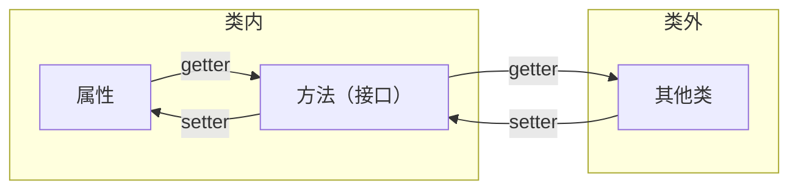

[toc]

# 🧊's 后端学习笔记

## Java 篇

### 1. Java 基础篇

#### 1.0 Java 项目的基本结构以及创建 java 项目

**Java 项目的结构**

当你在创建一个 Java 项目的时候，一般文件夹里会包含以下文件：

* `src` **文件夹 (Source Code)**：这是项目的核心，存放你所有书写的 `.java` 源代码文件。
* `lib` **文件夹 (Libraries)**：存放项目依赖的外部库 (`.jar` 文件)。
* `out` **或** `target` **或** `bin`  **文件夹 (Output)**：存放 Java 源代码编译后生成的字节码文件 (`.class` 文件)。
* **配置文件**：比如 `.project`，`.classpath`，`.pom.xml`，`build.gradle` 等。


**包 (Package)** 是什么

如果说项目是 “一本书”，那么**包**就是书里的**章节**

写一本书，不会统统的把内容糅杂在一起，而是分章节，例如“第一章”，“第二章”等等，包就是这个作用，主要有三个目的：

1. **组织和管理类**
    把功能相关的类放到同一个包里，可以让项目结构清晰。例如一个电商项目可以有：
	* `com.mycompany.user`：存放所有和用户有关的类，例如 `User.java`，`LoginService.java`
    * `com.mycompany.order`：存放所有和订单相关的类，例如 `Order.java`，`PaymentService.java`
    * `com.mycompany.product`：存放所有和商品相关的类。
2. **避免命名冲突**
    想象以下，如果小明写了一个工具类叫 `Utils.java`，小王也写了一个工具类 `Utils.java`。如果没有包，这两个文件就会冲突。但如果你们把各自的类放进不同的包里，例如 `com.xiaoming.feature1.Utils` 和 `com.xiaowang.feature2.Utils`，那么就能互不冲突。
3. **控制访问权限**
	如果在一个类里定义的变量或者方法不写 `public`，`private`，`protected`，那么它就是**包级私有**的，只有在同一个包里的其他类才能访问它。


例子：

```
MyBookProject/  (这是整个"项目")
├── src/  (书稿文件夹)
│   └── com/
│       └── mycompany/
│           ├── user/  (这是 "user" 包)
│           │   ├── User.java  (这是一个"类")
│           │   └── UserService.java
│           ├── order/  (这是 "order" 包)
│           │   ├── Order.java
│           │   └── PaymentService.java
│           └── Main.java  (程序的主入口类)
│
├── lib/  (参考书架)
│   └── some-library.jar  (一本参考书)
│
└── bin/  (印刷品文件夹)
    └── ... (自动生成的 .class 文件)
```


**创建 Java 项目**

打开 vscode，在扩展中搜索 `Java` 以及 `Extension Pack for Java`，并且安装这两个插件。

在 vscode 之中 `ctrl + shift + p` (windows) 或者 `command + shift + p` (MacOS) ，输入 `Create Java Project`


我们目前只需要创建空项目即可，选择 No build tools，即可创建好一个项目。


#### 1.1 Java 完整执行过程


**JDK (Java Development Kit)**，里面有工具和库，能够让你编写 Java 代码。当安装 JDK 的时候，JRE 也会被同时安装。

**JRE (Java Runtime Environment)**，提供了一个运行环境，你可以在 JRE 里面运行你的 Java 代码。JRE 内部有着 JVM，Java 代码在进入 JVM 之后才能运行。

**JVM (Java Virtual Machine)**，能够加载 .class 文件中的字节码，然后将其转换成当前运行环境所能理解和执行的机器码。即能将平台独立的字节码翻译成该平台的平台以来的机器码并且执行。


当我们编写一个 Java 程序时，我们会将代码写在一个 .java 文件之中，然后使用 javac 命令将文件编译成二进制代码（字节码），这个是**平台独立（平台无关）**的文件，也就是 javac 编译后的 .class 文件。然后在不同平台上，使用 jvm 加载 .class 文件的字节码，将其转换为当前运行环境所能理解和执行的机器码，JVM 是**平台依赖（平台相关）**的。

> **平台独立**指的是一个软件、程序、编程语言或者系统**能够在不同操作系统、硬件架构或其他计算环境下运行，而无需进行大量的修改或者重新编写**。即 “一次编写，到处运行”。
>
> **平台依赖**指的是一个软件、程序、编程语言或者系统**只能在特定的操作系统、硬件架构或其他计算环境下运行**。如果想要在不同的平台上运行，通常需要对代码进行大量的修改、重新编写以及重新编译。


当我们需要手动编译一个 java 文件时，例如 `Test.java`，我们需要在终端中执行

```bash
.javac Test.java
```

这会生成一个 `Test.class` 的文件，也就是上面提到的平台独立的字节码

在终端中执行

```bash
java Test
```

即可运行我们书写的 java 代码。

> 这里为什么不写 `java Test.class`？这行命令实际上调用的是 jvm，让其将字节码翻译成机器码并且运行，既然是 jvm，那它只会接受所有的 `.class` 文件，所以不需要特定的指定其后缀，因为其默认就会认为你要执行 `xxx.class` 文件。


#### 1.2 Java 程序的框架

以下是一个简单的 Java 程序示例：

```java
class Test {
    public static void main(String[] args) {
        System.out.println("Hello World!");
    }
}
```


这里的 class 后面跟着的是类名。在 java 中，我们将所有的代码写入类里面，这个类名要跟我们的文件名完全一致，且大小写敏感。


`public static void main(String[] args)` 这里是声明了主方法 main。在 java 中，main 就是程序的主入口。

其中，`public` 是访问修饰符，代表这个方法可以被类外的其他程序所访问。

`static` 表示这个方法属于类的本身，而不是类的实例。

`void` 表示这个方法不会返回任何值。

`String[] args` 表明该方法接受一个字符串数组作为参数。命令行参数可以通过这里传递给你的程序。

> 加入我编译程序的命令是
>
> ```bash
> javac Test.java
> java Test apple banana
> ```
>
> 那么 `args` 之中接受的就是 `["apple", "banana"]`
>
> 假设我代码中加入了 `System.out.println(args[0]);`
>
> 那么执行 `java Test apple banana` 后，终端输出为：
>
> ```bash
> Hello World!
> apple
> ```


`System.out.println()` 是一个 `java.lang` 包中的函数，能够在控制台中输出括号内的东西并**换行**。


请记住，分号是 java 指示语句结束的关键元素，能够帮助编译器知道语句的结束，所以在 Java 中书写语句时，你都必须使用分号来表示它的结束。


#### 1.3 Java 基础数据类型

不同于 python，java 是一种强类型语言，变量是有其具体的类型的，一般不能跨类型转化（例如 int 转 string 等等），一般也不能跨类型进行操作和运算。例如在 python 中这样是合法的：

```python
age = 20
```

但是在 java 中你需要这样写

```java
int age = 20;
```

即 `[类型] [变量名] = [值];`


我们也不能将一个变量重复声明为不同类型。例如以下是不合法的：

```java
int age = 20;
long age = 20; //不合法！因为 age 已经被声明为 int 类型了
```


##### 1.3.1 整数型

整数型分为 `byte`，`short`，`int`，`long` 四种

`byte` 的取值范围是 `-128 ~ 127`，占一个字节 (byte)

`short` 的取值范围是 `-32768 ~ 32767`，占两个字节 (byte)

`int` 的取值范围是 `-2147483648 ~ 2147483647` ( 21 亿，$-2 \times 10^9 \sim 2 \times 10^9$ )，占四个字节 (byte)

`long` 的取值范围是 `-9223372036854775808 ~ 9223372036854775807` ( 922 兆，$-9 \times 10^{18} \sim 9 \times 10^{18}$ )，占八个字节 (byte)

具体数字不需要背诵，大概知道范围是多少即可。如果实在需要知道，可以使用

```java
System.out.println(Byte.MIN_VALUE);
System.out.println(Byte.MAX_VALUE);
```

即可。可以将 `Byte` 替换为 `Short`，`Integer`，`Long` 以知道四种类型的最小和最大范围。


但当你输入数字的时候，编译器会默认其为 `int` 类型，所以当你声明例如

```java
long x = 2147483648
```

的时候，其仍然会报错。所以这时候你需要让编译器知道你给的是一个长整数，需要在数字后加一个 `l`，例如

```java
long x = 2147483648l
```

注意 `l` 是字母 `L` 的小写。


##### 1.3.2 小数型

小数型分为 `float`，`double` 两种

一般精度要求较低使用 `float`，精度要求较高使用 `double`。

`float` 一般具有 7 位小数的精度，占四个字节 (byte)

`double` 一般具有 15 位小数的精度，占八个字节 (byte)


但例如我们输入

```java
float x = 1000.1111231121f;
```

输出 x 的时候会发现为 `1000.11115`，只有 5 位小数，为什么呢？这是因为 float 同时也需要存前面的整数部分。如果我们定义 x 的时候：

```java
float x = 1.1111231121f;
```

输出 x 的时候就会发现为 `1.1111231`，有 7 位小数了。


当输入小数时，编译器也会默认其为 `double` 类型，所以当你声明例如

```java
float x = 3.1415926;
```

时其会报错。所以需要让编译器知道你给的是一个 `float` 类型的单精度浮点数，需要在数字后加一个 `f`。

```java
float x = 3.1415926f;
```


`float` 和 `double` 类型的最小值和最大值为，但这里的最大值和最小值指的是正数的最大值和最小值，负数同理，只不过前面加一个负号即可：


##### 1.3.3 字符型

`char` 是 java 中用来存**单个字符**的变量类型，占两个字节 (byte)，例如：

```java
char x = 'a';		// 注意这里的声明都是单引号而不是双引号，单引号一般指的是字符
char y = '\u27A4';	// unicode 表示法
char z = 10084;
```


在 java 中，`char` 类型的变量可以表示 Unicode 字符集在 $0 \sim 65535$ 之间的所有字符。

ASCII 码的范围一般在 $0 \sim 127$，是 Unicode 字符集的子集。


当然，java 之中也可以进行类型转换。例如以下操作都是合法的：

```java
char x = (char) 10084;
char xx = 10084;
int y = (int) x;
int yy = xx;
```


##### 1.3.4 布尔型

`boolean` 是 java 中用来存**真或假**的变量类型，占一个比特位 (bit)，例如：

```java
boolean a = true;
boolean b = false;
```


当**两种类型兼容**且**目标类型大于源类型**（占字节少的类型转化到占字节多的类型）时，会发生扩展转换，这时候精度不会丢失，且不会报错，编译器会自动进行转换类型，这个叫做**隐式转换**，也叫**宽化基本类型转换 (Widening Primitive Conversion)**，也可以叫做**自动转换**。

```java
int a = Integer.MAX_VALUE;
long b = a; //这里就是隐式转换
```


当**两种类型不兼容**或者**目标类型小于原类型**（占字节多的类型转化到占字节少的类型）时，会发生**窄化基本类型转换 (Narrowing Primitive Conversion)**，也叫**显式转换**。需要手动指明。

```java
Long a = Long.MAX_VALUE;
int b = (int) a; //这里就是显式转换
```

> 这里如果我们输出 b 的值，会发现其为 `-1`，这是为什么呢？
>
> a 在二进制中，可以表示为 `01111111 11111111 11111111 11111111 11111111 11111111 11111111 11111111`。即 8 个字节 64 位之中，第一位为 0，其余位为 1，当其转换成 int 的 4 个字节 32 位时，会保留后面的 32 位，即 b 的二进制表示为 `11111111 11111111 11111111 11111111`，如果学过补码的就知道这是 `-1` 的表示。


#### 1.4 Java 命名规则

Java 变量是**大小写敏感的**，即 `amount`，`Amount`，`amouNt` 这三个是不同的变量。

Java 的变量可以使用字母，数字，下划线 `_`，以及美元符号 `$` 进行组合，但首位不能是数字，变量名也不能是 Java 的保留关键字。

Java 变量应该**遵循小驼峰命名**法，即从第二个单词开始，每个单词的首字母都需要大写。例如：`fullName`，`myStudentCourses`

请让你的变量名**有意义**，这样在团队协作中，其他人就能知道你的变量名是什么意思。例如你要写人名，那我们应该将变量命名为 `name` 而不是 `a` 或者 `xxx`。


**以下三个后面会学到，你需要记住他们的命名规则**。

Java 中的**方法**也应该遵循与变量一样的规则，**遵循小驼峰命名法**。

Java 中的**类**应该要首字母大写，如果有多个单词，则应该**遵循大驼峰命名法**。即所有单词的首字母大写。

Java 中的**常量**应该要用**全大写字母和下划线来命名**。


#### 1.5 Java 的算术运算符及位运算符

##### 1.5.1 Java 中的算术运算符

Java 中有 `+ - * / %` 这五种基本算术运算符，运算优先级为 `% / *` > `+ -`，如果有括号的话优先为括号，同级运算符从左到右进行运算。


Java 也支持 `+= -= *= /= %=` 这样的复合运算符。复合运算符包含了**隐式类型转换**。

> 假设我有一段代码如下：
>
> ```java
> byte a = 10;
> a = a + 5;
> ```
>
> 会发现这一段出现了报错，原因是 `a + 5` 没有特殊声明的话，Java 会将数字看作是 `int` 类型的，所以 `a + 5` 这个数字是 `int` 类型的，但是 `a` 是 `byte` 类型的，所以会出现报错。我们当然可以显式转换来解决，如：
>
> ```java
> byte a = 10;
> a = (byte) (a + 5);
> ```
>
> 但我们也可以使用复合运算符来进行处理，即：
>
> ```java
> byte a = 10;
> a += 5;
> ```
>
> 这里的复合运算符就包含了**隐式类型转换**


Java 也有自增自减运算符，即 `++ --`。并且这个自增自减运算符**前置与后置是不同的**。且自增自减运算符优先级最高，即 `++ --` > `% / *` > `+ -`。

```java
int a = 99;
int b = a++;
```

这一段的 `++` 是后置的，运行结果是 `a = 100, b = 99`。自增自减运算符后置表示我先执行 `int b = a` 这个语句，然后在进行 `a = a + 1` 的操作。即当自增自减运算符**后置**时，**先使用，后增加 / 减少**。


```java
int a = 99;
int b = ++a;
```

这一段的 `++` 是前置的，运行结果是 `a = 100, b = 100`。自增自减运算符后置表示我先执行 `a = a + 1` 这个语句，然后在进行 `int b = a` 的操作。即当自增自减运算符**前置**时，**先增加 / 减少，后使用**。


下面的例子，可以自行尝试解决一下：

```java
int a = 1;
System.out.println(a++ + --a);
```

> 这一个的答案是 2。
>
> a++，遵循先使用后增加的原理，所以这里表达式的值是 1，然后 a 变成 2；
>
> --a，遵循先减少后使用的原理，之前的 a 是 2，那么减少后 a 变成 1，所以表达式的值为 1；
>
> 那么两者相加就是 1 + 1 = 2。


##### 1.5.2 Java 中的位运算符

Java 中的位运算符只能对 `byte short int long` 这四种类型使用。

Java 中有以下这几种运算符：`and`，`or`，`xor`，`not`，`left shift`，`right shift`，`unsigned right shift`，分别代表与运算 ( `&` )，或运算 ( `|` )，异或 ( `^` )，取反 ( `~` )，左移 ( `<<` )，右移 ( `>>` )，无符号右移 ( `>>>` )。


与运算 ( `&` ) 能够将两个数字按照其二进制每位进行运算，当两个数字的对应二进制位**都为 1**，则运算结果的当位为 1，否则为 0。

例如 5 & 4，5 的二进制为 `101`，4 的二进制位 `100`，对其进行按位与运算得到的结果就为 `100`，答案就是 4。


或运算 ( `|` ) 能够将两个数字按照其二进制每位进行运算，当两个数字的对应二进制位**有一个为 1**，则运算结果的当位为 1，否则为 0。

例如 5 & 4，5 的二进制为 `101`，4 的二进制位 `100`，对其进行按位与运算得到的结果就为 `101`，答案就是 5。


异或运算 ( `^` ) 能够将两个数字按照其二进制每位进行运算，当两个数字的对应二进制位**相同**，则运算结果的当位为 1，否则为 0。

例如 5 & 4，5 的二进制为 `101`，4 的二进制位 `100`，对其进行按位与运算得到的结果就为 `001`，答案就是 1。


| 第一个数的二进制位 | 第二个数的二进制位 | `&`  | `|`  | `^`  |
| :----------------: | :----------------: | :--: | :--: | :--: |
|         0          |         0          |  0   |  0   |  0   |
|         0          |         1          |  0   |  1   |  1   |
|         1          |         0          |  0   |  1   |  1   |
|         1          |         1          |  1   |  1   |  0   |


取反运算 ( `~` ) 能够让一个数字的所有二进制位取反，即 0 变 1，1 变 0。例如对 5 进行取反运算，答案为 -6。因为：

5 的二进制位为 `101`，假设这个变量是 int 类型的。那么取反之后就变成：

`11111111 11111111 11111111 11111010`，即为 -6 的补码表示。


左移运算 ( `<<` ) 能够让一个数字的所有二进制位左移任意位，如果超出变量类型则丢弃，右侧用 0 补齐。例如：

```java
int a = 5;
int c = a << 1;
```

5 的二进制位为 `101`，左移一位之后会变成 `1010`，答案为 10。

> 实际上对于正数来讲，左移运算相当于对这个数字 * $2^x$，其中 $x$ 代表左移的位数。


右移运算 ( `>>` ) 能够让一个数字的所有二进制位右移任意位，如果超出变量类型则丢弃，左侧使用符号位补齐 (对于正数左侧用 0 补齐，对于负数左侧用 1 补齐 )。例如：

```java
int a = 5;
int c = a >> 1;
```

5 的二进制位为 `101`，左移一位之后会变成 `10`，答案为 2。

```java
int a = -5;
int c = a >> 2;
```

`-5` 的二进制位为 `11111111 11111111 11111111 11111011`，右移两位之后变成

`11111111 11111111 11111111 11111110`，答案为 -2。

> 实际上对于正数来讲，右移运算相当于对这个数字 / $2^x$，其中 $x$ 代表右移的位数，但是要记得是向下取整的整除。


无符号右移运算 ( `>>>` ) 与右移一样，但左侧会使用 0 补齐。例如上面负数的例子：

```java
int a = -5;
int c = a >>> 2;
```

`-5` 的二进制位为 `11111111 11111111 11111111 11111011`，无符号右移两位之后变成

`00111111 11111111 11111111 11111110`，答案为 1073741822。


#### 1.6 java 中的字符串 (String) 与类 (Class) 的基本概念

字符串 `String` 实际上可以理解为字符序列，即许多字符组成的一个序列，可以存多个字符。例如：

```java
String name = "ice"; // 记住此处声明用的是双引号，双引号一般指的是字符串
String address = new String("China")	// 这样也可以声明一个字符串
```

注意，这两种声明方式是有区别的，下面会进行详细解释。


就像 C++ 等语言一样，Java 也是面向对象的语言，也有类的概念。例如一个学生，有其姓名，学号，以及班别，我们不可能对每一个新的学生都单独分别声明变量，例如 `name1, name2, name3` 等等，如果又需要新增一个年级，我们就需要对之前所有学生都新增 `grade1, grade2, grade3` 等等。这会不会太麻烦了一点？所以对于这种，我们引入了一个概念 ---- 对象。在 Java 中，我们可以通过实现类来实现面向对象编程。

我们可以在项目对应的包的文件夹中，新建一个 Java 文件，例如 `Student.java`，里面的内容有：

```java
// Student.java

package xxx;	// 这里的 xxx 是你当前文件对应的文件夹名，也叫包名

public class Student {
    String name;
    String address;
    int no;
}
```

这样我们就可以在其他引用了 Student 类的任意 java 文件中来使用这个类。例如:

```java
// Test.java

package xxx;

public class Test {
    public static void main (String[] args) {
        Student a = new Student();	// 用 类名 变量名 = new 类名() 来创建一个实例。
        a.name = "ice";
        a.address = "China";
        a.no = "2024";
    }
}
```

> 这里的 Student.java 和 Test.java 是在同一个文件夹下的，即在同一个**包**下的。


以下讲的内容可能会涉及到 [java 堆内存](#heapMemory)，可以先略微的看一下，了解以下堆内存是什么再回来看。[点我查看 java 堆内存篇](#heapMemory)


先来个小问题：请问下面这个代码的输出是什么？

```java
String a = new String("Ram");
String b = new String("Ram");
String c = "Ram";
String d = "Ram";
System.out.println(a == b);
System.out.println(c == d);
```

如果你的答案是：

```
true
true
```

那你就错误了。

正确答案应该是

```
false
true
```

为什么呢？

我们知道，堆内存中存放的是程序创建的对象实例和数组。使用 `String a = new String("Ram")` 的方式创建一个字符串实际上是创建了一个**对象**，会被分配到不同的堆内存上，所以在声明 a 的时候，a 被分配到了一个地址上，而声明 b 的时候，b 被分到了另一个地址上。这两个的地址是不一样的，所以两者是不一样的。

但为什么使用 `String c = "Ram"` 时，c 和 d 又是相等的呢？这是因为堆内存中有个区域叫做字符串池，它会将我们写到的**第一次出现的字符串**放入其中。这样当下次书写的时候，我就只需要将其分配到同一个内存上即可。所以两者的地址是一样的。

实际上，在字符串的比较中，我们实际上比较的是他们的**引用 (Reference)**，而不是比较他们的**内容**。所以我们只会在基本数据类型上使用 `==` 判断两者是否相同。


在 Java 中，**方法 (Method)** 就是一段**封装了特定功能、可以被重复调用的代码块**。本节我们只介绍字符串的一些方法。关于方法的详细讲解将会在后面书写。


第一个方法是 `.length()`，它能够返回字符串的长度。例如：

```java
String a = "ice";
System.out.println(a.length()); // 3
```


第二个方法是 `.charAt()`，它能够传入任意索引，就会返回对应下标对应的字符。例如：

```java
String a = "ice";
System.out.println(a.charAt(1)); // c，因为字符串的下标是从 0 开始的
```

如果输入的下标超过范围 (`0 ~ a.length() - 1`)，那么 java 会报错。


我们上面讲过，我们只会在判断基本数据类型时使用 `==` 来判断。所以 java 给我们提供了一个字符串比较的方法，也就是第三个方法 `.equals()` 来比较字符串是否相同。例如：

```java
String a = new String("Ram");
String b = new String("Ram");
String c = "Ram";
String d = "Ram";
System.out.println(a.equals(b)); // true
System.out.println(c.equals(d)); // true
System.out.println(a.equals(c)); // true
```


如果我们忽略大小写，例如有时候一些网站的用户名是大小写**不敏感**的，那就可以使用我们的第四个方法 `.equalsIgnoreCase()`，这个方法能够在忽略大小写的情况下比较两个字符串的值。例如：

```java
String a = "Ram";
String b = "ram";
System.out.println(a.equalsIgnoreCase(b)); // true
System.out.println(a.equals(b)); // false
```


第五个方法是 `.compareTo()`，这个方法会按照**字典序**比较两个字符串，返回值是一个 int。假设我们使用了 `str1.compareTo(str2)`，若：

* 返回一个负整数 (`< 0`)，即表示 `str1` 字典序**小于** `str2`。
* 返回零 (`== 0`)，即表示 `str1` 和 `str2` 的内容**完全相同**。
* 返回一个正整数 (`> 0`)，即表示 `str1` 字典序**大于** `str2`。

它的比较规则是：

1. 从两个字符串的第一个字符开始，逐个向后对比它们的 Unicode 值，若出现不同则停止，然后返回 `str1` 的字符值 - `str2` 的字符值。
2. 若已经比较完了所有字符，且长度完全一致，那么返回的值为 0。
3. 若有一个字符串短于另一个字符串，且短的字符串是长的字符串的**前缀**，则返回两者的长度差 (正数)。

> 前缀是指例如 `apple` 和 `applepie` 这样关系的字符串。即从 `applepie` 的第一位开始，到任意位置所截的字符串，都是 `applepie` 的前缀。即 `a`，`ap`，`app`，`appl`，`apple`，`applep`，`applepi` 都是 `applepie` 的前缀。


第六个方法是 `.compareToIgnoreCase()`，与 `.compareTo()` 一样，只不过忽略了大小写。


`.compareTo()` 与 `.equals` 的区别：

|   特性   |                        `.compareTo()`                        |                   `.equals()`                   |
| :------: | :----------------------------------------------------------: | :---------------------------------------------: |
| 返回类型 |                             int                              |                     boolean                     |
| 比较目的 |                判断两个字符串的**字典序关系**                |      判断两个字符串的**内容是否完全相同**       |
| 主要用途 | 排序 (例如 `Collections.sort()` 对字符串列表进行排序时，就是用的这个方法) | 条件判断 (例如 `if(password.equals("123456"))`) |


第七个方法是 `.substring()` 方法，这个方法能够截取一部分的字符串，例如：

```java
String name = "ice_awa";
String a = name.substring(1, 4);
System.out.println(a); // "ce_" 左闭右开的区间，截取了 [1, 3] 即 [1, 4) 的字符串
```


第八个方法是 `.toUpperCase()` 方法，这个方法能够让所有字母转换为大写。例如：

```java
String name = "ice";
System.out.println(name.toUpperCase()); // ICE
```


第九个方法是 `.toLowerCase()` 方法，这个方法能够让所有字母转换为小写。例如：

```java
String name = "ICE";
System.out.println(name.toLowerCase()); // ice
```


第十个方法是 `.trim()` 方法，这个方法能够忽略掉首尾的所有空格。例如：

```java
String name = "      ice_awa      ";
System.out.println(name.trim()); // ice_awa
```


第十一个方法是 `.replace()` 方法，这个方法能够将字符串中的某个子字符串替换成另一个字符串。例如：

```java
String a = "ice_awa";
String b = a.replace("awa", "pwp");
System.out.println(b); // "ice_pwp"

String c = "ice ice ice ice ice";
String d = c.replace("ice", "ice_awa");
System.out.println(d); // "ice_awa ice_awa ice_awa ice_awa ice_awa";
```


第十二个方法是 `.contains()` 方法，这个方法能够查看字符串中是否包含某个子字符串。例如：

```java
String name = "ice_awa";
System.out.println(name.contains("awa")); // true
```


第十三个方法是 `.startsWith()` 方法，这个方法能够查看某个字符串是否是这个字符串的前缀。例如：

```java
String name = "ice_awa";
System.out.println(name.startsWith("ice")); // true
```


第十四个方法是 `.endsWith()` 方法，这个方法能够查看某个字符串是否是这个字符串的后缀。例如：

```java
String name = "ice_awa";
System.out.println(name.endsWith("awa")); // true
```


第十五个方法是 `.isEmpty()` 方法，这个方法能够查看某个字符串是否是空的。例如：

```java
String a = " ";
String b = "";
System.out.println(a.isEmpty()); // false
System.out.println(b.isEmpty()); // true
```


第十六个方法是 `.isBlank()` 方法，这个方法能够查看某个字符串是否只由空格组成。例如：

```java
String a = "    ";
String b = " ";
System.out.println(a.isBlank()); // true
System.out.println(b.isBlank()); // true
```


第十七个方法是 `.indexOf()` 方法，这个方法能够告诉你某个字符串第一次出现的位置。例如：

```java
String a = "ice_awa";
System.out.println(a.indexOf("a")); // 4
System.out.println(a.indexOf("awa")); // 4
```

也可以给定两个参数，表示从下标为几开始，找到后面第一次出现这个字符串的位置。例如：

```java
String name = "Amar Panchal";
System.out.println(name.indexOf("a", 5)); // 6
```


第十八个方法是 `.lastIndexOf()` 方法，这个方法能够告诉你某个字符串最后一次出现的位置。例如：

```java
String a = "ice_awa";
System.out.println(a.lastIndexOf("a")); // 6
```


第十九个方法是 `.valueOf()` 方法，这个方法能够将数字转换成字符串。例如：

```java
int a = 10;
String s = String.valueOf(a);
System.out.println(s); // "10"
```


第二十个方法是 `.format()` 方法，这个方法类似于 `System.out.printf()`，也类似于 C 语言的 `printf()`。例如：

```java
String str = String.format("My name is %s and I am %d years old.", "ice", 18);
System.out.println(str); // My name is ice and I am 18 years old.
```


#### 1.7 Java 的条件语句与循环语句

Java 中有以下的关系运算符，用于比较大小：`> < >= <= == !=`。当其比较基本数据类型的时候，它比较的是两个的值，但不比较类型。例如：

```java
int a = 65;
char b = (char) 65;
System.out.println(a == b); // true
```

当其比较其他数据类型的时候，它比较的是两个的引用。例如前面提到的字符串的比较操作。


Java 中有以下的逻辑运算符，`&& || !`，分别代表与，或，非。可以连接多个关系运算符。


Java 中也有条件判断语句：`if, else if, else`，用法也与其他语言一样。即：

```java
if ( 条件语句 1 ) {
    语句 1
} else if ( 条件语句 2 ) {
    语句 2
} else {
    语句 3
}
```

当条件语句 1 成立时，语句 1 就会被执行。否则若条件语句 2 成立，则语句 2 会被执行。若都不成立，则语句 3 会被执行。


Java 中也有 `switch case` 的语句，用法与 C 类似，也要注意每个 case 之后都要 break，只不过需要加上大括号。即：

```java
switch ( 变量 ) {
    case xxx: {
        语句 1
        break;
    }
    case xxx: {
        语句 2
        break ;
    }
    default: {
        语句 3
    }
}
```


Java 中有三种循环的方式，`while, for, do-while`，用法与 C 类似。这里直接讲三种的用法：

```java
while ( 条件语句 ) {
    语句
}
```

当条件语句满足时，语句就会被执行。


```java
do {
    代码 1
} while ( 条件语句 ) {
    代码 2
}
```

每次循环时，无论条件语句是否满足，都会先执行一边代码 1，然后判断条件语句是否满足。若满足，则执行代码 2，若不满足，则跳出整个循环。


```java
for ( 初始条件; 条件语句; 更新语句) {
    代码
}
```

先执行一边初始条件。然后若条件语句满足，则执行内部的代码。然后执行更新语句。


#### 1.8 Java 中的数组

Java 中一维数组有以下几种声明方法：

```java
int[] arr = {1, 2, 3};	// 静态初始化
int[] arr = new int[5];	// 动态初始化
```

```java
int[] arr;
arr = new int[5];
```

```java
int[] arr;
arr = new int[]{1, 2, 3};
```

对于数字型的数组，默认的初始值都为 0。

> 实际上，这里的 `arr` 是一个引用，它会被存进 [栈内存](#stackMemory) 之中。而数组具体的内容会被存进 [堆内存](#heapMemory) 之中。


在数组被创建的时候，它都会有一个叫 length 的**属性**，可以像如下进行调用：

```java
int[] a = new int[10];
for (int i = 0; i < a.length; i++) {
    System.out.println(arr[i]);
}
```

请注意这里是 `length` 而不是 `length()`，这个是数组对象的**属性**而不是**方法**。 

> <span id = "toString"></span>
> 一个有趣的问题：如果我的代码是如下书写的：
>
> ```java
> int[] arr = new int[5];
> System.out.println(arr);
> ```
>
> 这样输出的是什么呢？
>
> 它会输出类似以下的格式：`[I@15db9742` 之类的格式。每次运行时都会不同，例如下次就有可能是 `[I@6d06d69c`。这个输出实际上是当你给 `System.out.println()` 传入一个对象时 (数组也是一个对象)，它会调用这个对象的 `toString()` 方法，然后打印返回的字符串。
>
> Java 的数组对象**并没有重写**从 `Object` 类继承来的默认的 `toString()` 方法，而这个方法的设计内容是返回一个对象的“身份标识”，格式是：`类名 + "@" + 对象的哈希码的十六进制格式`。
>
> 所以上面的输出 `[I@15db9742` 实际上表示的是：
>
> * `[`：表示这是一个数组
> * `I`：这是数组原始的内部签名，`I` 代表 `int` 类型。若是 `String` 数组，则是 `[Ljava.lang.String;`，若是 `Double` 数组，则是 `[D`
> * `15db9742`：这是 `arr` 指向的那个数组对象的**哈希码**的十六进制表示。它与内存地址有关**但不完全等同于内存地址**。


对于数组来讲，我们想遍历数组，可以使用 for-each 来遍历：

```java
int[] arr = {1, 2, 3, 4, 5};
for (int x : arr) {
    System.out.println(x);
}
```


在 Java 中，我们也有二维数组的创建，创建方式如下：

```java
int[][] arr = new int[3][3];	// 静态初始化
int[][] arr = {					// 动态初始化
    {1, 2, 3},
    {4, 5, 6},
    {7, 8, 9}
}
```


在 Java 中，我们可以创建"锯齿状"的数组，例如以下的数组：

```java
{
    {1, 2},
    {3, 4, 5},
    {6}
}
```

创建方式如下：

```java
// 静态初始化
int[][] arr = new int[3][];
arr[0] = new int[2];
arr[1] = new int[3];
arr[2] = new int[1];

// 动态初始化
int[][] arr = {
    {1, 2},
    {3, 4, 5},
    {6}
}
```


当数组是多维时，我们要使用 length 属性遍历的话，我们就需要进行如下操作：

```java
int[][] arr2D = new int[3][3];
for (int i = 0; i < arr2D.length; i++) {		// 注意这一行是 arr2D.length
    for (int j = 0; j < arr2D[i].length; j++) { // 注意这一行是 arr2D[i].length
        //代码
    }
}

int[][][] arr3D = new int[3][3][3];
for (int i = 0; i < arr3D.length; i++) {				// 注意这一行是 arr3D.length
    for (int j = 0; j < arr3D[i].length; j++) { 		// 注意这一行是 arr3D[i].length
        for (int k = 0; k < arr3D[i][j].length; k++) {	// 注意这一行是 arr3D[i][j].length
            //代码
        }
    }
}
```

我该如何理解呢？实际上，length 属性是当前维度拥有多少元素的属性。例如一个 `int[][] arr = new int[3][2]`，那么 `arr.length` 实际上是第一维有多少元素，即为 `3`。而 `arr[0].length` 实际上是问 `arr[0]` 由多少个元素，即为 `2`。


#### 1.9 Java 的方法 (签名，重载，对象的可变性)

我们在书写代码的时候，经常会发现有一些代码出现了许多次，这些可重复的代码如果我一直书写，就会让代码变的冗长且不好维护。例如我需要执行 `a + b` 多次，例如十几次或者更多次，那我就需要复制很多遍 `a + b`；当我需要将这些代码改成 `b + c` 的时候，我又需要将所有的语句都这样修改，会增加我们的工作量。我们就需要引入一个新的概念：方法。

**方法 (Method)** 是一段**封装了特定功能、可以被重复调用的代码块**，能够解决我们上述的烦恼。

它的语法结构是：`[修饰符] [方法类型] [方法名]([参数名]) throws [异常类型] { ... 方法体 ...}`

* **修饰符**：例如 `public`，`protected`，`private` 以及 `static`，这些后面会讲到，这部分是**可选的**。
* **返回类型**：方法执行完毕后返回给调用者的数据类型。如果不需要返回则用 `void`。
* **方法名**：你给这个功能起的名字。
* **参数列表**：方法执行时需要从外部接收的数据。可以没有参数，也可以有一个或者多个。
* `throws` **异常类型**：声明方法有可能会出现某些类型的异常，这个后面会讲到。这部分是**可选的**。
* **方法体**：`{}` 大括号中的具体代码。方法被调用时，这里面的代码就会执行。

给几个简单的例子：

```java
public void eat(String food) {
    System.out.println("我吃了" + food);
}
public int getAge() {
    int age = 19;
    return age;
}
```


有时候，方法中的参数列表我们不确定有多少个，我们就可以用**可变参数**，例如：

```java
public int sum(int... nums) {
    int res = 0;
    for(int x : nums) {
        res += x;
    }
    return res;
}
```

这里的 `int...` 指的就是可变参数，当我们调用这个函数时，以下的所有调用形式都是合法的：

```java
sum();
sum(1, 2);
sum(1);
sum(4, 5, 6);
sum(9, 10, 11);
```

即，我可以不用特定指定有几个参数了。当我们使用可变参数时，Java 实际上会把这个参数给封装成一个**数组**，即上述例子的 `nums` 实际上是一个 int 类型的数组。

**但是要注意**，使用可变参数时，要遵循以下规则：

* **一个方法最多只能有一个可变参数**
  例如，你不能这样写：`public void someMethod(int... nums, String... names) { ... }`

* **可变参数必须是参数列表中的最后一个**
  正确的例子：

  ```java
  public void someMethod(String message, double score, int... userIds) {
      // 一些代码
  }
  ```

  错误的例子：
  ```java
  public void someMethod(int... userIds, String message) {
      // 一些代码
  }
  ```


##### 1.9.1 方法的签名 (Signature)

**方法签名**，是 Java 用来**唯一标识一个方法**的东西，就像我们的身份证号码一样独一无二。在一个类中，一个方法的签名**只包括**两部分：**方法名和参数列表**。这里的参数列表又指**参数的类型、数量和顺序**。但请注意，**参数的名字不属于签名的一部分**。

同样的，**返回类型**（如 int 或者 void），**访问修饰符**（如 public 或者 private），以及 `throws` **异常字句**都不影响它的签名，**不属于方法签名的一部分**。


##### 1.9.2 方法的重载 (Overloading)

**重载 (Overload)** 指的是在**同一个类中**，允许存在一个以上的**同名方法**，只要它们的**参数列表不同**即可。

> 实际上，方法的重载也叫做编译时多态

例如简单的计算器类：

```java
public class Calculator {

	// 1. 参数个数不同
    public int add(int a, int b) {
        System.out.println("调用了有两个int参数的add方法");
        return a + b;
    }

    public int add(int a, int b, int c) {
        System.out.println("调用了有三个int参数的add方法");
        return a + b + c;
    }

    // 2. 参数类型不同
    public double add(double a, double b) {
        System.out.println("调用了有两个double参数的add方法");
        return a + b;
    }
    
    // 3. 参数类型的顺序不同
    public void print(String message, int number) {
        System.out.println(message + ": " + number);
    }

    public void print(int number, String message) {
        System.out.println(number + " -> " + message);
    }
    
    // ---- 调用 ----
    public static void main(String[] args) {
        Calculator calc = new Calculator();
        calc.add(2, 3);        // 调用第一个add
        calc.add(2, 3, 4);     // 调用第二个add
        calc.add(2.5, 3.5);    // 调用第三个add
        calc.print("数字是", 100);  // 调用第一个print
        calc.print(200, "是数字");  // 调用第二个print
    }
}
```


但请注意，**若仅仅返回类型不同**，那么他们**不能构成重载**。例如：

```java
public class BadExample {
    public int calculate(int a) {
        return a * 2;
    }
    
    // 编译错误！编译器无法区分你要调用哪个方法。
    public double calculate(int a) {
        return a * 2.0;
    }
}
```


##### 1.9.3 对象的可变性 (Mutability)

> 这部分知识需要对栈内存和堆内存有一定的了解。可以 [点此查看堆内存相关知识](#heapMemory) 以及 [点此查看栈内存相关知识](#stackMemory)

**可变性**，描述的是一个**对象在被创建了之后，它的内部状态还能不能被改变**。根据这一点可以将对象分为**可变对象**和**不可变对象**。

**不可变对象 (Immutable Object)** 的特点是**对象一旦创建，其内部状态就再也无法改变**。例如 `String`、`Integer`、`Double`、`Long` 等所有基本类型的包装类，以及 Java 8 的日期时间 API（如 `LocalDate`）。**任何看似“修改”不可变对象的方法，实际上都会返回一个全新的对象，而原始对象保持原样。**

**可变对象 (Mutable Object)** 的特点是**对象创建后，我们依然可以通过调用它的方法来改变它内部的状态。**例如 `StringBuilder`、`ArrayList`、`HashMap`、`Date`，以及我们自己创建的大多数普通对象。

如果有以下代码，请问输出的结果是什么：

```java
// Test.java

package test;

public class Test {
    // 这里的 Cat 类具体的内容你不需要知道，我们只需要用到其中的 name 属性。
    public static Cat funcA(Cat cat) {
        cat.name = cat.name.toUpperCase();
        return cat;
    }

    public static String funcB(String x) {
        x = x.toUpperCase();
        return x;
    }

    public static void main(String[] args) {
        Cat a = new Cat();
        a.name = "bob";
        String b = "bob";
        Cat aa = funcA(a);
        String bb = funcB(b);

        System.out.println(a.name);
        System.out.println(aa.name);
        System.out.println(b);
        System.out.println(bb);
    }
}
```

正确的输出是：

```
BOB
BOB
bob
BOB
```

为什么会出现这样的输出？

首先，Java 的方法永远是**值传递**的。并且，`Cat` 对象是**可变的**，`String` 对象是不可变的。

让我们一步一步解析一下代码运行时发生的事情：

**对于** `Cat` **类部分：**

首先执行 `Cat a = new Cat(); a.name = "bob";` 这两步。这时内存中发生的是：

* 堆内存：创建了一个 `Cat` 对象，房子里有个 `name` 属性，值是 `"bob"`。假设地址是 `0x123`。
* 栈内存：`main` 方法的栈帧里，创建了一个引用变量 `a`，这个变量指向的地址是 `0x123`。

然后调用了 `funcA(a)` 方法：

* Java 进行**值传递**。它把 `a` 变量的**值**（也就是地址 `0x123`）**复制一份**，传给 `funcA` 方法的参数 `cat`。
* 现在，`funcA` 的栈帧里，也有了一个引用变量 `cat`，值也是 `0x123`。

当我们执行 `cat.name = cat.name.toUpperCase()` 时：

* `funcA` 方法通过 `cat` 这个引用变量，指向了 `0x123` 地址。
* 它对 `name` 属性进行了修改，`"bob"` 变成了 `"BOB"`。这个修改是**直接作用于堆内存中那个唯一的 `Cat` 对象**。

**对于** `String` **类部分：**

首先执行 `String b = "bob";` 这一步：

* 堆内存中的字符串常量池：创建了一个 `String` 对象，内容是 `"bob"`，假设地址是 `0x456`。
* 栈内存：`main` 方法的栈帧里，创建了一个引用 `b`，值为 `0x456`。

然后调用了 `funcB(b)` 方法：

* 同样是值传递，`b` 的值 (`0x456`) 被**复制**一份给了 `funcB` 的参数 `x`。
* 现在，`main` 的 `b` 和 `funcB` 的 `x` 这两个引用，都指向了同一个 `"bob"` 字符串对象。

当我们执行 `x = x.toUpperCase()` 这一步：

* `x.toUpperCase` 这个方法**不会修改**原始的 `"bob"` 字符串（因为 `String` 是不可变对象）。
* 它会在堆里**创建一个全新的** `String` **对象**，内容是 `"BOB"`，假设这个新对象的地址是 `0x789`。
* 然后通过 `=` 赋值操作，把这个**新地址** `0x789` 赋值给了 `funcB` 方法的**内部的局部引用** `x`。
* 此时，`funcB` 里的 `x` 不再指向 `"bob"`，而是指向了 `"BOB"`。但 `main` 方法里的 `b` **完全没有受到影响**，仍然指向的是 `"bob"`。

所以返回后，`bb` 指向的地址实际上是 `0x789`，即 `"BOB"`，而 `b` 指向的地址仍然是 `0x456`，即 `"bob"`。`a` 和 `aa` 都是指向 `0x123` 这个 `cat` 类，它里面的 `name` 属性是 `"BOB"`。


### 2 Java 进阶篇

> 本节中，2.1 与 2.2 在教材上一般不会提到，但是若想就业或者了解底层原理，可以稍作学习。

<span id = "heapMemory"></span>

#### 2.1 Java 堆内存，分代垃圾回收模型

Java 中的**堆内存 (Heap Memory)** 是 JVM 在运行时管理的最大一块内存区域。它的唯一目的就是**存放程序中创建的对象实例和数组**。

Java 中的所有线程访问的都是**同一个堆内存区域**，这也是为什么 Java 多线程编程中需要处理“线程安全”问题的根源。

Java 堆内存的大小可以在 JVM 启动时通过参数来设定，例如 `-Xms` 初始堆大小，`Xmx` 最大堆大小。


Java 堆内存也是**垃圾回收的主要场所**，JVM 的**垃圾回收器 (Garbage Collector, GC)** 会清理堆内存，就不用像 C++ 等语言手动 `delete` 或者 `free` 以免内存泄漏。


为了让**垃圾回收 (GC)** 更高效，JVM 的设计者们将堆内存划分成了几个区域，这就是**分代垃圾回收模型**。堆内存的结构如下：

```mermaid
graph TD
A[堆内存]-->B[新生代]
A-->C[老年代]
B-->D[伊甸园区]
B-->E[幸存者 0 区]
B-->F[幸存者 1 区]
````


* **新生代 (Young Generation)**，是绝大多数新对象诞生的地方。因为大约 98% 的对象都是”昙花一现“的，即临时创建的，很快就被废弃，所以将它们集中放在新生代，可以非常搞笑地进行内存回收。新生代内部又可以分为以下几个部分：
	* **伊甸园区 (Eden Space)**，新对象的出生地
	* **幸存者 0 区 (Survivor 0 Space)** 与 **幸存者 1 区 (Survivor 1 Space)**。当伊甸园区满了，GC 就会进行一次**小型回收 (Minor GC)**，活下来的对象就会挪到其中一个幸存者区。这两个幸存者区会来回倒腾，每经历一次回收还”活着“的对象，年龄就 +1。
* **老生代 (Old Generation / Tenured Generation)**。当一个对象在新生代中存活了很多次 Minor GC，JVM 就会认为它是一个”长寿“的对象，就会将其”晋升“到老年代。在这里存放的都是生命周期很长的对象，对老年代**垃圾回收 (Minor GC 或 Full GC)** 发生的频率会低很多，但一旦发生，耗时会长的多。


#### 2.2 Java 栈内存以及栈帧

<span id = "stackMemory"></span>

Java 中的**栈内存 (Stack Memory)** 是 Java 内存中用于**存储方法的调用信息和局部变量**的内存区域。它有以下特点：

1. **存储内容**：有局部变量和方法调用 (栈帧)：
	* **局部变量**：在方法内部定义的变量，又分为基本数据类型和对象引用。
		* **基本数据类型**：比如 `int a = 10;`，变量 `a` 和它的值 `10` 都存在栈里。
		* **对象引用**：例如一个数组 `int[] arr = new int[5];`，这里的 `arr` 就是一个引用，存的是堆内存中对象的地址。
	* **方法调用 (栈帧)**：每当一个方法被调用，JVM 就会创建一个**"栈帧 (Stack Frame)"**并且将其压入栈顶。这个栈帧里面包含了这个方法所有局部变量、操作数栈等信息。
2. **先进后出 (LIFO, Last In First Out)**，栈的特点
3. **线程私有**
    **每一个线程都有它独立的栈内存**。所以方法里的局部变量是**线程安全的**。
4. **速度快，空间小**：栈内存的分配和回收速度非常快，因为它只是简单地移动栈顶指针。但它的空间通常比堆小得多。
5. **自动管理**：栈内存由 JVM 自动管理，当一个方法执行结束，它的栈帧就会自动销毁，不需要垃圾回收器 (GC) 的介入。
6. 如果方法调用太深 (例如没有终止的递归调用)，把栈内存的空间全部沾满了，就会抛出 `StackOverflowError`。


#### 2.3 Java 中的权限控制 (Public, Protected, Private)

`public`：被这个关键词修饰的成员，可以在**任何地方**被访问，无论是同一个类，还是同一个包，还是不同的包里的任何类都可以访问。**通常用于对外提供功能的接口或者方法**。

`protected`：被这个关键词修饰的成员，在**同一个包里的任何类**或者在**不同包里，通过继承的子类**可以访问。当你希望一个方法或者属性**只被子类继承和使用，或者被同一个包里的"兄弟类"使用，但又不想外界能够随机访问他时**，就可以使用 `protected` 关键字。

`private`：被这个关键词修饰的成员，**只能在它所在的那个类的内部被访问**。当我们涉及到**封装**时，类的**属性几乎总是应该被声明为 `private`**，然后通过 `getter/setter` 方法来控制对这些属性的访问和修改。

`default`：这个不是一个关键词。它表示如果你没有明确指明 `public`，`protected`，`private`，那么它就是默认的 (default)。它也叫**包级私有**，即这个成员只能被**同一个包里的其他类访问。除了这个包以外的所有类，哪怕是子类，都无法访问。**


#### 2.4 Java 中的类与对象 (构造函数，封装，继承，多态与抽象类)

对于一辆车来讲，我们一般会有这辆车的蓝图，这个蓝图里面会记载车的属性以及行为。例如重量，油耗等等这些属性；以及刹车，油门等等这些行为。对于 Java 来讲，这个蓝图就叫**类**，跟据这个蓝图创建出来的，一个个具体存在的实例就叫**对象**。

**类**就是一个模板，它本身**不占内存空间 (程序运行时)**，它只是代码的一部分，用来描述一类事物应该是怎么样的。

**对象**是一个具体化、实体化的东西。在程序运行时会真真实实地**占用对内存空间**。我们把”根据类创建对象“这个过程，称为**”实例化“**。


拿一个简单的汽车例子来说，项目结构如下：


如果我想要写一个汽车类，代码可以这样写：

```java
// Car.java

package test;

public class Car {
    // 这些都是汽车的属性
    String color;
    String brand;
    String model;
    int year;
    int speed;
    
    // 这些都是汽车的行为，在 java 中我们通过方法来实现
    public void accelerate (int increment) {
        speed += increment;
    }
    public void brake (int decrement) {
        speed -= decrement;
        if (speed < 0) {
            speed = 0;
        }
    }
}
```

其中，车的颜色，品牌，对应的车型，年份，速度都是一辆汽车的**属性**。汽车有油门和刹车，这里用加速减速来简单的书写，在 java 中我们通过方法来实现这些**行为**。如果我们需要创建任何汽车，我们就可以借助这个**类**，也就是蓝图来实现。

在我们的主程序中，我们可以通过以下来**实例化**对象，也就是我们说的”造车“：

```java
// Test.java

package test;

public class Test {
    public static void main(String[] args) {
        Car car = new Car(); // 这一步也就是实例化，是将类具体化为一个对象的过程。
        car.color = "Blue";
        car.speed = 40;
        car.brand = "xxx";
        car.year = 2024;
        car.model = "xxx";
        /* 
        这样，我们就“造好了这个车”，即创建了这个对象，这是一辆蓝色的 2024 xxx 牌子 xxx 型号的车，现在的速度是 40。那么如果我想让它加速或者减速，就可以调用之前我们写的方法。例如
        */
        car.accelerate(1);
        car.brake(10);
    }
}
```


##### 2.4.1 类的构造函数

当我们执行例如 `Car car = new Car()` 的时候，实际上是调用了类的构造函数 `Car()`。但是我们类里面并没有这个函数啊？其实这个函数是当我们**没有手动指定构造函数**时， java 自动帮我们生成的，我们也将其称作**默认构造函数**。构造函数**一定是跟类同名的。**

当我们使用默认构造函数创建新的对象时，它会将内部属性初始化为默认值，例如 int 会被初始化为 0 等等。

我们当然可以重载构造函数，这样可以让我们自定义某些属性的初始值以及进行某些操作。例如：

```java
// Car.java

package test;

public class Car {
    String color;
    String brand;
    String model;
    int year;
    int speed;
    public void accelerate (int increment) {
        speed += increment;
    }
    public void brake (int decrement) {
        speed -= decrement;
        if (speed < 0) {
            speed = 0;
        }
    }
    // 我们可以重载一个不带任何参数的构造函数
    public Car() {
        this.color = "blue";
        this.brand = "xxx";
        this.model = "xxx";
    }
    // 我们也可以重载一个带参数的构造函数
    public Car(String color, String brand, String model) {
        this.color = color;
        this.brand = brand;
        this.model = model;
    }
}
```


##### 2.4.2 类的封装

假设我们上面的代码更改成了下面这样，是合法的嘛：

```java
// Test.java

package test;

public class Test {
    public static void main(String[] args) {
        Car car = new Car(); // 这一步也就是实例化，是将类具体化为一个对象的过程。
        car.color = "Blue";
        car.speed = 40;
        car.brand = "xxx";
        car.year = 2024;
        car.model = "xxx";
        car.accelerate(1);
        car.brake(10);
        // 下面是新增的代码
        car.year = 2030;
        car.brand = "abc";
    }
}
```

在代码层面中，我们看起来是合法的，但是在现实中，一辆车的年份以及品牌应该是出厂就应该被设置的，但是我们却可以随意修改，这个是不合法的。所以我们就需要介绍本节的概念：**封装**。

**封装**的作用是，**隐藏内部的复杂细节，只对外暴露有限的，简单的操作接口。**例如我们玩的“扭蛋机”，我们只需要通过一个简单的接口 -- 投币口和旋转纽来操作它，而不需要看内部具体的机械零件如何运作。这样做保护了它内部的状态，让你不能随便伸手进去把不属于你的扭蛋拿出来。

对于上述例子，也就是用户无法修改车的品牌，年号等。

在 Java 中，封装就是把**属性**和**行为**打包到一个类里面。然后，通过 `private` 等修饰符隐藏内部属性，然后再提供 `public` 的方法，也就是**行为**，一般我们叫 `getter/setter` 来作为唯一的“操作按钮”。

那么对于上面车的类，我们该如何更改呢？首先我们需要将所有的属性用 `private` 修饰，我们不希望用户能够直接更改这些：

```java
// Car.java

package test;

public class Car {
    private String color;
    private String brand;
    private String model;
    private int year;
    private int speed;
    // 这里的方法，也就是油门和刹车，我们是可以对外进行暴露的
    public void accelerate (int increment) {
        speed += increment;
    }
    public void brake (int decrement) {
        speed -= decrement;
        if (speed < 0) {
            speed = 0;
        }
    }
}
```

那么我们的蓝图已经做好了，但问题来了，外部的用户无法知道具体的颜色之类的属性啊？这时候我们就需要设置 `getter`：

```java
// Car.java

package test;

public class Car {
    private String color;
    private String brand;
    private String model;
    private int year;
    private int speed;
    public void accelerate (int increment) {
        speed += increment;
    }
    public void brake (int decrement) {
        speed -= decrement;
        if (speed < 0) {
            speed = 0;
        }
    }
    // 以下都是 getter，目的是访问这个函数的时候，能够返回对应的变量。因为是外部可以访问的，所以我们用 public 修饰
    public String getColor() {
        return color;
    }
    public String getBrand() {
        return brand;
    }
    public String getModel() {
        return model;
    }
    public int getYear() {
        return year;
    }
    public int getSpeed() {
        return speed;
    }
}
```

假设我们用户可以更改颜色，我们又无法直接操作内部的属性，该怎么办？这时候我们就需要设置 `setter`：

```java
// Car.java

package test;

public class Car {
    private String color;
    private String brand;
    private String model;
    private int year;
    private int speed;
    public void accelerate (int increment) {
        speed += increment;
    }
    public void brake (int decrement) {
        speed -= decrement;
        if (speed < 0) {
            speed = 0;
        }
    }
    // 以下都是 getter，目的是访问这个函数的时候，能够返回对应的变量。因为是外部可以访问的，所以我们用 public 修饰
    public String getColor() {
        return color;
    }
    public String getBrand() {
        return brand;
    }
    public String getModel() {
        return model;
    }
    public int getYear() {
        return year;
    }
    public int getSpeed() {
        return speed;
    }
    // 以下是 setter，目的是可以通过这个函数来改变内部属性的值
    public void setColor (String color) {
        this.color = color;
    }
}
```

这些方法的作用，实际上是提供了一个接口，这些接口因为是类内的，所以能够访问内部的属性，然后通过返回，让外部也能够知道类内的属性，以及通过这些方法，让外部也能够修改内部的属性。




##### 2.4.3 类的继承

项目结构：


当有许多东西有部分共同点，有部分特点的时候，例如猫和狗都是动物，都会走，都会呼吸，都会吃饭，只是有一些不同点。那我们在书写代码时，需要把所有共同点在每一个类里面都书写一遍吗？那样太麻烦了，所以我们要使用**继承 (Inheritance)**，能够让我们**允许一个类（子类）获取另一个类（父类）的属性和方法，并且可以进行扩展。**

在继承中，我们一般使用 `protected` 来修饰父类成员，这样只有其子类能够访问，实现了良好的权限控制。且 `protected` 是有传递性的。

> `protected` 的传递性指的是，假设子类 A 继承了父类的属性，子类 B 继承了子类 A，那么子类 B 是能访问父类的属性的。

```java
// Animal.java

package test;

public class Animal {
    protected String name;
    protected int age;

    public String getName() {
        return name;
    }
    public void setName(String name) {
        this.name = name;
    }

    public int getAge() {
        return age;
    }
    public void setAge(int age) {
        this.age = age;
    }
}
```

```java
// Cat.java

package test;

public class Cat extends Animal {
    public void meow() {
        System.out.println("Meow");
    }
}
```

那么我们新建 Cat 对象的时候，Cat 就也会有 `name`，`age` 等属性，并且也可以使用 Animal 类的 `getter/setter`，并且自身还多了一个方法 `meow()`。

```java
// Test.java

package test;

public class Test {
    public static void main(String[] args) {
        Cat cat = new Cat();
        cat.setName("ice");
        cat.setAge(19);
        cat.meow();
    }
}
```

Java 只支持**单继承、多层继承以及层级继承**，即下面三种继承方式：

```
// 单继承
	  +-----------+
      |  A (父类)  |
      +-----------+
            ^
            | (extends)
            |
      +-----------+
      |  B (子类)  |
      +-----------+
```

```
// 多层继承
	  +-----------+
      |  A (爷爷)  |
      +-----------+
            ^
            |
      +-----------+
      |  B (爸爸)  |
      +-----------+
            ^
            |
      +-----------+
      |  C (孙子)  |
      +-----------+
```

```
// 层级继承
		   +-------------+
           |  A (父类)   |
           +-------------+
            /      |      \
           /       |       \
    +-------+ +-------+ +-------+
    | B(子) | | C(子) | | D(子) |
    +-------+ +-------+ +-------+
```

Java 是不支持**多重继承**的，例如 `class C extends A, B` 这种。这种在 C++ 等语言是支持的，但 Java 不支持。如果我们想要实现多重继承，我们可以通过后面学习的**接口 (Interface)** 来解决这个问题。


假设我们有以下代码：

```java
// GrandParent.java
public class GrandParent {
    public GrandParent() {
        System.out.println("GrandParent Constructor Called");
    }
}
```

```java
// Parent.java
public class Parent extends GrandParent {
    public Parent() {
        System.out.println("Parent Constructor Called");
    }
}
```

```java
// Child.java
public class Child extends Parent {
    public Child() {
        System.out.println("Child Constructor Called");
    }
}
```

加入我执行代码 `Child child = new Child()`，我的控制台会输出什么呢？答案是：

```
GrandParent Constructor Called
Parent Constructor Called
Child Constructor Called
```

这个现象我们可以将其理解为俄罗斯套娃：

* GrandParent 类：是最里面、最核心的那个小娃娃
* Parent 类：是包裹着最里面的小娃娃的中间一层娃娃
* Child 类：是包裹着中间和最里面的娃娃的、最外面的大娃娃

如果我们想要得到一个完整的 Child 套娃时，我们必须**先把里面的娃娃造好**，然后再一层一层地套起来。


**从原理层面怎么理解呢？**（如果这部分看不懂，请直接跳转至 2.4.4 类的多态）

实际上，**在任何一个类的构造方法中**，如果我们不主动写 `super(...)`，那么 Java 编译器会**自动**在构造方法的第一行中隐式的插入一句 `super();`。这个函数的意思是**调用父类的无参数构造方法**。

也就是，对于上述代码，实际上 Java 编译器插入 super 后会变成：

```java
// GrandParent.java
public class GrandParent {
    public GrandParent() {
        System.out.println("GrandParent Constructor Called");
    }
}
```

```java
// Parent.java
public class Parent extends GrandParent {
    public Parent() {
        super();
        System.out.println("Parent Constructor Called");
    }
}
```

```java
// Child.java
public class Child extends Parent {
    public Child() {
        super();
        System.out.println("Child Constructor Called");
    }
}
```


在内存中，当遇到 `new Child()` 指令时，它会立刻在**堆内存中，分配一整块连续的内存空间**，并且这块空间的大小，能够容纳**GrandParent 类，Parent 类以及 Child 类中定义的所有字段（成员属性及行为）**。

然后会通过构造器链（即 super() 的调用），从上至下初始化内存。例如本例子就是一直追溯到 GrandParent 类然后初始化 GrandParent 类的那部分空间（例如给子段赋初始值），然后再继续 Parent 类的操作。


并且一个有趣的事情是，`super` 实际上是一个关键字，指向父级，我们可以这样写：

```java
// Parent.java
public class Parent {
    public Parent() {
        System.out.println("Parent Constructor Called");
    }
    public void parentMethod() {
        System.out.println("Parent Method Called");
    }
}
```

```java
// Child.java
public class Child extends Parent {
    public Child() {
        System.out.println("Child Constructor Called");
    }
    public void childMethod() {
        super.parentMethod();
        System.out.println("Child Method Called");
    }
}
```

当我们执行 `child.childMethod()` 的时候，输出为：

```
Parent Method Called
Child Method Called
```


那么问题来了，对于子类，我可不可以这样写：

```java
// Child.java
public class Child extends Parent {
    public Child() {
        System.out.println("Child Constructor Called");
    }
    public void childMethod() {
        System.out.println("Child Method Called");
        // 这里的顺序进行了更改
        super.parentMethod();
    }
}
```

答案是可以的，因为对象已经被创建了，输出就是：

```
Child Method Called
Parent Method Called
```


当我们重载了父类的构造器，但是我们没有保留默认构造器的时候，就会出错，例如下面这个例子是错的：

```java
// Parent.java
public class Parent {
    private int age;
    public Parent(int age) {
        this.age = age;
    }
}
```

```java
// Child.java
public class Child extends Parent {
    public Child() {
      	
    }
}
```

编译器会报错，我们需要这样修改：

```java
// Parent.java
public class Parent {
    private int age;
    public Parent(int age) {
        this.age = age;
    }
    public Parent() {
        this.age = 0;
    }
}
```

```java
// Child.java
public class Child extends Parent {
    public Child(int age) {
        super(age);
    }
    public Child() {
 		// 这里的 super(); 实际上编译器帮我们生成了       
    }
}
```

即我们有参数的构造器需要手动指定 `super([参数列表])`，不然编译器无法自动给我们生成构造函数。

> 为什么这里我们要手动写无参数构造函数？这是因为当我们有**手动重载构造函数时**，Java 不会帮我们生成**默认构造函数了**。


##### 2.4.4 类的多态

项目结构：


当许多不同的对象，执行同一个操作或者方法时，会产生不同的执行结果。例如猫猫和狗勾都会叫，但是猫猫是喵喵叫，狗勾是汪汪叫。我们在 java 中，将**同一操作作用于不同的对象，会产生不同的执行结果**称之为**多态**。对于方法**重载 (Overloading)**，我们称之为**编译时多态**，也叫**静态多态**；对于方法**重写 (Overriding)**，我们称之为**运行时多态**，也叫**动态多态**。我们通常在讨论面向对象 (OOP) 中的多态时，主要讨论的是动态多态，即下面所说的方法重写。

> 因为方法重载一般是参数列表发生了改变，这是编译器来决定到底要执行那个函数。例如 sum(a, b) 和 sum(a, b, c)，所以叫做**编译时多态**。
>
> 方法重写一般是子类重写了父类的函数，在调用函数时是调用了子类重写的函数，在运行时才能看出来，所以叫做**运行时多态**。

```java
// Animal.java

package test;

public class Animal {
    protected String name;
    protected int age;

    public String getName() {
        return name;
    }
    public void setName(String name) {
        this.name = name;
    }

    public int getAge() {
        return age;
    }
    public void setAge(int age) {
        this.age = age;
    }
	// 这里有一个 makeSound() 方法，表示动物都会叫或者发出声音，但具体声音由具体类来解释
    public void makeSound() {
        System.out.println("some sound");
    }
}
```

```java
// Cat.java

package test;

public class Cat extends Animal {
    @Override
    public void makeSound() {
        System.out.println("meow");
    }
}
```

```java
// Dog.java

package test;

public class Dog extends Animal {
    @Override
    public void makeSound() {
        System.out.println("woof");
    }
}
```

例如上述代码，动物都有 `makeSound()` 这个方法，但是对于猫猫来讲，我们是喵喵叫，对于狗勾来讲，我们是汪汪叫，我们就可以：

```java
// Test.java

package test;

public class Test {
    public static void main(String[] args) {
        Cat cat = new Cat();
        Dog dog = new Dog();
        cat.makeSound();
        dog.makeSound();
    }
}
```

这样写的好处是，对于同一个方法，不同类能够产生不同的效果。


**以下是拓展知识，若看不懂可以跳至 [2.4.5 类的抽象](#classAbstraction)**

**1. 为什么重写 (Overriding) 方法的时候需要加上 `@Override` 标注？**

`@Override` 这个标注是**编译器层面的元数据 (Metadata)**，而不是 JVM 在运行时执行的代码。这个标注像一个安全锁，能够避免很多非常经典又很难发现的错误。但注意，这个标注**不是强制的**，但**强烈建议一定要加上他**。

> **元数据 (Metadata)** 是**关于数据的数据 (Data about data)**。简单来说，可以将其比作图书馆里的图书卡片。可以把数据比作图书馆书架上的书，元数据即是那本书的图书卡片或者索引卡。

一些经典的错误：

**错误一：不小心写错了方法名**

假设有以下两个代码：

```java
// Animal.java

package test;

public class Animal {
    public void makeSound() {
        System.out.println("some sound");
    }
}
```

```java
// Dog.java

package test;

public class Dog extends Animal {
    public void makeSoud() { // 这里少些了一个 n
        System.out.println("woof");
    }
}
```

当我们调用代码：`dog.makeSound()`，我们会发现输出为 `some sound`。因为编译器认为 `makeSoud()` 是你在 `Dog` 类创建的一个**全新的、独有的方法**，它和父类的 `makeSound()` 毫无关系。所以多态失效了，并且这个错误在编译时不会有任何提示，但在运行时结果却不是你想要的，非常难排查。

但如果我这样写：

```java
// Dog.java

package test;

public class Dog extends Animal {
    @Override
    public void makeSoud() { // 编译器：嗯？makeSoud？
        System.out.println("woof");
    }
}
```

这时候编译器看到 `@Override` 标签，就会立即去他的父类里检查。发现父类里根本没有 `makeSoud()` 方法让它重写，于是就会报错："`Method does not override method from its supertype`"，于是我们这样的错误就会被扼杀在摇篮里。

**错误二：不小心搞错了参数列表**

假设有以下代码：

```java
class Person {
    private String name;
    // Object类的equals方法，参数是Object类型
    public boolean equals(Object obj) { 
        // ...
        return true;
    }
}

class Student extends Person {
    // 我想重写equals，但不小心把参数写成了 Student 类型
    public boolean equals(Student other) {
        // ...
        return true;
    }
}
```

在这种情况下，你并没有**重写 (Overriding)** `equals(Object obj)`，而是**重载 (Overload)** 了一个新的 `equals (Student other)`。

当我们加上了 `@Override` 之后，例如：

```java
class Student extends Person {
    @Override
    public boolean equals(Student other) { // 编译器：父类里没有这个方法给你重写！
        // ...
        return true;
    }
}
```

编译器会立刻报错，告诉方法签名不匹配，从而避免了重载和重写的错误。


**2. 什么是向上转型 (Upcasting)**

对于上面的例子，即 Animal 类和 Dog 类：Dog 类继承 Animal 类这个例子上，我们通常写法是：

```java
Dog dog = new Dog();
```

但我们有时候也会看到这样的写法：

```java
Animal dog = new Dog();
```

这样的写法为什么合法？

这个写法的背后实际上是**继承 (Inheritance)** 带来的 **“is-a"** 关系。

当我们书写 `class Dog extends Animal` 时，就已经声明了 `Dog` 就是一种 `Animal`，所以将一个更具体地 `Dog` 对象声明为 `Animal` 类型地变量来引用，是完全合法地。这个过程，我们叫做**向上转型 (Upcasting)**。

上面那个语句实际上可以这样理解：`new Dog()` 表示在堆内存中，实实在在的创建了一个 `Dog` 类型的**对象实例**。`Animal dog` 表示我们声明了一个类型为 `Animal` 的引用变量。`=` 就是将 `Animal` 类型的标签，贴在了那只真正的 `Dog` 对象上。


**为什么要这样写？**

既然 `Dog dog = new Dog()` 也能用，为什么我们还要用 `Animal dog = new Dog()`呢？

`Animal dog = new Dog()` 在处理单个对象的时候，实际上优势并不明显，甚至还有一个”缺点“：

假设代码是如下的：

```java
public class Animal {
    public String name;
    public void makeSound() {
        System.out.println("some sound");
    }
}
```

```java
public class Dog extends Animal {
    @Override
    public void makeSound() {
        System.out.println("woof");
    }
    
    public void eat() {
        // 一些代码
    }
}
```

当我们使用 `Animal dog = new Dog()` 来声明变量时，因为 `eat()` 函数不是 `Animal` 类的，所以我们实际上**无法调用子类特有的方法和属性**，例如 `eat()` 这个函数。

那么好处到底在哪？答案是：**处理一组不同类型的相关对象时，能够极大的简化代码，提高程序的灵活性和可扩展性**。

来个例子：你现在是一个宠物店店主，店里有狗勾、猫猫、还有鸟。

如果你**没有使用多态**，喂食的时候，你需要走到它们对应的区域，然后对它们说："xxx 吃饭啦！"，即

```java
// ...
dog.eat();
cat.eat();
bird.eat();
```

如果将来引进了新的动物，例如 "仓鼠"，那就要新增一套喂仓鼠的流程。但是宠物店不仅只有喂食工作，还有其他工作，如果每个都增加，那么代码就会越来越”臃肿“。

如果你**使用了多态**，我们可以这样写：

```java
Animal[] pets = new Animal[3];
pets[0] = new Dog();
pets[1] = new Cat();
pets[2] = new Bird();

for(Animal pet : pets) {
    pet.eat();
    // 假设后面还有方法，我们就可以直接在这里添加，例如 pet.makeSound() 等
}
```

这样写，能够允许我们**忽略对象的具体类型，统一用更抽象的父类来进行管理和操作**，从而写出更简洁的代码。


**用内存来解释这样写执行的操作**

**Part 1**：`Animal dog = new Dog()` 创建对象时的内存操作。

**第 1 步**：`new Dog()` **- 在堆内存中构造实体**。

当 JVM 遇到 `new Dog()` 指令时，它会立即在**堆内存**中进行操作。堆内存是存放所有对象实例的地方。

1. **分配内存**：JVM 在堆中寻找并分配一块足够大的内存，用来存放一个完整的 `Dog` 对象。这个“完整”意味着它包含了**从父类 `Animal` 继承来的所有字段**以及 **`Dog` 自己定义的所有字段**。
2. **字段初始化**：分配好内存后，JVM 会对这块内存中的所有字段进行**零值初始化（zeroing）**。比如，引用类型的 `name` 会被初始化为 `null`。
3. **对象头设置**：在这块内存的头部，JVM 会设置一个**对象头 (Object Header)**。这是对象的“身份证”，里面包含了至关重要的信息，比如：
   - 指向该对象所属**类元数据（Class Metadata）的指针**。这个指针明确地告诉 JVM：“**我是一个 Dog，不是一个 Animal**”。
   - 对象的哈希码、GC年龄、锁状态等信息。
4. **执行构造方法**：设置好对象头后，JVM 会调用 `Dog` 类的构造方法（即使你没写，也有一个默认的无参构造方法）。在调用子类构造方法之前，会先沿着继承链向上，调用父类的构造方法。所以，`Animal` 的构造逻辑会先于 `Dog` 的构造逻辑执行。

执行完第 1 步后的堆内存看起来像这样：

```
堆内存 (Heap)
           +-------------------------------------------------------------+
           |                                                             |
0x12345 -> |  Dog 对象实例                                                 |
           | +---------------------------------------------------------+ |
           | |  对象头 (Object Header)                                   | |
           | |  + 指向 Dog Class 元数据的指针                           | |
           | +---------------------------------------------------------+ |
           | |  实例数据 (Instance Data)                                 | |
           | |  (从 Animal 继承的) String name = null                   | |
           | +---------------------------------------------------------+ |
           |                                                             |
           +-------------------------------------------------------------+
```

**第 2 步**：`Animal dog = ...` **- 在栈中创建引用**

1. **分配引用**：因为 `dog` 是在方法中声明的局部变量，所以 JVM 会在当前线程的**栈内存 (Stack)** 中为它分配一小块空间。
2. **确定类型**：编译器根据你的代码 `Animal dog`，将这个引用的**静态类型（Static Type）确定为 `Animal`。这个类型信息在编译期**至关重要，决定了你能用这个引用“看到”哪些方法。
3. **赋值**：`=` 操作符把刚刚在堆中创建的 `Dog` 对象的地址（比如 `0x12345`），存入栈上的 `dog` 变量中。

```
栈内存 (Stack)                                 堆内存 (Heap)
+-------------------------+                 +--------------------------------------+
|  main() 方法栈帧        |                 |                                      |
| +---------------------+ |                 |  Dog 对象实例 @ 0x12345                |
| | Animal dog (引用)   | -- 指向 ---------> | +----------------------------------+ |
| |  (值: 0x12345)      | |                 | | 对象头 (指向 Dog Class)            | |
| +---------------------+ |                 | +----------------------------------+ |
|                         |                 | | String name = null               | |
+-------------------------+                 | +----------------------------------+ |
                                            |                                      |
                                            +--------------------------------------+
```


**Part 2**: `dog.makeSound()` **- 方法调用时的内存操作**

**第1步：编译期检查 (Compiler's Job) - “按规矩办事”**

编译器在编译你的 `.java` 文件时，它会进行静态类型检查。

1. **检查引用类型**：当编译器看到 `dog.makeSound()` 这行代码，它会检查 `dog` 这个引用的**声明类型**。它发现 `dog` 被声明为 `Animal`。
2. **检查方法是否存在**：编译器接着会去 `Animal` 类的“设计图”中查找，是否存在一个名为 `makeSound()` 且无参数的方法。
3. **做出决定**：它找到了！`Animal` 类确实有 `public void makeSound()`。于是编译器认为“**这个调用是合法的**”，编译通过。

那么，为什么不能访问 `eat()` 呢？这是因为当你调用 `dog.eat()` 时，编译器会执行同样的检查：

1. `dog` 的声明类型是 `Animal`。
2. 去 `Animal` 类的设计图中查找 `eat()` 方法。
3. 没找到！`Animal` 类没有定义这个方法。
4. **编译失败！** 编译器会报错，告诉你 `Animal` 类型上没有这个方法。

**关键点**：**编译器只看引用的声明类型，它决定了你能“看到”和“调用”哪些方法。**

> 例如拿上面的例子，如果 Dog 有 `bark()` 方法，而 Cat 有 `meow()` 方法，如果我这样写，肯定就会出问题：
>
> ```java
> Animal[] pets = new Animal[3];
> pets[0] = new Dog();
> pets[1] = new Cat();
> pets[2] = new Bird();
> 
> for(Animal pet : pets) {
>     pet.eat();
>     pet.bark();
>     // 只有 dog 才有 bark 方法，cat 没有。如果编译期的时候不执行检查，最后运行就会出错。
> }
> ```

**第2步：运行期执行 (JVM's Job) - “探究本质”**

当程序通过编译并开始运行时，JVM接管了一切。

1. **定位对象**：JVM 遇到 `dog.makeSound()` 指令，它会根据栈中 `dog` 引用存储的地址 `0x12345`，找到堆中那个**真实的 `Dog` 对象**。
2. **查找虚方法表 (Virtual Method Table)**：JVM 查看该对象的对象头，得知它的**实际类型**是 `Dog`。每个类在加载时都会有一个“虚方法表”，你可以把它想象成一个方法的地址簿。
3. **动态绑定**：JVM 在 `Dog` 的方法表中查找 `makeSound()` 方法。因为 `Dog` 类**重写（@Override）**了 `makeSound()`，所以方法表里记录的是 `Dog` 版本的 `makeSound()` 方法的内存地址。
4. **执行调用**：JVM 跳转到 `Dog` 版 `makeSound()` 方法的地址，并开始执行其中的代码，最终在控制台打印出 "woof"。

这个在运行时根据对象的实际类型来决定调用哪个版本的方法的过程，就是**动态绑定 (Dynamic Binding)**，它是多态能够实现的核心机制。


**总结**

**向上转型 (`Animal dog = new Dog()`)**：内存中创建的是一个**完整的子类 `Dog` 对象**。我们只是用了一个“视野”更窄的**父类 `Animal` 引用**去看待它。

**为什么不能调用子类独有方法**：因为**编译器**进行安全检查时，只信任引用的**声明类型（`Animal`）**，`Animal` 的“说明书”上没有 `wagTail()`，所以编译不通过。这保证了无论这个 `Animal` 引用将来指向 `Dog` 还是 `Cat`，代码在语法层面都是安全的。

**多态如何工作**：因为**JVM**在运行时会**探究对象的真实身份（`Dog`）**，并通过**动态绑定**找到并执行那个真实对象重写过的方法版本。


这个机制通常被总结为：“**编译看左边，运行看右边**”。

* **编译看左边**：编译时，看引用变量的**声明类型**（`Animal`），决定能调用哪些方法。
* **运行看右边**：运行时，看**new**出来的**实际对象类型**（`Dog`），决定具体执行哪个版本的方法。


<span id = "classAbstraction"></span>

##### 2.4.5 抽象类以及抽象函数

如果我问你：“动物怎么叫？”在你不知道具体动物的前提下，你肯定也没有头脑。例如具体问的是狗勾还是猫猫？所以这时候我们要引入一个抽象类和抽象函数的概念。

我们可以通过以下方式创建抽象类和抽象函数：

```java
public abstract class xxx {
    public abstract void xxx();
}
```

例如对于动物的例子，我们就可以这样写：

```java
public abstract class Animal {
    public abstract void sayHello();
}
```

我们会发现，这里面的 `sayHello()` 方法并没有方法体，那我们该怎么办呢？让我们回想以下最初的例子，我们是想要知道“动物怎么叫”，那么我们就需要知道具体的“动物”指的是什么，所以我们就要在具体的动物，也就是具体的子类之中实现。也就是**在子类中重写方法**。并且，**父类的所有抽象函数，在子类必须都要实现**。

```java
public class Dog extends Animal {
    @Override
    public void sayHello() {
        System.out.println("woof!");
    }
}
```

当我问你，“狗勾怎么叫”的时候，你也就能答出来“汪汪叫”这样了。

那么抽象类能不能在里面写正常的东西呢？答案是当然可以！例如动物们都要 zzz 的睡觉，我们就可以这样写

```java
public abstract class Animal {
    public abstract void sayHello();
    public void sleep() {
        System.out.println("zzz");
    }
}
```

我们也同样可以给他设置个属性，并且设置他的 getter 和 setter，例如：

```java
public abstract class Animal {
    public abstract void sayHello();
    public void sleep() {
        System.out.println("zzz");
    }
    private String name;
    public String getName() {
        return name;
    }
    public void setName(String name) {
        this.name = name;
    }
}
```

请注意，**抽象函数只能写在抽象类中。**并且对于**类的访问权限仍然生效**。


并且，我们**不能创建一个抽象类的对象**，但是**可以作为引用类型**，例如：

```java
Animal dog = new Dog(); // 这样是可以的
Animal animal = new Animal(); // 这样是不行的，这个是一个抽象类，无法实例化
```


#### 2.5 Java 中的 static 关键词

static 关键词意味着这个方法或者属性**是属于类本身的**，**而不是属于某一个实例的**。

例如我想要统计学生的数量，我可以这样做：

```java
public class Student {
    public static int count = 0;
    public Student() {
        count++;
    }
}
```

这样当我每调用一次 Student() 的构造函数时，count 就会 +1。因为 count 这个类型是属于类本身的，所以我们可以通过 Student.count 来调用。

例如我想要固定下来每个学生的学校，我也可以这样做：

```java
public class Student {
    public static String school = "SCNU";
    public static int count = 0;
    public Student() {
        count++;
    }
}
```

我们当然也可以给方法添加上 static 关键词。例如：

```java
public class Student {
    private static String school = "SCNU";
    private static int count = 0;
    public Student() {
        count++;
    }
    public static int getCount() {
		return count;
    }
    public static String getSchool() {
        return school;
    }
}
```

这样做的好处是：这些变量和方法并不是每个实例特有的，我们不会在每次创建一个新的对象都创建一个对应的副本，所以我们可以节省内存。


被 static 修饰的成员会在**类第一次被加载到 JVM 时执行，且只执行这一次**。

但是请注意，**被 static 修饰的成员不能访问非 static 成员**。例如：

```java
public class Student {
    private static String school = "SCNU";
    private static int count = 0;
    public Student() {
        count++;
    }
    public static int getCount() {
		return count;
    }
    public static String getSchool() {
        return school;
    }
    // 这样是错的！
    private int age;
    public static int getAge() {
        return age;
    }
}
```

因为 static 是属于类本身而不属于任何实例的，这个函数不知道你要获取谁的 age 变量。


我们的 main 方法就是静态的。因为 JVM 需要在不创建任何对象的情况下，就能直接调用程序的入口。


我们也可以直接在类中加入 static 代码块，一般用于某个类第一次加载时的初始化不止。例如服务器配置等：

```java
public class ServerConfig {
    public static final int PORT;
    public static final String ADDRESS;
	// 这个就是 static 代码块，用法就是 static { ... }
    static {
        PORT = 8080;
        ADDRESS = "127.0.0.1";
    }
}
```


进阶用法就是：

```java
public class School {
    private static School instance;
    private School() {
        
    }
    public static School getInstance() {
        if (instance == null) {
            instance = new School();
        }
        return instance;
    }
}
```

这实际上是一个非常基础的设计模式 -- **单例设计模式**，即整个程序运行期间，最多只能存在一个实例。因为这里的 `School()` 构造函数是 private 的，所以外部无法调用这个的构造函数，这样设计的话就让我们只能通过 `School.getInstance()` 来调用实例。


#### 2.6 Java 中的 Final 关键词

##### 2.6.1 final 修饰变量

当 final 修饰变量时，这个变量就变成了一个**常量**。你只有**一次**给它赋值的机会，之后它的值就不能再被改变。


**当 final 修饰基本类型时**

变量的值一旦被赋予，就不能再更改了。例如：

```java
public class Constants {
    // 编译时常量，在声明时赋值
    public final int DAYS_IN_A_WEEK = 7;
    
    // 运行时常量，可以在构造方法等地方赋值
    public final long creationTime;
    public Constants() {
        this.creationTime = System.currentTimeMillis();
    }
}
```

我们可以同时使用 `final` 和 `static` 修饰同一个东西。我们通常把这类型的常量用**全大写字母和下划线命名**，例如上面的 `DAYS_IN_A_WEEK`，这是一种开发时候的规范。


**当 final 修饰引用类型时**

引用变量**本身不可变**，但是**对象内部的状态可以改变（前提是这个对象本身是可变的）**。

我们可以将其比喻成：给你的宠物狗系上了一条**永不解开的牵引绳**，你**不能**让这个牵引绳栓其他宠物（即指向新的对象），但是宠物狗本身是可以吃饭长大摇尾巴的（即对象内部状态可变）。

```java
public final StringBuilder sb = new StringBuilder("Hello");
sb.append(", World!"); // 这一步是合法的
// sb = new StringBuilder("World"); // 这一步是不合法的，会导致编译错误
```


##### 2.6.2 final 修饰方法

被 final 修饰的方法，**不能被任何子类重写 (Overriding)**。

这是为了**锁定**一个方法的实现，防止子类在继承时重写这个方法，从而保证整个方法的**行为一致性**和**稳定性**。

```java
public class Animal {
    public final void sleep() {
		System.out.println("zzz");
    }
    public void eat() {
        System.out.println("...");
    }
}
```

```java
public class Dog extends Animal {
    /*
    以下代码是错误的，因为方法不能被重写了，这样会导致编译错误
    @Override
    public void sleep() {
    	System.out.println("zzzzzz");
    }
    */
    // 但是下面代码是可以的，即其他方法仍然可以正常被重写
    @Override
    public void eat() {
        System.out.println("eating");
    }
}
```


##### 2.6.3 final 修饰类

被 final 修饰的类，**不能被任何类继承**。

这是**出于安全和设计的考虑**。当你确认一个类的实现已经非常完美，不希望任何人通过继承来修改它的行为时，就可以用 final 将其”封印“。例如 Java 中的 `String` 类以及所有的基本类型包装类 (`Integer`，`Double`) 等都是 final 的，这保证了它们**不可变**的特性，使得它们在多线程环境下使用非常安全。


#### 2.7 Java 接口 (Interface)

我们之前提到类是对象的蓝图这个比喻，那么我们也可以将接口比喻成类的蓝图。

接口里面**全部都是抽象方法以及常量**。Java 会自动将你写的方法转换为抽象方法以及常量，即下述写法是等价的：

```java
public interface test {
    void fly();
    int MAX_USERS = 100;
}
```

```java
public interface test {
    public abstract void fly();
    public static final int MAX_USERS = 100;
}
```

我们一般采用上面的写法，因为在接口之中，所有的方法和变量都会自动被转换为抽象方法和常量，无论你是否加上 `public abstract` 或者 `public static final` 修饰。


对于接口里的常量，我们当然可以将其当成接口的一部分，也可以当成子类的一部分。并且，当一个类需要实现某些接口时，就需要用到 implement 关键词。例如：

```java
public interface Animal {
    int MAX_AGE = 150;
    void eat();
}
```

```java
public class Dog implements Animal {
	@Override
    public void eat() {
        System.out.println("Dog is eating.");
    }
}
```

```java
public class Test {
    public static void main(String[] args) {
        Dog dog = new Dog();
        System.out.println(Animal.MAX_AGE); // 我们可以将常量当作是接口的一部分
        System.out.println(Dog.MAX_AGE);	// 也可以将常量当作是子类的一部分
    }
}
```


在 Java 8 之后，我们可以在接口中写**静态方法**，例如：

```java
public interface Animal {
    int MAX_AGE = 150;
    void eat();
    static void info() {
        System.out.println("This is Animal interface");
    }
}
```

我们可以通过

```java
Animal.info();
```

来调用接口的静态函数。接口的静态函数与类类似，都是属于其本身的。

但我们要注意，接口的静态方法**只能接口本身调用，子类无法调用**。


接口能够实现**“多重继承”**的效果。例如一个人只能是“人类”，但他可以同时拥有“驾驶证”，“厨师证”等等，他可以拥有几种不同的能力。对于鸭子，它是一种动物，同时他也可以游泳和飞。例如：

```java
public interface Flyable {
    void fly();
}
```

```java
public interface Swimmable {
    void swim();
}
```

```java
public class Duck extends Animal implements Flyable, Swimmable {
    @Override
    public void fly() {
        System.out.println("flying");
    }
    
    @Override
    public void swim() {
        System.out.println("swimming");
    }
}
```


在 Java 8 以后，接口有了一个新的关键词 `default`，它是接口里的**”可选升级包“**或者**”默认设置“**。我们可以使用 `default` 修饰一个方法，并且写出具体的实现，所有实现了这个接口的类都会拥有这个方法。例如：

```java
public interface Animal {
    default void sleep() {
        System.out.println("Animal is sleeping.");
    }
}
```

这样子任何一个实现了 Animal 这个接口的类都拥有 sleep 方法。假设有一个 Dog 类，那么我们就可以通过 `dog.sleep()` 来调用这个方法。

为什么叫这个为”可选升级包“呢，因为这个方法在子类中仍然可以**被重写 (Overriding)**，例如：

```java
public class Dog implements Animal {
    @Override
    public void sleep() {
        System.out.println("Dog is sleeping.");
    }
}
```

当多个接口的默认方法冲突时，Java 会强制让你进行重写方法，来明确解决这个冲突。例如：

```java
public interface Radio {
    default void turnOn() {
        System.out.println("收音机打开了");
    }
}
```

```java
public interface Speaker {
    default void turnOn() {
        System.out.println("音箱打开了");
    }
}
```

```java
public class SmartSpeaker implements Radio, Speaker {
    // 这里是必须要写的，不然会编译错误
    @Override
    public void turnOn() {
        // xxx
    }
}
```

那么为什么我们需要有**默认方法**呢？我们可以想象一个场景，Java 中的 `List` 是一个非常核心的接口，在全世界有许多个类都实现了它，例如 `ArrayList`, `LinkedList`，以及许多公司实现的其他类。在 Java 8 前，`List` 接口没有 `forEach()` 这个遍历的方法，如果现在 Java 的设计师想要给 `List` 增加一个新功能 `forEach()`，假设没有默认方法，我们就要强迫全世界的程序员去修改它们的旧代码，这个是不可接受的。因为这产生了一个问题：**”接口一旦发布就难以进化“**。

所以默认方法的作用是**向后兼容性**，允许接口在不破坏已有实现类的情况下，增加新的功能。


Java 接口最重要的能力是**解耦合**，这能够让我们程序模块之间**面向协议编程，而不是面向实现编程。**因为接口里面所有的方法都是抽象方法，所以实现这个接口的类**一定包含这个接口定义的所有方法**，那么我们可以利用类似我们在类中学到的**向上转型**来实现解耦合。

例如在 Java 中，`List` 是一种接口，而 `ArrayList` 和 `LinkedList` 就是这个接口的两个不同的实现。`ArrayList` 查询快，增删慢。`LinkedList` 查询慢，增删快。我们一般会根据不同的需求来使用不同的 list，但假设我们有一个函数需要接收这两种类型，我们就可以面向 `List` 这个协议编程。例如：

```java
public class test {
    public static void printList(List<String> anyList) {
        for(String item : anyList) {
            System.out.println(item);
        }
    }
    public static void main(String args[]) {
        List<String> listA = new ArrayList<>();
        List<String> listB = new LinkedList<>();
        // 假设这里插入了许多数据
        // ...
        // 这里是关键，printList 可以处理任何一种 List
        printList(listA);
        printList(listB);
    }
}
```


#### 2.8 Java 内部类 (Inner Class)

内部类，官方称为**嵌套类 (Nested Classes)**。在一个大项目中，我们通常会写很多类，有的时候，某个“辅助类”的存在，完全是为了服务于另一个“主类“的。如果将其单独放在外面，会显得很零散，而且可能会被不相关的类误用。这时候，将其放到”主类”里，就有两大好处：

1. **逻辑上的组织和封装**
   * “引擎”这个东西，逻辑上就是“汽车”的一部分。把 `Engine` 类放在 `Car` 类内部，能非常清晰地体现“从属”关系，让代码关系更清晰
   * 内部类可以被声明为 `private`，这样除了它的外部类，其他类完全不知道这个类的存在，实现了更彻底的隐藏和封装。
2. **更紧密的访问权限**
   * **非静态**的内部类，可以**直接访问**其外部类实例的所有成员，包括 `private` 成员。
   * 就像汽车的“引擎”可以直接连接到汽车“私有的”油箱和仪表盘一样，我们可以在不把外部类成员声明为 `public` 的前提下，使用外部类成员。


内部类一般分为两大类，共四种：

* **静态内部类**
* **非静态内部类**
  * 成员内部类
  * 局部内部类
  * 匿名内部类


##### 2.8.1 静态内部类

在类内部，用 `static` 修饰的内部类叫做静态内部类。它与外部类的关系，更像是一个“恰好被放在”外部类里的**普通类**，知识为了方便组织。

**它不依赖于外部类的任何具体实例**。也就是说，你可以不创建外部类，直接创建内部类。因此，它**不能**访问外部类的**非静态成员**，**只能**访问内部类的**静态成员**。

```java
public class Car {
    private String model;
    private static int carCount = 0;
    
    public static class Engine {
        public void showInfo() {
            // 可以访问外部类的静态成员
            System.out.println("已生产汽车：" + carCount + "辆");
            
            // 但是不能访问外部类的非静态成员
            // System.out.println(model); // 编译错误
        }
    }
}
```

```java
// 使用时，可以不需要外部类实例，直接创建。例如
Car.Engine engine = new Car.Engine();
engine.showInfo();
```


##### 2.8.2 成员内部类

**它的存在，必须依赖一个外部类的具体实例**。例如引擎不能脱离汽车而独立存在。

它可以**无条件访问**外部类实例的所有成员，包括 `private`。

```java
public class Car {
    private String model;
    private int speed = 0;
    
    public class Engine {
        public void start() {
            System.out.println("汽车型号为：" + model + "的车启动了");
            Car.this.speed = 10; // Car.this 可以明确指代外部类实例
        }
    }
}
```

```java
// 使用时，必须要先有外部类实例，再创建内部类。
Car myCar = new Car();
Car.Engine myEngine = myCar.new Engine(); // 这个语法比较特殊
myEngine.start();
```


##### 2.8.3 局部内部类

它的**生命周期和作用域仅限于这个方法**，一般是临时的类。但是它可以访问外部类的所有成员，以及所在**方法中**被 `final` 修饰的局部变量以及”事实上的 final 变量“。

> ”事实上的 final 变量“指的是虽然你没有明确地使用 `final` 修饰，但它的行为和效果**等同于**一个 `final` 变量。即被初始化赋值之后，**再也没有被重新赋值过**。

```java
public class Car {
    public void startJourney() {
        final String destination = "SCNU";
        
        class Navigator {
            public void guide() {
                System.out.println("开始前往" + destination);
            }
        }
        
        Navigator navigator = new Navigator();
        navigator.guide();
    }
}
```

至于上述所说的，“事实上的 final 变量”，下述是满足的：

```java
public class Test {
    public void myMethod() {
        String message = "Hello!"; // 这个变量从来没有重新赋值，所以它是“事实上的 final 变量”
        
        class Inner {
            public void sayHi() {
                System.out.println(message);
            }
        }
        
        Inner inner = new Inner();
        inner.sayHi();
    }
}
```

但下述是不满足的：

```java
public class Test{
    public void myMethod() {
        String message = "Hello!";
        
        message = "Hello, World!"; // 这里重新赋值了，所以 message 不再是 “事实上的 final 变量了”
        
        class Inner {
            public void sayHi() {
                // 编译器会在这里报错
                System.out.println(message);
            }
        }
        
        Inner inner = new Inner();
        inner.sayHi();
    }
}
```


那么从原理上，我们该如何理解为什么只能访问 final 修饰的变量以及“事实上的 final 变量”呢？

首先，局部变量的生命周期比较短。因为方法的局部变量是存放在**栈内存**上的，当方法执行结束，对应栈帧弹出，这个变量就会立刻被销毁。

但是内部类创建的对象实例，是存放在**堆内存**上的。生命周期一般比局部变量比较长。

对于上述例子，这就出现了一个问题，如果 `myMethod()` 方法已经执行完了，栈上的 `message` 变量已经被销毁了。但此时 `Inner` 实例化的对象还活着。那么，当这个对象调用 `sayHi()` 方法时，它去哪里找哪个早就不存在的 `message` 变量呢？

答案是：复制一份。即 Java 编译器在创建内部类实例的时候，并不是让内部类直接引用栈上的局部变量，而是**把这个局部变量的值“复制”了一份**，作为内部类对象的一个隐藏的、合成的字段，存放在堆内存里。

问题又来了，既然是复制，那么为什么原件不允许修改呢？

答案是：为了保证数据的一致性。例如某个任务是让你去北京，你的上级给了你一张纸条，上面写着你要去北京（复制）。规定你一旦出发，就不能再更改办公室中原始纸条的指令，例如让你去广东。否则，两个人手里的信息就不一致了，任务就会出问题了。


##### 2.8.4 匿名内部类

它是一种**没有名字**的局部内部类，一般是**一次性的、用完就扔的适配器**。

通常需要**立刻**创建一个接口或抽象类的子类对象时使用，比较方便。

但是它的语法很抽象，语法是这样的：

```java
new 父类名或者接口名() {
    // 类的实现体
}; // 注意这里的分号，因为整个表达式通常是作为一条语句的一部分。
```

举个栗子：

```java
public interface Heater() {
    void heat();
}
```

```java
public class Test {
    public static void main(String[] args) {
        Heater myHeater = new Heater() {
            @Override
            public void heat() {
				System.out.println("开始加热");
            }
        }; // 整个 new Heater() { ... } 是一个表达式，用来赋值给 myHeater
        myHeater.heat();
    }
}
```

它的访问规则与局部内部类一样，可以访问外部类的所有成员，也可以访问**所在作用域中**被 final 修饰的局部变量，以及所有“事实上的 final 变量”

当然我们也可以使用 Lambda 表达式来简化，例如下面两个例子是等价的：

```java
Runnable r = new Runnable() {
    @Override
    public void run() {
        System.out.println("Hello!");
    }
};
```

```java
Runnable r = () -> System.out.println("Hello!");
```


经典应用场景（创建并启动线程）：

```java
public class ThreadExample {
    public static void main(String[] args) {
        Thread myThread = new Thread(new Runnable() {
            @Override
            public void run() {
                System.out.println("新线程启动！");
            }
        });
        
        myThread.start();
    }
}
```


##### 2.9 Java 中的异常捕获与处理

Java 中一共有三种错误，分别是：

* **语法错误 (Syntax Error)**：也叫**编译时错误**，指的是你的代码不符合 Java 的语法规范，例如每行代码后面没有打分号等等。
* **逻辑错误 (Logical Error)**：运行时和编译时的整个过程中都没有任何错误，但是最后的结果确实错的。例如计算圆的面积时，我们错误的使用了 $2 \times \pi \times r$ 而不是 $\pi \times r^2$。这个错误并不是程序的错误，而是**人**的错误。
* **运行时错误 (Runtime Error)**：你的代码在语法上是完全正确的，也能够成功编译，但是在**程序运行过程中**，由于某些特殊情况或者非法操作（例如 `10 / 0`），导致程序无法继续执行下去而意外终止的错误。通常表现为**异常 (Exception)**，本节所讲的异常捕获也是围绕运行时错误的异常捕获来进行的。


**异常**指的是一种会打断正常程序运行的**事件**，它是一个在运行时被抛出的对象。

正常情况下，当异常出现时，程序会被强行终止。但是在我们平时运行的过程中，我们并不想让程序直接终止，而是处理这个异常之后继续运行这个程序，这时候就是**异常处理**发挥作用的时候。


异常处理的核心就是 `try-catch-finally` 代码块。它的用法是：

* `try` 代码块：你需要把**所有你觉得可能会出问题（抛出异常）的代码**，放进 `try` 的大括号里面。

* `catch` 代码块：catch 紧跟在 try 后面，用于捕获并处理特定类型的异常。它的括号里 `(ExceptionType e)` 声明了它捕获哪一种异常。当对应的异常出现了，catch 块中的代码就会执行。
  **你可以有多个 catch 块，来捕获并且处理不同类型的异常**。

  > 在写多个 catch 块时，必须把**更具体的异常类型**放在**更通用的异常类型的前面**，否则，具体的异常会被通用的异常提前“拦截”，导致代码无法编译。

* `finally` 代码块：`finally` 块是**可选的**，但当你写了之后，这里面的代码**一定会执行**，无论是 `try-catch` 正常执行，还是中途抛出异常被 `catch` 捕获，甚至程序崩溃，`finally` 都会执行。


例如我们上述的某某数字 / 0 这个错误，我们就可以通过下面这个写法避免程序崩溃：

```java
public class Test{
    public static int divide(int a, int b) {
        try {
            return a / b;
        } catch (ArithmeticException e) {
            System.out.println(e);
            return -1;
        }
    }
    public static void main(String[] args) {
        System.out.println(divide(10, 2));
        System.out.println(divide(10, 0));
    }
}
```

这样，上述代码的输出为：

```
5
java.lang.ArithmeticException: / by zero
-1
```

其中，`ArithmeticException` 就是算术异常，是 java 中的一种异常。

> 如果你看了之前我们说的，当我们使用 System.out.println() 输出一个数组的引用对象时，会出现类似 `[I@15db9742` 这样的东西，就知道实际上这个是 Java 中 Object 类的 toString() 方法。如果你没有看过，可以[点此回顾](#toString)。
>
> 那么在这里，为什么我们可以直接用 System.out.println() 输出一个异常呢？实际上，是因为异常的一个祖父类 `Throwable` 中重写了 toString() 方法。方法如下：
>
> ```java
> @Override
> public String toString() {
>     String s = getClass().getName();
>     String message = getLocalizedMessage();
>     return (message != null) ? (s + ": " + message) : s;
> }
> ```
>
> 这一段就能对应上我们上面的输出：`java.lang.ArithmeticException: / by zero`。其中，`java.lang.ArithmeticException` 代表对应的类名，即 ArithmeticException 类，后面跟的信息是具体的异常信息。


再来一个 ai 写的栗子：

```java
import java.io.BufferedReader;
import java.io.FileNotFoundException;
import java.io.FileReader;
import java.io.IOException;

public class ExceptionHandlingExample {
    public static void main(String[] args) {
        BufferedReader reader = null; // 先在外面声明，以便 finally 能访问到
        
        System.out.println("程序开始，准备读取文件...");

        // --- 危险作业区 ---
        try {
            reader = new BufferedReader(new FileReader("一个不存在的文件.txt"));
            String line = reader.readLine();
            while (line != null) {
                System.out.println(line);
                line = reader.readLine();
            }
        } 
        // --- 应急预案 A (针对“找不到文件”这种具体事故) ---
        catch (FileNotFoundException e) {
            System.out.println("【错误】文件不存在！请检查你的文件路径。");
            // e.printStackTrace(); // 打印详细的错误堆栈信息，方便调试
        }
        // --- 应急预案 B (针对其他所有IO相关的事故) ---
        catch (IOException e) {
            System.out.println("【错误】读取文件时发生IO错误！");
        }
        // --- 最终清理工作 ---
        finally {
            System.out.println("Finally 块被执行了，开始清理资源...");
            try {
                if (reader != null) {
                    reader.close(); // 确保文件读取器被关闭
                    System.out.println("文件读取器已成功关闭。");
                }
            } catch (IOException e) {
                System.out.println("【错误】关闭文件读取器时也发生了错误！");
            }
        }
        
        System.out.println("程序执行完毕。");
    }
}
```


有的时候，我们很难定位到问题具体出在哪里。例如下面的例子：

```java
public class Test {
    public static void level1() {
        level2();
    }
    
    public static void level2() {
        level3();
    }
    
    public static void level3() {
        int[] arr = new int[5];
        arr[5] = 10; // 这一步是有问题的，数组越界了
    }
    
    public static void main(String[] args) {
        level1();
    }
}
```

运行之后，java 会报错：

```
Exception in thread "main" java.lang.ArrayIndexOutOfBoundsException: Index 5 out of bounds for length 5
	at Test.level3(Test.java:12)
	at Test.level2(Test.java:7)
	at Test.level1(Test.java:3)
	at Test.main(Test.java:16)
```

这一段报错，从上至下告诉了我们具体报错的原因，以及报错的函数在哪里，然后这个报错的函数被谁调用等等，这样就有了一个很清晰的报错链。但当我们使用 try-catch 代码块捕获异常的时候，会发生什么呢？

将代码修改成：

```java
public class Test {
    public static void level1() {
        level2();
    }
    
    public static void level2() {
        level3();
    }
    
    public static void level3() {
        int[] arr = new int[5];
        arr[5] = 10; // 这一步是有问题的，数组越界了
    }
    
    public static void main(String[] args) {
        try {
            level1();
        } catch (Exception e) {
            System.out.println(e);
        }
    }
}
```

就会输出：

```
java.lang.ArrayIndexOutOfBoundsException: Index 5 out of bounds for length 5
```

我们会发现少了许多详细信息，那些详细信息叫做**堆栈追踪 (Stack Trace)**，能够帮助我们找到**错误发生的正确位置（文件名+行号）**，并且展示了**方法调用的完整链条**。
