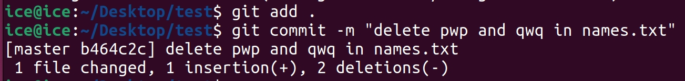

[toc]


## 🧊's DevOps 笔记

### Git 篇

#### 0. git 的安装以及初始化

##### 0.1 git 的安装

点击链接安装Git：[Git安装](https://git-scm.com/book/zh/v2/%E8%B5%B7%E6%AD%A5-%E5%AE%89%E8%A3%85-Git)

安装后，重启你的命令行/终端，在终端中输入

```bash
git -v
```

查看 git 版本号。如果 git 版本号正确显示，则说明你已经成功安装 git！


##### 0.2 将 github 账号关联至 git

我们在每次使用 git 提交到 github 上时，怎么让 github 知道我们是谁，这时候我们就需要设置 git 的全局变量，现在 github 上面注册一个账号，然后记住你 github 的用户名和邮箱，在命令行中运行：

```bash
git config --global user.name "xxx"
git config --global user.email "xxx@xxx.xxx"
```

来告诉 git，我每次提交到 github 上时，使用的是这个用户和邮箱。

例如，用户名为 ice，邮箱为 "xxx@qq.com"，那就在终端运行

```bash
git config --global user.name "ice"
git config --global user.email "xxx@qq.com"
```


##### 0.3 配置 git 的 vpn 代理

如果有时候由于网络原因无法正常 push 和 pull 上去，我们就需要设置全局变量，让 git 知道代理的端口。在 vpn 中查看代理端口是多少，然后在命令行中执行以下命令：

```bash
git config --global http.proxy http://127.0.0.1:<你的端口>
git config --global https.proxy http://127.0.0.1:<你的端口>
```

假设我的代理端口为 7890，那么我在命令行中运行：

```bash
git config --global http.proxy http://127.0.0.1:7890
git config --global https.proxy http://127.0.0.1:7890
```


##### 0.4 git 运行模式的抽象示意图


#### 1. 初始化 git 仓库

电脑中的文件夹总是有很多很多，我们怎么让 git 知道哪个仓库是需要 git 管理的，哪个仓库是不需要 git 管理的呢？所以我们需要在命令行中告诉 git，这个仓库是需要你来进行管理的。在需要管理的文件夹的路径下，使用命令行，输入:

```bash
git init
```

来告诉 git 这个仓库是我需要你来管理的。


#### 2. 在本地仓库的操作

> 由于 git 等操作一般是比较杂乱的，这里直接拿一个例子来演示各个命令的作用，而不是单独进行讲解

##### 2.1 在文件夹中新增文件

在 linux/macOS 中使用命令:

```bash
touch names.txt
```

新建一个 names.txt 文件

如果是 windows 则直接新建就好

在命令行中输入

```bash
git status
```

查看仓库状态，会发现输出如下：


这个表示这个文件是*未被跟踪的 (等会会进行解释)*


##### 2.2 暂存第一次更新

在命令行中，将刚才的文件提交到暂存区，使用命令

```bash
git add names.txt
```

> git add 命令后面跟的可以是文件夹，可以是文件，也可以是 `.` 或者 `*`，代表提交全部文件。例如
>
> ```bash
> git add files.txt #添加文件
> git add dir/      #添加文件夹
> git add .         #添加所有文件
> ```

将文件暂存。

如果在命令行中输入

```BASH
git status
```

查看仓库状态，会发现输出如下:


表示文件已经被 *暂存下来了*


##### 2.3 提交第一次更新

我们已经将文件暂存到 "运输车(暂存区)" 上了，想要将其 "运送" 到我们的本地仓库，就要使用到 `git commit` 命令。这个命令支持一个参数 `-m`，后面能写上这次提交的详细信息。

> Q: 为什么要写详细信息？
>
> A: 在多人合作的时候，你并不知道对方的某次修改具体做了些什么。哪怕是你自己，也不一定能记得很早之前自己提交过什么，所以就需要写出详细信息，让人们知道这次提交做了些什么

假设我们这次提交只是测试使用，我想要让自己知道，这是第一次提交，那么在命令行中运行：

```bash
git commit -m "first commit"
```


> 这里的提示中，`master` 指的是当前的分支，`2308fae` 这一串指的是十六进制的提交 id，后面跟着的是我们写的 commit 消息。下面的 `1 file changed` 指的是我们有一个文件发生了变更，这里的 `3 insertions(+)` 指的是文件有三行发生**增加**的变化 (这里其实是我在文件里面写了三行内容进行测试)

那如果现在使用 `git status` 查看状态，会显示什么呢？


会发现已经没有什么东西需要提交了。


##### 2.4 对刚才的文件进行更新

我在上述操作中，对 names.txt 添加了三行内容，文件内容为：


其中，`cat` 命令是 linux 中显示文件内容的命令。我现在将 pwp 和 qwq 两行删掉后，使用 `git status` 查看状态：

```bash
git status
```


发现这里显示 names.txt 的状态是 "未暂存，已修改"，代表这个文件距离上次提交，发生了修改。

在命令行中输入

```bash
git add .
```

以让文件被 git 暂存。


##### 2.5 将刚才的文件移出暂存区

如果我们有一些文件还未修改完成，或者由于某些原因，我不想在这次提交中将这个文件提交上去，但我又已经将其加入暂存区了，我就可以使用

```bash
git restore --staged names.txt
```

将 names.txt 从暂存区中 "丢" 出来。


##### 2.6 将刚才的文件暂存并提交出去

使用 `git add` 和 `git commit` 将这次修改提交出去，这里我删除了两行，我这里的提交信息就写 `在 names.txt 中删除了 pwp 和 qwq 两行`，在命令行中执行:

```bash
git add .
git commit -m "在 names.txt 中删除了 pwp 和 qwq 两行"
```



> 这里的提交消息是英文，是因为我 linux 没有装中文输入法(
>
> 2 deleteions 表示我删掉了两行代码，这里的 1 insertion 其实是我多打了一个换行(


##### 2.7 查看我们之前所进行的所有提交记录

使用 `git log` 可以查看之前的所有提交，支持几个参数。`--oneline` 表示简写具体信息，`--graph` 表示使用字符图来表示消息。以下是命令和参数的对比：


##### 2.8 删除掉刚才的文件

在 linux/macOS 的命令行中输入:

```bash
rm -rf names.txt
```

删除 names.txt 文件

如果是 windows 直接删除即可

然后使用 `git add` 和 `git commit` 将其提交上去，使用 `git log` 查看提交记录


##### 2.9 从历史中恢复某一次提交

有时候在项目中，我想要恢复到之前的任意一次提交，就可以使用 `git reset` 命令将其恢复到某次提交的状态。例如我想要恢复到第一次提交的状态，则我将那一次提交的 id 复制下来，执行命令，例如：

```bash
git reset 2308fae88f81169c168c68ff4ccd0352c1a36f81 #这里的 id 是上面例子的第一次提交的 id，请根据你具体项目的 id 修改
```

> 请注意，git reset 之后，会将之后的所有提交丢掉


但我们会发现，好像文件夹里面没有 names.txt 啊？这里涉及到了 `git reset` 的一些参数问题：

git reset 默认参数是 `--mixed`，这个操作只会动**历史记录和暂存区**，不会动**工作区**。

当参数为 `--hard` 时，这个操作会动**工作区，历史记录和暂存区**。

所以，如果想要**丢掉目前工作区的所有东西**，**完全恢复到某一次提交**，则使用 `git reset <id>`。


##### 2.9.extra 将目前工作区状态储藏

我们新建一个文件 `test.md`，用于模拟我们工作区里面的文件。即，假设我现在写了一个 test.md，我又想暂时保存现在的整个环境，回到之前的某一次提交进行修改，该怎么做呢？我们要使用 git stash 命令，这里简单列举一些用法。

|               参数                |                             作用                             |
| :-------------------------------: | :----------------------------------------------------------: |
|        `push -m <message>`        |        将已暂存和未暂存的所有东西放入一个“储藏”之中。        |
|              `list`               |                 列出所有的已经保存的“储藏”。                 |
|        `apply <stash_id>`         |      应用指定的储藏，如果不填 id，则是应用最新的储藏。       |
|         `pop <stash_id>`          |  应用并且删除指定的储藏，如果不填 id，则是应用最新的储藏。   |
|         `drop <stash_id>`         |      删除指定的储藏，如果不填 id，则是删除最新的储藏。       |
|       `show <stash_id> -p`        | 查看指定储藏的详细修改内容。如果不加 `-p`，则是查看修改摘要。如果不填 id，则是查看最新的储藏。 |
| `branch <branch-name> <stash_id>` | 在创建储藏时的提交点创建一个新的分支，并将储藏的修改应用到这个新分支上。 |
|              `clear`              |                        清空所有储藏。                        |

使用 `git add` 命令将文件暂存起来，然后使用 `git stash` 将其存储起来，此时将会恢复到 reset 的提交上。


那么假设我已经完成了我需要的操作，我现在想要回到我之前的工作状态，该如何做呢？使用命令

```bash
git stash pop
```

即可。


现在我们来恢复一下之前的状态，即第一次 commit 的状态，来继续我们的文档。使用 `git reset <id> --hard` 恢复到第一次提交状态，并且清除“储藏”区域和工作区。例如：

```bash
git reset 2308fae88f81169c168c68ff4ccd0352c1a36f81 --hard
rm -rf test.md
git stash clear
```


#### 3. Github && 分支篇

##### 3.0 新建 github repo 以及添加远程仓库

在 github 中注册你的账号，然后右键右上角的头像，点击 `Your Repository`，点击右上角的 `New`。在 `Repository name` 中填入你想要叫的名字，在 `Description` 中填你对仓库的描述 (可选)。然后选择仓库的权限 (`Public / Private`)，如果是 `Public` 则所有人可见，如果是 `Private` 则仅有你和你拉的人可见。

创建好后，在你的仓库中执行以下命令：

```bash
git remote add origin <link>
```

其中，`<link>` 代表你的 github 仓库链接，一般是 `https://github.com/<你的名字>/<你的仓库名>.git`。拿我的仓库来举例，我就填

```bash
git remote add origin https://github.com/ICE-awa/test.git
```


##### 3.1 使用 git push 将本地仓库内容上传到远程仓库中

对于上述的仓库，我们使用 `git push origin <本地分支名>:<远程分支名>` 来进行上传，但如果本地分支名和远程分支名相同，我们可以简写为 `git push origin <分支名>`。一般 github 的默认分支为 main，那么我们可以使用以下命令来进行上传：

```bash
git push origin main
```

> 当然，有时候因为你的 git 是老版本，有可能默认分支为 master，所以可以执行
>
> ```bash
> git branch
> ```
>
> 来查看你的分支名字，如果是 master，则执行
>
> ```bash
> git push origin master
> ```
>
> master 分支现在基本上被 main 分支取代，因为 master 有 "主人" 的意思，黑人会觉得这是一种种族歧视等的字眼，所以现在普遍被取代为 main。


##### 3.2 git 分支的简单讲解

在多人管理的同时，由于我们不知道对方什么时候提交，多人协作时肯定不是一群人等一个人开发完之后，再去开发自己的部分，而是多个人同时开发。那么，如果许多人在不同电脑上对着同一个项目进行操作，我们可以怎么做呢？答案是 -- 分支。

一般来讲，`main/master` 分支存放的是**可以稳定运行的，可以发布的代码**，即在这个分支上的所有代码一定是**可以运行的**，在此分支之下，有着 `develop` 分支。`develop` 分支一般是在开发过程中的分支，会存放着整个项目的所有文件。在此分支之下，一般会有多个分支，都是以 `前缀/详细信息` 来命名。一般常用的有三个，分别是 `feat`，`bugfix`，`doc`，分别指代功能性分支，bug 修复型分支，文档分支。


在对应分支操作完后，会合并到上级分支，以实现分支的管理。

例如，我开发一个管理员管理页面的功能，那我的分支名字可以叫做 `feat/admin-management-page`，如果是修复 jwt 认证问题的功能，那分支名字可以叫做 `bugfix/jwt-authentication`，如果是修改 README.md 文档的分支，则可以叫做 `doc/README.md`。


##### 3.3 git 分支新建与合并操作

此处因为我的 linux 没有配置 vpn，所以所有操作转到 windows 上进行。

这里我新建了一个仓库，名字叫做 test，上传了一个空的 names.txt，提交了一次，提交记录为 "First commit"，并且 push 到了远程仓库的 main 分支上。

假设我们现在需要开发一个管理员功能，那我们就需要从 `develop` 分支之中创建一个**功能分支**，并且命名为 `feat/admin`，并且在这个分支下提交。在命令行中运行：

```bash
git checkout -b feat/admin
```

以创建并且切换分支。

> `git checkout` 命令用于切换到某个分支，支持参数 `-b`，加上这个参数表示创建并切换到这个参数。

使用命令

```bash
git branch
```

查看当前分支，标 * 的以及绿色的是当前的分支。

在这里新建一个 feat.txt 文件，用于模拟我们进行的功能开发，然后 `git add`，`git commit`，将文件放入到本地仓库之中，然后执行命令以将其放到我们的 github 仓库的 `feat/admin` 分支之中：

```bash
git push origin feat/admin
```


那么我们已经开发好了功能分支，我想要将其合并到开发分支上，我们该怎么做呢？

这里我直接将其合并到主分支，但在实际开发之中，功能分支一般是合并到 `develop` 分支之上。

在合并分支时，请先切换到**上游分支**，例如现在功能分支是从 `main` 分支之中出来的，那我们就先切换到 `main` 分支。如果是从 `develop` 分支出来的，那我们就先切换到 `develop` 分支。在命令行中执行

```bash
git checkout main
```

切换到 main 分支之中。

使用 `git merge` 命令合并分支，在命令行中使用：

```bash
git merge --no-ff feat/admin
```

将分支合并到 main 分支之中。如果命令行打开了新的窗口，直接关掉或者按 ESC 输入 `:q` 退出。

> `git merge` 的用法为 `git merge [参数] <分支名>`，会将这里的 `<分支名>` 合并到我现在的分支上。`--no-ff` 参数指的是 `No Fast Forward`，`git merge` 默认使用的是 `Fast-Forward` 合并方式，会直接将两个分支合并，并且不给任何提示消息。`--no-ff` 参数能够让 git 强行生成一个提示消息，提示 xx 分支合并到 xx 分支，这样做更安全，也更明显。

然后再将修改提交，在命令行中执行

```bash
git push origin main
```

将修改推送到远程仓库之中。


##### 3.4 git 仓库的拉取操作

多人一起操作的时候，我们怎么同步进行更新代码？答案就是使用 `git pull` 命令。这个命令的用法跟 push 一样，都是 `git pull origin <本地分支名>:<远程分支名>`，当两个分支名相同时可以简写成 `git pull origin <分支名>`。

在 github 的浏览器上，我们使用在线编辑，编辑一下 main 分支下的 names.txt 文件，在里面加入一个 ice，用于模拟他人对文件的提交。然后，在我们本地的命令行中使用 git pull 命令拉取一下远程的仓库提交：


```bash
git pull origin main
```


我们发现远程的提交已经被我们拉取了，并且文件已经更新。这就是为什么多人开发时，在我们要开发之前，需要养成**拉取**的习惯，以防止文件冲突。


##### 3.5 git 冲突处理

在本地的 names.txt 之中的第二行写上 pwp，在 github 上将 main 分支的 names.txt 的第二行写上 qwq。这时候，我们执行 `git pull` 命令，会发现 git 出现报错:


告诉我们存在冲突，git 的自动合并失败了，需要我们自己解决冲突然后再提交。那么如何进行解决呢？答案是打开我们的 names.txt 文件，我们会发现文件变成了这样：


文件的格式的意思如下：

```
<<<<<<< 本地的指针
本地的文件内容
=======
远程的文件内容
>>>>>>> 远程提交的 id
```

我们只需要手动选择我们需要保留的部分，然后将 `<<<<<<<` ，`=======` 和 `>>>>>>>` 删掉即可，只用保留我们需要的部分。例如保留成：

```
ice
pwp
```

然后执行

```bash
git add .
git commit
git push origin main
```

将我们修改后处理的冲突提交上去即可。


##### 3.6 git rebase 的用法

`git rebase -i <id>` 是最经常的用法，其中 `<id>` 代表你想要操作的起点，git 会列出从这个**之后**的所有 commit，并且让你进行操作。

例如，我添加了四个文件，并且进行了四次提交：


我现在不想让 github 收到 4 次提交 (例如在开发过程中，我开发的是同一个功能，但是我提交之后发现有 bug，或者有打错的变量之类的，然后又进行了新的提交，但本质上来讲，这应该是属于一次提交的)，我就可以在终端使用命令:

```bash
git rebase -i 33f0a8d
```

这里指的是，我从提交 id 为 33f0a8d 为起点，开始修改后面的四次提交。执行命令后，git 会打开一个编辑器，并且展示如下图的画面：


上面的几行代表从起点之后的所有提交，格式为 `操作 id 提交信息`，其中操作的表格如下：

|     操作     |                             作用                             |
| :----------: | :----------------------------------------------------------: |
| `s`/`squash` | 将所有标记为 `s` 的提交**向上合并**到前一个 `pick` 的提交里面 |
|  `r/reward`  |  git 会立即弹出编辑界面，让你重新输入这个 commit 的 message  |
|   `e/edit`   | 提交完发现漏掉了一个文件或者一行代码写错了，使用这个参数，会让 `rebase` 过程暂停，git 会回到提交刚刚完成的状态，然后你可以修改你的代码，再使用 `git add .` 来添加遗漏的文件或者修改的文件，并且使用 `git commit --amend` 来追加到这个 commit 中。最后，使用 `git rebase --continue` 来继续 `rebase` 过程 |
|   `d/drop`   |                      删除掉这整一次提交                      |

当然，你也可以任意更改这些提交的顺序，可以让这些 commit 任意排序。

请注意，不可以同时对一次提交使用多个参数！


关闭上述文件后，git 会重新弹出一个编辑界面，让你输入合并后的提交信息。请你将所有不带 # 的消息删掉，然后直接输入你想要的信息。例如：


然后执行

```bash
git push origin main
```

将我们的修改 push 上去。


### 计算机网络篇

#### 1. 计算机基本概念 (IP, 端口, LAN, MAN, WAN, Modem, Router, 网络拓扑结构)

IP 地址形如 `xxx.xxx.xxx.xxx`，其中 `xxx` 的范围为 `0~255`。


调解器或者路由是通过 `DHCP(Dynamic Host Configuration Protocol)`，动态主机配置协议，来给本地设备发放本地 IP 地址的。


当用户发送了一次请求（例如输入 www.google.com 等等），请求会逐渐传输到调解器，运营商，再到互联网上。然后数据会一路传下来，传到调解器时，调解器使用 `NAT(Network Address Translation)`，网络地址转换，建立内部设备和公网之间的连接。

但是对于一个计算机，不可能只运行了一个程序，有可能同时运行了多个程序，那计算机怎么知道数据是哪个程序发送或者接受呢？这时候就需要引入**端口**的概念。

端口一共有 $2^{16}$ 个，即 65536 个，常见的端口号有：22 (SSH), 80(HTTP), 443(HTTPS), MySQL(3306), MongoDB(27017)

一般来说，0 ~ 1023 端口号是**保留端口**；1024 ~ 49152 端口号是注册端口，是给一些特定的应用程序所使用的端口


**LAN (Local Area Network)**，局域网，范围非常小，通常只覆盖一个家庭，一个办公室等小范围，速度较快。

**MAN (Metropolitan Area Network)**，城域网，范围比较大，一般覆盖整个城市。

**WAN (Wide Area Network)**，广域网，一般跨越多个城市，国家，甚至覆盖整个全球。

我们家里的网络 (LAN) 一般是通过网络运营商连接到城市网络 (MAN) 中再汇入全球网络 (WAN) 中。


**Modem (Modulator-Demodulator)**，"光猫"，调制解调器，能够让电脑识别的“数字信号”与光纤上传输的“光信号”相互转换。

**Router**，路由器，用于建立局域网，接收外来的网络信号，并且通过 IP 地址精确分配给对应的设备。


**总线型拓扑结构 (Bus Topology)**

是最简单的拓扑结构，所有设备都连接在"总线"这条共享主电缆上。

```
      [电脑A]     [电脑B]     [电脑C]     [电脑D]
         |           |           |           |
<--------|-----------|-----------|-----------|--------> (主电缆/总线)
```

**优点**：

* 结构简单，安装容易，用的线缆少
* 容易新增设备

**缺点**：

* 总线如果坏了，整个网络就会瘫痪，无法使用。
* 设备多了容易导致网络性能下降
* 如果出了问题，很难排查到具体出问题的点。


**环形拓扑结构 (Ring Topology)**

所有设备被连接成一个封闭的圆环，数据传输时需要经过其他设备。

```
      [电脑A] -------- [电脑B]
      /                   \
     /                     \
   (数据顺时针流动 ->)       (<-)
     \                     /
      \                   /
      [电脑D] -------- [电脑C]
```

**优点**：

* 数据传输路径固定，性能稳定
* 比总线型能支持更多的设备

**缺点**：

* 如果网络中任意一个设备或者线路坏了，数据就无法正常完成传输了
* 添加或者移除设备时，会暂时中断整个网络的运行。


**星型拓扑结构 (Star Topology)**

所有设备各自连接到一个中心的设备上，比如交换机或者集线器，是目前**最常见**的结构。

```
        [电脑A]     [电脑B]
             \       /
              \     /
      [中心设备(路由器/交换机)]
              /     \
             /       \
        [电脑C]     [电脑D]
```

**优点**：

* 如果其中的某一个设备或者线路坏了，不会影响其他设备
* 方便管理和维护，容易添加或者移除设备
* 性能好，因为数据是点对点通过中心设备转发的

**缺点**：

* 如果中心的交换机或者集线器坏了，那整个网络都无法使用
* 成本较高，因为每个设备都需要独立连接到中心，需要的线缆较多


**树形拓扑结构 (Tree Topology)**

是总线型以及星型的结合体，顶层有一个总的根节点 (服务器)，下面有若干分支 (交换机)，分支下面可以使用星型拓扑结构连接更多的设备。

```
                 [根节点]
                    |
      +-------------+-------------+ (主干)
      |                           |
   [中心设备A]                 [中心设备B]
  /   |   \                   /   |   \
[A1] [A2] [A3]             [B1] [B2] [B3]
```

**优点**：

* 非常适合做大型网络，扩展性强，很容易增加新的分支
* 管理起来更容易，某个分支的问题不会影响到其他分支

**缺点**：

* 对根节点或者主干线路的依赖性很强，如果根节点或者主干线路坏了，整个网络会瘫痪
* 比单纯的星型和总线型更加复杂


**网状拓扑结构 (Mesh Topology)**

是最复杂也是最可靠的结构。在理想的“全网状”结构中，每一个设备都和其他所有设备有直接的连接

```
      [电脑A] ----- [电脑B]
      /  |\          /  |
     /   | \        /   |
    /    |  \      /    |
   [电脑C] -- [电脑D] --- [电脑E]
    \    |   /     \    /
     \   |  /       \  /
      \  | /         \/
       [电脑F] -------+
```

**优点**：

* 可靠性高，连接路径非常多，一条路断了，数据可以从别的线路中传输，整个网络几乎不可能瘫痪
* 可以同时处理大量的通信

**缺点**：

* 过于复杂和昂贵，安装和维护的成本极高，一般只用于可靠性要求极高的骨干网络上


#### 2. 网络结构 (OSI 七层模型，TCP/IP 五层模型)

##### 2.1 OSI 七层模型 (Open System Interconnection Model)

```
Application Layer		(应用层)
Presentation Layer		(表示层)
Session Layer			(会话层)
Transport Layer			(传输层)
Network Layer			(网络层)
Data Link Layer			(数据链路层)
Physical Layer			(物理层)
```

**第 7 层：应用层 (Application Layer)**

为你正在使用的应用程序提供访问网络的接口。

**常见的协议**有： `HTTP`（访问网页），`FTP`（文件传输），`SMTP`（发邮件），`DNS`（域名解析）

**数据单位**：数据 (Data)


**第 6 层：表示层 (Presentation Layer)**

确保一个系统应用层发出的信息可以被另一个系统的应用层读取，将应用层的数据转化为机器码。负责数据的**翻译，压缩和解密**。

**常见的协议和格式**有：`SSL/TLS`（加密），`JPEG`，`ASCII`

**数据单位**：数据 (Data)  


**第 5 层：会话层 (Session Layer)**

建立、管理和终止两个应用程序之间的通信会话 (Session)。在会话建立之前，这个层会进行身份认证，身份授权等，以确认你是否有权访问服务器上的文件。

**常见的协议**有：`NetBIOS`，`RPC`

**数据单位**：数据 (Data)


**第 4 层：传输层 (Transport Layer)**

负责端到端的数据传输控制吗，例如分块，流量控制，错误控制。

分块会把上层传来的大块数据，分割成一个个小的数据段，并给它们编号，提供 TCP 以及 UDP 两种不同的协议。每个数据段会包含源和目标的端口号和序列号，其中序列号能够让我们按照正确顺序重新组装片段。

流量控制能够控制传输的数据量，例如服务器以 40 Mbps 的速度传输，但客户端以 20 Mbps 的速度接受，那么传输层就会让速度变慢一下，从而实现传输速度一致。

错误控制能够处理丢失的数据包或者损坏的数据等等。通过对每个数据段进行校验和，就可以算出来接收到的数据是否良好。

**常见的协议**有：`TCP`（传输控制协议），`UDP`（用户数据报协议）

> TCP 更加面向连接，UDP 更不面向连接。UDP 一般更快，因为它不提供反馈，无论数据是否丢失。一般在视频会议或者游戏中使用。TCP 会让接收端收到消息后，确认数据是否完好。一般在文件传输或者电子邮件等使用。

**数据单位**：段 (Segment)


**第 3 层：网络层 (Network Layer)**

负责将数据包从源头传到最终目的地。使用 IP 地址来标识网络中的设备，并且负责**路由选择**（决定数据包走哪条路最快）

**常见的协议**有：`IP`（互联网协议），`ICMP`，`ARP`。

**数据单位**：包 (Packet)


**第 2 层：数据链路层 (Data Link Layer)**

负责在同一个网络内的两个相邻节点之间传输数据。使用 MAC 地址（物理地址）进行寻址。

**硬件设备**：交换机，网卡等

**数据单位**：帧 (Frame)


**第 1 层：物理层 (Physical Layer)**

定义了物理上的所有东西，比如网线材质，接口形状，电压标准等。负责把数据链路层传来的数据帧，转换成 01 的二进制比特流（电流或者光信号），并且通过物理介质（网线、光纤、无线电波）发送出去。

**硬件设备**：网线，集线器，中继器等

**数据单位**：比特 (Bit)


数据的过程为：

**应用层 --> 表示层 --> 会话层 --> 传输层 --> 网络层 --> 数据链路层 --> 物理层**

`数据` --> `加密压缩的数据` --> `带会话信息的数据` --> `分割成 TCP/UDP 段` --> `加上 IP 地址的包` --> `加上 MAC 地址的帧` --> `0101 的比特流`


当发送信息时，数据是从第 7 层开始一层层往下走，每经过一层就会被“打包一次”（加上该层的头部信息），这个过程叫**封装**。

当接受信息时，数据是从第 1 层开始一层层往上走，每经过一层就会被“拆开一层包装”，直到最后在第 7 层呈现出来，这个过程叫**解封装**。

