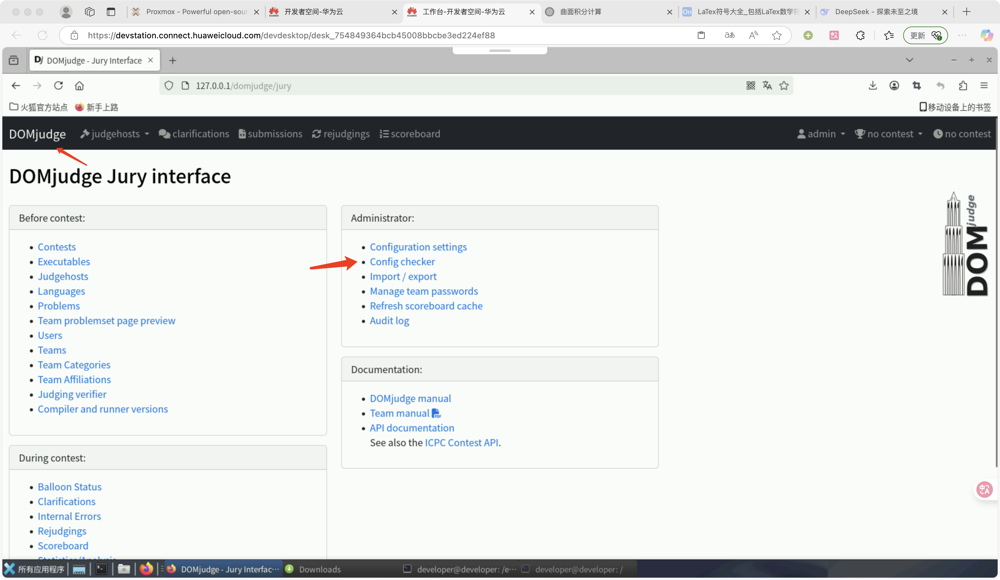
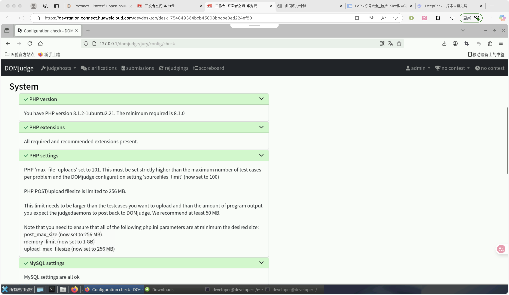
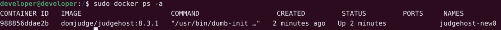
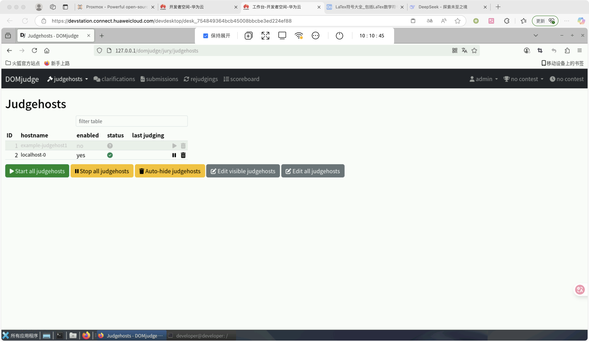
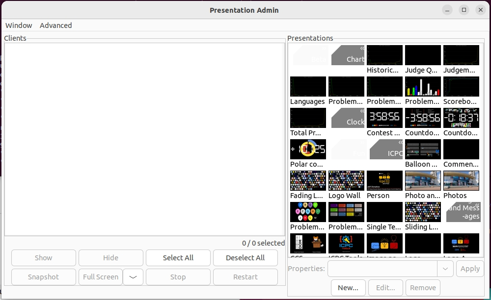

[toc]

## 🧊的 domjudge 与 ICPC tools 的搭建笔记

### 安装 DOMjudge 和相关依赖

```bash
sudo apt-get update
sudo apt-get upgrade
```

```bash
sudo apt install acl zip unzip mariadb-server nginx php-fpm php-gd php-cli php-intl php-mbstring php-mysql php-curl php-json php-xml php-zip composer ntp
```

```bash
sudo apt install make gcc g++ debootstrap libcgroup-dev lsof procps libcurl4-gnutls-dev libjsoncpp-dev libmagic-dev
```

```bash
sudo apt install pkg-config
```

```bash
sudo apt install python3-pip
```

```bash
pip install requests
pip install jinja2 jsonpatch jsonschema
```


进入到根目录中，将文件下载

```bash
cd /opt
sudo wget https://www.domjudge.org/releases/domjudge-8.3.1.tar.gz
sudo tar -zxvf domjudge-8.3.1.tar.gz
```

解压后文件会存入当前目录下的 domjudge-8.3.1 ，进入目录下的 domjudge-8.3.1 目录

```bash
cd ./domjudge-8.3.1
```


### 编译 Domjudge 并且配置数据库和 web 服务器

```BASH
sudo ./configure --prefix=/opt/domjudge --with-domjudge-user=root --with-baseurl=127.0.0.1
```

> 如果这一步警告缺少 `pkg-config` 则 `sudo apt install pkg-config`

```bash
sudo make domserver
sudo make install-domserver
```

进入到刚才 --prefix 指定的路径下的 domserver

```bash
cd /opt/domjudge/domserver
sudo bin/dj_setup_database -s install
```

> 此处的 php 版本需要根据自己电脑里的进行修改，如要查看，具体操作为
>
> ```bash
> cd /etc/php
> ls
> ```
>
> 此处以 php8.1 为例子
>
> 如果提示 No module named 'requests' 则执行 `pip install requests`
>
> 如果安装 requests 的时候提示
>
> ```bash
> cloud-init 19.1 requires jinja2, which is not installed.
> cloud-init 19.1 requires jsonpatch, which is not installed.
> cloud-init 19.1 requires jsonschema, which is not installed.
> ```
>
> 则执行`pip install jinja2 jsonpatch jsonschema`

```bash
sudo ln -s /opt/domjudge/domserver/etc/nginx-conf /etc/nginx/sites-enabled/domjudge
sudo ln -s /opt/domjudge/domserver/etc/domjudge-fpm.conf /etc/php/8.1/fpm/pool.d/domjudge.conf
sudo service php8.1-fpm reload
```

```bash
cd /etc/nginx/sites-enabled
sudo rm default
sudo service nginx reload
cd /opt/domjudge/domserver
sudo chown www-data:www-data -R webapp/public/*
```

> 若出现 404 则是因为没有执行 `sudo rm default`

接着在网页里面 login，账号为 admin，密码通过以下命令获取：

```bash
sudo cat /opt/domjudge/domserver/etc/initial_admin_password.secret
```


### 配置 php 和 mysql

```bash
cd /etc/php/8.1/fpm/pool.d
sudo nano domjudge.conf
```

打开配置文件后找到 `php_admin_value[memory_limit]` 改成

```bash
php_admin_value[memory_limit] = 1024M
```

再找到 `php_admin_value[date.timezone]` 一栏，改成

```bash
php_admin_value[date.timezone] = Asia/Shanghai
```

保存退出后，执行

```bash
sudo service php8.1-fpm reload
sudo nano /etc/mysql/conf.d/mysql.cnf
```

将文件中的 `[mysql]` 删掉，接着粘贴以下内容：

```bash
[mysqld]
max_connections = 1000
max_allowed_packet = 512MB
innodb_log_file_size = 2560MB
```

> 在实际运行中，`max_allowed_packet` 要改成两倍于题目测试数据文件的大小；`innodb_log_file_size` 要改成十倍于题目测试数据文件的大小

```bash
sudo nano /etc/mysql/mariadb.conf.d/50-server.cnf
```

找到 `max_allowed_packet = 1G` 取消掉这一行的注释

```bash
sudo systemctl restart mysql
```


若上述配置成功，则下述界面 (DOMjudge --> Config checker) 里面会显示






### 配置 judgehost (docker)

按照以下命令下载 docker

```bash
sudo apt-get update
sudo apt-get -y install apt-transport-https ca-certificates curl software-properties-common
curl -fsSL https://mirrors.aliyun.com/docker-ce/linux/ubuntu/gpg | sudo gpg --dearmor -o /etc/apt/keyrings/docker.gpg

echo \
  "deb [arch=$(dpkg --print-architecture) signed-by=/etc/apt/keyrings/docker.gpg] \
  https://mirrors.aliyun.com/docker-ce/linux/ubuntu \
  $(lsb_release -cs) stable" | sudo tee /etc/apt/sources.list.d/docker.list > /dev/null
  
sudo apt-get update
```

> 若提示 `密钥存储在过时的 trusted.gpg 密钥环中` 则执行下列命令
>
> ```bash
> cd /etc/apt
> sudo cp trusted.gpg trusted.gpg.d
> sudo apt-get update
> ```

```
sudo apt-get install docker-ce
cd /etc/docker
sudo touch daemon.json
sudo nano daemon.json
```

然后在 json 文件中粘贴以下内容

```json
{
    "registry-mirrors": ["https://docker.1ms.run"]
}
```

然后执行

```bash
sudo service docker restart
```

接着配置 cgroups

```bash
sudo nano /etc/default/grub
```

找到 `GRUB_CMDLINE_LINUX_DEFAULT=""` 这一行，改成

```bash
GRUB_CMDLINE_LINUX_DEFAULT="quiet cgroup_enable=memory swapaccount=1 systemd.unified_cgroup_hierarchy=0"
```

保存退出后

```bash
sudo update-grub
sudo reboot
```

使用下列命令获得密码

```bash
sudo cat /opt/domjudge/domserver/etc/restapi.secret
```

将下列的 `<domserver password>` 改成上面获得的

```bash
sudo docker run -d -it --privileged -v /sys/fs/cgroup:/sys/fs/cgroup --name judgehost-new0 --hostname localhost --network="host" -e DAEMON_ID=0 -e CONTAINER_TIMEZONE=Asia/Shanghai -e JUDGEDAEMON_PASSWORD=<domserver password> -e DOMSERVER_BASEURL=http://localhost/domjudge/ domjudge/judgehost:8.3.1
```

> 如果需要起多个 judgehost，则需要修改 `--name` 和 `DAEMON_ID` 参数，后者是核编号，不能超过物理机的核心数。


起成功后，输入 `sudo docker ps -a` 会查看到以下状态






### pol2dom 的安装以及使用 (此处暂时无法使用，请忽略此板块)

#### 安装环境及其依赖

```bash
sudo apt install texlive-latex-base texlive-latex-extra
sudo apt install texlive-lang-chinese
sudo apt install texlive-fonts-recommended texlive-fonts-extra
```

```bash
sudo pip install webcolors
sudo pip3 install tqdm
```

```bash
git clone https://github.com/dario2994/pol2dom
```

> 如果使用的是 Linux，默认安装的是 python3 而不是 python，需要 cd 到对应的目录，将目录下的 p2d.sh 中的 `exec python -m p2d.p2d "$@"` 改成 `exec python3 -m p2d.p2d "$@"`


#### 正式使用

首先先新建一个文件夹，用你想用的文件夹名字，这里以 `Testing_Round` 作为例子

```bash
mkdir Testing_Round
cd ./Testing_Round
touch config.yaml
```


书写 config.yaml

```bash
contest_name: test

front_page_statements: absolute_path/statements_frontpage.pdf # A single-page pdf
front_page_solutions: absolute_path/solutions_frontpage.pdf # A single-page pdf
header_image: absolute_path/header.pdf # A rectangular-shaped image (it can be in any format supported by \includegraphics in latex).

polygon:
  key: xxxx
  secret: xxxx
domjudge:
  server: http://xxx/domjudge
  username: admin
  password: xxx
  contest_id: xxx
problems:
- name: hello-minecraft
  label: A
  color: CornflowerBlue
  polygon_id: 375741
  author: Galaxy
  preparation: Galaxy
```

> 这里的 polygon 的 key 和 secret 可以在 polygon 中的 `settings` 下的 `New API key` 中获得
>
> problems 中的 polygon_id 为 problem 中右边的 id 
>
> domjudge 中的 server 为你的 server
>
> username 需要为管理员
>
> password 需要为上述 username 的密码
>
> contest_id 为打开比赛网页时，上面的链接的数字
>
> 例如 `http://xxx/domjudge/jury/contests/2` 那么即为 2


回到 pol2dom 目录，执行

```bash
sudo ./p2d.sh Testing_Round --polygon --convert --domjudge --pdf
```


### p2d 的使用

p2d 是用来将 polygon 包转为 domjudge 包的一个工具。


### 配置 CDS

CDS (Contest Data Server)，用于比赛后台的管理服务，先配置好这个才能使用其他 Tools (除了 Resolver)

在需要运行 CDS 的机子上下载并安装好 [CDS](https://github.com/icpctools/icpctools/releases/download/v2.5.940/wlp.CDS-2.5.940.zip)

下载好后解压，把 wlp 目录重命名为 cds，并将其放置在 /opt 目录下

然后

```bash
sudo nano /opt/cds/usr/servers/cds/config/cdsConfig.xml
```

将文件内容替换为

```xml
<cds>
    <!-- Set location= to a directory that the user running the CDS can write to -->
    <contest location="/home/cds/contest-data" recordReactions="false">
        <!-- Set the url to the URL of your DOMjudge installation, followed by /api/contests/<cid>, where <cid> is your CID or external ID -->
        <!-- Set the user and password to the user you created in the previous step -->
        <ccs
            url="https://www.domjudge.org/demoweb/api/contests/nwerc18"
            user="cds"
            password="somepassword" />
    </contest>
</cds>
```

其中 `location` 替换为一个不需要 root 就能访问或者修改的目录 `/home/<username>/cds/contest-data`，例如

`/home/ice/cds/contest-data`

则需要现在终端中运行

```bash
cd /home/ice
mkdir cds
cd ./cds
mkdir contest-data
```


`url` 替换为 `<domjudge url>/api/contests/<contests cid>`，例如

`http://ice_awa.cn/domjudge/api/contests/3`


`user` 和 `password` 替换为 `admin` 和 admin 的密码。


然后在终端中执行

```bash
sudo apt update
sudo apt install default-jdk
```

安装 Java 环境

然后

```bash
cd /opt/cds/bin
sudo chmod +x ./server
./server run cds
```

启动 CDS 服务。

之后访问 `https://<server-ip>:8443/`，这里需要保证 8443 端口开放，忽略 SSL 警告。记得一定要访问 `https`！！


在 `/opt/cds/usr/servers/cds/config/accounts.yaml` 查看用户名和密码，可以登录到 CDS 里。


### 配置 Presentation Admin

#### Linux 的配置 (实测不是很稳定)

是一个屏幕显示的后台管理工具，可以管理多个 Client 的屏幕显示。[在这里下载](https://github.com/icpctools/icpctools/releases/download/v2.5.940/presentationAdmin-2.5.940.zip)

下载后，解压并且重命名为 presAdmin。将其放置于 `/opt` 中，在终端执行

```bash
sudo chmod +x ./presAdmin.sh
ICPC_FONT="DengXian" ./presAdmin.sh https://<server ip>:8443 presAdmin <presAdmin password>
```

其中 `presAdmin` 和他的密码见之前的 `accounts.yaml`，`server ip` 就是之前的 ip。




#### Windows 的配置

因为 Linux 环境配置后非常容易爆炸，所以这里使用 Windows 进行重新配置。

在 bash 环境中 (如果 win 没有，可以下载一个 git 然后在 git cmd 中运行。)

```bash
presAdmin.bat https://<server ip>:8443 presAdmin <presAdmin password>
```


### 配置 Presentation Client

这一步我选择使用了 Windows 来配置。[在这里下载](https://github.com/icpctools/icpctools/releases/download/v2.5.940/presentations-2.5.940.zip)

在 bash 环境中运行 (如果 win 下没有 bash 环境，可以下载一个 git 然后在 git cmd 下运行)

```bash
client.bat https://<server ip>:8443/api/contests/<cid> presentation <presentation password> --name <client name> --display id
```

presentation 和其密码还是见 `accounts.yaml`，最后的 `name` 指的是这台 client 的名称，可以不加。`display` 指的是显示器的编号，可以指定。


### 部分遇到的错误

1. 在测试比赛的时候，发现提交代码后，重定向回 /domjudge/team/submit，但是 submission 中没有记录，且在控制台中发现所有 Network 的活动都为 200 码，排查 judgehost 也是全绿。

​	此问题也许是 domjudge 底层的问题，在搭建 domjudge 的机子中，无论是通过公网访问还是 127.0.0.1/domjudge 都无法正常提交。但是其他地方提交没有问题。
