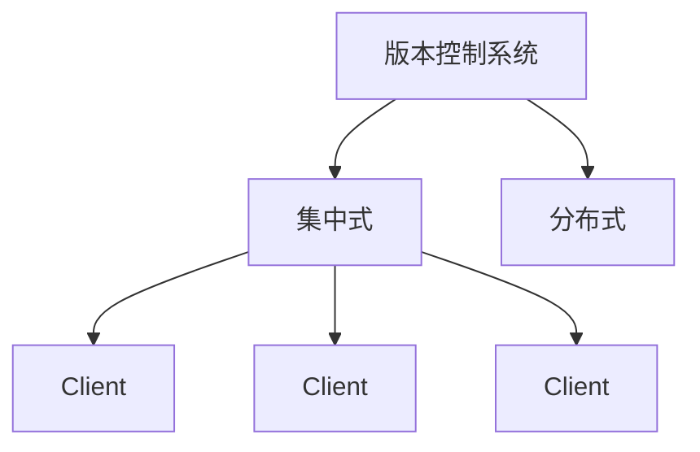
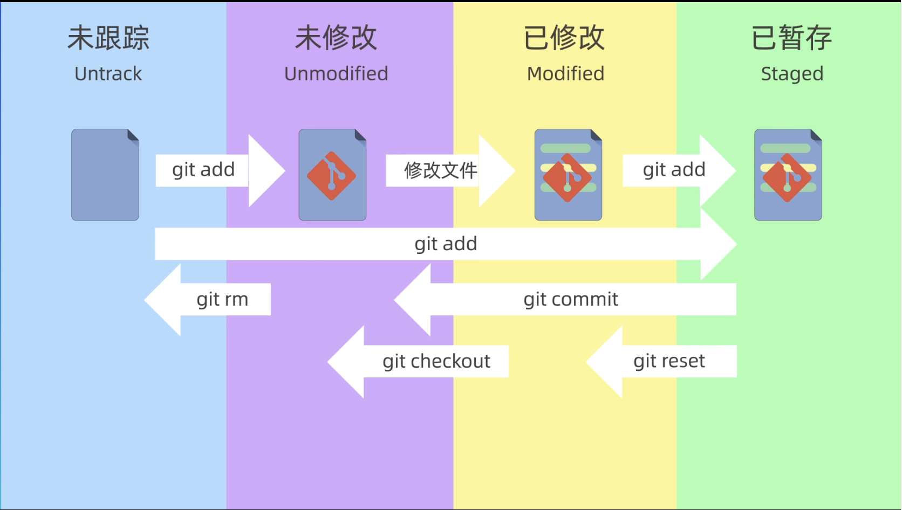
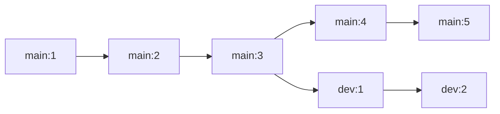
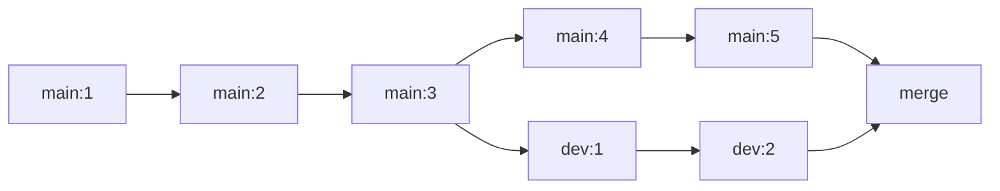
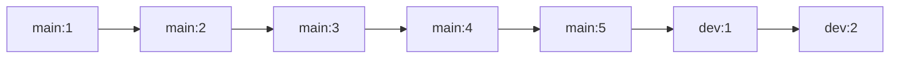
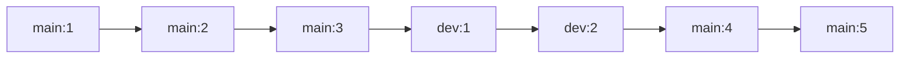
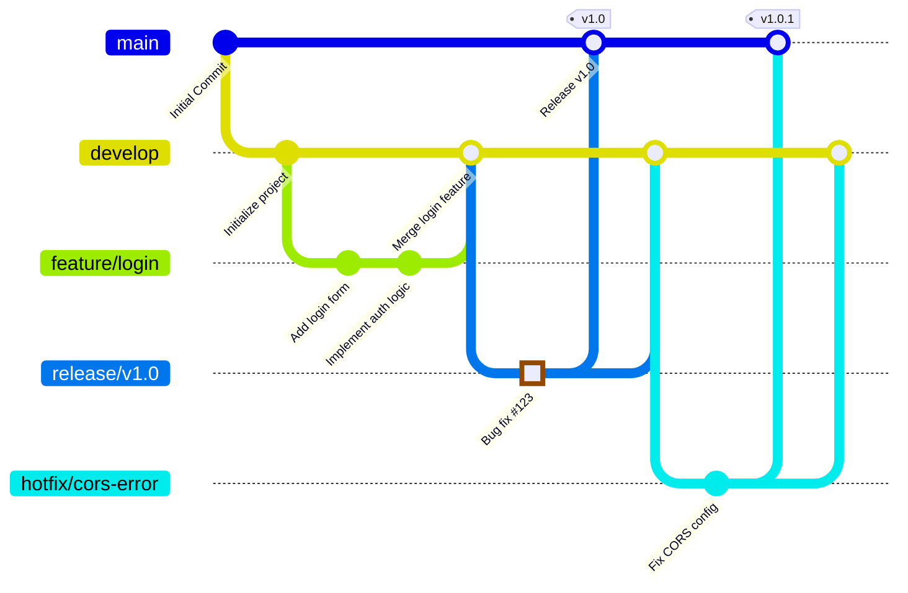

[toc]

## 🧊's Git学习笔记

### 版本控制系统



> 其中 集中式有SVN CVS等等 分布式有Git Mercurial等等

集中式服务器使用时，每个客户端只会保存一个副本，使用时，首先要从中央服务器上下载最新的版本

，然后添加需要修改的内容，修改后再上传回中央服务器

优点是使用起来非常简单，只需要每次使用时从中央服务器下拉取最新版本，修改后再上传，不需要考虑其他问题

缺点是，如果中央服务器出现故障或者网络连接出现问题，那么所有人都无法工作，只能等待中央服务器或者网络恢复正常。


分布式版本控制，每个人的电脑都拥有完整的版本库，所以可以在本地进行修改，不需要考虑网络问题，即使中央服务器出现故障也可以继续工作。当需要将修改内容分享给其他人的时候，只需要将仓库同步即可。


### Git安装以及初始化

**Git安装**

点击链接安装Git：[Git安装](https://git-scm.com/book/zh/v2/%E8%B5%B7%E6%AD%A5-%E5%AE%89%E8%A3%85-Git)


**Git初始化命令**

显示当前git版本号

```
git -v
```


**初始化git全局变量**

```
git config --global user.name "xxx"
git config --global user.email "xxx@xxx.xxx"
```

> 第一行命令用于配置你的用户名，第二行命令用于配置你的邮箱，将上述xxx替换为github/gitee的用户名和邮箱即可
>
> 其中 --global代表全局变量，对所有的仓库有效；还有 --system与省略（Local），其中不填的话就是本地配置，只对本地仓库有效， --system是系统配置，对所有用户生效。一般最常用的是 --global


```
git config --global credential.helper store
```

这行命令用于保存用户名和密码，这样就可以不用每次都输入密码了


```cpp
git config --global --list
```

用于查看刚才配置的global变量，若使用`git config --list`则显示的是所有变量


### 新建仓库

版本库，又叫Repository，简称Repo，这个目录里面所有的文件都可以被Git管理起来，每个文件的修改，删除，添加等操作都能被git记录，以便任何时候都可以追踪历史或者还原到之前的某一个版本


第一种方式：在本地直接创建一个仓库

```
git init
```

> 若直接在终端中输入命令，则是在当前目录下直接创建一个repo
>
> 若`git init xxx`，则是在当前目录下的xxx文件夹下创建一个repo


第二种方式：从远程服务器上克隆一个已经存在的仓库

```
git clone
```

> `git clone xxx` 在当前目录下新建一个xxx文件夹并且将网上项目克隆进文件夹内


### Git的工作区域和文件状态

Git 的本地数据管理分为三个区域，分别是工作区，暂存区和本地仓库

工作区也叫工作目录或者本地工作目录，即电脑资源管理器中的文件夹

暂存区也称为索引 Index ，是一种临时存储区域，用于保存即将提交到 Git 仓库的修改内容，此区域是在 Git 进行版本控制时非常重要的一个区域

本地仓库是使用`git init`创建的仓库，包含了完整的项目历史和元数据，是 Git 存储代码和版本信息的主要位置

当你修改了工作区中的文件之后，需要讲它们添加到暂存区(git add)，然后再将暂存区的修改提交到本地仓库中(git commit)，这个过程中我们可以使用 Git 提供的命令来查看 比较 或撤销修改，来保证版本控制的准确性和完整性

可以形象的将上述过程认为是**后厨-->服务员-->客人**


Git 中的文件分为四种状态，分别是未跟踪，未修改，已暂存，已提交

未跟踪就是我们新创建的，还没有被 Git 管理起来的文件

未修改就是我们已经被 Git 管理起来，但是文件的内容没有发生变化，还没有被修改过

已修改就是我们修改了文件，但是还没有添加到暂存区里面

已暂存就是我们修改后，并且已经添加到了暂存区域的文件




### 添加和提交文件

1. `git status`

这个命令的作用是用来查看当前仓库的状态，可以查看当前仓库处在哪个分支，有哪些文件以及这些文件当前处在怎样的状态

2. `git add`

作用是将文件添加到暂存区，等待后续的提交操作

> `git add xxx.xxx` 是添加单文件
>
> `git add file1.txt file2.txt file3.txt` 是添加多文件，其中 filex.txt 可以自行更改
>
> `git add xxx/` 是添加单个文件夹，会添加**该文件夹下的所有文件和子目录**
>
> `git add src1/ src2/ src3/` 是添加多个文件夹，**会添加这些文件夹下的所有文件和子目录**

3. `git commit`

用于将**暂存区**中的文件提交到本地仓库，而**不会提交**工作区中的文件

注意此命令需要使用 `git commit -m "xxx"` 来指定提交信息，若直接使用 `git commit` 则为进入 vim 来编辑提交信息

`git commit -am` 能够同时完成添加到暂存区和提交至仓库的两个操作

4. `git log`

此命令可以查看提交记录，每次提交都有一个唯一的id，是一个16进制的字符串，也会显示提交作者，提交的时间和提交时编写的注释信息等内容

也可以使用 `git log --oneline` 来查看简洁的提交记录


### git reset 回退版本

1. `git reset --soft id`

soft 参数表示回退到某一个版本，并且保留工作区和暂存区的所有修改内容，id 代表 `git log` 中查看的提交的id，即那个16进制字符串

> 例如我执行下述命令：
>
> ```bash
> git add file1.txt
> git commit -m "commit1"
> git add file2.txt
> git commit -m "commit2"
> git add file3.txt
> git commit -m "commit3"
> ```
>
> 假设此时第二次提交的 id 为 12345
>
> 那么当我执行
>
> ```bash
> git reset --soft 12345
> ```
>
> 时，file1.txt file2.txt file3.txt 的内容都不会变，但是 file3.txt 不再存于本地仓库中，而是存在于暂存区中，即可以理解为撤回了第三次提交


2. `git reset --hard id`

hard 参数表示回退到某一个版本，并且丢弃工作区和暂存区的所有修改内容，id 代表 `git log` 中查看的提交的id，即那个16进制字符串

> 例如我执行下述命令：
>
> ```bash
> git add file1.txt
> git commit -m "commit1"
> git add file2.txt
> git commit -m "commit2"
> git add file3.txt
> git commit -m "commit3"
> ```
>
> 假设此时第二次提交的 id 为 12345
>
> 那么当我执行
>
> ```bash
> git reset --hard 12345
> ```
>
> 时，file1.txt file2.txt 的内容都不变，但是 file3.txt 将不存在于工作区与暂存区，即目录下只有 file1.txt 和 file2.txt 了，相当于完全**抹杀了第三次提交的成果，会导致当前未提交的内容全部丢失**


3. `git reset --mixed id`

mixed 参数表示回退到某一个版本，并且只保留工作区的修改内容，而丢弃暂存区的修改内容，也是 reset 命令的**默认参数**，id 代表 `git log` 中查看的提交的id，即那个16进制字符串

> 例如我执行下述命令：
>
> ```bash
> git add file1.txt
> git commit -m "commit1"
> git add file2.txt
> git commit -m "commit2"
> git add file3.txt
> git commit -m "commit3"
> ```
>
> 假设此时第二次提交的 id 为 12345
>
> 那么当我执行
>
> ```bash
> git reset 12345
> ```
>
> 时，file1.txt file2.txt file3.txt 的内容都不会变，但是 file3.txt 不再存于暂存区中


在正常使用中，`--soft` 和 `--mixed` 参数使用上几乎相同，区别在于是否保留暂存区的内容，一般来说，当我们连续提交了多个版本，但是又觉得这些提交没有太大意义，就可以通过这两个参数来进行回退之后再重新提交，主要区别就是在重新提交之前， `--mixed` 需要再执行 `git add` 来将变动的内容重新添加到暂存区，而 `--soft` 则不需要，因为暂存区并没有被清空。

而 `--hard` 参数，一般是你真的要放弃目前本地的所有修改内容的时候。**建议谨慎使用这个参数**，因为它会删除这两个版本之间的工作区和暂存区的所有修改内容。

> 但如果真的不小心执行了也没关系，git 的操作是可以回溯的，使用 `git reflog` 命令来查看我们操作的历史记录，找到误操作之前的版本号，然后再使用 `git reset` 来回退到这个版本就可以了


### 使用 git diff 查看差异

这个命令可以用来查看文件在工作区 暂存区以及版本库之间的差异，还可以查看文件在两个特定版本之间的差异，或者查看不同分支之间的差异。平时可以使用图形化来查看之间的差异。

`git diff` 不加参数时默认比较的是工作区和暂存区之间的差异内容，会显示发生更改的文件以及详细的更改信息。git 会将文件的内容实用哈希算法生成一个40位的哈希值，后面的数字表示文件的权限，红色的文字表示删除的内容，绿色的表示刚刚添加的内容。

`git diff HEAD` 用来比较工作区和版本库之间的差异。

> 此处的 HEAD 表示当前分支的最新提交
>
> 也可以使用 HEAD~ 或者 HEAD^ 表示上一次提交
>
> 也可以使用 HEAD~2 或者 HEAD^2 表示上两次提交，这里的数字可以更改

`git diff --cached` 可以比较暂存区和版本库之间的差异。

`git diff id_1 id_2` 可以比较两次提交 $id_1\ id_2$ 之间的差异内容

`git diff branch_name_1 branch_name_2` 可以比较两个分支之间的差异内容


`git diff file_name` 可以查看 file_name 的差异，可以与上述参数组合

例如想查看 $id_1 \ id_2$ 两次提交之间的 file.txt 的差异，可以使用

```bash
git diff id_1 id_2 file.txt
```

这样就只会查看 $id_1 id_2$ 两次提交间 file.txt 的差异


### 使用 git rm 删除文件

`git rm <file>` 能够将文件从工作区和暂存区中同时删除

`git rm --cached <file>` 能够把文件从暂存区中删除，但是保留当前工作区中的文件

`git rm -r <dir_name>` 能够递归将某个目录下的所有子目录和文件从暂存区和工作区中删除

也可以使用 `git rm -r --cached <dir_name>` 来将某个目录下的所有子目录和文件从暂存区中删除，但是保留当前工作区的文件


### .gitignore 文件

在正式开发中，应该忽略以下文件

* 系统或者软件自动生成的文件，如日志文件及文件夹
* 编译产生的中间文件和结果文件，例如 .class 文件和 .o 文件
* 运行时生成的日志文件，缓存文件，临时文件
* **涉及身份，密码，口令，密钥等敏感信息文件**

在这个文件中列出需要忽略的文件的模式，这样这些文件就不会提交到版本库中。

> 这个文件生效的前提，就是这个文件不能是已经被添加到版本库中的文件


.gitignore 文件的匹配规则

* 文件中，空行或者以#开头的行会被忽略，#一般用作注释
* 使用标准的Blob模式匹配

> Blob 模式指的是 shell 所使用的简化的正则表达式，`*` 代表通配任意个字符，`?` 匹配单个字符，`[]` 表示匹配列表中的单个字符，例如 `[abc]` 表示 a/b/c

* 两个星号 ** 表示匹配任意的中间目录
* 中括号可以使用短中线连接，比如 [0-9] 代表任意一位数字，[a-z] 表示任意一位小写字母
* `!` 表示取反，要忽略指令模式以外的文件或者目录

> 例如 .gitignore 文件有以下内容
>
> ```
> # 忽略所有的 .a 文件
> *.a
> 
> # 但是不忽略所有的 lib.a ，即使你在前面忽略了 .a 文件
> !lib.a
> 
> # 只忽略当前目录下的 TODO 文件，而不忽略 subdir/TODO
> /TODO
> 
> # 忽略任何目录下名为 build 的文件夹
> build/
> 
> # 忽略 doc/*.txt，但不忽略 doc/xxx/*.txt
> doc/*.txt
> 
> # 忽略 doc/ 目录及其所有子目录下的 .pdf 文件
> doc/**/*.pdf
> ```


### 关联本地仓库和远程仓库

* `git remote add <shortname> <url>`

意思是添加一个远程仓库，shortname 是远程仓库的别名

例如 `git remote add origin xxx` 就是将 xxx 添加为远程仓库，origin 是远程仓库的别名

* `git remote -v`

可以用来查看当前仓库所对应的远程仓库的别名和地址

* `git push -u origin main:main`

其中，`-u` 是 upstream 的缩写，他的意思是将本地仓库和别名为 origin 的远程仓库关联起来，并且把本地的 main 分支推送给远程的 main 分支

* `git pull <remote-repo-name> <remote-branch-name>:<local-branch-name>`

此命令的仓库的名称和分支的名称可以省略，如果省略的话默认就是拉取仓库别名为 origin 的 main 分支。作用是把远程仓库的指定分支拉取到本地再进行合并

注意执行完 `git pull` 之后，Git 会自动为我们执行一次合并操作，如果远程仓库的修改内容和本地仓库中的修改内容没有冲突的话，那么合并操作就会成功，否则合并操作就会由于冲突而失败。这个时候就需要手动解决一下冲突。

* `git fetch`

此命令用于同步远程仓库的最新状态，**但不会改动你的本地代码**，一般用于获取他人推送的新分支或者tag

可以使用 `git fetch origin` 来获取远程仓库的代码


### 分支简介和基本操作

分支适合日常开发和团队管理，多个开发人员可以在自己的分支上进行开发工作，最后再合并到主线代码库中，也可以在一个分支上进行新功能的开发，或者建立一个问题修复的分支来处理一些 bug 和缺陷，这样就可以让主线代码仓库处于一个随时可用的比较稳定的状态，而不会影响到其他功能的开发和测试，保证了项目的正常运行和高效协作。优点是提高团队协作的效率，减少冲突和错误的影响，让团队中的每个人都能够独立开发和测试。

* `git branch` 用于查看当前仓库中的所有分支，在命令行的回显之中前面带有星号的就是目前所在的分支
* `git branch <branch-name>` 用于创建一个名为 branch-name 的新分支，注意此命令**只是创建了一个分支**，**并没有切换到这个分支**
* `git checkout <branch-name>` 用于切换到 branch-name 这个分支上，此命令除了切换分支和状态以外，还可以用来恢复文件或者目录到之前的某一个状态，**如果分支名字和文件名字相同的话就会出现歧义，默认是用来切换分支而不是恢复文件。**在 git 2.23 版本后提供了新的命令：
* `git switch <branch-name>` 此命令在 git 2.23 版本后存在，仅用来切换分支，切换到 branch-name 分支。
* `git merge <branch-name>` 此命令用于将 **branch-name 这个分支合并到当前分支中**，当前所在的分支为合并后的**目标分支**，合并后 git 会默认帮我们执行一次提交，需要输入提交信息。例如我想要把 dev 分支合并到 main 分支中，则需要执行

```bash
git switch main
git merge dev
```

可以使用 `git log --graph --oneline --decorate --all` 来查看图形化的分支合并

**注意合并之后分支不会消失掉，如果我们不需要此分支了，则可以使用 `git branch -d <branch-name>` 来删除这个分支**，其中 `-d` 参数表示删除**已经合并的分支**。意思就是如果一个分支已经被合并到其他分支中了，那么就可以使用这个命令来删除这个分支。如果要删除**还未合并的分支**，则需要使用 `-D` 参数来强制删除这个分支。


* `git branch -b <branch-name>` 此命令意思是创建一个新分支 branch-name 并且立刻切换过去
* `git branch -b <branch-name> <id>` 命令是基于 id 这个提交创建分支并立刻切换过去
* `git branch -b <branch-name> origin/dev` 这个命令是基于远程分支 `origin/dev` 创建本地分支 branch-name 并立刻切换过去


### 解决合并冲突

若以下任一条件发生，就会发生合并冲突：

1. 同一文件的同一行被不同分支修改

> 例如分支 `main` 修改了 `main.js` 的第 10 行： `const version = "1.0";`
>
> 分支 `bugfix` 修改了 `main.js` 的第 10 行：`const version = "2.0;"`
>
> 那么 git 无法判断保留哪个版本，就会触发冲突

2. 一个分支删除文件，另一个分支修改同一文件

> 例如分支 `main` 删除了 `utils.js`
>
> 分支 `bugfix` 修改了 `utils.js` 的内容
>
> 那么 git 无法判断应该删除文件还是保留修改后的版本

3. 同一文件的相邻行被修改

> 例如分支 `main` 在 `index.html` 第 5 行后添加了 `<script src="feature.js"> ... </script>`
>
> 分支 `bugfix` 在 `index.html` 第 5 行后添加了 `<link rel="stylesheet" href="bugfix.css">`
>
> 那么虽然修改的行数不同，但 Git 会因为上下文重叠无法自动合并。

4. 同一位置的分支结构差异过大

> 例如分支 `main` 在同一时间修改了 `src/` 中的多个文件
>
> 分支 `bugfix` 对 `src/` 目录进行了大规模重构
>
> 那么因为文件结构差异过大导致多文件冲突，会让 git 无法自动合并

git 会使用左箭头 等号 和右箭头分别来表示两个分支的修改内容

例如 main 分支中，我新增的内容为 123，而在 feat 分支中，新增的内容为 456，那么 git merge 之后会出现形如下面的内容：

```
<<<<<<< HEAD
当前分支的内容
=======
合并分支的内容
>>>>>>> bugfix
```

对于上述例子则是

```
<<<<<<< HEAD
123
=======
456
>>>>>>> bugfix
```

这时候需要**手动选择保留的内容**，然后删除冲突标记，再`git commit -am ""`


当不想继续执行合并操作时可以使用 `git merge --abort` 来终止合并


### 回退和rebase

rebase 和 merge 操作不完全相同，merge操作会让两个分支像溪流一样汇聚到一起

假设存在以下的分支图以及提交记录：



执行 merge 操作的时候，会变成以下的图



执行 rebase 操作的时候，会出现两种情况

假设我执行以下命令

```bash
git switch dev
git rebase main
```

会变成以下的图



若执行以下命令

```bash
git switch main
git rebase dev
```

会变成以下的图




**即 rebase 操作为找到两个分支的最近公共祖先(LCA)，把从分岔点以后的整个分支（不包含LCA）移动到目标分支的最新提交记录后面**

假设要将一个分支合并到另一个分支上，需要先切换到**需要被合并的分支**上，然后使用 rebase 命令指定**合并到的分支上**

更详细的说，假设我需要将 `dev` 分支合并到 `main` 分支中，则需要先执行 `git switch dev` 来切换到 `dev` 分支，然后执行 `git rebase main` 将 `dev` 分支合并到 `main` 分支中。


merge 的优点是不会破坏原分支的提交历史，方便回溯和查看。缺点是会产生额外的提交节点，分支图比较复杂。

rebase 的优点是不会新增额外的提交记录，形成线性历史，比较直观和干净。缺点是会改变提交历史，改变了当前分支 branch out 的节点。**避免在共享分支中使用**


### Git 分支工作流模型

#### 主线分支（基线分支）main

此分支也就是常常说的 main 分支或者 master 分支，是项目的核心分支，包含了项目的最新稳定版本的代码，我们应该随时保证主线分支中的代码是可发布的。一般来说，主线分支的代码会被部署到生产环境中，主线分支中的代码是**不允许直接修改的**。只能通过合并分支的方式来修改，每次合并分支都建议生成一个新的版本号，方便追踪和回溯。

一般使用 `git tag` 来标记版本号，版本号也有规则，包括主版本，次版本，修订版本

* 主版本：主要的功能变化或者重大更新
* 次版本：一些新的功能，改进和更新，通常不会影响现有功能
* 修订版本：一些小的 bug 修复，安全漏洞补丁等。通常不会更改现有功能和接口


#### 问题修复分支 hotfix bugfix

包含项目某个问题修复的源码，用于修复线上的问题。一般来说，问题修复分支是从主线分支中分离出来的，修复完成后会合并到住分支和开发分支中。当问题修复分支合并完成之后，一般会讲问题修复分支删除掉，然后更新为我们的小版本号。

> 示例：hotfix-#issueid-desc


#### 开发分支 develop

从主线分支中分离出来的，包含了项目的最新开发版本的代码，用于开发和测试，也是项目的核心分支，和主线分支一样，是一个长期存在的分支。


#### 功能分支 feature

功能分支一般是指包含了项目某个新功能的代码，用于开发新的功能。是从开发分支中分离出来的，当功能开发的分支稳定后，会以某种方式合并回开发分支中。

> 示例：feature-login-page


#### 版本发布分支（预发布分支） release

这个分支包含了项目最新预发布版本的代码，用于发布前的测试和验证。一般来说，此分支是从开发分支中分离出来的，当预发布分支的代码稳定后，会合并到主分支和开发分支中，

> 示例：v1.0.0


以下是一个例子



