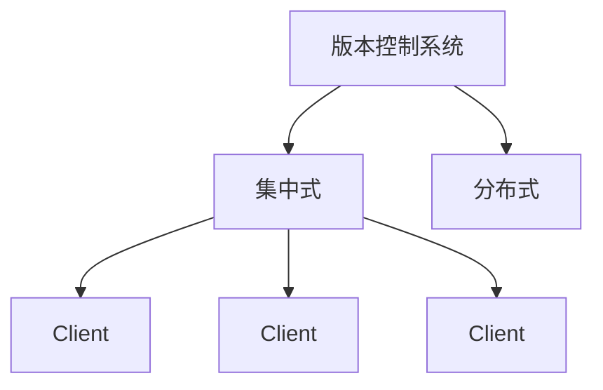

[toc]

## 🧊's Git学习笔记

### 版本控制系统



> 其中 集中式有SVN CVS等等 分布式有Git Mercurial等等

集中式服务器使用时，每个客户端只会保存一个副本，使用时，首先要从中央服务器上下载最新的版本

，然后添加需要修改的内容，修改后再上传回中央服务器

优点是使用起来非常简单，只需要每次使用时从中央服务器下拉取最新版本，修改后再上传，不需要考虑其他问题

缺点是，如果中央服务器出现故障或者网络连接出现问题，那么所有人都无法工作，只能等待中央服务器或者网络恢复正常。


分布式版本控制，每个人的电脑都拥有完整的版本库，所以可以在本地进行修改，不需要考虑网络问题，即使中央服务器出现故障也可以继续工作。当需要将修改内容分享给其他人的时候，只需要将仓库同步即可。


### Git安装以及初始化

**Git安装**

点击链接安装Git：[Git安装](https://git-scm.com/book/zh/v2/%E8%B5%B7%E6%AD%A5-%E5%AE%89%E8%A3%85-Git)


**Git初始化命令**

显示当前git版本号

```
git -v
```


**初始化git全局变量**

```
git config --global user.name "xxx"
git config --global user.email "xxx@xxx.xxx"
```

> 第一行命令用于配置你的用户名，第二行命令用于配置你的邮箱，将上述xxx替换为github/gitee的用户名和邮箱即可
>
> 其中 --global代表全局变量，对所有的仓库有效；还有 --system与省略（Local），其中不填的话就是本地配置，只对本地仓库有效， --system是系统配置，对所有用户生效。一般最常用的是 --global


```
git config --global credential.helper store
```

这行命令用于保存用户名和密码，这样就可以不用每次都输入密码了


```cpp
git config --global --list
```

用于查看刚才配置的global变量，若使用`git config --list`则显示的是所有变量