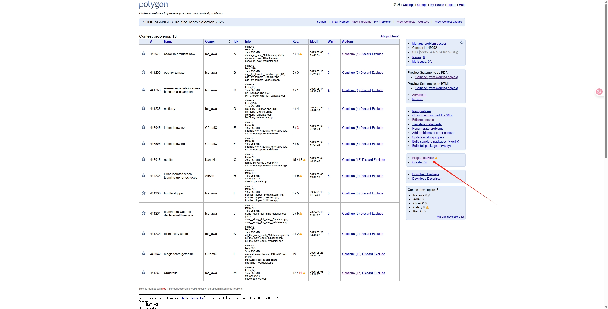

[toc]

## ice's polygon 笔记

### 简介

本笔记是 ice 在使用 [polygon](https://polygon.codeforces.com/) 进行出题时的笔记，旨在于帮助快速上手 polygon 并且能够出属于自己的题目。


### Files

Files 包含三个部分: Resource Files, Source Files, Attachments。我们一般只需要处理 Source Files 即可。

若想要题面能够生成为中文，则需要将 Files 里面的 statements.ftl 替换成下面的代码

```tex
\documentclass [11pt, a4paper, oneside] {article}
\usepackage {CJK}
\usepackage [T2A] {fontenc}
\usepackage [utf8] {inputenc}
\usepackage [english, russian] {babel}
\usepackage {amsmath}
\usepackage {amssymb}
\usepackage <#if contest.language?? && contest.language="russian">[russian]<#elseif contest.language?? && contest.language="ukrainian">[ukrainian]</#if>{olymp}
\usepackage {comment}
\usepackage {epigraph}
\usepackage {expdlist}
\usepackage {graphicx}
\usepackage {ulem}
\usepackage {import}
\usepackage{ifpdf}
\ifpdf
  \DeclareGraphicsRule{*}{mps}{*}{}
\fi

\begin {document}
\begin{CJK}{UTF8}{gbsn}
\contest
{${contest.name!}}%
{${contest.location!}}%
{${contest.date!}}%

\binoppenalty=10000
\relpenalty=10000

\renewcommand{\t}{\texttt}

<#if shortProblemTitle?? && shortProblemTitle>
  \def\ShortProblemTitle{}
</#if>

<#list statements as statement>
<#if statement.path??>
\graphicspath{{${statement.path}}}
<#if statement.index??>
  \def\ProblemIndex{${statement.index}}
</#if>
\import{${statement.path}}{./${statement.file}}
<#else>
\input ${statement.file}
</#if>
</#list>
\end{CJK}
\end {document}
```


Source Files 里面存放了你的 Validator, Checker, Generator 等文件，这里也是 Generator 的上传地方。


### Statement

将上述 Files 的 statements.ftl 修改之后，就可以在这个部分写你的题面了。可以使用 `Edit with Preview` 查看实时渲染的结果。其中 `Name` 是你题面的标题，`Legend` 是你题面的主体部分，`Input format` 是你的输入格式，即题面渲染的 `Input` 部分，`Output format` 是你输出格式，即题面渲染的 `Output` 部分。`Notes` 是你解释样例的部分，或者对于题面特殊说明的部分。

若你想要题面上有样例，即 `Example`，请你继续往下查看，并且书写完 Validator, Checker, Generator (可选) 后在 `Tests` 部分详细了解。


### Validator

Validator 用于检验你生成的数据，以及 cf 上的 hack 数据的输入是否合法。模板为

```cpp
#include <bits/stdc++.h>
#include "testlib.h"

using namespace std;

int main(int argc, char* argv[]){
	registerValidation(argc, argv);
	
}
```


在 testlib.h 里，可以通过 `inf.xxx()` 来从输入中执行某些函数，可以使用以下函数：

```cpp
inf.readInt(); //从输入中读入一个 int 类型整数
inf.readInt(min_value, max_value, variable_name); //从输入中读入一个 int 类型整数，且这个整数需要在 [min_value, max_value] 中，否则 Validator 会返回错误，即输入不合法。 variable_name 表示这个变量的名字。

inf.readLong(); //从输入中读如一个 ll 类型整数
inf.readLong(min_value, max_value, variable_name); //和 inf.readInt() 一样，只不过读入的是一个 ll 类型整数

inf.readChar(); //从输入中读入一个 char 类型字符
inf.readChar(c); //从输入中读入一个 char 类型字符，且这个字符一定要是 c

inf.readWord(); //从输入中读入一个 string 类字符串

inf.readSpace(); //从输入中读入一个空格

inf.readEoln(); //从输入中读入一个换行

inf.readEof(); //从输入中读入 EOF(文件结束标志)

```

如果需要对形如 `x + y > 1` 等多变量或者一些特殊变量进行判断，可以使用

```cpp
ensure(situation); //保证 situation 中的条件。如果 situation 返回为 true，则 Validation Success，否则 Failed，但是不返回详细信息，只会返回 Validation Failed。
ensuref(situation, message); //保证 situation 中的条件。如果 situation 返回为 true，则 Validation Success，否则 Failed，但是返回 message。
```

对于上述，可以参考以下例子：

```cpp
int a = inf.readInt(); //读入一个 int 类型整数
int b = inf.readInt(1, 100, "b") //读入一个 1～100 的 int 类型整数
ll c = inf.readLong(); //读入一个 ll 类型整数
ll d = inf.readLong(1'000'000'000, 1'000'000'000'000, "d") //读入一个 1e9 ~ 1e12 的 ll 类型整数。注意 cf polygon 推荐如果数字超过 3 位，请使用 ' 进行分割。
std::string s = inf.readWord(); //读入一个 string 类型字符串。

ensure(a + b >= 1); //确保 a + b >= 1，但是如果校验失败不会返回详细信息。

ensuref(c + d >= 1, "c + d should greater equal than 1"); //确保 c + d >= 1，但是如果校验失败会返回 "c + d should greater equal than 1"
```


**请注意，你的校验器 Validator 需要严格的读入空格和换行进行格式判断。**

假设输入样例为(包含 T 测)

```
2
4
1 3 5 9
4
2 2 2 2

```


那么 Validator 需要如下书写：

```cpp
#include <bits/stdc++.h>
#include "testlib.h"

using namespace std;

int main(int argc, char* argv[]){
	registerValidation(argc, argv);
	int T = inf.readInt();
  inf.readEoln(); //记住要读入换行
  while(T--){
    int n = inf.readInt();
    inf.readEoln(); //记住读入换行
    for(int i = 1; i <= n; i++){
      int x = inf.readInt();
      if(i != n) inf.readSpace(); //这里的输入样例没有行末空格，请注意判断！
    }
    inf.readEoln();
  }
  inf.readEof(); //请一定要记得读入 EOF
}
```


### Checker

Checker 用于检验参赛者的输出以及答案的输出是否一样，模板为

```cpp
#include <bits/stdc++.h>
#include "testlib.h"

using namespace std;

int main(int argc, char* argv[]){
	registerTestlibCmd(argc, argv);
	
}
```


在 testlib.h 里，可以使用 `ouf.xxx()` 从参赛者输出中执行某些函数，使用 `ans.xxx()` 从答案中执行某些函数，可以执行以下函数：

```cpp
ouf.readInt(); //从参赛者输出中读入一个 int 类型整数
ouf.readInt(min_value, max_value, variable_name); //从参赛者输出中读入一个 int 类型整数，且这个整数需要在 [min_value, max_value] 中，否则 Checker 会返回错误，即输入不合法。 variable_name 表示这个变量的名字。

ouf.readLong(); //从参赛者输出中读如一个 ll 类型整数
ouf.readLong(min_value, max_value, variable_name); //和 ouf.readInt() 一样，只不过读入的是一个 ll 类型整数

ouf.readChar(); //从参赛者输出中读入一个 char 类型字符
ouf.readChar(c); //从参赛者输出中读入一个 char 类型字符，且这个字符一定要是 c

ouf.readWord(); //从参赛者输出中读入一个 string 类字符串

ouf.seekEof(); //若已经到达参赛者输出的文件末尾 (即下一个字符为 EOF) 则返回 true

//ans 与 ouf 一样，只不过把 ouf 改成 ans 即可
```


在 testlib.h 里，可以使用 `quitf()` 来返回判题结果，以及返回判题信息

```cpp
quitf(status, message);
//其中 status 代表返回的状态，_ok 代表 Accepted，_wa 代表 Wrong Answer.
//message 代表评测机给用户返回的详细信息
```


若需要参赛者的输出和答案输出完全一样，可以参考一下模板：

```cpp
#include <bits/stdc++.h>
#include "testlib.h"
typedef long long ll;

using namespace std;

int main(int argc, char* argv[]){
	registerTestlibCmd(argc, argv);
	while(!ans.seekEof()){
		ll jans = ans.readLong();
		if(ouf.seekEof())
			quitf(_wa, "Too few numbers in output, expected more");
		ll pans = ouf.readLong();
		if(pans != jans)
			quitf(_wa, "Expected %lld but received %lld", jans, pans);
	}
	if(!ouf.seekEof())
		quitf(_wa, "Too many numbers in output");
	quitf(_ok, "You finish all the test!");
}
```

以上代码实现了判断 用户输出的数字个数 和 答案输出的数字个数 是否相同，以及数字是否相同，可以依据实际情况进行更改。


Checker 还可以作为 Special Judge (spj)，手动书写正确条件。

例如给定 $a, b, c$，只要 $a \times b \times c \equiv M \pmod {2025}$ 即返回 AC，可以参考以下代码：

```cpp
#include <bits/stdc++.h>
#include "testlib.h"

using namespace std;

int main(int argc, char *argv[]){
	registerTestlibCmd(argc, argv);
	int T = inf.readInt();
	std::vector<int> ok(2030);
	for(int a = 1; a <= 100; a++)
		for(int b = 1; b <= 100; b++)
			for(int c = 1; c <= 100; c++)
				ok[a * b * c % 2025] = 1;
	inf.readEoln();
	while(T--){
		int M = inf.readInt();
		// inf.readEoln();
		int x = ouf.readInt(-1, 100, "a");
		if(x == -1){
			if(ok[M])
				quitf(_wa, "Galaxy_Ivan can found a, b, c such that a * b * c % 2025 == M");
			// ouf.readEoln();
		}else if(!x){
			quitf(_wa, "Found input number 0 but input should be in 1~100 or -1");
		}else{
			int a = x;
			int b = ouf.readInt(a, 100, "b"), c = ouf.readInt(b, 100, "c");
			// ouf.readEoln();
			int pans = a * b * c % 2025;
			if(pans != M)
				quitf(_wa, "Wrong answer.Got %d, expected %d", pans, M);
		}
	}
	// ouf.readEof();
	quitf(_ok, "You solved all the solution! You are so smart!");
}
```


### Tests

> 请尽量读完 Generator 和 Script 板块后再书写你的 Generator

#### Generator

Generator 用来生成数据，让出题者不需要手动输入数据，而是可以通过 polygon 直接生成。模板为

```cpp
#include <bits/stdc++.h>
#include "testlib.h"

using namespace std;

int main(int argc, char* argv[]){
	registerGen(argc, argv, 1);
	
}
```


在 `testlib.h` 中，可以使用以下函数：

```cpp
rnd.next(4); //等概率生成一个 [0, 4) 范围内的整数
rnd.next(4, 100); //等概率生成一个 [4, 100] 范围内的整数
rnd.next(10.0); //等概率生成一个 [0, 10.0) 范围内的浮点数
rnd.next("one | two | three"); //等概率从 one, two, three 三个串中返回一个
rnd.any(container); //等概率返回一个具有随机访问迭代器 (e.g. std::vector, std::string) 的容器内的某一元素的引用
rnd.wnext(i, t); //下面进行解释
shuffle(); //接受一对迭代器，使用 rnd 打乱序列
```

关于 `rnd.wnext(i, t)` 的形式化定义为：
$$
wnext(i, t)=
\begin{cases}
next(i) & t = 0 \\
max(next(i), wnext(i, t - 1)) & t > 0 \\
min(next(i), wnext(i, t + 1)) & t < 0
\end{cases}
$$
举个例子，`rnd.wnext(4, 2)` 等同于 `std::max(rnd.next(4), rnd.next(4));` 即这个函数是用来执行 $t$ 次 `rnd.next(i)` 并且取最大值。`rnd.wnext(4, -2)` 等同于 `std::min(rnd.next(4), rnd.next(4));` 即这个函数是执行 $-t$ 次 `rnd.next(i)` 并取最小值。

即当 $t < 0$，调用 $-t$ 次 `rnd.next(i)` 并取最小值；当 $t > 0$，调用 $t$ 次 `rnd.next(i)` 并取最大值；当 $t = 0$ 则等同于 `next()`。


#### Script

Script 能够让你使用 **带命令行参数** 的 generator 来生成数据，而不是写一大堆 generator 或者每次生成数据时修改 generator。并且，只需要生成输入，不需要生成输出。

脚本的形式为 `generator-name [params] > test-index`。例如我的 generator 名字为 ice_generator.cpp，参数为 `Tests, mxn, mxm` 等，我可以使用

```
ice_generator -Tests 2025 -mxn 200000 -mxm 200000 > 2
```

也可以使用 `generator-name [params] > $` 来自动指定测试点编号。上述例子可改为

```
ice_generator -Tests 2025 -mxn 200000 -mxm 200000 > $
```


**命令行参数** 即有时候你想要数据大小从小到大进行递增，例如第 2 个测试点我只想要 10 组多测，而第 3 个测试点我想要 100 组多测，则可以在 generator 中指定 $T$ 为一个命令行参数，在生成的时候可以调整其大小。

假设，我想要命令行参数的名字为 `Tests`，若命令行中没有指定，则默认为 2025，我可以在 generator 中这样写：

``` cpp
int T = opt<int>("Tests", 2025);
std::cout << T << "\n";
```


### Solution


### Invocations


### 对于整场比赛题面的生成

请在 polygon 主页右边的 `Properties/Files` 中更改 `statements.ftl`



```tex
\documentclass [11pt, a4paper, oneside] {article}
\usepackage {CJK}
\usepackage [T2A] {fontenc}
\usepackage [utf8] {inputenc}
\usepackage [english, russian] {babel}
\usepackage {amsmath}
\usepackage {amssymb}
\usepackage <#if contest.language?? && contest.language="russian">[russian]<#elseif contest.language?? && contest.language="ukrainian">[ukrainian]</#if>{olymp}
\usepackage {comment}
\usepackage {epigraph}
\usepackage {expdlist}
\usepackage {graphicx}
\usepackage {ulem}
\usepackage {import}
\usepackage{ifpdf}
\ifpdf
  \DeclareGraphicsRule{*}{mps}{*}{}
\fi
%这里开始内部的内容进行更改
\begin{CJK}{UTF8}{gbsn}
\title{2025 华南师范大学集训队筛选赛}
\author{迫害小登小纵队}
\date{2025.06.15}

\begin {document}

% 使用 titlepage 环境来自定义标题页
\begin{titlepage}
    \maketitle % 先输出标准的标题、作者、日期

    % 在 \maketitle 下方添加一些垂直间距
    \vspace{2cm} 

    % 添加你的两句话，可以使用 \centering 来居中
    \centering
    \textbf{本场比赛并不保证题目顺序按照难度排序。}\par
    \vspace{0.5cm} % 两句话之间加一点小间距
    \textbf{本场所有题目标题，皆源自于历届集训队队伍之名。愿你以智慧之火，点亮属于自己的 XCPC 长空。}\par

    % 如果希望这两句话在页面底部，可以这样做：
    % \vspace*{\fill} % 弹性空白，将下面的内容推到底部
    % \centering
    % 这是第一句话。\par
    % 这是第二句话。\par

    \thispagestyle{empty} % titlepage 环境通常会自动设置此项，但显式写出无害
\end{titlepage}
%这以上的部分可以自由更改
\contest
{${contest.name!}}%
{${contest.location!}}%
{${contest.date!}}%

\binoppenalty=10000
\relpenalty=10000

\renewcommand{\t}{\texttt}

<#if shortProblemTitle?? && shortProblemTitle>
  \def\ShortProblemTitle{}
</#if>

<#list statements as statement>
<#if statement.path??>
\graphicspath{{${statement.path}}}
<#if statement.index??>
  \def\ProblemIndex{${statement.index}}
</#if>
\import{${statement.path}}{./${statement.file}}
<#else>
\input ${statement.file}
</#if>
</#list>
\end{CJK}
\end {document}
```


### 一些报错的解决方法

#### Verification Failed

首先先在 Validator 和 Checker 下面添加 tests，检查是否能够正确运行，如果不行则进行修改

再在 Tests 里面，如果使用了 Generator 生成数据，点开 Preview，查看输入和输出是否能正确被生成，如果输入没有被生成，则 Generator 或者 Validator 有问题，若输出有问题，则 Checker 有问题

若 Checker 报错 `Wrong output format: Unexpected end of file - int32 expected`

则是你的 Checker 循环逻辑出错，检查是否使用了 `ans.eof()` 或者 `ouf.eof()`，若有，请更改为 `ans.seekEof()` 或者 `ouf.seekEof()` 控制循环。 


#### PDF 编译错误

* 请把所有的 `\>` `\<` 替换成 `\tt{>}` 和 `\tt{<}`
