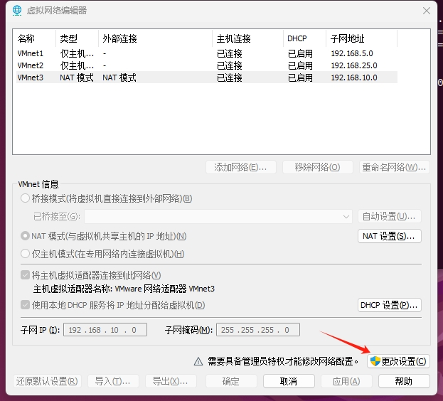
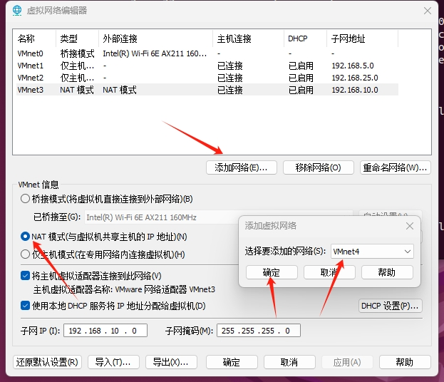
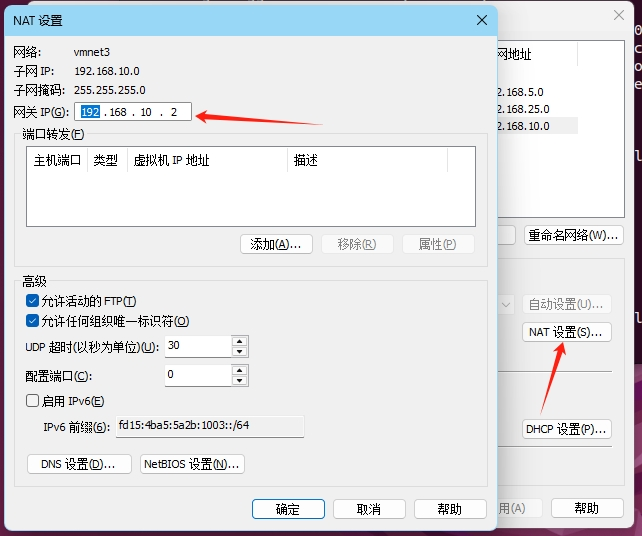
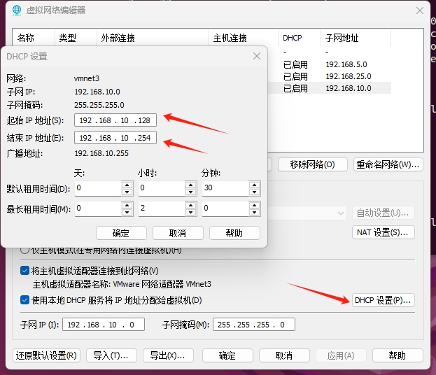
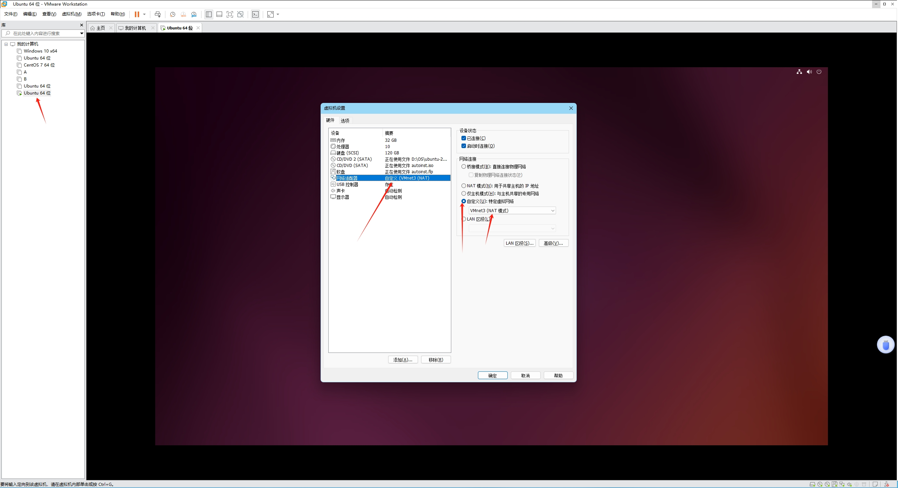
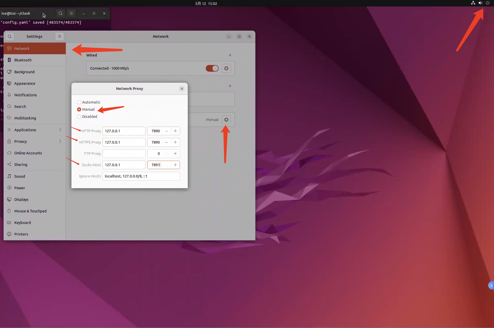

[toc]

## 🧊 vmware-ubuntu 的虚拟机配置笔记

### 初始化 su 账户 (超级用户)

Ubuntu 默认是锁定 root 账户的，没有设置密码，使用以下命令设置后，即可进入 root 用户

```bash
sudo passwd root
```


### 连接公网 ip

打开 Vmware --> 编辑 --> 虚拟网络编辑器



将原有的 NAT 模式的 VMnetx 删掉，添加新网络，名称任意，然后将模式更改为 NAT 模式



一般虚拟机默认的 ip 是 `192.168.10.x` ，以下操作默认联网后，虚拟机的 ip 为 `192.168.10.x` ，同时也会介绍更改为特定 ip 的方法。按照此方法，只要虚拟机的 ip 在 DHCP 设置中的起始 IP 到结束 IP 之间都可以联网 (这一步在后面有提到)

首先将这里的子网 IP 设置为 `192.168.10.0`，子网掩码设置为 `255.255.255.0`

> 若需要特定的 ip，则设置为 `xxx.xxx.xxx.xxx`。例如想要联网后虚拟机的 ip 为 `10.168.99.x`，则子网 ip 设置为 `10.168.99.0`

点击 NAT 设置，将网关 IP 设置为 `192.168.10.2`

> 若想要特定的 ip，例如联网后虚拟机的 ip 为 `10.168.99.x`，则网关 ip 设置为 `10.168.99.2`



点击 DHCP 设置，可以自定义起始 IP 地址和结束 IP 地址 （起始 ip 建议在 `192.168.10.3` 后面）

> 若需要设置特定 ip，例如想要联网后虚拟机的 ip 为 `10.168.99.x`，则起始 ip 和结束 ip 都要为 `10.168.99.x`



点击确定后，右击我们需要联网的虚拟机，点击设置，将网络适配器那里更改为自定义，自定义为刚才新建的 VMnetx



点击确定后，开启虚拟机即可联网。


### VMWare Tools 的配置

VMWare Tools 能够支持用户从桌面复制到虚拟机中，但是官方的安装方式 ice 尝试过但是失败了，这里介绍通过 bash 安装的教程。

```bash
sudo apt-get update
sudo apt-get install open-vm-tools-desktop
reboot
```


### ssh 的配置

ssh 能够让我们连接到虚拟机，并且通过一些软件往里面传入文件 (此处以 MobaXTerm 为例)

先安装 OpenSSH 客户端

```bash
sudo apt update
sudo apt install openssh-client
```


使用 `sudo service ssh status` 或者 `systemctl status ssh` 查看 ssh 是否正常运行

若出现 `Unit ssh.service could not be found`

则安装 openssh-server

```bash
sudo apt-get update
sudo apt-get install openssh-server
systemctl enable ssh.service
```


再次使用 `sudo service ssh status` 查看状态是否为 `active (running)`

再次尝试连接


若出现 `Access Denied`

则修改一下 `sshd_config`

使用 `sudo nano /etc/ssh/sshd_config`

将 `PermitRootLogin` 设置为 `yes`

然后执行 `sudo systemctl restart sshd` 重启 ssh，并再次尝试。


### VPN 的配置 (以 clash 为例)

在 bash 中执行以下命令，以在用户目录下创建 clash 文件夹

```bash
mkdir ~/clash
cd ~/clash
```

在 `https://github.com/DustinWin/proxy-tools/releases/tag/Clash-Premium` 中下载 `clashpremium-release-linux-amd64.tar.gz`，并且执行

```bash
tar -zxvf clashpremium-release-linux-amd64.tar.gz
```

解压后将二进制产物重命名为 clash，并且将其移动过去。可以执行以下命令

```bash
sudo mv <你的产物名字> clash
sudo mv clash ~/clash/
```


然后 cd 到 clash 二进制文件所在的目录，登录到 clash 的网站上，在 `下载与教程` 板块中复制 wget 命令

执行完后，在 `~/clash` 目录下面执行

```bash
chmod +x clash
./clash -d .
```


然后在 Ubuntu 的 Setting 当中的 Network 里，更改网络代理，将类型改为手动，然后将 `HTTP` 和 `HTTPS` 代理设置为 `127.0.0.1:7890`，`Socks` 主机为 `127.0.0.1:7891`




### 内网穿透 (以 Sakura Frp 为例)


